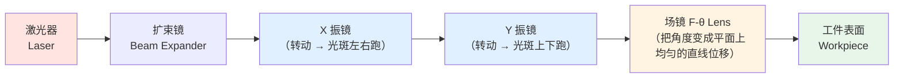
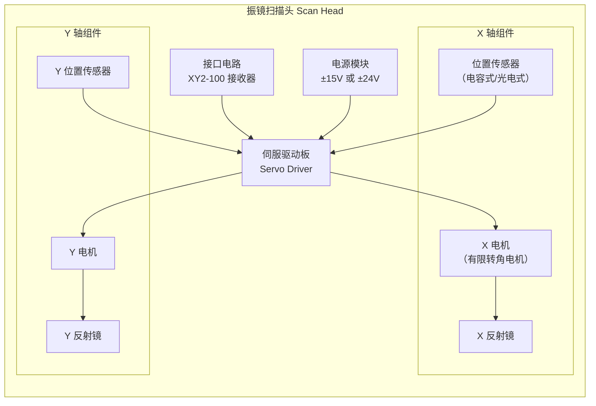
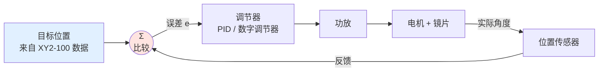

# 🔍 振镜是什么

> [!info] 一句话版本
> **振镜 = 两个（或三个）能极快地转动小镜子的电机 + 一套闭环伺服控制。**
> 激光打在镜子上，镜子一转，光斑就跑到别的地方去了。
> 因为电机是"振动"着来回转，所以中文叫**振镜**，英文叫 **Galvanometer Scanner**（简称 galvo）。

---

## 1. 先看它在整台机器里的位置

一台激光打标机 / 激光雕刻机，光路大致是这样：

**关键点**：振镜本身只负责"把光束偏转到某个角度"，真正把角度变成平面上准确位置的是**场镜**。所以振镜和场镜是配套的——这也是为什么新手最容易忽略的一环。

> [!note] 💡 为什么叫"场镜"
> F-θ 场镜的作用是让「光束偏转角 θ」和「焦平面上的位移 r」成正比：`r = f × θ`。
> 普通凸透镜是 `r = f × tan(θ)`，越到边缘误差越大。F-θ 镜经过特殊设计修正了这个关系，
> 所以大面积打标时边缘才不会变形。
> 笔记：f是焦距，位移=f*光学角

---

## 2. 振镜内部有什么

拆开一个振镜（scan head），你会看到：

| 部件 | 作用 | 备注 |
|---|---|---|
| **电机** | 驱动镜子转动 | 通常是**有限转角**的动磁式/动圈式电机，不是普通步进电机 |
| **反射镜** | 反射激光 | 很薄很轻（减惯量），表面镀高反膜 |
| **位置传感器** | 实时测出镜子真实角度 | 闭环的关键，没有它就成了开环 |
| **伺服驱动板** | 把"目标位置"变成电机电流 | 内部是 PID 或更复杂的数字调节器 |
| **接口电路** | 接收上位机指令 | **XY2-100 协议就在这一层** |

> [!important] 这是理解 XY2-100 的关键
> XY2-100 协议传的是**目标位置（setpoint）**，不是电压、不是电流、不是 PWM。
> 振镜内部有它自己的闭环，你只管告诉它"去这个位置"，剩下的它自己搞定。
> 这是"数字振镜"和"模拟振镜"最本质的区别。

---

## 3. 电机是怎么"转"的

### 有限转角电机（Limited Rotation Motor）

普通电机能转 360° 不停，振镜电机不行——它只能在**零点附近 ±十几度**范围内摆动。

| 特性 | 说明 |
|---|---|
| 转动范围 | 机械上约 ±10° ~ ±30°（光学的 ±2 倍） |
| 转子 | 极轻，惯量极小（为了快） |
| 回复力 | 靠**扭力弹簧/磁弹簧**回到零位 |
| 典型带宽 | 小信号 1–10 kHz 💡 |

> [!note] 为什么惯量要小
> 转动惯量 J 越小，同样的力矩下角加速度越大：`α = M / J`。
> 这就是为什么振镜的镜子薄得像纸片——**轻**才是快的前提。
> 但也因此镜子很脆，装机时千万别用手指按。

### 闭环控制环路

**你要理解的核心结论**：
- 你通过 XY2-100 送进去的是 **SP（目标位置）**
- 振镜内部会自己比较、自己调节
- 如果**送得太快**（超过振镜带宽），镜子跟不上 → 图形失真
- 如果**送得太慢**，加工效率低

这就是 [[02-硬件实现篇/05-更新率与振镜带宽匹配]] 要讲的事。

---

## 4. 两个轴为什么要分开

X 镜和 Y 镜是**串联**的：激光先打 X 镜，反射到 Y 镜，再反射到场镜。

**这带来一个重要的工程问题**：X 镜偏转时，激光在 Y 镜上的落点会移动；如果 Y 镜不够大，光就可能打偏甚至打飞。所以：

- Y 镜通常比 X 镜**大一点**
- 大扫描范围需要更大的镜子 → 更重 → 更慢
- 这就是"**扫描范围 vs 速度**"的经典取舍 💡

---

## 5. 常见应用

| 应用 | 对振镜的要求 | 典型协议 |
|---|---|---|
| 激光打标 / 雕刻 | 中等速度、高精度 | XY2-100 |
| 激光焊接 / 切割 | 高功率、大范围 | XY2-100 / XY2-200 |
| 3D 打印（SLM/SLS） | 极高速度、多振镜协同 | XY2-100E / XY3-100 |
| 激光雷达 LiDAR | 高帧率、车规可靠性 | 自研或 XY2-100 |
| 医疗成像（OCT） | 极高线性度 | 模拟或专用 |
| 激光投影 / 舞台灯光 | 大角度 | 模拟 ±10V 居多 |

---

## 6. 关键参数：你会在说明书上看到的

| 参数 | 含义 | 典型值 |
|---|---|---|
| **扫描角度** | 光学偏转角（不是机械角！） | ±20° 光学 💡 |
| **小信号带宽** | 小幅度正弦响应的 -3dB 频率 | 1–10 kHz |
| **跟踪误差** | 实际位置与指令位置的最大偏差 | 0.1–1 mrad |
| **重复精度** | 多次到同一点的一致性 | 几 μrad |
| **标记速度** | 实际能跑的加工速度 | 几 m/s |
| **分辨率** | 最小可分辨角度步进 | 16 位 ≈ 8 μrad 💡 |
| **零点漂移** | 温漂导致的零点移动 | 几十 μrad/K |

> [!warning] ⚠️ 光学角 vs 机械角
> 这是新手 100% 会搞错的地方！
> 镜子转 θ 机械角，光线反射后偏转 **2θ**（反射定律）。
> 所以说明书说"±20°"时，要看清是光学角还是机械角。
> **本库统一标注"光学角"或"机械角"，你也要养成这个习惯。**

---

## 7. 动手：把关键数字算一遍

> [!example] 🔬 练习 1.1
> 一面镜子转了 5°（机械角），光线偏转多少？
>
> **答**：10°（光学角）。因为反射角 = 2 × 镜面转角。

> [!example] 🔬 练习 1.2
> 一个振镜的 16 位分辨率对应 ±20°（光学角），那么 1 LSB 是多少？
>
> **答**：总范围 40°，分成 65536 份 → `40 / 65536 ≈ 0.61 mrad ≈ 0.035°`。
> 记住这个算法：**满量程角度 ÷ 65536 = 1 LSB 的角度**。

---

## ✅ 自检

- [x] 能说出振镜内部五大部件：   xy2-100接口，电源，伺服驱动，x，y电机组件（位置传感器）
- [x] 知道 XY2-100 传的是"目标位置"而不是电压
- [x] 能解释为什么镜子要做得极轻 a=M(力矩)/J
- [x] 分得清光学角和机械角
- [x] 知道场镜的作用 r=f*光学角

---

## 📖 原厂依据

> [!quote] 参考来源
> - 振镜内部结构：各厂商 scan head 手册的 "General Description" 章节
> - 有限转角电机原理：见 [[04-资源库/04-论文书籍]] 中的电机学资料
>
> ⚠️ 本节中的**具体数值**（带宽、角度、精度）标注为 💡 的是行业常见范围，
> **不是** XY2-100 协议规范的强制要求。协议只管数据传输，不管振镜性能。
> 你的振镜真实参数以**该型号的数据手册**为准。

---

## 🔗 相关

- 下一篇：[[00-入门篇/02-为什么需要数字协议]]
- 术语不懂：[[00-入门篇/03-术语表]]
- 回到入口：[[🏠 开始这里]]
