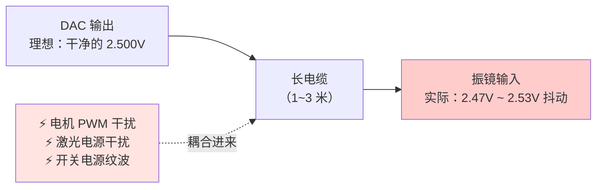
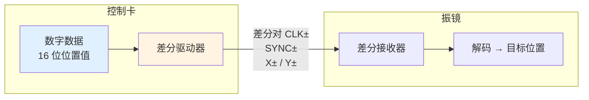
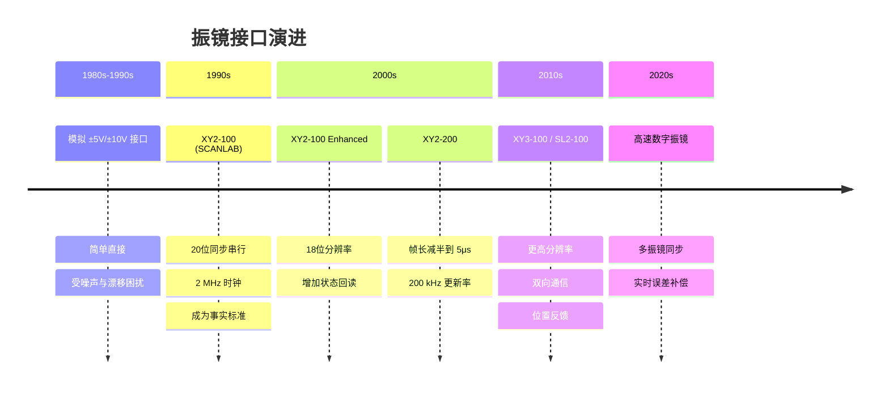

# ⚡ 为什么需要数字协议

> [!info] 一句话版本
> 老方案用**模拟电压**（±5V 代表角度）控制振镜，简单但在高速下噪声大、会漂移、距离受限。
> XY2-100 把"电压"换成了"**数字时钟同步传数据**"，一举解决噪声、漂移、精度三大问题。

---

## 1. 老方案：模拟接口长什么样

最早期（现在仍大量使用）的振镜接口是这样的：

```
上位机 DAC ──[模拟电压 -5V ~ +5V]──> 振镜 X
           ──[模拟电压 -5V ~ +5V]──> 振镜 Y
           ──[GND]──────────────> 共地
```

| 电压 | 对应角度 |
|---|---|
| −5 V | −满量程（例如 −20° 光学角） |
| 0 V | 零位（正中心） |
| +5 V | +满量程 |

> [!note] 💡 为什么是 ±5V / ±10V
> 这是工业模拟信号的传统标准（源自 ±10V 仪表标准，±5V 是其一半）。
> 电压摆幅大 → 抗噪声能力强一些，但也带来了下面的问题。

---

## 2. 模拟方案的三个致命伤

### 💥 问题一：噪声



- 激光设备里到处是**大功率开关电源、电机 PWM、高压激光电源**
- 模拟线就像一根天线，把这些干扰全收进来
- 结果：光斑**抖动**，画不出光滑的线

**关键点**：模拟电压从 DAC 到振镜要经过电缆，而电缆上的噪声会**直接**变成角度误差。

### 💥 问题二：漂移

| 漂移来源 | 后果 |
|---|---|
| 温漂（DAC、运放、振镜输入级） | 打的图形整体慢慢偏移 |
| 地电位差（两端地不是同一个 0V） | 系统性偏差，且随负载变化 |
| 电源老化 | 长期精度下降 |

> [!warning] 地电位差是最阴险的
> 上位机和振镜各自接"地"，但两个"地"之间可能有几十到几百 mV 的电位差，
> 这个差值**直接叠加**到模拟信号上。你测 DAC 输出是准的，但振镜收到的已经错了。

### 💥 问题三：精度与距离

| 限制 | 说明 |
|---|---|
| DAC 分辨率 | 16 位 DAC 就有 ±1 LSB 误差，加上噪声可能只剩 12 位有效 |
| 电缆长度 | 越长噪声越大，一般不建议超过 2~3 米 💡 |
| 无法传状态 | 模拟接口**只能单向**传位置，振镜有问题你也收不到任何信息 |

---

## 3. 数字方案怎么解决的

### XY2-100 的做法



**核心思路**：传输过程中始终是**数字信号**，只有到了振镜内部才转成模拟量。

### 对比表

| 维度 | 模拟 ±5V | XY2-100 数字 |
|---|---|---|
| **信号形式** | 连续电压 | 离散 bit（高/低） |
| **抗噪声** | 差，噪声直接变误差 | **好**，需要很大干扰才能翻转逻辑电平 |
| **传输方式** | 单端 | **差分**（双绞线，共模抑制） |
| **误差累积** | 沿电缆累积 | 不累积，到点再生 |
| **温漂** | 影响全程 | 只影响振镜内部 DAC |
| **地电位差** | 直接变成误差 | 差分输入基本免疫 |
| **分辨率** | 受噪声限制 | **16 位（65536 步）确定** |
| **状态回读** | ❌ 不可能 | ✅ STATUS 线可回读 |
| **电缆长度** | ~2–3 m | 可达 **10 m 以上** 💡 |
| **多轴同步** | 靠多路 DAC 同步，难 | **同一时钟，天然同步** |
| **成本** | 低 | 略高 |
| **复杂度** | 简单 | 需要时钟、时序、校验 |

---

## 4. 为什么"差分"这么重要

这是数字方案能抗噪声的**核心技术**，务必理解。

### 单端 vs 差分

```
【单端】一根线传信号，另一根是地
   信号线 ────[ 2.50V + 噪声 0.3V = 2.80V ]────> 接收端读到 2.80V ❌ 错了

【差分】两根线传相反的信号，接收端读"差值"
   X+ 线 ────[ +1.8V + 噪声 0.3V = 2.1V ]────┐
                                              ├─> 差值 = 2.1 - 0.9 = 1.2V ✅
   X− 线 ────[ −1.8V + 噪声 0.3V = -0.9V ]───┘        （噪声被抵消）
```

> [!important] 差分的精髓
> 干扰是**同时**耦合到两根线上的（因为它们在同一个双绞线里，位置几乎相同）。
> 接收端只关心 `V+ − V−`，两边都加的噪声在相减时**自动消失**。
> 这叫**共模抑制（CMRR）**。

所以：
- 一定要用**双绞线**（让两根线经历相同的干扰）
- 一定要**成对走线**，不要拆开
- P/N 接反了会怎样？→ 见 [[03-调试与排错篇/03-常见故障速查]]

---

## 5. 数字方案付出的代价

天下没有免费的午餐，数字方案也有代价：

| 代价 | 说明 | 怎么应对 |
|---|---|---|
| **需要时钟** | 必须有一个稳定的 2 MHz 时钟 | 用晶振，别用 RC 振荡 |
| **需要时序配合** | 建立/保持时间必须满足 | 见 [[01-协议篇/03-时序规范与参数表]] |
| **有固定延迟** | 数据传输有 1 帧（10 μs）的固有延迟 | 属于系统延迟一部分，需补偿 |
| **协议开销** | 20 位里只有 16 位是有效数据 | 效率 80%，可接受 |
| **实现复杂** | 需要 FPGA/MCU 或专用芯片 | 有开源实现可抄，见 [[04-资源库/03-开源项目清单]] |

---

## 6. 那现在还有必要学模拟接口吗

**有必要**，原因：

1. **存量设备多**：大量老设备和低端设备仍在用模拟振镜
2. **激光雷达等领域**仍在用模拟驱动
3. **理解模拟方案才能理解数字方案好在哪**（面试常问）
4. **有些场合模拟更合适**：极低成本、极简结构、不需要高精度

> [!tip] 💡 一个实用判断法
> - 需要**大面积、高精度、长距离、要读状态** → 选数字（XY2-100）
> - **成本极度敏感、距离短、精度要求低** → 模拟够用

---

## 7. 从模拟到数字的演进时间线



---

## ✅ 自检

- [x] 能说出模拟方案的三个致命伤
噪声（电机pwm信号，电源信号干扰，无法传状态），漂移（温漂，对地电压），精度低传输距离短（dac精度，距离远导致电压不稳定）。
- [x] 能解释差分传输为什么能抗噪声
两条信号线在一起接受干扰信号，传输只取他们的差值，天然去噪
- [x] 知道 XY2-100 传的是数字目标位置，不是电压
- [x] 能说出数字方案的两个代价
价格高，效率80%20字符16位是数据，实现技术高
- [x] 能判断什么场合该用模拟、什么场合该用数字
低精度，短距离，成本敏感模拟振镜。
高精度，长距离，大面积读状态数字振镜。

---

## 📖 原厂依据

> [!quote] 参考来源
> - **差分接口与 20 位字结构**：`XY2-100_Laser_Scanner_Protocol_Format_Specification.pdf` 第 2 页
>   → 原文："The rising edge on SYNC marks the beginning of a XY2-100 frame"
> - **信号定义与时钟机制**：`Documents_TD_XY2-100_R0703.pdf` 第 2 页
>   → 原文："When it goes high, the data bit changes. When it goes low, the data bit is sampled by the deflection system."
> - **物理引脚**：`Raylase_Interface_XY2-100.pdf` 第 1 页
>
> 💡 标记的对比结论（抗噪声、电缆长度、成本）是工程经验总结，非规范原文。

---

## 🔗 相关

- 上一篇：[[00-入门篇/01-振镜是什么]]
- 下一篇：[[00-入门篇/03-术语表]]
- 深入：[[01-协议篇/01-XY2-100协议总览]]
- 回到入口：[[🏠 开始这里]]
