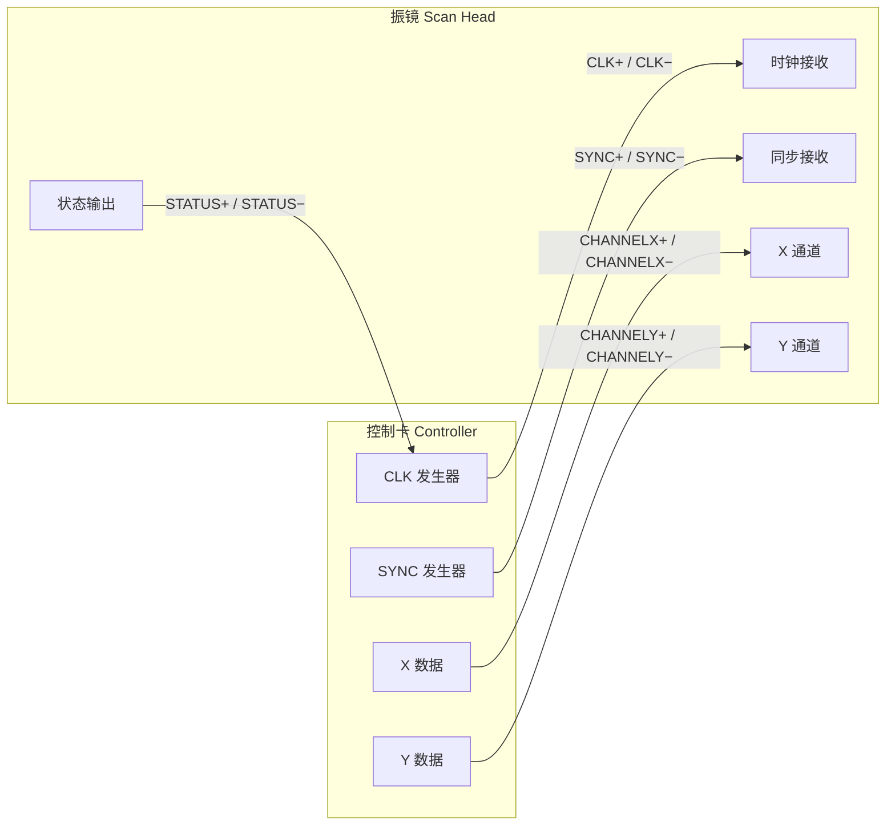
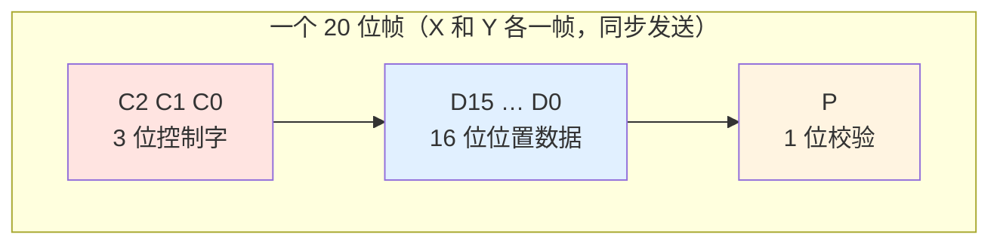
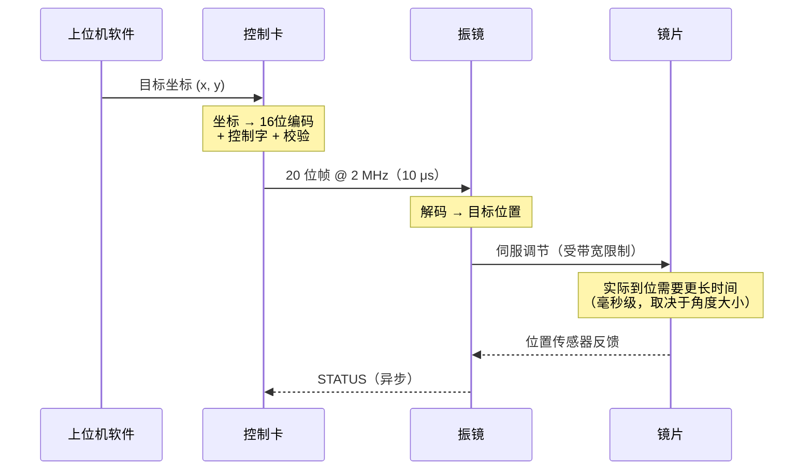
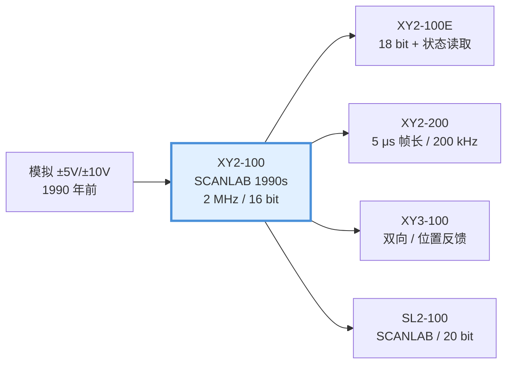

# 📡 XY2-100 协议总览

> [!info] 一句话版本
> XY2-100 是一个**单向、同步、串行、差分**接口：控制卡用一根连续运行的 **2 MHz 时钟**，
> 每 **20 个时钟**发送一个 **20 位字**，把 X 和 Y 两个轴的目标位置**同时**告诉振镜。
> 帧率 = 2 MHz ÷ 20 = **100 kHz**。

> [!quote] 规范原文（最权威的一句话）
> "The XY2-100 interface is used to send X and Y coordinates from the controller to the deflection system.
> It is a serial interface using 20-bit words, sent with a speed of 2 Mbit/s or 100 kwords/s."
> — `Raylase_Interface_XY2-100.pdf` 第 1 页 / `Documents_TD_XY2-100_R0703.pdf` 第 1 页

---

## 0. 标准编号与归属 ✅

> [!success] XY2-100 有正式行业标准
> | 项目 | 值 |
> |---|---|
> | **标准编号** | **LasIA LIA202001** |
> | 发布方 | **LasIA**（Laser Industry Association，激光行业协会） |
> | 后继标准 | **XY3-100** = LIA202002 (v1.0) / **LIA202307 (v1.1)** |
>
> 💡 本库归档的 `XY2-100_Laser_Scanner_Protocol_Format_Specification.pdf`
> **经 MD5 比对确认就是 LIA202001 标准原文本身**
> （MD5 = `604A8F106749B320657ED90134266909`）。
>
> 📌 **实践含义**：你的实现只要符合 LIA202001，就是"符合标准"，
> 而不是"模仿某家厂商"。和客户/厂商沟通时可以直接引用标准号。
>
> ⚠️ 标准原文现可从 Wayback Machine 获取：
> `https://web.archive.org/web/20231206141529id_/https://lasia.org/LIA202001/xy2_100_specification.pdf`

---

## 1. 核心参数一览

| 参数 | 值 | 来源 |
|---|---|---|
| 时钟频率 | **2 MHz**（固定） | ✅ 规范 |
| 每帧位数 | **20 bit** | ✅ 规范 |
| 帧长度 | **10 μs** | ✅ 规范 |
| 帧率 / 字率 | **100 kHz**（100 kwords/s） | ✅ 规范 |
| 比特率 | **2 Mbit/s** | ✅ 规范 |
| 轴数 | X、Y（可选 Z） | ✅ 规范 |
| 位置位数 | 16 bit（标准）/ 18 bit（增强） | ✅ 规范 |
| 位置编码 | 偏移二进制（offset binary） | ✅ 规范 |
| 校验 | 偶校验（标准）/ 奇校验（增强） | ✅ 规范 |
| 数据采样沿 | **时钟下降沿** | ✅ 规范 |
| 数据变化沿 | **时钟上升沿** | ✅ 规范 |
| 帧边界标记 | SYNC 上升沿 = 帧开始 | ✅ 规范 |
| 建立时间 tDS | ≥ **50 ns** | ✅ 规范 |
| 保持时间 tDH | ≥ **100 ns** | ✅ 规范 |
| 传输方式 | 差分（差分对，双绞线） | ✅ 规范 |
| 方向 | 控制卡 → 振镜（单向）+ STATUS 回读 | ✅ 规范 |
| 典型连接器 | DB25 | ✅ 规范 |

---

## 2. 信号线：一共几根

### 最少 4 对差分线



| 信号 | 别名 | 方向 | 说明 |
|---|---|---|---|
| **CLK** | SENDCK、CLOCK | 控制卡 → 振镜 | **连续运行**的 2 MHz 时钟 |
| **SYNC** | — | 控制卡 → 振镜 | 标记帧边界 |
| **CHANNELX** | X、CHAN1 | 控制卡 → 振镜 | X 轴数据 |
| **CHANNELY** | Y、CHAN2 | 控制卡 → 振镜 | Y 轴数据 |
| **Z**（可选） | CHANNELZ | 控制卡 → 振镜 | Z 轴 / 动态聚焦，3D 振镜才有 |
| **STATUS** | BACK、IO6 | 振镜 → 控制卡 | 状态回读，**不与时钟同步** |
| **REF_IO** | — | — | 参考地，接控制卡 GND |

> [!important] 关键认识
> **X、Y、Z 用的是各自独立的线，但共用同一个 CLK 和同一个 SYNC。**
> 这就是为什么 X 和 Y 天然同步——它们在同一个时钟节拍下、被同一个 SYNC 划进同一帧。
> 对比模拟方案：两个 DAC 要同步是很难的。

### 关于第五对线

有些资料写"至少 4 对线"，有的写"5 对"。区别在于：
- **4 对**：CLK、SYNC、X、Y（只发不收）
- **5 对**：再加 STATUS（能读回振镜状态）

> [!tip] 💡 实际接线建议
> 即使你暂时不用 STATUS，也**建议把线接上**——调试时它是你唯一能"看到振镜内部"的窗口。
> 见 [[01-协议篇/05-STATUS状态回读]]。

---

## 3. 时序全貌

一个帧 = 20 个时钟周期 = 10 μs：

![[xy2-100-时序图.svg]]

> [!note] 关于这张图
> 示例用的是 **X 目标 = −12345**（帧 `0x29F8F`），因为它的数据位有 0 有 1，
> 能看清"数据在 CLK 上升沿变化"这件事。中心位置 `0`（帧 `0x30000`）的对照值见图右下角。
>
> **源文件**：`99-附件与下载/图片/xy2-100-时序图.svg`
> —— 矢量图，可无损缩放；本身是纯文本，**可以直接编辑改值**。

> [!tip] 💡 怎么改这张图
> SVG 的几何基准只有两个数字（在文件里搜 `150,150` 那一行）：
> - **`X0 = 150`** —— 第 1 位 bit 的左边界（x 坐标）
> - **`BW = 50`** —— 每个 bit 的宽度（px）
>
> 第 i 位的中心 x = `175 + 50 × (i−1)`。想换成别的示例值，只要改两组文字元素：
> 1. **位名称**那一组 `<text ... y="306">` —— `C2 C1 C0 D15 … D0 P`
> 2. **位值**那一组 `<text ... y="323">` —— 对应的 `0/1`
>
> 高电平画在 `y=340`，低电平画在 `y=374`。改完用浏览器打开就能看效果。

### 三句话记住时序

1. **CLK 一直跑**，2 MHz，永不停
2. **SYNC 上升沿** = 新的一帧开始
3. **SYNC 下降沿** = 最后一位（校验位）开始

> [!quote] 规范原文
> "The SYNC bit goes high when the first bit can be sent. It remains high for 19 bits and goes low when the parity can be sent."
> — `Raylase_Interface_XY2-100.pdf` 第 1 页

> [!quote] 数据采样时刻（最容易搞错的地方）
> "When it goes high, the data bit changes. When it goes low, the data bit is sampled by the deflection system."
> — `Documents_TD_XY2-100_R0703.pdf` 第 2 页
>
> 翻译：**时钟上升沿数据变化，下降沿振镜采样。**
> 也就是数据在时钟**高电平期间稳定**，振镜在**下降沿**读走。

---

## 4. 一帧里装了什么



| 字段 | 位数 | 标准模式（16 位） | 增强模式（18 位） |
|---|---|---|---|
| 控制字 | 3 | `001` = 电机设定值 | — |
| 类型位 | 1 | — | `1` |
| 位置数据 | 16 / 18 | D15…D0 | D17…D0 |
| 校验 | 1 | 偶校验 Pe | 奇校验 Po |
| **合计** | **20** | 3+16+1 | 1+18+1 |

> [!warning] ⚠️ 一个容易混淆的表述
> 规范表格里把位编号写成：
> ```text
> 19 18 17 | 16 15 … 1 | 0
>  0  0  1 |  D15..D0  | Pe
> ```
> 这里的 **19/18/17 是"位序号"（第几个发送）**，而 **D15..D0 是"数据位名"**。
> 两套编号体系混在一张表里，非常容易看晕。
>
> **记住这个更简单的说法**：
> - 第 1~3 个发出的位 = 控制字 `001`
> - 第 4~19 个发出的位 = 位置数据，**D15 先发，D0 后发（MSB first）**
> - 第 20 个发出的位 = 校验位
>
> 详见 [[01-协议篇/02-帧结构详解]]。

---

## 5. 数据流向与延迟



**延迟构成**：

| 环节 | 典型量级 | 说明 |
|---|---|---|
| 传输延迟 | 1 帧 = 10 μs | 数据要串行传完才生效 |
| 解码 + DAC | 几 μs 💡 | 振镜内部处理 |
| **伺服响应** | **几十 μs ~ 几 ms** 💡 | **主导项**，取决于角度和带宽 |
| STATUS 回读 | 异步 | 不能用于精确定时 |

> [!important] 结论
> **传输延迟（10 μs）在总延迟里可以忽略**。
> 真正决定"能不能跟上"的是振镜的**伺服带宽**。
> 这就是为什么 [[02-硬件实现篇/05-更新率与振镜带宽匹配]] 比协议本身更难。

---

## 6. 更新率 vs 实际能力（重要）

很多人以为协议 100 kHz 就能跑 100 kHz，这是**错的**。

```text
协议帧率        ████████████████████████████████  100 kHz  （固定，协议决定）
                                     ↑ 只能这么快，也「必须」这么快

典型可用点速率  ████████                          ~10-30 kHz 💡（振镜带宽限制）

小信号带宽      ███                               1-10 kHz 💡（物理限制）
```

> [!danger] 这是新手最大的坑
> 见 [[00-入门篇/04-常见误区]] 误区 3。
> - **不能更快**：2 MHz ÷ 20 = 100 kHz 是协议上限
> - **不能更慢**：时钟必须连续运行
> - **但你不需要每 10 μs 都换一个新位置**——可以连续发相同的位置，等振镜跟上

---

## 7. XY2-100 的历史地位



**XY2-100 为什么能统治 30 年**（来自 SCANLAB SPIE 论文的核心论点）：

1. **够用**：16 位对绝大多数激光加工足够
2. **简单**：只有 4~5 对线，无需握手协议
3. **同步好**：X/Y 共时钟，天然同步
4. **开放**：成为事实标准，所有厂商兼容 → 生态锁定
5. **可靠**：差分 + 校验，工业环境够稳

> [!note] 一个有趣的旁证
> SCANLAB 自家产品 SCANcube 10 的控制接口选项是：
> **数字 SL2-100 / 数字 XY2-100（标准）/ 模拟 ±4.8V**
> —— 即便是自研了 SL2-100 的厂商，也把 XY2-100 作为**标配**选项。
> 来源：SCANLAB 官网 SCANcube 10 产品页

> [!warning] ⚠️ 关于"谁发明了 XY2-100"
> **不要断言"XY2-100 是 SCANLAB 发明的"——这个说法没有一手证据支持。**
>
> 可以确定的是：
> - 公开标准文档由 **LasIA**（Laser Industry Association，激光行业协会）
>   以 **LIA202001** 编号发布
> - SCANLAB 与 RAYLASE 是**最大的两个实现方**
> - SCANLAB **自研**的是 **SL2-100**（20 位，专有封闭），不是 XY2-100
>
> 公开资料对"原始发明方"存在多种说法（SCANLAB / Cambridge Technology / Newson），
> **未找到决定性证据**。讲课时说"由 LasIA 发布标准、SCANLAB 与 RAYLASE 是主要实现方"即可。

---

## 8. 学到这里应该能回答

- [x] 为什么叫 "XY2-100"？（提示：XY 两轴、**2** MHz、**100** kHz）
- [ ] 一帧多少位？多长时间？帧率多少？
 20位，1的-5次方秒，100khz。
- [ ] X 和 Y 为什么天然同步？
- [ ] 时钟可以停吗？
- [ ] SYNC 什么时候拉低？为什么？
- [ ] 数据在时钟的哪个沿变化、哪个沿被采样？
- [ ] 传输延迟是多少？为什么它可以忽略？

---

## 📖 原厂依据

> [!quote] 本节结论的原始出处
> | 结论 | 出处 |
> |---|---|
> | 20 位字、2 Mbit/s、100 kwords/s | `Raylase_Interface_XY2-100.pdf` p.1；`Documents_TD_XY2-100_R0703.pdf` p.1 |
> | 引脚定义（CLOCK/SYNC/CHANNELX/CHANNELY） | `Raylase_Interface_XY2-100.pdf` p.1 |
> | SYNC 高 19 位、校验位时拉低 | `Raylase_Interface_XY2-100.pdf` p.1；`Documents_TD_XY2-100_R0703.pdf` p.2 |
> | 2 MHz 时钟、下降沿采样 | `Documents_TD_XY2-100_R0703.pdf` p.2 |
> | 帧长 10 μs = 100 kHz | `E1803D_Scanner_Controller_Manual.pdf` p.150 (Appendix B) |
> | tDS ≥ 50 ns、tDH ≥ 100 ns | `Raylase_Interface_XY2-100.pdf` p.1；`Documents_TD_XY2-100_R0703.pdf` p.2 |
> | STATUS 不与 SENDCK 同步 | `Documents_TD_XY2-100_R0703.pdf` p.2 |
> | 16 位偶校验 / 18 位奇校验 | `E1803D...Manual.pdf` p.150；`XY2-100_Laser_Scanner_Protocol_Format_Specification.pdf` p.2 |
>
> 本地文件位置：`99-附件与下载/pdf/`
> 在线原文：见 [[04-资源库/01-官方文档索引]]

---

## 🔗 相关

- 上一篇：[[00-入门篇/04-常见误区]]
- 下一篇：[[01-协议篇/02-帧结构详解]] ← **必读**
- 速查：[[07-速查卡/01-协议一页纸]]
- 回到入口：[[🏠 开始这里]]
