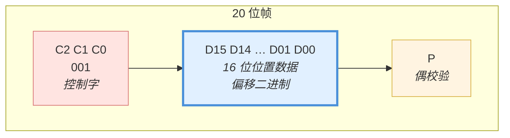

# 🧩 帧结构详解 ★核心笔记

> [!info] 一句话版本
> 一帧 = **20 位** = `001`（3 位控制字）+ 16 位位置数据（**D15 先发**）+ 1 位偶校验。
> X 和 Y 各有一条线，但**同时**发送、共用 CLK 和 SYNC。

> [!warning] 这篇是本库最重要的一篇
> 协议实现出错，90% 都错在这里：**位顺序**、**校验算法**、**同步时序**。
> 建议对照本地 PDF 原文 + 开源代码一起看。

---

## 1. 标准 16 位模式的完整位序

这是**发送顺序**（时间从左到右）：

| 发送次序 | 1 | 2 | 3 | 4 | 5 | … | 18 | 19 | 20 |
|---|---|---|---|---|---|---|---|---|---|
| **内容** | `0` | `0` | `1` | D15 | D14 | … | D1 | D0 | **P** |
| **作用** | 控制字 | 控制字 | 控制字 | MSB | | | | LSB | 偶校验 |

用规范原文的表格表达（同样是发送顺序）：

```text
发送次序:   1   2   3    4    5    6   …   18   19   20
          ┌───┬───┬───┬────┬────┬────┬────┬────┬────┐
CHANNELX  │ 0 │ 0 │ 1 │D15 │D14 │D13 │ …  │D01 │D00 │ P │
CHANNELY  │ 0 │ 0 │ 1 │D15 │D14 │D13 │ …  │D01 │D00 │ P │
          └───┴───┴───┴────┴────┴────┴────┴────┴────┘
            └─控制字─┘  └──── 16 位位置数据 ────┘  校验
             = 001         MSB → LSB 顺序          偶校验
```

> [!important] 位顺序：MSB First（高位先发）
> **D15 先发，D0 最后发。**
> 这是最容易搞错的一点——如果你按 LSB first 写代码，图形会完全错乱。

### 为什么能确定是 MSB first

三重证据，互相印证：

| 证据 | 说明 |
|---|---|
| **① 规范表格** | 原文写作 `001` 后面紧跟 `D15..D0 position data`，书写顺序即发送顺序 |
| **② sigrok 解码器** | 官方逻辑分析仪解码器用 `pos |= value << count`（count 从 15 递减），即第 4 位是 MSB |
| **③ Arduino 开源实现** | `(x >> (15 - i)) & 1`，i 从 0 递增 → 先取 bit15 |

> [!quote] sigrok 解码器源码（`xy2-100/pd.py`）
> ```python
> if (type == frame_type_16bit_pos):
>     count = 15
>     for ss, es, value in self.bits[3:19]:
>         pos |= value << count
>         count -= 1
>     pos = pos if pos < 32768 else pos - 65536
> ```
> 本地文件：`99-附件与下载/代码/sigrok-xy2-100-decoder/pd.py`

> [!quote] Arduino 实现（`XY2_100.cpp`）
> ```cpp
> for (int i = 0; i < 16; i++) {
>   unsigned char current_bit_x = (x >> (15 - i)) & 1;   // 先取 bit15
>   ...
> }
> ```
> 本地文件：`99-附件与下载/代码/xy2-100-arduino/src/XY2_100.cpp`

---

## 2. 逐位拆解：每一段干什么



### 2.1 控制字 C2-C0（第 1~3 位）

| C2 C1 C0 | 含义 | 备注 |
|---|---|---|
| `0 0 1` | **电机设定值**（motor setpoint value） | 标准位置帧，最常用 |
| `1 x x` | 18 位增强模式 | 见 [[01-协议篇/06-XY2-100E增强版]] |
| `1 1 1` | 命令帧（Command） | 部分厂商支持，8 位命令 + 8 位参数 ⚠️ |

> [!quote] 规范原文
> "The first 3 bits are used as a control word (C2-C0)."
> "C2 C1 C0 = 0 0 1 → motor setpoint value"
> — `Documents_TD_XY2-100_R0703.pdf` 第 2 页

> [!note] 有意思的发现：命令帧
> sigrok 官方解码器识别出第三种帧类型：
> ```text
> -TYPE-- -8-bit command -8-bit parameter value- PARITY
> ```
> 即控制字 `111` + 8 位命令 + 8 位参数。这说明**部分厂商在 XY2-100 上扩展了配置通道**。
> ⚠️ 这不是所有振镜都支持，用之前必须查该型号手册。

### 2.2 位置数据 D15-D0（第 4~19 位）

| 属性 | 值 |
|---|---|
| 位宽 | 16 位 |
| 顺序 | **D15（MSB）先发 → D0（LSB）最后** |
| 编码 | **偏移二进制**（offset binary） |
| 取值范围 | 0x0000 ~ 0xFFFF（无符号） |
| 等效值域 | −32768 ~ +32767（有符号解释） |
| 中心位置 | **0x8000**（即 32768） |

> [!important] "偏移二进制"是什么意思
> 就是"把有符号数加上一个偏移量变成无符号数"：
> ```text
> 想表达 −32768  →  发送 0x0000
> 想表达      0  →  发送 0x8000   ← 中心！
> 想表达 +32767  →  发送 0xFFFF
> ```
> 换算公式：`发送值 = 目标值 + 32768`（目标值范围 −32768 ~ +32767）
>
> **详细换算见 [[01-协议篇/04-位置数据编码]]**

### 2.3 校验位 P（第 20 位）

| 模式 | 校验类型 | 算法 |
|---|---|---|
| 标准 16 位 | **偶校验 Even Parity** | 16 位数据中 `1` 的个数 + P 的个数 = **偶数** |
| 增强 18 位 | **奇校验 Odd Parity** | 18 位数据中 `1` 的个数 + P 的个数 = **奇数** |

> [!quote] 规范原文
> 标准模式："then 16 bit position data followed by a parity bit (Pe, **even parity**)"
> 增强模式："then 18 bit position data followed by a parity bit (Po, **odd parity**)"
> — `E1803D_Scanner_Controller_Manual.pdf` p.150

**偶校验的计算方法**（对 16 位数据做异或）：

```c
// 偶校验：把所有数据位异或起来，结果就是校验位
uint8_t parity = 0;
for (int i = 0; i < 16; i++)
    parity ^= (value >> i) & 1;
```

> [!tip] 💡 为什么异或能得到偶校验位
> 异或的性质：`1` 的个数为偶数时异或结果为 0，奇数时为 1。
> 把这个结果作为校验位附加上去，就使**总**的 `1` 的个数变成偶数。
>
> 验证：数据 `1010` 0000 0000 0000（2 个 1，偶数）→ 异或得 0 → 加 P=0 → 总共 2 个 1 ✅ 偶数
> 数据 `1011` 0000 0000 0000（3 个 1，奇数）→ 异或得 1 → 加 P=1 → 总共 4 个 1 ✅ 偶数

> [!success] ✅ 校验范围已确认：覆盖全部 19 个前导位
> **结论：`P = XOR(C2, C1, C0, D15…D0)`**，即对控制字 + 位置数据共 **19 位**求偶校验，
> 使整帧 20 bit 中 `1` 的个数为偶数。
>
> **证据（多个独立接收端实现交叉验证）**：
> | 实现 | 校验范围 |
> |---|---|
> | **sigrok 官方解码器** `xy2-100/pd.py` | `for v in self.bits[:-1]` → **前 19 位** ✅ |
> | danmcb / Saleae 解码器 | 前 19 位 ✅ |
> | earlynerd / XY2-100_HLA 解码器 | 前 19 位 ✅ |
> | SCANLAB / halaser 文档推导 | 整帧偶校验 → 前 19 位 ✅ |
>
> 本地文件：`99-附件与下载/代码/sigrok-xy2-100-decoder/pd.py`

> [!danger] ⚠️ 两个流行开源库在这里有 BUG
> **`georgemihaila/xy2-100`（Arduino，本库已下载参考）和 `NOBIC-NTU/OPAL`
> 只对 16 个数据位求 XOR，结果实际变成了"整帧奇校验"。**
>
> ```cpp
> // georgemihaila/xy2-100 的做法 (只算 16 位数据) —— 与规范不符
> for (int i = 0; i < 16; i++) {
>     unsigned char current_bit_x = (x >> (15 - i)) & 1;
>     even_parity_bit_x ^= current_bit_x;
> }
> ```
>
> 因为控制字 `001` 本身含 **1 个 `1`（奇数）**，所以"只算数据位"和"算全部 19 位"
> 得到的结果**必然相反**。
>
> 💡 这解释了为什么有些 DIY 项目"能跑但偶尔抽风"——校验位实际上一直是错的。

**正确的计算方法**：

```c
/* 方法一: 显式异或 19 个前导位 */
uint32_t frame19 = (0b001u << 17) | (wire << 1);   /* 控制字 + 数据, 共 19 位 */
uint8_t  parity  = 0;
for (int i = 1; i <= 19; i++)
    parity ^= (frame19 >> i) & 1u;

/* 方法二: 更简洁 —— 统计 1 的个数 */
uint8_t parity = __builtin_parity(frame19);        /* GCC 内建函数 */

/* 方法三: Verilog 一行搞定 */
// wire par = ^frame19[19:1];
```

> [!tip] 💡 一句话记忆法
> **偶校验 = 让"整帧 20 位里 1 的个数"变成偶数。**
> 先把控制字 `001` 摆上（已经贡献了 1 个 `1`），
> 再数数据里有多少个 `1`，补一个校验位把总数凑成偶数。
>
> 因为控制字贡献了奇数个 `1`，所以**只数数据位会得到相反结果**——
> 这就是那两个开源库出错的原因。

---

## 3. SYNC 信号：帧的"括号"

SYNC 是理解协议的关键。它**不是**每个字节一个脉冲，而是**一帧一个长脉冲**。

```text
CLK     ┌┐┌┐┌┐┌┐┌┐┌┐┌┐┌┐┌┐┌┐┌┐┌┐┌┐┌┐┌┐┌┐┌┐┌┐┌┐┌┐┌┐┌┐┌┐  连续不停
        ┘└┘└┘└┘└┘└┘└┘└┘└┘└┘└┘└┘└┘└┘└┘└┘└┘└┘└┘└┘└┘└┘└┘└┘

SYNC    ┌───────────────────────────────────────────┐         ┌───
        │                                           │         │
        ┘                                           └─────────┘
        ↑                                           ↑
   上升沿 = 帧开始                        下降沿 = 校验位开始
   （第 1 位 C2 可发）                    （第 20 位 P 可发）

         │←─────── 高电平 = 19 个 bit ──────────→│
         │←────────────── 10 μs ─────────────────→│
```

| 事件 | 含义 |
|---|---|
| SYNC **上升沿** | 新的一帧开始，第 1 位（C2）可以发送 |
| SYNC **保持高** | 持续 **19 个时钟位** |
| SYNC **下降沿** | 第 20 位（校验位 P）可以发送，且标志帧即将结束 |

> [!quote] 规范原文
> "The rising edge on SYNC marks the beginning of a XY2-100 frame,
> the falling edge on SYNC signals the beginning of the last bit of the current XY2-100 frame."
> — `XY2-100_Laser_Scanner_Protocol_Format_Specification.pdf` 第 2 页

> [!danger] 新手最常犯的 SYNC 错误
> **❌ 错误**：把 SYNC 当成"每 20 个时钟翻转一次"，或者"发完就拉低"。
> **✅ 正确**：SYNC 高电平恰好覆盖前 19 位，**在第 20 位（校验位）期间是低电平**。
>
> 如果你把 SYNC 一直保持高到第 20 位结束，振镜可能无法正确识别帧边界。

### 为什么 SYNC 要提前一位拉低

💡 一种合理的解释：**下降沿本身就是"最后一位即将到来"的预告**。
振镜检测到 SYNC 下降沿，就知道"下一个时钟就是校验位了"，可以提前准备帧收尾/校验判断。
这样接收方不需要自己数满 20 个时钟——**SYNC 同时充当了帧头标记和帧尾预告**。

> [!note] 🔬 验证实验
> 把 SYNC 改成"整帧都高"，看振镜是否还能工作。
> 用逻辑分析仪记录现象，这是理解 SYNC 作用最好的实验。

---

## 4. 完整时序图（含数据）

```text
        1    2    3    4    5    6    7   …   18   19   20
      ┌────┬────┬────┬────┬────┬────┬────┬───┬────┬────┬────┐
CLK   │ 1  │ 2  │ 3  │ 4  │ 5  │ 6  │ 7  │ … │ 18 │ 19 │ 20 │   ← 周期编号
      └────┴────┴────┴────┴────┴────┴────┴───┴────┴────┴────┘

SYNC  ─────────────────────────────────────────────────────┐
      （高）                                                  └── 低
      ↑ 帧开始                                              ↑ 校验位

X     ──< 0 >< 0 >< 1 ><D15 ><D14 ><D13 >< … ><D01 ><D00 >< P >──
Y     ──< 0 >< 0 >< 1 ><D15 ><D14 ><D13 >< … ><D01 ><D00 >< P >──
        └─控制字─┘└──────── 16 位位置（MSB→LSB）────────┘└校验┘

              ↑                                    ↑
        上升沿数据变化                      下降沿振镜采样
```

### 数据有效窗口

```text
               ┌────────────────────────────────
CLK            │          高电平
        ───────┘
               ↑                              ↑
          上升沿：数据在此后变化        下降沿：振镜在此采样
                                          
DATA   ────────XXXX═══════════════════════XXXX────────
                   ↑                 ↑
              变化完成            必须保持稳定
              
              │←─ tDS ≥ 50 ns ─→│←─ tDH ≥ 100 ns ─→│
              （相对采样沿的时间参数，见下篇）
```

> [!warning] 一个细节：数据在"高电平期间"稳定
> 规范说上升沿数据变化、下降沿采样。实践中：
> - 在 CLK **上升沿之后尽快**把新数据推到线上
> - 保证在**下降沿前后**数据已经稳定
> - 具体 tDS / tDH 数值见 [[01-协议篇/03-时序规范与参数表]]

---

## 5. 连续帧：帧与帧之间没有间隙

这是 XY2-100 的一个重要特点：**帧是背靠背连续的**。

```text
CLK   ┌┐┌┐┌┐ … ┌┐ ┌┐┌┐┌┐ … ┌┐ ┌┐┌┐┌┐ … ┌┐
      ┘└┘└┘└     ┘└ ┘└┘└┘└     ┘└ ┘└┘└┘└     ┘└

SYNC  ────────┐                  ┌────────────┐
              └──────────────────┘            └────────
              │←── 帧 N (10 μs) ─→│←─ 帧 N+1 ──→│

      帧 N 的校验位结束 → 下一个时钟 → 帧 N+1 的控制字开始
```

| 特性 | 说明 |
|---|---|
| 帧间间隙 | **无**（10 μs 一个接一个） |
| CLK | 不间断 |
| 帧率 | 恒定 100 kHz |
| 要改位置 | 在下一帧填入新值即可 |
| 不改位置 | 下一帧重复发相同值（**必须继续发！**） |

> [!danger] 关键规则：即使位置不变也必须持续发送
> 振镜**不会**记住"上次的位置然后待机"。
> 你**必须**以 100 kHz 持续发送帧，位置不变就重复发同一个值。
>
> ❌ 错误做法：发一帧 → 停 1 ms → 再发下一帧
> ✅ 正确做法：每 10 μs 发一帧，位置不变时重复上一帧的值
>
> 💡 少数振镜容忍时钟间歇，但**按规范做**才是安全的。

---

## 6. 三个轴的情况（3D 振镜）

3D 振镜（带动态聚焦）多一条 CHANNELZ：

```text
SYNC   ─────────┐                ┌──────────
                └────────────────┘

X      ──<001>< D15…D0 ><P>──
Y      ──<001>< D15…D0 ><P>──      ← 同一帧内，同步发送
Z      ──<001>< D15…D0 ><P>──
```

**要点**：
- Z 通道和 X/Y **共用同一个 CLK 和 SYNC**
- 所以 Z 与 X/Y **完全同步**
- Z 通常控制**动态聚焦模块**（改变焦距，补偿场镜的平面误差）

---

## 7. 手算练习 🔬

> [!example] 练习 2.1：手写一帧
> 目标：X 轴到中心位置（0）
>
> **步骤**：
> 1. 中心位置 → 偏移二进制值 = `0x8000` = `1000 0000 0000 0000`
> 2. 控制字 = `001`，数据占 bit[16:1]
> 3. 数 `1` 的个数：控制字有 1 个，数据有 1 个 → 共 **2 个（偶数）**
> 4. 偶校验要求总数为偶数 → 校验位 = `0`
> 5. 拼起来（发送顺序）：
> ```text
> 001 1000000000000000 0
> ```
> 共 20 位 ✅（`1` 的总数 = 2，偶数 ✅）

> [!example] 练习 2.2：X = 最大值
> X = +32767 → 偏移二进制 = `0xFFFF` = `1111 1111 1111 1111`（16 个 `1`）
> 加控制字 1 个 `1` → 共 17 个（奇数）→ 校验位 = `1`
> ```text
> 001 1111111111111111 1     （总 18 个 1，偶数 ✅）
> ```

> [!example] 练习 2.3：X = 最小值
> X = −32768 → 偏移二进制 = `0x0000` = `0000 0000 0000 0000`（0 个 `1`）
> 加控制字 1 个 `1` → 共 1 个（奇数）→ 校验位 = `1`
> ```text
> 001 0000000000000000 1     （总 2 个 1，偶数 ✅）
> ```

> [!example] 练习 2.4：X = +1
> X = +1 → 偏移 = `0x8001` = `1000 0000 0000 0001`（2 个 `1`）
> 加控制字 1 个 `1` → 共 3 个（奇数）→ 校验位 = `1`
> ```text
> 001 1000000000000001 1     （总 4 个 1，偶数 ✅）
> ```

> [!example] 练习 2.5：对照"错误算法"
> 假如你**只数数据位**（就是那两个开源库的做法）：
> - 练习 2.1：数据 1 个 `1`（奇数）→ 校验位 = `1` → `001 1000000000000000 1` ❌
> - 练习 2.3：数据 0 个 `1`（偶数）→ 校验位 = `0` → `001 0000000000000000 0` ❌
>
> **和正确答案正好相反。** 这就是为什么"校验范围"这件事必须搞清楚。

> [!success] 🔬 快速验证你的实现
> 用下面的代码直接算出正确答案，和你的实现对比：
> ```python
> def frame(target):
>     wire   = (target + 32768) & 0xFFFF
>     f19    = (0b001 << 17) | (wire << 1)      # 19 个前导位
>     parity = bin(f19).count("1") & 1          # 补成偶数
>     return f19 | parity
>
> for t in (0, 32767, -32768, 1, -12345):
>     w = frame(t)
>     print(f"{t:7d} -> 0x{w:05X}  {w:020b}")
> ```
> 期望输出（已实测验证）：
> ```text
>       0 -> 0x30000  00110000000000000000
>  32767 -> 0x3FFFF  00111111111111111111
> -32768 -> 0x20001  00100000000000000001
>      1 -> 0x30003  00110000000000000011
> -12345 -> 0x29F8F  00101001111110001111
> ```

---

## ✅ 自检

- [ ] 能默写标准 16 位模式的完整位序
- [ ] 知道是 MSB first 还是 LSB first，并能给出两个证据
- [ ] 会手算偶校验位
- [ ] 能画出 SYNC 的波形，说清它在第几位拉低
- [ ] 知道帧之间没有间隙，位置不变也必须继续发
- [ ] 知道位置数据的中心值是 `0x8000` 而不是 0

---

## 📖 原厂依据

> [!quote] 原始出处
> | 内容 | 出处 |
> |---|---|
> | 标准模式位序 `001` + D15..D0 + Pe | `XY2-100_Laser_Scanner_Protocol_Format_Specification.pdf` p.2 |
> | 同样表述 | `E1803D_Scanner_Controller_Manual.pdf` p.150 (Appendix B) |
> | 控制字 C2-C0，`001` = motor setpoint | `Documents_TD_XY2-100_R0703.pdf` p.2 |
> | 偏移二进制 offset binary | `Documents_TD_XY2-100_R0703.pdf` p.2；`Raylase_Interface_XY2-100.pdf` p.1 |
> | SYNC 上升沿=帧开始、下降沿=最后一位 | `XY2-100_..._Specification.pdf` p.2 |
> | SYNC 高 19 位、校验位时拉低 | `Raylase_Interface_XY2-100.pdf` p.1 |
> | 偶校验（标准）/ 奇校验（增强） | `E1803D...Manual.pdf` p.150 |
> | MSB-first 位顺序（代码佐证） | sigrok `xy2-100/pd.py`；Arduino `XY2_100.cpp` |
> | 命令帧 `111` + 8 bit cmd + 8 bit param | sigrok `xy2-100/pd.py` 注释 |
>
> 本地文件：`99-附件与下载/pdf/`、`99-附件与下载/代码/`

---

## 🔗 相关

- 上一篇：[[01-协议篇/01-XY2-100协议总览]]
- 下一篇：[[01-协议篇/03-时序规范与参数表]]
- 深挖编码：[[01-协议篇/04-位置数据编码]]
- 代码实现：[[02-硬件实现篇/02-FPGA实现思路]]
- 回到入口：[[🏠 开始这里]]
