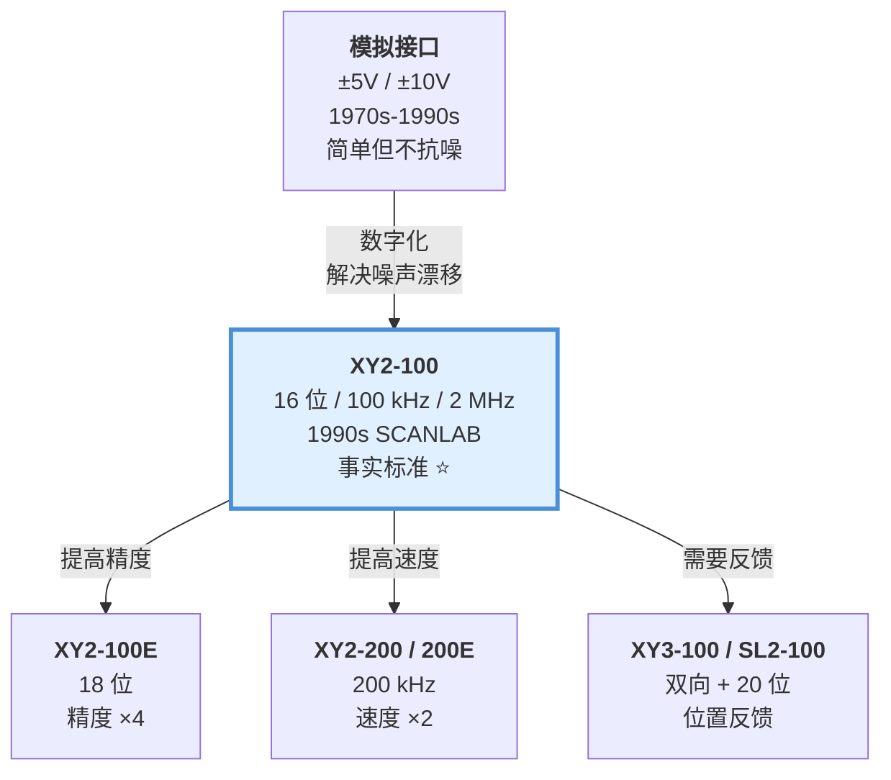
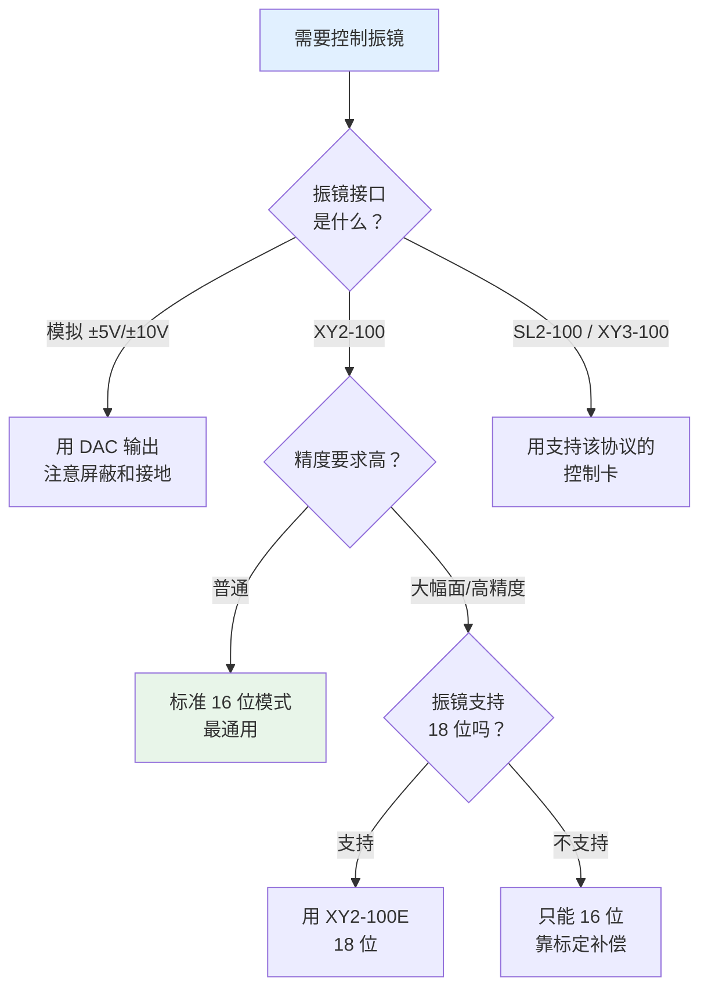

# 🔀 振镜接口协议家族横向对比

> [!info] 一句话版本
> XY2-100 是**事实标准**（16 位 / 100 kHz）；往上走有 **XY2-100E**（18 位）、
> **XY2-200**（200 kHz）、**XY3-100 / SL2-100**（双向 + 位置反馈）；
> 往下还有**模拟 ±5V/±10V** 仍在大量使用。

---

## 1. 总览对比表

| 协议 | 标准号 | 位置位数 | 帧长 | 帧率 | 时钟 | 方向 | 校验 | 终端电阻 |
|---|---|---|---|---|---|---|---|---|
| **模拟 ±5V/±10V** | — | 模拟连续 | — | — | — | 单向 | — | — |
| **XY2-100** ⭐ | **LIA202001** | 16 | 10 μs | 100 kHz | 2 MHz | 单向 | 偶 | ⚠️ 无规定 |
| **XY2-100E** | （同上） | 18 | 10 μs | 100 kHz | 2 MHz | 单向 | **奇** | ⚠️ 无规定 |
| **XY2-200** | — | 16 | 5 μs | 200 kHz | 4 MHz | 单向 | 偶 | ⚠️ 无规定 |
| **XY2-200E** | — | 18 | 5 μs | 200 kHz | 4 MHz | 单向 | 奇 | ⚠️ 无规定 |
| **XY3-100** | **LIA202002 / LIA202307** | 16–26 可变 | 24/32 bit 帧 | — | 2.4/3.2 MHz | **双向** | P1/P0, P3–P0 | ✅ **必须加** |
| **SL2-100** | 专有封闭 | **20** | 10 μs | 100 kHz | — | **双向** | — | — |
| **RL3-100** | — | — | — | — | — | 双向 | — | — |

> [!danger] 🚨 读这张表时必看：XY3-100 的 CLK/SYNC 引脚与 XY2-100 互换
> 两者用的是**同一条 DB25**，但第 1/2 脚的信号定义相反。
> 详见 [[01-协议篇/08-物理层与连接器]] 第 2.5 节。

> [!success] ✅ 表中数据的来源等级
> | 协议 | 数据来源 |
> |---|---|
> | XY2-100 / 100E / 200 / 200E | **厂商一手文档**（halaser E1803D 手册 p.150） |
> | **XY3-100** | **LasIA 官方标准** LIA202002 / LIA202307 |
> | **SL2-100** | **SCANLAB RTC6 官方手册** p.1214 |
> | 模拟接口标度因子 | 各厂商一手数据 |
>
> ⚠️ 唯一仍是**逆向结论**的是 SL2-100 的"差分曼彻斯特编码"
> （官方从未明说，只有侧面印证）。
>
> 📌 标准原文获取方式（lasia.org 现返回 401，用 Wayback 的 `id_` 直链）：
> ```text
> XY2-100: https://web.archive.org/web/20231206141529id_/https://lasia.org/LIA202001/xy2_100_specification.pdf
> XY3-100: https://web.archive.org/web/20231206143105id_/https://lasia.org/LIA202307/xy3_100_specification_v11.pdf
> ```

---

## 2. 四代协议的演进逻辑



**每一代解决了什么**：

| 演进 | 解决的痛点 |
|---|---|
| 模拟 → XY2-100 | 噪声、漂移、精度不确定、无法回读状态 |
| XY2-100 → XY2-100E | 大幅面下的绝对精度不足 |
| XY2-100 → XY2-200 | 高速度加工（3D 打印、高速打标）帧率不够 |
| XY2-100 → XY3-100 | **官方后继标准**：真正的双向 + 位置反馈 |
| XY2-100 → SL2-100 | SCANLAB 自研路线：20 位 + 更少的线 |

> [!note] 标准化的脉络
> ```text
> LIA202001  →  LIA202002 (XY3-100 v1.0)  →  LIA202307 (XY3-100 v1.1)
>  XY2-100          官方后继标准开始                 现行版本
> ```
> 由 **LasIA**（激光行业协会）发布。
> ⚠️ XY3-100 **不是**中国厂商定义的——它是国际标准，国内厂商是**实现方**。

---

## 3. 逐个详解

### 3.1 模拟接口 ±5V / ±10V

```text
上位机 DAC ──[−5V ~ +5V]──> 振镜 X
           ──[−5V ~ +5V]──> 振镜 Y
           ──[GND]────────> 共地
```

| 优点 | 缺点 |
|---|---|
| 极简单，无需协议 | 噪声直接变成位置误差 |
| 成本最低 | 温漂、地电位差影响大 |
| 无延迟（模拟直通） | 电缆不能长 |
| 兼容老设备 | **无法回读任何状态** |

**仍在使用**：低端打标机、舞台激光灯、部分 LiDAR、DIY 项目。

> [!note] SCANLAB 的一个实例
> SCANLAB SCANcube 10 的接口选项包含 **模拟 ±4.8V**（不是 ±5V，略有差异）。
> 说明模拟接口至今仍是正式选项，没有完全淘汰。

### 3.2 XY2-100 ⭐

**本知识库的主角。** 完整内容见 [[01-协议篇/01-XY2-100协议总览]]。

| 属性 | 值 |
|---|---|
| 位置位数 | 16 |
| 帧 | 20 位 / 10 μs |
| 帧率 | 100 kHz |
| 时钟 | 2 MHz |
| 校验 | 偶校验 |
| 头部 | `001` |

**地位**：激光材料加工行业的**最流行振镜协议**，所有厂商兼容，生态最成熟。

### 3.3 XY2-100E

**唯一区别**：位置 16 位 → **18 位**，校验偶 → **奇**，头部 `001` → `1`。
帧长、帧率、时钟**完全不变**（这是精妙的向后兼容设计）。

详见 [[01-协议篇/06-XY2-100E增强版]]。

### 3.4 XY2-200 / XY2-200E

**唯一区别**：帧长 10 μs → **5 μs**（帧率翻倍到 200 kHz）。

| 项目 | XY2-100 | XY2-200 |
|---|---|---|
| 帧长 | 10 μs | **5 μs** |
| 帧率 | 100 kHz | **200 kHz** |
| 隐含时钟 | 2 MHz | **4 MHz** |

> [!quote] 规范原文
> "In XY2-100 and XY2-100E mode one frame with 20 bits has a length of 10 usec which is similar to 100 kHz output clock.
> For the XY2-200 and XY2-200E modes a frame with 20 bits has a length of 5 usec which is similar to 200 kHz output frequency."
> — `E1803D_Scanner_Controller_Manual.pdf` p.150

> [!tip] 💡 什么时候需要 200 kHz
> 只有在振镜本身带宽足够、且加工速度要求极高时才用得上。
> 注意：**200 kHz 帧率 ≠ 振镜能跑 200 kHz**。
> 大多数振镜的小信号带宽只有 1–10 kHz，所以 200 kHz 帧率对它们**没有实际意义**——
> 你只是在用同样的位置值重复填充而已。
> 见 [[02-硬件实现篇/05-更新率与振镜带宽匹配]]。

### 3.5 XY3-100

新一代协议，**由 LasIA 发布**（标准号 **LIA202002 v1.0 / LIA202307 v1.1**），
官方定位为 **XY2-100 的后继标准**。

| 特性 | 说明 |
|---|---|
| **双向通信** | 振镜可以回传更多信息 |
| **位置反馈** | 能读到振镜**实际**位置（不只是指令位置） |
| **回传通道** | **异步 RS-485，默认 115200 8N1**；包格式 `0x48 + Type + Len + Payload` |
| **端接** | ✅ 官方**明确要求接收端加终端电阻**（XY2-100 无此规定） |
| 帧结构 | 24 / 32 bit 帧，数据位宽 16–26 bit 可选 |
| 校验 | 有 P1/P0 与 P3–P0 校验机制 |
| 时钟 | 2.4 / 3.2 MHz 可选 |
| 分辨率 | 更高，⚠️ 具体位数需查标准原文 |

> [!danger] 🚨 与 XY2-100 的最大陷阱：CLK/SYNC 引脚互换
> | 协议 | Pin 1 / 14 | Pin 2 / 15 |
> |---|---|---|
> | XY2-100 | **CLK** | **SYNC** |
> | **XY3-100** | **SYNC (A)** | **CLK (B)** |
>
> 而且**帧起始边沿也相反**（XY2-100 = 上升沿，XY3-100 = 下降沿）。
>
> ⚠️ XY3-100 标准原文写着 *"Same pinout as XY2-100(E), no hardware changes needed"*，
> **这句话只在数据线上成立，控制线是互换的。**
>
> 详见 [[01-协议篇/08-物理层与连接器]] 第 2.5 节。

> [!quote] 控制卡手册原文
> "when an XY3-100 scanhead is connected, that provides its actual position, these values are returned"
> — `E1803D_Scanner_Controller_Manual.pdf`

> [!important] 位置反馈为什么重要
> XY2-100 是**开环指令**：你告诉振镜"去这里"，但你**不知道它到底到没到**。
> XY3-100 能告诉你**实际位置**，这就打开了：
> - 实时误差补偿
> - 真正的闭环加工
> - 加工质量在线监测
>
> 代价是协议复杂得多（不是简单的 4 对线了）。

### 3.6 SL2-100

**SCANLAB 自研**的高速协议（专有封闭，未授权第三方）。

> [!success] ✅ 已获得 **SCANLAB 官方定义**（RTC6 手册第 1214 页）
> 此前公开资料只有第三方逆向，现在有官方数据了：
> ```text
> 1 block  = 192 frames + preamble      （每块开始有前导码）
> 1 frame  = 2 sub-frames
> 1 frame  = 10 µs                      （与 XY2-100 相同帧率）
> 1 sub-frame = 20 bit 载荷 + 12 bit 附加信息（同步用）
> ```
> 前向通道与回传通道**完全独立**，各有自己的 block。
>
> **与逆向结果精确吻合**：`2 × (20+12) = 64 bit/帧` → 6.4 Mbit/s 有效数据率；
> 差分曼彻斯特编码 → `128 线路码元 / 10 µs = 12.8 Mbaud`，
> 与论坛实测的"128 码元 / 10 µs"完全对上 ✅

| 属性 | 值 | 来源 |
|---|---|---|
| 分辨率 | **20 位** | ✅ SCANLAB 微加工页 |
| 帧周期 | **10 µs**（= 100 kHz） | ✅ RTC6 手册 p.1214 |
| 块结构 | 192 帧 + 前导码 | ✅ RTC6 手册 p.1214 |
| 子帧 | 20 bit 载荷 + 12 bit 附加 | ✅ RTC6 手册 p.1214 |
| 线路码元 | 128 / 10 µs = **12.8 Mbaud** | ✅ 官方 + 逆向互证 |
| 线对数 | **仅需 2 对**（DataIn±、DataOut±） | 🟡 论坛 |
| 编码方式 | 差分曼彻斯特 | ⚠️ **逆向结论**，官方未明说 |
| 方向 | 双向 | ✅ |
| 授权 | 专有封闭，**不授权第三方** | ✅ HALaser 对照表 |

> [!warning] ⚠️ 两个被证伪的流传说法
> 1. **"SL2-100 帧长 26 bit"** → ❌ **错误**。
>    26 bit 是**控制器内部运算分辨率**（HALaser 手册原文），被误读成了帧长。
> 2. **"SL2-100 是 10 Mbit/s"** → ❌ 不准确。
>    实际是 **12.8 Mbaud** 线路速率（差分曼彻斯特编码，含时钟信息）。
>
> 另外注意：**差分曼彻斯特编码目前仍属逆向结论**——
> 官方从未明说，只给出了 preamble / pulse length / bit count / parity
> 四类错误位，从侧面印证它是自同步编码。

> [!note] 一个有意思的设计取舍
> SL2-100 只需要 **2 对差分线**（而 XY2-100 需要 4~5 对）。
> 因为它是**真双向**的，且用了自同步编码，时钟信息嵌在数据里。
> 更少的线 = 更简单的电缆 = 更好的信号完整性 = 更长的传输距离。

### 3.7 RL3-100

控制卡手册中列为支持的协议之一，⚠️ 详细参数需查官网。

---

## 3.8 ⚠️ 关于模拟接口的两个错误说法

> [!danger] 错误说法 1：「±10 V = ±20° 光学角」
> **在多数实现下这个换算是错的，差了 2 倍。**
>
> 模拟振镜的**标度因子（scale factor）**不是固定的，各家不同：
>
> | 厂商 / 来源 | 标度因子（一手值） |
> |---|---|
> | **Thorlabs** | **0.5 / 0.8 / 1.0 V 每机械度** |
> | Sino-Galvo（世纪桑尼） | 0.33 V / 度 |
> | Scanner Optics | 0.5 ~ 2 V / 机械度 |
>
> **按 0.5 V/机械度 计算**：
> ```text
> ±10 V  →  ±20° 机械角   →  ±40° 光学角   ⚠️ 不是 ±20° 光学！
> ```
> **因为光学角 = 2 × 机械角**（反射定律）。
>
> 📌 **正确做法**：**按你手上那台的标度因子算**，不要套用固定换算。

> [!danger] 错误说法 2：「模拟接口等效 12 bit」
> **这个说法没有一手证据支持。**
>
> 决定性反证：**同一块 Thorlabs 驱动板，只换电源**——
>
> | 电源类型 | 实测分辨率 |
> |---|---|
> | **线性电源** | **15 μrad**（≈ 15.5 bit） |
> | 开关电源 | **70 μrad**（≈ 13.3 bit） |
>
> **瓶颈是电源噪声，不是 DAC 位数。**
> 换一个好电源，同一块板的分辨率提升近 5 倍。
>
> 💡 这对数字振镜同样成立——见 [[02-硬件实现篇/04-差分驱动电路]] 的电源与接地一节。

---

## 4. 选型决策树



### 按应用场景推荐

| 场景 | 推荐 | 理由 |
|---|---|---|
| 普通激光打标 | **XY2-100** | 生态成熟，够用 |
| 大幅面打标/焊接 | XY2-100E | 绝对精度 |
| 金属 3D 打印 | XY2-100E / XY2-200 | 速度 + 精度 |
| 需要质量监控 | **XY3-100 / SL2-100** | 位置反馈 |
| 舞台灯光/LiDAR | 模拟 或 XY2-100 | 成本敏感 |
| DIY 学习 | **XY2-100** | 资料最多，开源实现多 |
| 超高精度科研 | SL2-100 | 20 位分辨率 |

---

## 5. 一个重要认识：协议 ≠ 性能

> [!warning] 这是最容易被误解的一点
> **接口协议决定的是"数据传输能力"，不是"振镜的物理性能"。**
>
> 举例：两台振镜都用 XY2-100，但：
> | 参数 | 廉价振镜 | 高端振镜 |
> |---|---|---|
> | 小信号带宽 | 1 kHz | 10 kHz |
> | 跟踪误差 | 1 mrad | 0.05 mrad |
> | 重复精度 | 50 μrad | 2 μrad |
>
> **协议完全一样，性能差 20 倍。**
> 差异来自电机、传感器、伺服算法、机械结构——**不来自协议**。
>
> 所以选型时：**先看振镜性能参数，再看接口协议是否兼容你的控制卡。**

---

## 6. 兼容性说明

| 问题 | 答案 |
|---|---|
| XY2-100 控制卡能驱动 XY2-100E 振镜吗？ | 通常可以，**降级到 16 位模式**运行（如果振镜支持标准模式） |
| XY2-100E 控制卡能驱动 XY2-100 振镜吗？ | 需切回标准模式，否则振镜不认帧 |
| XY2-100 控制卡能驱动 SL2-100 振镜吗？ | ❌ 不行，需要转换器 |
| 模拟输出能接 XY2-100 振镜吗？ | ❌ 不行，需要**模拟转 XY2-100 转换板** |
| XY2-100 能接模拟振镜吗？ | ❌ 不行，需要 **XY2-100 转模拟**的 DAC 板 |

> [!note] 转换板是真实需求
> 有专门的论文研究这个，例如：
> 《基于 XY2-100 协议的振镜控制转换板的设计与实现》（王文毅等，DSP F2812 实现）
> —— 见 [[04-资源库/04-论文书籍]]

---

## ✅ 自检

- [ ] 能说出 XY2-100 / 100E / 200 / 200E 的区别
- [ ] 记得 E 后缀 = 18 位（精度），200 = 200 kHz（速度）
- [ ] 知道 XY3-100 / SL2-100 的核心优势是**位置反馈**
- [ ] 理解"协议 ≠ 性能"
- [ ] 能判断自己的场景该选哪个协议

---

## 📖 原厂依据

> [!quote] 原始出处
> | 内容 | 出处 |
> |---|---|
> | XY2-100/E 帧长 10 μs、XY2-200/E 帧长 5 μs | `E1803D_Scanner_Controller_Manual.pdf` p.150 |
> | XY3-100 / SL2-100 / RL3-100 存在性 | 同上 p.151-153（Appendix C/D/E） |
> | XY3-100 提供实际位置反馈 | 同上（E180X API 说明） |
> | 支持协议列表（XY2-100/200/100E/200E/XY3-100） | 同上 p.1-2（产品特性） |
> | SL2-100 = 20 位、XY2-100 = 16 位 | NI 官方论坛技术说明 |
> | SCANcube 10 接口选项（SL2-100 / XY2-100 / 模拟 ±4.8V） | SCANLAB 官网产品页 |
>
> ⚠️ **未验证内容**：XY3-100 / SL2-100 / RL3-100 的详细时序参数、
> XY3-100 的具体分辨率，我**没有找到可核对的原厂数据**，因此表中留空。
> 官方对比页：`https://halaser.systems/compare.php#XY3`（本机网络无法访问）

---

## 🔗 相关

- 上一篇：[[01-协议篇/06-XY2-100E增强版]]
- 下一篇：[[01-协议篇/08-物理层与连接器]]
- 性能匹配：[[02-硬件实现篇/05-更新率与振镜带宽匹配]]
- 资源：[[04-资源库/01-官方文档索引]]
- 回到入口：[[🏠 开始这里]]
