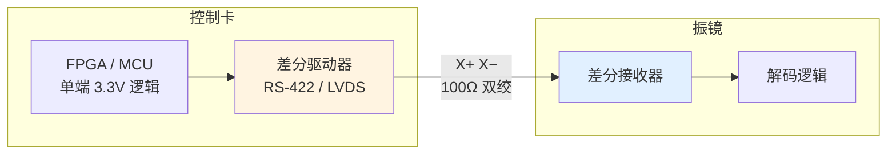

# 🔌 物理层与连接器

> [!info] 一句话版本
> XY2-100 用 **DB25** 连接器，信号全是**差分对**（P/N 两根线）。
> 最常见的是 Raylase/SCANLAB 风格的引脚排列，但**各家不完全一样**。

> [!warning] ⚠️ 接插件是烧设备的高发区
> **引脚接错 = 可能烧振镜或烧控制卡。**
> 上电前必须用万用表逐针核对，尤其是**电源针**。

---

## 1. 信号清单

| 信号 | 说明 | 方向 | 差分对 |
|---|---|---|---|
| **CLK** | 连续 2 MHz 时钟 | 控制卡 → 振镜 | ✅ |
| **SYNC** | 帧同步 | 控制卡 → 振镜 | ✅ |
| **CHANNELX** | X 轴数据 | 控制卡 → 振镜 | ✅ |
| **CHANNELY** | Y 轴数据 | 控制卡 → 振镜 | ✅ |
| **CHANNELZ** | Z 轴数据（3D 振镜） | 控制卡 → 振镜 | ✅ |
| **STATUS** | 状态回读 | **振镜 → 控制卡** ⚠️ | ✅ |
| **REF_IO** | 参考地 | — | 单端 |
| **POWER+ / POWER−** | 振镜供电 | 控制卡 → 振镜 | 单端 |

> [!important] STATUS 方向相反
> 除了 STATUS，所有信号都是"控制卡 → 振镜"。
> **STATUS 是唯一反向的信号**，接错方向会损坏接口。

---

## 2. DB25 引脚定义

### 2.1 Raylase / Ray-Motion 风格

| 引脚 (P) | 引脚 (N) | 信号名 | 说明 | 方向 |
|---|---|---|---|---|
| **1** | **14** | CLOCK− / CLOCK+ | 连续时钟 | Input |
| **2** | **15** | SYNC− / SYNC+ | 帧同步 | Input |
| **3** | **16** | CHAN1− / CHAN1+ | **CHANNEL X** | Input |
| **4** | **17** | CHAN2− / CHAN2+ | **CHANNEL Y** | Input |
| 5 | 18 | — | 未使用 | — |
| 6 | 19 | — | 未使用 | — |
| 7 | 20 | — | 未使用 | — |
| 8 | 21 | — | 未使用 | — |
| **9** | **10 / 22** | POWER+ | **+15 V** | Input |
| **11** | **23 / 24** | GND | 地 | Input |
| **12** | **13 / 25** | POWER− | **−15 V** | Input |

> [!quote] 规范原文
> ```text
> Pin Name    Signal description                 In/Out
> 1 / 14      CLOCK-/CLOCK+  CLOCK: continuously running clock   Input
> 2 / 15      SYNC-/SYNC+    SYNC: synchronises data transfer    Input
> 3 / 16      CHAN1-/CHAN1+  CHANNELX: data to X axis            Input
> 4 / 17      CHAN2-/CHAN2+  CHANNELY: data to Y axis            Input
> 9/10/22     POWER+         +15V                                Input
> 11/23/24    GND                                                Input
> 12/13/25    POWER-         -15V                                Input
> ```
> — `Raylase_Interface_XY2-100.pdf` 第 1 页

### 2.2 Newson 风格（与上面略有不同）

| 引脚 (P) | 引脚 (N) | 信号名 | 说明 | 方向 |
|---|---|---|---|---|
| **1** | **14** | IO1− / IO1+ | **SENDCK**（时钟） | Input |
| **2** | **15** | IO2− / IO2+ | **SYNC** | Input |
| **3** | **16** | IO3− / IO3+ | **CHANNELX** | Input |
| **4** | **17** | IO4− / IO4+ | **CHANNELY** | Input |
| 5 | 18 | IO5− / IO5+ | 未使用 | — |
| **6** | **19** | IO6− / IO6+ | **STATUS** | **Output** ⚠️ |
| 7 | 20 | IO7− / IO7+ | 未使用 | — |
| **13** | — | REF_IO | 参考 I/O，接控制卡 GND | — |

> [!quote] 规范原文
> ```text
> Pin Name    Signal description                       In/Out
> 1 / 14      IO1- / IO1+   SENDCK: continuously running clock   Input
> 2 / 15      IO2- / IO2+   SYNC: synchronises data transfer     Input
> 3 / 16      IO3- / IO3+   CHANNELX: data to X axis             Input
> 4 / 17      IO4- / IO4+   CHANNELY: data to Y axis             Input
> 5 / 18      IO5- / IO5+
> 6 / 19      IO6- / IO6+   STATUS: defines head status          Output
> 7 / 20      IO7- / IO7+
> 13          REF_IO        Reference I/O, connect with GND of controller board.
> ```
> — `Documents_TD_XY2-100_R0703.pdf` 第 1 页

> [!important] ✅ 重要结论：前 4 对线，两家完全一致！
> | 引脚 | Raylase 叫法 | Newson 叫法 | 实际信号 |
> |---|---|---|---|
> | 1 / 14 | CLOCK | SENDCK | **时钟** |
> | 2 / 15 | SYNC | SYNC | **同步** |
> | 3 / 16 | CHAN1 | CHANNELX | **X 数据** |
> | 4 / 17 | CHAN2 | CHANNELY | **Y 数据** |
>
> **只要用 1~4 对（前 8 针）就能发送数据**，这就是"最少 4 对差分线"的由来。
> 这也是为什么不同厂商的振镜能互相兼容——**核心引脚已经事实上标准化了**。
> RAYLASE SS-III、SCANLAB RTC4、Newson、Ray-Motion **四家一手文档在这一点上完全一致**。

---

## 2.5 🚨 危险陷阱：XY3-100 与 XY2-100 的 CLK/SYNC 是互换的

> [!danger] 这是本库**最危险**的一条接线陷阱
> **XY3-100 用的是同一条 DB25，但第 1/2 脚的信号定义与 XY2-100 完全相反！**

| 协议 | **Pin 1 / 14** | **Pin 2 / 15** |
|---|---|---|
| **XY2-100 / XY2-100E** | **CLK −/+** | **SYNC −/+** |
| **XY3-100** | **SYNC −/+**（文档中叫 **A**） | **CLK −/+**（文档中叫 **B**） |

**证据（一手）**：
- XY2-100 侧：RAYLASE SS-III、SCANLAB RTC4、Newson、Ray-Motion —— **四家一致** ✅
- XY3-100 侧：**LasIA LIA202307 v1.1 标准原文 §4.1「DB25 Connector」**：
  ```text
  1  – SYNC- (A-)      14 – SYNC+ (A+)
  2  – CLK-  (B-)      15 – CLK+  (B+)
  ```
  原文还说：*"the control lines SYNC and CLK (**named as A and B** in end user documents)"*
  → **A = SYNC，B = CLK**
- 交叉验证：**HALaser E1803D 同一块卡**，XY2-100 模式下 `1/2 = CLK、3/4 = SYNC`；
  切到 XY3-100 模式后变成 `1/2 = A = SYNC、3/4 = B = CLK` ✅

> [!warning] ⚠️ XY3-100 规范里那句话是错的
> XY3-100 标准写着 *"Same pinout as XY2-100(E), no hardware changes needed"*，
> **但这句话只在数据线（X/Y/Z/U/W）上成立**——
> 控制线 CLK/SYNC 实际是互换的。**读者极易被这句话误导。**

### 帧起始边沿也相反

| 协议 | 帧起始标记 |
|---|---|
| **XY2-100** | SYNC **上升沿** |
| **XY3-100** | SYNC **下降沿** ⚠️ |

### 工程结论

> [!danger] 如果要做双协议兼容板
> **CLK / SYNC 必须可交换**：用跳线、模拟开关，或可配置的差分对映射。
> 硬件上直接把两对线固定死，就无法同时兼容两种协议。
>
> 💡 **唯一的利好**：**Z 轴在 5/18 脚**这一点上，
> RAYLASE、SCANLAB（CHAN3）、XY3-100（Z，E 对）**三家一致**。

> [!tip] 🔬 现场快速判别协议
> 如果不确定手上的设备是 XY2-100 还是 XY3-100：
> 1. 接逻辑分析仪到 1/2 脚
> 2. 看哪一对是**周期恒定的 2 MHz 方波** → 那对是 **CLK**
> 3. 看哪一对是**每 10 μs 一个脉冲** → 那对是 **SYNC**
> 4. 再对照帧起始边沿（上升沿 = XY2-100，下降沿 = XY3-100）

---

## 3. 26 针接口（控制卡侧）

控制卡内部常用 26 针 IDC 排线接口。以 halaser E1803D 为例：

| 上排针 | 信号 | 备注 | 下排针 | 信号 | 备注 |
|---|---|---|---|---|---|
| 1 | CLK− | | 2 | CLK+ | |
| 3 | SYNC− | | 4 | SYNC+ | |
| 5 | X− | XY2-100 兼容 | 6 | X+ | XY2-100 兼容 |
| 7 | Y− | | 8 | Y+ | |
| 9 | Z− | | 10 | Z+ | 3D 振镜用 |
| 11 | STATUS− | | 12 | STATUS+ | |
| 13 | — | | 14 | — | |
| 15 | — | | 16 | — | |
| **17** | **+V** | **+12~24 V** | **18** | **+V** | **+12~24 V** |
| **19** | **+V** | **+12~24 V** | **20** | **GND** | 振镜供电（输出） |
| **21** | **GND** | 振镜供电（输出） | **22** | **GND** | 振镜供电（输出） |
| **23** | **−V** | **−12~24 V** | **24** | **−V** | **−12~24 V** |
| 25 | −V | −12~24 V | 26 | — | |

> [!quote] 控制卡手册原文
> "The 26 pin connector provides signals to be used to control up to three galvos of a scanhead and to power it up."
> — `E1803D_Scanner_Controller_Manual.pdf` p.31

对应的 DB25 线序（同一控制卡的 DB25 版本）：

```text
CLK−
CLK+
SYNC−
SYNC+
X−
X+
Y−
Y+
Z−
Z+
STATUS−
STATUS+
+V  / +V / +V        ← 电源
GND / GND / GND      ← 地
−V  / −V / −V        ← 电源
```

---

## 4. ⚠️ 电源：最容易烧设备的地方

> [!danger] 上电前必须核对的三件事
> 1. **电压是多少？** 不同振镜差别巨大
> 2. **谁来供电？** 控制卡供还是独立电源供？
> 3. **电流够不够？** E1803D 限制 3 A

### 供电电压对比

| 厂商/型号 | 供电 | 备注 |
|---|---|---|
| Raylase (Ray-Motion DB25) | **±15 V** | 双极性电源 |
| halaser E1803D 输出 | **+12~24 V / −12~24 V** | 由外部三针电源输入直通 |
| 多数国产振镜 | **±15 V** 或 **±24 V** 💡 | 必须查手册 |

> [!quote] 控制卡手册的警告（原文照录）
> ```text
> PLEASE NOTE:
> • do not connect scanheads that consume more than 3A (peak and continuously),
>   this may damage the controller and voids warranty!
> • do not feed more than 24V into the three-pin power connector of E1803!
> • feed a stabilised voltage into E1803D controller according to requirements of connected scanhead!
> • when E1803 card is powered via three-pin power connector but scanhead has not to be
>   powered out of the card, the 9 lines for -V, GND, +V (9..13 and 22..25) need to be
>   disconnected, means the used D-SUB25 cable needs to leave these pins open!
> • Violating one of these rules may damage the E1803D card or scanhead irreversibly!
> ```
> — `E1803D_Scanner_Controller_Manual.pdf` p.32

> [!warning] 💡 "不要双重供电"
> 上表最后一条极其重要：
> **如果振镜自己有独立电源，就必须把控制卡到振镜的电源针断开（悬空）。**
>
> 否则 = 两个电源并联 → 可能烧毁其中之一。
> 实操方法：用一根**只接了信号针、剪掉电源针**的定制 DB25 线。

---

## 5. 差分电平与电缆

### 5.1 电平标准：RS-422（不是 LVDS）

> [!success] ✅ 已确认：XY2-100 用的是 **RS-422** 电平
> 虽然我下载的三份基础规范都只写"差分"、没给电平标准，
> 但**厂商推荐器件**明确指向 RS-422：
>
> | 用途 | 厂商推荐器件 | 标准 |
> |---|---|---|
> | 差分**驱动** | UA9638CD、AM26LS31 | **RS-422** |
> | 差分**接收** | MAX3096、UA9637、AM26LV32 | **RS-422** |
>
> 参考：`TI_AM26LS31_RS422_Driver.pdf`、`TI_UA9638_RS422_Driver.pdf`、
> `Maxim_MAX3096_RS422_Receiver.pdf`（均已归档到 `99-附件与下载/pdf/`）

| 项目 | 值 |
|---|---|
| 标准 | **RS-422** ✅ |
| 差分摆幅 | 约 ±2 V（RS-422 典型） |
| 单端阻抗 | 约 50 Ω |
| 差分阻抗 | 约 100 Ω（双绞线） |
| 共模范围 | RS-422 规定 −7 V ~ +7 V |

> [!warning] ⚠️ 不要用 LVDS 器件
> LVDS 摆幅只有 ±350 mV，与 RS-422 的 ±2 V 差 6 倍。
> 虽然有些场合能"凑合"工作，但**抗噪声余量和共模范围都差很多**。
> **按 RS-422 选器件。**

> [!note] 关于电气隔离
> **RAYLASE SS-III 与 SCANLAB RTC4 的 XY2-100 接口没有电气隔离。**
> 只有 RTC5/6 的 SL2-100 才做隔离。
> 💡 这意味着：**控制卡和振镜必须共地**，地电位差会直接影响通信。
> 长距离或强干扰场合建议自己加隔离器。

### 5.2 电缆要求

| 要求 | 说明 | 原因 |
|---|---|---|
| **必须用双绞线** | P/N 两根线绞在一起 | 让干扰共模，被差分抵消 |
| **必须成对走线** | 不要把一对拆开走不同路径 | 拆开就失去共模抑制 |
| **建议屏蔽** | 整体屏蔽层，单端接地 | 抑制高频干扰 |
| **长度尽量短** | 建议 ≤ 3 m 💡 | 减少衰减和干扰 |
| **远离干扰源** | 远离电机线、激光电源线、PWM 线 | 从源头避免干扰 |
| **差分阻抗 100 Ω** | 双绞线典型值 | 减少反射 |
| **终端电阻** | ⚠️ **XY2-100 官方无规定**，见下 | — |

> [!success] ✅ 关于终端电阻：XY2-100 官方不管，XY3-100 明确要求
> | 协议 | 官方对端接的规定 |
> |---|---|
> | **XY2-100** | ⚠️ **标准中没有任何规定**（LIA202001 原文未提及） |
> | **XY3-100** | ✅ **官方明确要求接收端必须加终端电阻**（LIA202307） |
>
> **实证**：**两份真实的开源 XY2-100 设计都不加终端电阻**
> （XY2Galvo、hyperchao0/qspi4xy2-100 的 KiCad 原理图）。
>
> 💡 **实践建议**：
> 1. 线短（< 30 cm）→ **不加**，参考开源做法
> 2. 线长或有振铃 → 在**接收端**加 100~120 Ω
> 3. ⚠️ 很多振镜内部已集成端接，外部再加会**加重驱动器负载**
> 4. **别盲目照抄"RS-422 必须加 120 Ω"的说法** —— XY2-100 标准没这么要求

> [!tip] 💡 一个实用技巧
> 如果只能用普通排线（没有双绞），把 **P 和 N 相邻的两根**尽量靠紧走，
> 也能获得部分共模抑制效果。**最差的做法**是把 P/N 分别走在排线两端。

---

## 6. 差分驱动电路



### 常用器件

| 类型 | 器件示例 | 说明 |
|---|---|---|
| **RS-422 驱动器** ⭐ | **AM26LS31**、**UA9638**、AM26C31、SN75174 | 厂商推荐，4 通道 |
| **RS-422 接收器** ⭐ | **MAX3096**、UA9637、AM26LV32 | 厂商推荐 |
| LVDS 驱动器 | SN65LVDS31 / SN65LVDS047 | ⚠️ 摆幅小，不推荐 |
| 收发一体 | SN65HVD 系列 | 双向（要 STATUS 回读时有用） |

> [!success] ✅ 这是有厂商依据的选型
> AM26LS31 / UA9638 / MAX3096 不是我的猜测，
> 而是**厂商文档中实际推荐的器件**，相关 datasheet 已归档：
> `TI_AM26LS31_RS422_Driver.pdf`、`TI_UA9638_RS422_Driver.pdf`、
> `Maxim_MAX3096_RS422_Receiver.pdf`

### 一个简化方案：只是学习/验证

如果只是想让振镜动起来做实验，**可以用普通 GPIO 加一对互补输出**（像 Arduino 参考实现那样）：

```cpp
void DifferentialWirePair::set(unsigned char state) {
  digitalWrite(_pinP, state == 1 ? HIGH : LOW);
  digitalWrite(_pinM, state == 0 ? HIGH : LOW);   // 反相输出
}
```

这就是"伪差分"——**没有真正的差分驱动能力**，但短线实验够用。
⚠️ 工业环境**必须用真正的 RS-422 收发器**。
本地代码：`99-附件与下载/代码/xy2-100-arduino/src/DifferentialWirePair.cpp`

---

## 7. 引脚核对清单 🔬

> [!danger] 上电前逐条打勾
> - [ ] 用万用表确认了每一根信号线的通断
> - [ ] 确认了 P/N 没有接反（对照引脚表）
> - [ ] 确认了 **STATUS 方向正确**（振镜输出 → 控制卡输入）
> - [ ] 确认了供电电压与振镜要求**完全一致**
> - [ ] 确认了供电极性（+V/−V/GND）
> - [ ] 确认了**没有双重供电**（如果振镜有独立电源，断开电源针）
> - [ ] 确认了电流需求 < 控制卡上限
> - [ ] 差分线用了双绞线且成对走线
> - [ ] 上电前先用示波器预检（或限流电源）

> [!tip] 💡 首次上电的安全做法
> 用**可调限流电源**，把电流限值设到正常值的 50%。
> 如果一上电就限流 → 立刻断电检查，能救回设备。

---

## 📖 原厂依据

> [!quote] 原始出处
> | 内容 | 出处 |
> |---|---|
> | Raylase DB25 引脚（含 ±15V 电源） | `Raylase_Interface_XY2-100.pdf` p.1 |
> | Newson DB25 引脚（IO1~IO7、STATUS 为 Output） | `Documents_TD_XY2-100_R0703.pdf` p.1 |
> | 26 针接口完整引脚表 | `E1803D_Scanner_Controller_Manual.pdf` p.31 |
> | DB25 线序（CLK/SYNC/X/Y/Z/STATUS/±V/GND） | 同上 p.32 |
> | 电源安全警告（3A 限制、24V 上限、禁止双重供电） | 同上 p.32 |
> | "差分传输"的表述 | `XY2-100_Laser_Scanner_Protocol_Format_Specification.pdf` p.2 |
>
> ⚠️ **未在原文中找到的内容**：
> - 具体的差分电平标准（LVDS / RS-422 的摆幅、共模范围）
> - 电缆长度上限
> - 差分阻抗要求
> 以上标注 💡 的内容为工程通用做法，需实测量确认。

---

## 🔗 相关

- 上一篇：[[01-协议篇/07-协议家族横向对比]]
- 下一篇：[[02-硬件实现篇/01-硬件方案选型]]
- 驱动电路：[[02-硬件实现篇/04-差分驱动电路]]
- 实测：[[03-调试与排错篇/01-示波器测量方法]]
- 速查：[[05-速查卡/02-引脚接线速查]]
- 回到入口：[[🏠 开始这里]]
