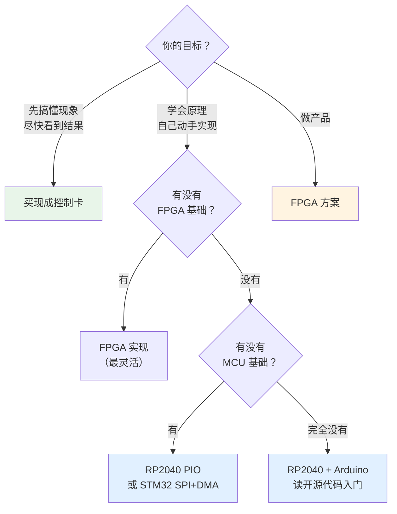

# 🛠️ 硬件方案选型

> [!info] 一句话版本
> 想把 XY2-100 发出去，有 5 条路：**FPGA、现代 MCU（PIO/FlexIO）、专用控制卡、普通 MCU 软件翻转、现成开源硬件**。
> 从**零基础**出发，推荐顺序是：**先买现成控制卡看懂现象 → 再用 RP2040（PIO）自己实现**。

---

## 1. 五条路对比

| 方案 | 精确 2 MHz | 难度 | 成本 | 适合谁 |
|---|---|---|---|---|
| **① 现成控制卡**（halaser / 正运动 / JCZ） | ✅ | ⭐ 极低 | ¥200~2000 | **零基础，先看现象** |
| **② RP2040 + PIO** | ✅ | ⭐⭐ 低 | ¥15~50 | **推荐自学首选** ⭐ |
| **③ FPGA** | ✅✅ 最精确 | ⭐⭐⭐⭐ 高 | ¥100~500 | 要做产品、要多轴同步 |
| **④ 现代 MCU 外设**（i.MX FlexIO / STM32 SPI+DMA） | ✅ | ⭐⭐⭐ 中 | ¥30~100 | 已有 MCU 基础 |
| **⑤ 普通 MCU 软件翻转 GPIO** | ⚠️ 达不到 | ⭐ 低 | ¥10~20 | 只想验证原理 |

> [!tip] 💡 给零基础实习生的路线建议
> ```mermaid
> flowchart LR
>     A["第 1 步<br/>买现成控制卡<br/>+ 便宜振镜"] --> B["第 2 步<br/>用逻辑分析仪<br/>抓它的波形"]
>     B --> C["第 3 步<br/>用 RP2040<br/>复现同样的波形"]
>     C --> D["第 4 步<br/>换成 FPGA<br/>做产品级实现"]
>     style A fill:#e8f5e9
>     style C fill:#e1f0ff
> ```
> **为什么这样排**：先有一个"已知正确"的参照物（第 1 步），
> 你后面自己实现时才有对比基准。否则你根本不知道是自己错了还是振镜有问题。

---

## 2. 关键约束：为什么"软件翻转 GPIO"不推荐

先算一笔账：

```text
需要产生 2 MHz 时钟
→ 每个时钟周期 500 ns
→ 每个周期要：翻转 CLK 两次（高、低）+ 更新数据位
→ 至少 3~4 次 GPIO 操作 / 500 ns
→ 需要 < 125 ns 的执行间隔
```

| 平台 | 主频 | 一条 GPIO 指令耗时 | 够不够 |
|---|---|---|---|
| Arduino Nano (ATmega328P) | 16 MHz | ~62 ns | ⚠️ 勉强，且被中断打断就崩 |
| STM32F103 | 72 MHz | ~14 ns | ⚠️ 理论够，实际要关中断 |
| ESP32 (Arduino) | 240 MHz | ~4 ns（理论） | ⚠️ WiFi 中断会打断 |
| RP2040 (PIO) | 133 MHz + PIO 独立 | **硬件保证** | ✅ 完美 |
| FPGA | 任意 | **硬件保证** | ✅ 完美 |

> [!warning] ⚠️ 软件翻转的根本问题
> 不是"能不能跑得快"，而是**"能不能保证不被打断"**。
> 一旦被中断打断 1 μs，时钟就出现一个 2 倍宽的周期 → 振镜可能：
> - 丢失帧同步
> - 内部环路受扰
> - 极端情况镜片抖动
>
> 开源实现的作者也承认这一点：
> > "Does this work at the standard rate of 2MHz? **Most likely not**,
> > but an Arduino Nano seems to be able to drive a galvo just fine."
> > — `xy2-100-arduino/README.md`

> [!tip] 💡 所以结论是
> - **学习验证**：软件翻转 GPIO 可以（能看懂现象就行）
> - **实际使用**：必须用**硬件外设**（PIO / FlexIO / FPGA / SPI+DMA）

---

## 3. 方案详解

### ① 现成控制卡（最快见效）

| 品牌 | 型号示例 | 特点 |
|---|---|---|
| **halaser** | E1803D | 支持 XY2-100/100E/200/XY3-100，以太网 + USB，含完整手册 ✅ |
| **正运动技术** | ZMC420SCAN | 国产，支持 XY2-100，中文文档和视频教程丰富 |
| **金橙子 JCZ** | 系列控制卡 | 国产打标机主流 |
| **SCANLAB** | RTC 系列 | 高端，价格高 |

**优点**：开箱即用，有完整软件生态（如 LightBurn、EZCAD）
**缺点**：看不到底层实现，学不到协议细节

> [!tip] 💡 但这恰恰是最好的"参照物"
> 用**逻辑分析仪**抓它的输出，你就能得到一份**绝对正确的波形**。
> 拿这份波形去比对你自己实现的波形——这是最快的调试方法。
> 见 [[03-调试与排错篇/02-逻辑分析仪抓包]]。

### ② RP2040 + PIO ⭐ 推荐自学

**为什么推荐**：

| 优点 | 说明 |
|---|---|
| **PIO 是硬件状态机** | 不受中断影响，时序精确 |
| **便宜** | Pico 板 ¥15~30 |
| **有现成开源实现** | XY2Galvo、Laseroids，可以直接读代码 |
| **Arduino 生态** | 上手快 |
| **双核** | core1 专责信号生成，core0 跑应用逻辑 |

**引脚分配参考**（来自 XY2Galvo 开源库）：

| 信号 | GPIO | 说明 |
|---|---|---|
| CLOCK+ / CLOCK− | 8 / 9 | 必须相邻 |
| SYNC+ / SYNC− | 10 / 11 | 必须相邻 |
| Y+ / Y− | 12 / 13 | 必须相邻 |
| X+ / X− | 14 / 15 | 必须相邻 |
| PIO 内部同步 | 16 | 状态机之间同步用 |
| LASER | 22 | 激光控制 |

> [!note] 为什么 P 和 N 必须用相邻 GPIO
> PIO 的 **side-set** 机制一次可以设置**连续多个引脚**。
> 把 P/N 放在相邻引脚，就能用一条 PIO 指令同时设置两者
> （`HIGH = 0b01` → P=1, N=0；`LOW = 0b10` → P=0, N=1）。
>
> 这正是 XY2Galvo 的做法：
> ```pio
> .define HIGH 0b01       ; pin N = 1,  pin N+1 = !1
> .define LOW  0b10       ; pin N = 0,  Pin N+1 = !0
> ```

**时钟配置**（关键数字）：

```text
PIO 状态机时钟 = 8 MHz      ← 注意不是 2 MHz！
每个 PIO 指令 = 1 个时钟周期 + 延迟
每个数据位 = 4 个 PIO 周期 = 4 / 8 MHz = 500 ns ✅
→ 输出时钟 = 2 MHz ✅
→ 一帧 = 20 × 500 ns = 10 μs ✅
```

> [!important] 这个 "8 MHz → 2 MHz" 的关系很重要
> **PIO 时钟是输出时钟的 4 倍**。因为一个数据位需要 4 个 PIO 周期
> （高电平、低电平各需要独立的指令周期 + 延迟）。
> 这是 PIO 实现 XY2-100 的核心技巧。

### ③ FPGA（产品级）

**为什么 FPGA 最适合做产品**：

| 能力 | 说明 |
|---|---|
| **绝对精确的时序** | 硬件电路，不受软件影响 |
| **多轴 / 多振镜同步** | 一套时钟驱动多个振镜，相位可精确控制 |
| **可做复杂轨迹插补** | 内部直接做直线/圆弧插补 |
| **可做实时补偿** | 内部实现畸变校正、延时补偿 |
| **可扩展** | 加以太网、加激光同步、加 PSO |

**代价**：开发难度高，需要 Verilog/VHDL 基础。

详见 [[02-硬件实现篇/02-FPGA实现思路]]。

### ④ 现代 MCU 外设

| 平台 | 外设 | 说明 |
|---|---|---|
| **i.MX RT10xx** | **FlexIO** | NXP 官方有 XY2-100 应用方案（含实测波形） |
| **STM32** | SPI + DMA + 定时器 | 用 SPI 当移位寄存器，DMA 送数据 |
| **ESP32** | RMT / I2S | RMT 可以做精确波形 |
| **RP2040** | PIO | （见方案 ②） |

> [!note] STM32 用 SPI 的巧思
> SPI 本质就是一个**硬件移位寄存器 + 时钟发生器**——这正是 XY2-100 需要的。
> - MOSI 输出数据（MSB first ✅ 正好匹配）
> - SCK 输出时钟（分频到 2 MHz）
> - 硬件产生 SYNC（用另一个定时器或 PWM）
>
> 但要注意：**SPI 的时钟极性/相位必须与 XY2-100 要求一致**
> （数据在上升沿变化、下降沿被采样）。
> 这需要仔细配置 CPOL/CPHA，并且**用逻辑分析仪验证**。

---

## 4. 必要仪器

> [!danger] 没有逻辑分析仪，这个项目会难 10 倍
> 强烈建议买一个。理由：XY2-100 的问题几乎都是**时序问题**，
> 而时序问题**看不见就修不了**。

| 仪器 | 价格 | 必备性 | 用途 |
|---|---|---|---|
| **USB 逻辑分析仪**（8 通道 24 MHz） | ¥15~50 | ⭐⭐⭐ **必备** | 抓波形、用 sigrok 直接解码 |
| **示波器**（≥100 MHz，2 通道） | ¥300~3000 | ⭐⭐ 强烈建议 | 看信号质量、上升时间、差分 |
| 万用表 | ¥30 | ⭐⭐⭐ 必备 | 接线核对、通断测试 |
| 差分探头 | ¥500+ | ⭐ 可选 | 直接看差分信号质量 |
| 限流可调电源 | ¥100 | ⭐⭐ 建议 | 首次上电保护设备 |

> [!success] sigrok 内置了 XY2-100 解码器！
> 这是本知识库最重要的实用信息之一：
> **开源的 PulseView（sigrok）软件自带了 `xy2-100` 协议解码器。**
> 你只需要 ¥20 的逻辑分析仪 + PulseView，就能：
> - 自动解出每一帧的位置值
> - 自动检查校验位
> - 自动识别 16 位 / 18 位 / 命令帧
> - 自动给出警告（校验错、数据位不足）
>
> 解码器源码已下载到：`99-附件与下载/代码/sigrok-xy2-100-decoder/pd.py`

---

## 5. 推荐起步套件

> [!example] 💡 一份 ¥300 以内的入门清单
> | 项目 | 参考价 | 说明 |
> |---|---|---|
> | RP2040 开发板（Pico 或兼容板） | ¥20 | 主控 |
> | USB 逻辑分析仪（8ch 24MHz） | ¥25 | **最关键的工具** |
> | RS-422 差分驱动模块（AM26LV31 ×2） | ¥10 | 真正的差分输出 |
> | 便宜 XY2-100 振镜（如 SinoGalvo SG7110 类） | ¥150~200 | 实验对象 |
> | ±15V 或 ±24V 电源 | ¥50 | 给振镜供电 |
> | DB25 公头 + 线材 | ¥15 | 接线 |
> | 面包板 / 杜邦线 | ¥20 | 连接 |
> | **合计** | **约 ¥290** | |
>
> ⚠️ 买振镜前**务必确认它支持 XY2-100**，并且要看它的说明书里
> **供电电压**和**引脚定义**。

---

## 6. 决策树



---

## ✅ 自检

- [ ] 知道为什么不能用普通 GPIO 软件翻转
- [ ] 说得出现成控制卡的价值（作为"已知正确"的参照物）
- [ ] 知道 RP2040 PIO 的时钟是 8 MHz，输出 2 MHz
- [ ] 知道 P/N 必须用相邻 GPIO 的原因（side-set）
- [ ] 知道 sigrok 有现成的 XY2-100 解码器
- [ ] 知道自己该从哪个方案起步

---

## 📖 依据

> [!quote] 出处
> | 内容 | 出处 |
> |---|---|
> | RP2040 PIO 8 MHz 时钟、2 MHz 输出、side-set 技巧 | `XY2Galvo-rp2040/src/XY2-100.pio` |
> | 引脚分配（GPIO 8~16、22） | `XY2Galvo-rp2040/src/XY2Galvo.h`、`README.md` |
> | "达不到 2 MHz 但能驱动振镜"的作者原话 | `xy2-100-arduino/README.md` |
> | sigrok XY2-100 解码器存在 | `sigrok-xy2-100-decoder/pd.py` |
> | i.MX RT FlexIO 方案、STM32 方案 | 见 [[04-资源库/03-开源项目清单]] 中的链接 |
> | 现成控制卡支持列表 | `E1803D_Scanner_Controller_Manual.pdf` p.1-2 |
>
> 💡 价格、推荐清单为工程估算，非厂商数据。

---

## 🔗 相关

- 上一篇：[[01-协议篇/08-物理层与连接器]]
- 下一篇：[[02-硬件实现篇/02-FPGA实现思路]]
- 电路细节：[[02-硬件实现篇/04-差分驱动电路]]
- 代码导读：[[02-硬件实现篇/06-开源参考实现导读]]
- 回到入口：[[🏠 开始这里]]
