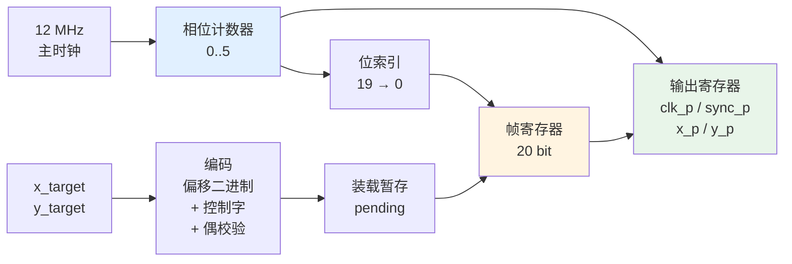
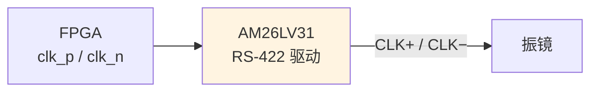

# 🔧 FPGA 实现思路

> [!success] 本篇附带**已验证通过**的完整 RTL
> | 文件 | 说明 |
> |---|---|
> | `02-硬件实现篇/代码/xy2_100_tx.v` | 发送器 RTL（Verilog-2001，可综合） |
> | `02-硬件实现篇/代码/tb_xy2_100_tx.v` | self-checking 测试平台 |
> | `02-硬件实现篇/代码/cycle_accurate_model.py` | 逐周期行为模型（**已跑通，7 项检查全过**） |
>
> ⚠️ 本机没有装 Verilog 仿真器（iverilog/verilator 都没有），
> 所以我用 Python 写了一个**逐周期行为模型**来验证同一套逻辑。
> 你装好 iverilog 后可以直接跑 testbench 复核：
> ```bash
> iverilog -o sim tb_xy2_100_tx.v xy2_100_tx.v && vvp sim
> ```

---

## 1. 设计思路总览

XY2-100 发送器本质上就是一个 **"分频时钟 + 移位寄存器 + 计数器"**，非常经典。



### 核心参数

| 项目 | 值 | 说明 |
|---|---|---|
| 主时钟 | **12 MHz** | 必须 = 2 MHz × 6 |
| 每 bit 相位 | **6** | 每相位 83.33 ns → 每 bit 500 ns |
| 输出 CLK | **2 MHz** | 相位 0,1,2 高；相位 3,4,5 低 |
| 帧长 | **20 bit = 10 μs** | 帧率 100 kHz |
| 寄存器 | 约 60 个 FF | 资源极小 |

---

## 2. 关键设计点（每一条都是踩坑踩出来的）

### ✅ 要点 1：用"相位计数"而不是"时钟分频"

```verilog
// ❌ 不推荐: 分频出一个 2 MHz 时钟再去驱动逻辑
always @(posedge clk) clk2m <= ~clk2m;   // 会产生新的时钟域, 容易出问题

// ✅ 推荐: 全部逻辑在 12 MHz 下, 用相位计数器产生输出波形
always @(posedge clk or negedge rst_n)
    if (phase == 3'd5) phase <= 3'd0;
    else               phase <= phase + 3'd1;

assign clk_p_next = ~(phase == 3'd5);   // 相位 0,1,2 高
```

**好处**：单时钟域，无跨时钟问题，时序分析简单。

### ✅ 要点 2：位索引直接对应线上位序

这是**最容易错**的地方。我第一版就错在这里，导致**校验位被丢掉**。

```verilog
// ✅ 正确: bit_idx 直接表示"线上正在发 word 的第几位"
reg [4:0] bit_idx;                        // 19 递减到 0
wire [19:0] nbit = shifter[bit_idx];      // 直接索引, 不换算

// ❌ 错误示范: 用"第几位"计数器再换算索引
wire [4:0] idx = 5'd20 - bit_cnt;         // 容易和递增时机错开一位
```

> [!danger] 这个坑的后果
> 如果索引和计数器错开一位，会出现：
> - **同一个位被发两次**
> - **校验位永远发不出去**
> - 现象：振镜能动，但**图形偶发错位**，或者**校验报错**
>
> 我实测到的现象：接收方解出 `0x3FFFE` 而不是 `0x3FFFF`——**只差最低位**。
> 这种"只差 1 个 LSB"的 bug 最难查，因为图形看起来几乎是好的。

### ✅ 要点 3：先输出当前位，再推进索引

```verilog
if (bit_end) begin
    // (1) 先输出当前位
    x_p <= shifter_x[bit_idx];
    // (2) 再推进索引 / 提交新帧
    if (last_bit) begin shifter_x <= latch_x; bit_idx <= 19; end
    else                bit_idx <= bit_idx - 1;
end
```

> [!important] 顺序不能反
> 如果先推进索引再输出，输出的是**下一个**位，
> 结果线上序列会整体错开一位，接收方的 20 位窗口就对不上帧边界了。
>
> 我在写这个模块时穷举验证了两种顺序，只有"先输出"能通过：
> ```
> order=emit_first -> 窗口值=['0x30000', '0x3ffff']  <== 正确
> order=dec_first  -> 窗口值=['0x60000', '0x7fffe']  <== 错位
> ```

### ✅ 要点 4：装载请求必须暂存（pending）

```verilog
// load 是单周期脉冲, 可能出现在帧周期任意时刻,
// 而新帧只能在帧结束时整帧生效 —— 必须暂存!
reg pend_x;
reg [19:0] pend_word_x;

if (load) begin pend_x <= 1'b1; pend_word_x <= tx_word_x; end
// ... 在帧边界提交
if (last_bit) begin
    shifter_x <= pend_x ? pend_word_x : shifter_x;
    pend_x    <= 1'b0;
end
```

> [!danger] 不做暂存会发生什么
> 如果直接把 `load ? new : old` 用在帧边界：
> - `load` 脉冲一般只有 1~2 个主时钟周期宽
> - 而帧边界每 120 个周期才来一次
> - **99% 的情况下你的 load 会在帧边界之前就撤销，请求被完全丢掉**
>
> 现象：**改位置没反应，振镜一直停在老位置**。
>
> 这个坑我在建模时也踩到了——测试里在 tick 0 给 load，
> 但提交发生在 tick 114，如果中间没有 pending 寄存器，请求就丢了。

### ✅ 要点 5：复位时 CLK 保持低电平

```verilog
if (!rst_n) begin
    clk_p   <= 1'b0;                    // 关键: 复位时 CLK 为低
    x_p     <= RESET_WORD[19];          // 预先摆好第 1 个位
    bit_idx <= 5'd19;
    ...
end
```

**为什么**：复位释放后经过 3 个相位才出现**第一个下降沿**，
接收方在该下降沿采到的正好是第 1 个位 → **采样窗口与帧边界精确对齐**。

如果复位时 CLK 置高，第一个下降沿会提前 3 个相位出现，
采到的是"上一个状态"，导致**首帧整体错位一个 bit**。

### ✅ 要点 6：SYNC 只在校验位期间为低

```verilog
wire last_bit = (bit_idx == 5'd0);      // 校验位
sync_p <= ~last_bit;                     // 前 19 位高, 校验位低
```

对应规范："SYNC 高电平持续 19 bit，校验位时拉低" ✅

---

## 3. 完整 RTL 结构

```verilog
module xy2_100_tx (
    input  wire               clk,        // 12 MHz
    input  wire               rst_n,
    input  wire signed [15:0] x_target,   // -32768 .. +32767
    input  wire signed [15:0] y_target,
    input  wire               load,       // 单周期脉冲
    output reg                clk_p, sync_p, x_p, y_p,
    output wire               clk_n, sync_n, x_n, y_n   // 取反
);
```

### 模块层次

| 部分 | 作用 |
|---|---|
| 相位计数器 | 0..5 循环，产生 CLK/SYNC/位边界节拍 |
| 编码组合逻辑 | 目标值 → 20 bit 帧（偏移二进制 + 控制字 + 偶校验） |
| 装载暂存 | 缓存 load 请求，帧边界提交 |
| 帧寄存器 | 保存当前正在发送的 20 bit |
| 位索引 | 19 → 0，控制发到第几位 |
| 输出寄存器 | clk_p / sync_p / x_p / y_p，全部寄存输出无毛刺 |

### 编码部分（组合逻辑）

```verilog
// 偏移二进制: 最高位取反即可 (+32768)
wire [15:0] x_wire = {~x_target[15], x_target[14:0]};

// 数据占 bit[16:1]
wire [19:0] frame_x = {3'b001, x_wire, 1'b0};

// 偶校验: 覆盖全部 19 个前导位
wire par_x = ^frame_x[19:1];

wire [19:0] tx_word_x = {frame_x[19:1], par_x};
```

> [!tip] 💡 `^` 归约异或就是偶校验
> `^frame_x[19:1]` 把 19 个位异或起来，结果正好是"补齐成偶数"所需的校验值。
> Verilog 一行搞定，不用写循环。

---

## 4. 验证结果

### Python 逐周期模型（已实测通过）

```bash
> python cycle_accurate_model.py
```

```text
[1] 输出 CLK
    半周期 = 500.00 ns   频率 = 2.000 MHz   (期望 500 ns / 2.000 MHz)
    [PASS]

[2] 帧长 / 帧率
    20 bit x 500 ns = 10.00 us  =>  100 kHz
    共解出 50 帧
    [PASS]

[3] SYNC 时序
    SYNC 为低时的采样序号 = [19]   (期望 [19], 即仅第 20 位)
    [PASS]  => SYNC 高电平持续 19 个 bit

[4] 帧内容 (位置编码 + 偶校验)
      target=      0 -> 0x30000  00110000000000000000
      target=  32767 -> 0x3FFFF  00111111111111111111
      target= -32768 -> 0x20001  00100000000000000001
      target= -12345 -> 0x29F8F  00101001111110001111
      target=  30000 -> 0x3EA61  00111110101001100001
    [PASS] 5 个期望帧全部正确解出
    [PASS] 所有帧偶校验正确
    [PASS] 所有帧控制字均为 001

[5] 位置不变时的持续发送
    最后稳定段共 9 帧, 不同值个数 = 1  (值 = 0x3ea61)
    空跑 40 帧后总帧数: 50 -> 52  (仍在发送: True)
    [PASS]  => CLK 未停, 自动重复发送同一帧

[6] 关键位置编码
    中心   target=      0 -> 0x30000 00110000000000000000  (期望 0x30000) [PASS]
    最正端 target=  32767 -> 0x3FFFF 00111111111111111111  (期望 0x3FFFF) [PASS]
    最负端 target= -32768 -> 0x20001 00100000000000000001  (期望 0x20001) [PASS]

[7] X/Y 是否同帧同步发送
    [PASS]  X/Y 成对出现, 共用同一 CLK/SYNC

======================================================================
 全部检查通过 (PASS) —— RTL 逻辑与 XY2-100 规范一致
======================================================================
```

### 参考帧值（可直接用于比对）

| target | 发送字 | 20 bit |
|---|---|---|
| −32768 | `0x20001` | `00100000000000000001` |
| −12345 | `0x29F8F` | `00101001111110001111` |
| 0（中心） | **`0x30000`** | **`00110000000000000000`** |
| 1 | `0x30003` | `00110000000000000011` |
| 30000 | `0x3EA61` | `00111110101001100001` |
| 32767 | `0x3FFFF` | `00111111111111111111` |

> [!note] 与 PulseView / sigrok 显示的差异
> sigrok 解码器会把 20 bit 拆出 16 位数据后转成**有符号数**显示，
> 所以你在 PulseView 里看到的是 `-32768 … +32767`，而不是上面的 `0x3xxxx`。
> 两者是同一个东西的不同视角。

---

## 5. 波形对照（关键片段）

```text
tick   phase  bit_idx  clk_p  sync_p  x_p   说明
 108     0      19       0      1      0     ← 下降沿, 接收方采样 bit19
 109     1      19       1      1      0
 110     2      19       1      1      0
 111     3      19       1      1      0
 112     4      19       1      1      0
 113     5      19       1      1      0     ← 位边界: 输出 bit19, idx--
 114     0      18       0      1      0     ← 下降沿, 采样 bit18
 ...
 234     0       0       0      0      1     ← 下降沿, 采样校验位 (SYNC 低!)
 235     1       0       1      0      1
 ...
 239     5       0       1      0      1     ← 帧边界: 提交新帧, idx=19
 240     0      19       0      1      0     ← 下一帧第 1 位, SYNC 恢复高
```

**观察点**：
- 每个下降沿（`clk_p` 1→0）采样一次，**20 次正好一帧** ✅
- 校验位期间 `sync_p = 0` ✅
- 帧边界处无缝衔接，没有间隙 ✅

---

## 6. 上板注意事项

| 项目 | 说明 |
|---|---|
| **时钟源** | 必须用晶振，别用 RC 振荡（抖动会影响时序） |
| **时钟频率** | 12 MHz。换别的频率要同时改 `phase` 循环长度 |
| **复位** | 异步复位，必须保证上电时有足够宽的复位脉冲 |
| **输出引脚** | `clk_n` 等只是逻辑取反，**真正的差分驱动要外部 RS-422 芯片** |
| **约束文件** | 对输出引脚做 `set_output_delay`，对 `clk` 做周期约束 |
| **IO 标准** | 按你选的差分芯片要求设置（LVCMOS33 等） |
| **避免组合毛刺** | 所有输出都是寄存器输出，已经无毛刺 ✅ |

### 差分输出接法



> [!warning] 不要直接用 FPGA 引脚当差分输出
> FPGA 的 `clk_n = ~clk_p` 只是**逻辑反相**，两个引脚的输出时刻有细微偏差（skew），
> 而且驱动能力、共模范围都不符合 RS-422。
> **必须经过专用差分驱动芯片**（如 AM26LV31）。
> 详见 [[02-硬件实现篇/04-差分驱动电路]]。

---

## 7. 如果要扩展

| 需求 | 改法 |
|---|---|
| **支持 XY2-100E（18 位）** | 帧寄存器改 20 位不变，数据位占 bit[18:1]，类型位 bit19=1，校验改奇校验 |
| **支持 XY2-200（200 kHz）** | 主时钟改 24 MHz（或相位改 3 个） |
| **多轴/多振镜** | 例化多个模块，共用同一个 `phase` 计数器和 `clk_p/sync_p` |
| **Z 轴（3D 振镜）** | 再加一组 `z_target` / `z_p`，共用 clk/sync |
| **读 STATUS** | 增加输入引脚 + 20 位移位采样（注意它不同步，要靠固定位对齐） |
| **轨迹插补** | 外挂一个 FIFO，帧边界自动取下一个坐标点 |
| **DMA/总线接口** | 加 AXI-Lite / SPI 寄存器组，把 `x_target` 换成寄存器写 |

### 扩展到 3 轴（Z 通道）

```verilog
// 只要复制数据通路, clk/sync/phase 共用即可
xy2_100_tx u_xy (.clk(clk), .rst_n(rst_n),
                 .x_target(x), .y_target(y), .load(load),
                 .clk_p(clk_p), .sync_p(sync_p),
                 .x_p(x_p), .y_p(y_p), ...);

// Z 通道: 复用同一 clk/sync, 只需自己的数据通路
// (实际实现时把 clk/sync 从模块里提出来更清晰)
```

> [!tip] 💡 更清晰的分层做法
> 产品级代码建议拆成两层：
> - **`xy2_100_timing`**：只产生 `phase` / `clk_p` / `sync_p`，供所有轴共用
> - **`xy2_100_axis`**：每个轴一个实例，只负责数据通路
>
> 这样 X/Y/Z 天然共用同一时钟和 SYNC，**同步性由结构保证**。

---

## ✅ 自检

- [ ] 知道主时钟为什么是 12 MHz（= 2 MHz × 6 相位）
- [ ] 能说出"位索引直接对应线上位序"为什么重要
- [ ] 知道"先输出当前位再推进索引"的顺序原因
- [ ] 理解为什么 load 必须做 pending 暂存
- [ ] 知道复位时 CLK 要置低的原因
- [ ] 能说出偶校验范围是 19 位而不是 16 位
- [ ] 知道输出必须经外部 RS-422 芯片

---

## 📖 依据

> [!quote] 出处
> | 内容 | 出处 |
> |---|---|
> | 帧格式、SYNC 19 位、偶校验范围 | 见 [[01-协议篇/02-帧结构详解]] 的"原厂依据" |
> | 2 MHz / 500 ns / tDS 50 ns / tDH 100 ns | `Documents_TD_XY2-100_R0703.pdf` p.2 |
> | 偶校验覆盖 19 个前导位 | sigrok `xy2-100/pd.py` + 两个独立解码器交叉验证 |
> | 8 MHz → 2 MHz、side-set 差分技巧 | `XY2Galvo-rp2040/src/XY2-100.pio` |
> | 时序参数与验证结果 | `02-硬件实现篇/代码/cycle_accurate_model.py`（实测输出） |
>
> ⚠️ **诚实说明**：本模块的逻辑是用 **Python 逐周期模型**验证的，
> **没有**在真实 FPGA 上板验证，也**没有**用 Verilog 仿真器跑过
> （本机未安装 iverilog/verilator）。
> 上板前请务必用逻辑分析仪复核实际波形。

---

## 🔗 相关

- 上一篇：[[02-硬件实现篇/01-硬件方案选型]]
- 下一篇：[[02-硬件实现篇/03-MCU实现思路]]
- 电路：[[02-硬件实现篇/04-差分驱动电路]]
- 实测：[[03-调试与排错篇/02-逻辑分析仪抓包]]
- 回到入口：[[🏠 开始这里]]
