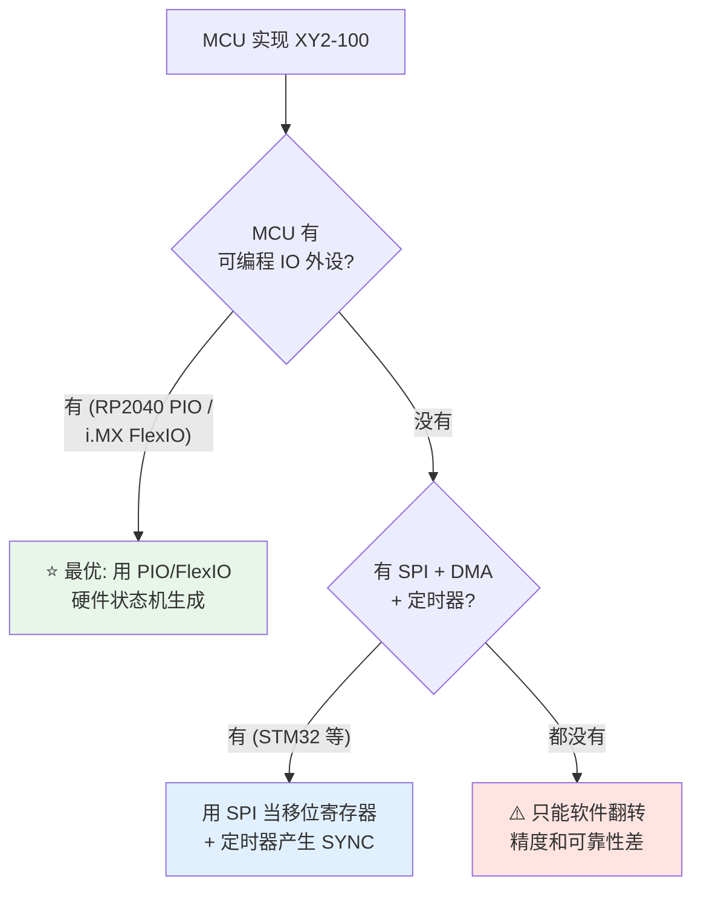

# 🎛️ MCU 实现思路

> [!info] 一句话版本
> 普通 MCU 用软件翻转 GPIO 做 XY2-100 **能跑但不可靠**。
> 可靠做法是**用硬件外设当"信号发生器"**：RP2040 的 **PIO**、i.MX 的 **FlexIO**、
> STM32 的 **SPI + DMA + 定时器**。

---

## 1. 三条技术路线



---

## 2. 方案 A：RP2040 + PIO ⭐ 推荐

### 为什么 PIO 是最佳选择

| 优点 | 说明 |
|---|---|
| **独立于 CPU** | PIO 是硬件状态机，CPU 被中断打断也不影响时序 |
| **精确** | 时钟精确到 1 个主时钟周期 |
| **可同时驱动多路** | PIO 有 8 个状态机，可分工 |
| **side-set 机制** | 一条指令同时设置相邻的 P/N 两个引脚 |

### 核心设计：一个 bit = 4 个 PIO 周期

```text
PIO 状态机时钟 = 8 MHz
每个 PIO 指令 = 1 周期 (+ 延迟)
                                ┌─ 数据位 = 4 个周期 = 4 / 8 MHz = 500 ns ✅
输出 CLK = 2 MHz = 8 MHz / 4
```

> [!important] 为什么是 8 MHz 而不是 2 MHz
> 因为一个完整的 CLK 周期需要：
> 1. 高电平指令 + 延迟
> 2. 低电平指令 + 延迟
>
> 每个位至少需要 4 个 PIO 周期（高、低各 2 个）。
> 所以 `PIO 时钟 = 4 × 输出时钟 = 8 MHz`。

### 时钟与 SYNC 状态机

来自 XY2Galvo 开源实现（本地已下载）：

```pio
.define HIGH 0b01       ; pin N = 1,  pin N+1 = 0
.define LOW  0b10       ; pin N = 0,  Pin N+1 = 1

.program xy2_clock
.side_set 4             ; clock+ clock- sync+ sync-

.wrap_target
public start:
    nop         side (SYNC_LOW + CLOCK_HIGH) [1]   ; 第20位: 校验位
    set x, 18   side (SYNC_LOW + CLOCK_LOW)  [1]   ; 循环 19 次
a:  nop         side (SYNC_HIGH + CLOCK_HIGH)[1]   ; 第 1..19 位
    jmp x-- a   side (SYNC_HIGH + CLOCK_LOW) [1]
.wrap
```

**解读**：
1. 先输出**一个** SYNC 低、CLK 高的相位 → 这是**校验位**（第 20 位）
2. 然后 `x = 18`，循环 **19 次**输出 SYNC 高
3. 结果：**SYNC 高电平覆盖 19 位，校验位时为低** ✅ 完全符合规范

> [!success] 这是"规范正确性"的一个独立证据
> 这份 PIO 代码的注释写得很明白：
> ```text
> nop   side (SYNC_LOW + CLOCK_HIGH) [1]   ; bit 20: parity
> set x, 18    side (SYNC_LOW + CLOCK_LOW) ; => 19 loops
> a: nop       side (SYNC_HIGH + CLOCK_HIGH) ; bits 1..19
> ```
> **独立开发者从零写的实现，也得出 SYNC 覆盖 19 位、校验位拉低的结论。**

### 数据状态机与奇偶校验跟踪

```pio
; 发送 "001" 头部 (MSB first)
tx: out null,16  side DATA_HIGH [1]   ; 跳过 bit19..4, 同时输出头部的最后一个 1
                                     ; (头部 001 的最后一位是 1, 用 side-set 给出)

; 逐位发送, 同时用"程序流"跟踪校验
loop_even:
    out y, 1                          ; 取下一位
    jmp !y, send_0_even
send_1_even:
    jmp loop_end_odd  side DATA_HIGH  ; 输出 1, 校验状态翻转到 odd
send_0_even:
    jmp loop_end_even side DATA_LOW   ; 输出 0, 校验状态保持 even
; ... (odd 分支对称)
```

> [!tip] 💡 "用程序流跟踪校验"是这里的精髓
> PIO 没有通用寄存器和 ALU，做不了 `^=` 运算。
> 作者用了一个巧妙的办法：**用两个代码分支代表校验的奇偶状态**。
> - 当前是 even 状态 → 走 `loop_even` 分支
> - 当前是 odd 状态 → 走 `loop_odd` 分支
> - 每发一个 `1` 就跳转到另一个分支（状态翻转）
> - 每发一个 `0` 就留在原分支
>
> 循环结束时，**在哪个分支就等于校验位应该是多少**：
> ```pio
> loop_end_even:
>     jmp next_word  side DATA_HIGH [3]   ; 发 PE = '1'
> loop_end_odd:
>     jmp next_word  side DATA_LOW  [3]   ; 发 PE = '0'
> ```
> 教科书级的技巧。

### 双核分工

```c
// core1: 专职信号生成 + 绘图逻辑
void core1_entry(void) {
    // 初始化 PIO, 装载状态机
    // 循环从队列取绘图指令并输出
}

// core0: 跑你的应用逻辑 (UI / 通信 / 文件系统)
int main(void) {
    multicore_launch_core1(core1_entry);
    // ...
}
```

> [!quote] 开源实现的原话
> "Dual-core operation: Offloads the demanding signal generation and drawing logic
> to the second core (core1), leaving the main loop (core0) free for your application logic."
> — `XY2Galvo-rp2040/README.md`

### 引脚分配（P/N 必须相邻）

| 信号 | GPIO | 说明 |
|---|---|---|
| CLOCK+ / CLOCK− | 8 / 9 | 必须相邻 |
| SYNC+ / SYNC− | 10 / 11 | 必须相邻 |
| Y+ / Y− | 12 / 13 | 必须相邻 |
| X+ / X− | 14 / 15 | 必须相邻 |
| PIO 内部同步 | 16 | 状态机之间握手 |
| LASER | 22 | 激光控制 |

### 自动重复发送（FIFO 空了怎么办）

振镜要求**持续发送**，但 CPU 可能来不及喂数据。PIO 实现里的处理：

```pio
next_word:
    jmp pin, tx_empty   side DATA_LOW [3]   ; FIFO 空了吗?
tx_not_empty:
    pull block                               ; 有数据: 拉新值
    mov x, osr                               ; 存一份备用
    jmp tx [1]
tx_empty:
    mov osr, x          [3]                  ; 没数据: 重复上一个值
tx: out null,16         side DATA_HIGH [1]
```

> [!important] 这解决了一个真实的工程问题
> X 和 Y 的 FIFO 是**两个独立的 FIFO**，写入时刻不同。
> 如果其中一个空了而另一个还有数据，就会出现 **X/Y 不同步**——这是致命的
> （回想 [[00-入门篇/04-常见误区]] 误区 5：X/Y 必须同帧发送）。
>
> 该实现用**第三个状态机（xy2_laser）** 专门仲裁：
> 它在每帧最后一位检查 FIFO 状态，并通过一个同步引脚告诉所有数据状态机
> "这一帧该不该读新数据"。
>
> ```text
> "the state of the tx fifo is tested and the xy sync pin is set:
>  1 => fifo empty: all state machines must not read the fifo but use old data instead
>  0 => data available: all state machines must read the fifo for new data."
> ```

---

## 3. 方案 B：STM32 + SPI + DMA + 定时器

### 核心思路

**SPI 本质就是"硬件移位寄存器 + 时钟发生器"**——正好是 XY2-100 需要的。

| XY2-100 需要 | STM32 外设 |
|---|---|
| 2 MHz 时钟 | SPI 的 SCK（分频得到） |
| MSB first 数据 | SPI 的 MOSI（配置为 MSB first） |
| 连续发送 | DMA 循环搬运 |
| SYNC 信号 | 定时器 PWM 或另一个 SPI 片选 |

### 实现要点

```c
/* 1. 配置 SPI
 *    - 主模式, 2 MHz (APB2=72MHz 时分频 36)
 *    - MSB first  ✅ 与 XY2-100 一致
 *    - 8 位或 16 位数据帧
 *    - CPOL/CPHA 需要仔细设置 (见下)
 */
SPI1->CR1 = SPI_CR1_MSTR | SPI_CR1_BR_2 | SPI_CR1_BR_1 | ...;

/* 2. 把 20 bit 帧拆成 3 个字节放进 DMA 缓冲区
 *    每次 DMA 传输 = 一帧 (20 bit, 补 4 个空位)
 */
uint8_t frame_buf[3] = { hi8, mid8, lo4 << 4 };
```

> [!warning] ⚠️ SPI 方案的最大难点：时钟极性/相位
> XY2-100 要求：
> - **数据在 CLK 上升沿变化**
> - **数据在 CLK 下降沿被采样**
>
> 这是很特殊的要求，SPI 的四种模式（CPOL/CPHA 组合）里**没有完全对应的**：
>
> | SPI 模式 | CPOL | CPHA | 数据变化沿 | 数据采样沿 |
> |---|---|---|---|---|
> | Mode 0 | 0 | 0 | 下降沿 | **上升沿** |
> | Mode 1 | 0 | 1 | 上升沿 | **下降沿** ✅ 接近 |
> | Mode 2 | 1 | 0 | 上升沿 | **下降沿** ✅ 接近 |
> | Mode 3 | 1 | 1 | 下降沿 | **上升沿** |
>
> **Mode 1 / Mode 2 的采样沿是下降沿 ✅，但数据变化沿也是有效的**——
> 不过 SPI 的"变化沿"是数据在**输出寄存器**里更新，方向上是对的。
>
> 💡 **实际做法**：优先试 **Mode 1**，然后用**逻辑分析仪实测**确认
> 数据相对 CLK 的关系是否符合"上升沿变化、下降沿稳定"。
> 如果 SPII 硬件行为不完全匹配，可以用 **SPI 输出 + 外部门电路整形**，
> 或者干脆改用 **定时器 + DMA 直接翻转 GPIO**（更灵活）。

### SYNC 的产生

SYNC 需要"每 20 个 CLK 高 19 个、低 1 个"。生成方式：

| 方案 | 说明 |
|---|---|
| **定时器 PWM** | 周期 = 10 μs，但占空比要 95%（19/20），且与 SPI 对齐困难 |
| **定时器 + DMA 更新** | 灵活但复杂 |
| **另一个 SPI/GPIO** | 用软件在每帧开始时翻转（受中断影响）⚠️ |
| **外部 CPLD/FPGA** | 最可靠但要加芯片 |

> [!danger] SYNC 与 SPI 的相位对齐是 STM32 方案的真正难点
> SPI 的 SCK 由 SPI 外设自己产生，你很难在同一时刻精确控制另一个引脚翻转。
> **必须用逻辑分析仪实测 SYNC 与 CLK 的边沿关系**，确认符合规范。
>
> 这也是为什么我**更推荐 RP2040 PIO**——PIO 的 side-set 可以在同一条指令里
> 同时设置 CLK、SYNC 和 DATA 引脚，天然保证相位关系。

---

## 4. 方案 C：i.MX RT + FlexIO

NXP 官方有现成的应用方案（含逻辑分析仪实测波形），思路：

| 步骤 | 说明 |
|---|---|
| FlexIO 配置为移位器 | 输出串行数据 |
| FlexIO 定时器 | 产生 2 MHz 时钟 |
| 另一个 FlexIO 通道 | 产生 SYNC |
| DMA 送数据 | 持续更新位置 |

> [!note] 这是"厂商官方背书"的方案
> NXP 官方供稿的电子发烧友文章里**含逻辑分析仪实测波形对比**，
> 调试参考价值很高。链接见 [[04-资源库/02-在线课程与视频]]。
> ⚠️ 该链接来自搜索摘要，我未能直接抓取验证。

---

## 5. 方案 D：软件翻转 GPIO（不推荐，但可用）

### Arduino 参考实现的做法

```cpp
void XY2_100::_write(int x, int y) {
  // 帧开始
  _clock->set(1);
  _syn->set(1);
  // 写 "001" 头部
  _x->set(0); _y->set(0); _clock->set(0); _clock->set(1);   // 第1位 0
  _x->set(0); _y->set(0); _clock->set(0); _clock->set(1);   // 第2位 0
  _x->set(1); _y->set(1); _clock->set(0); _clock->set(1);   // 第3位 1
  // 写 16 位数据 (MSB first)
  for (int i = 0; i < 16; i++) {
    unsigned char b = (x >> (15 - i)) & 1;
    _x->set(b); _y->set(b);
    _clock->set(0); _clock->set(1);
  }
  // 写校验位
  _x->set(parity_x); _y->set(parity_y);
  _clock->set(0); _clock->set(1);
  _syn->set(0);      // 帧结束
}
```

### 这份代码的问题

> [!danger] 三个真实缺陷
> 1. **校验位算错**：它用 `even_parity_bit_x ^= current_bit_x` 只异或了 **16 位数据**，
>    而规范的偶校验要覆盖 **19 个前导位**。
>    因为控制字 `001` 含 1 个 `1`，**这实际变成了整帧奇校验**。
>    见 [[01-协议篇/02-帧结构详解]] 的校验范围说明。
>
> 2. **SYNC 时序不对**：代码里 SYNC 在开头拉高、**在最后一位发完之后**才拉低
>    （`_syn->set(0)` 在所有时钟之后）。而规范要求 SYNC 在**校验位开始前**拉低。
>    这份代码的 SYNC 高电平覆盖了 **20** 位，不是 19 位。
>
> 3. **频率达不到 2 MHz**：作者自己也承认了
>    > "Does this work at the standard rate of 2MHz? **Most likely not**"

> [!tip] 💡 那为什么它"能用"
> 因为很多振镜的接收端**容错性比规范宽松**：
> - 只要时钟不太快、帧结构大致对，就能工作
> - SYNC 相位略有偏差可能仍在容忍范围内
> - 校验位算错时，部分振镜**不检查**校验
>
> **但这不代表你做产品可以这么写。** 遇到严格的振镜就会出问题。

### 如果你一定要用软件翻转

```c
/* 关键: 关闭中断, 用固定的指令序列保证时序 */
void xy2_send_frame(uint16_t x_wire, uint16_t y_wire)
{
    uint32_t primask = __get_PRIMASK();
    __disable_irq();                      /* 关中断! 否则被中断就崩 */

    XY2_CLK_HIGH(); XY2_SYNC_HIGH();
    XY2_DATA(0, 0);  XY2_CLK_LOW(); XY2_CLK_HIGH();   /* 0 */
    XY2_DATA(0, 0);  XY2_CLK_LOW(); XY2_CLK_HIGH();   /* 0 */
    XY2_DATA(1, 1);  XY2_CLK_LOW(); XY2_CLK_HIGH();   /* 1 */
    /* ... 16 位数据 + 校验位 ... */
    XY2_SYNC_LOW();                                   /* 校验位前拉低 */
    XY2_DATA(px, py); XY2_CLK_LOW(); XY2_CLK_HIGH();  /* 校验位 */

    __set_PRIMASK(primask);               /* 恢复中断 */
}
```

> [!warning] 即使关中断也有问题
> - 关中断时间 ≈ 20 × 4 条指令 × 执行周期。72 MHz 下约 1~2 μs，**会破坏其他实时性**
> - DMA 传输会抢总线，造成不可预测的延迟
> - Flash 预取/分支预测可能引入抖动
> - 代码优化等级变化会改变指令数 → 时序变了
>
> **结论：可以用于学习验证，不要用于产品。**

---

## 6. 三种方案对比总结

| 维度 | RP2040 PIO | STM32 SPI+DMA | 软件翻转 |
|---|---|---|---|
| 时序精确度 | ⭐⭐⭐ 硬件保证 | ⭐⭐ 较好 | ⭐ 差 |
| 抗中断干扰 | ✅ 完全免疫 | ✅ 基本免疫 | ❌ 严重 |
| SYNC 相位控制 | ✅ side-set 同时设置 | ⚠️ 难对齐 | ⚠️ 可以但抖 |
| 多轴扩展 | ✅ 多状态机 | ⚠️ 需多 SPI | ⚠️ 更慢 |
| 开发难度 | ⭐⭐ | ⭐⭐⭐ | ⭐ |
| 成本 | ¥15~30 | ¥10~50 | ¥10~20 |
| **推荐度** | **⭐⭐⭐⭐⭐** | ⭐⭐⭐ | ⭐（仅学习） |

---

## ✅ 自检

- [ ] 知道 PIO 时钟为什么是 8 MHz 而不是 2 MHz
- [ ] 能解释 P/N 为什么必须用相邻 GPIO
- [ ] 理解"用程序流跟踪奇偶校验"的技巧
- [ ] 知道 X/Y 两个 FIFO 不同步会有什么后果
- [ ] 知道 STM32 SPI 方案的难点在 SYNC 相位对齐
- [ ] 能说出软件翻转 GPIO 的三个缺陷（校验、SYNC、频率）

---

## 📖 依据

> [!quote] 出处
> | 内容 | 出处 |
> |---|---|
> | PIO 时钟 8 MHz、side-set、程序流校验技巧、FIFO 仲裁 | `XY2Galvo-rp2040/src/XY2-100.pio` |
> | 引脚分配、双核分工 | `XY2Galvo-rp2040/README.md`、`src/XY2Galvo.h` |
> | Arduino 实现代码与作者原话 | `xy2-100-arduino/src/XY2_100.cpp`、`README.md` |
> | 校验位覆盖 19 位的结论 | sigrok `xy2-100/pd.py` + 多实现交叉验证 |
> | i.MX FlexIO 方案 | 见 [[04-资源库/02-在线课程与视频]]（未直接验证链接） |
>
> ⚠️ **诚实说明**：本节的 STM32 SPI 方案是我基于外设原理的分析，
> **没有实际跑通过**。CPOL/CPHA 的具体匹配情况**必须用逻辑分析仪实测确认**。

---

## 🔗 相关

- 上一篇：[[02-硬件实现篇/02-FPGA实现思路]]
- 下一篇：[[02-硬件实现篇/04-差分驱动电路]]
- 代码导读：[[02-硬件实现篇/06-开源参考实现导读]]
- 回到入口：[[🏠 开始这里]]
