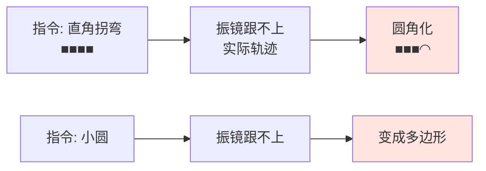
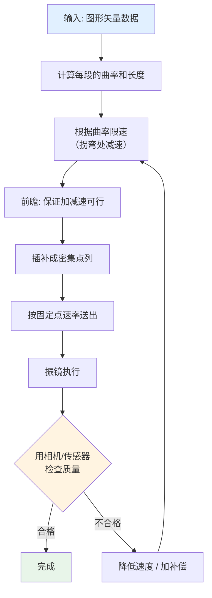

# 📈 更新率与振镜带宽匹配

> [!info] 一句话版本
> **协议能跑 100 kHz，振镜只有约 1 kHz 量级。**
> 你送数据的速率必须匹配振镜的**机械响应能力**，否则图形会失真。
> 这是整个项目里**最容易翻车、也最需要实测**的一环。

---

## 1. 两个完全不同的"速度"

```text
协议帧率        ████████████████████████████████  100 kHz   ← 固定, 由 2MHz÷20 决定
                                                            你「必须」按这个速率发

振镜响应能力    ███                               ~1 kHz 💡  ← 物理限制, 由电机决定
                                                            你「只能」按这个速率改位置
```

| 概念 | 值 | 由什么决定 |
|---|---|---|
| **协议帧率** | 100 kHz | 2 MHz ÷ 20，**不可改** |
| **数据更新率** | 你决定 | 你每隔几帧改一次目标位置 |
| **振镜机械带宽** | ~1 kHz 量级 💡 | 电机惯量、力矩、伺服环路 |

> [!important] 关键认识：帧率 ≠ 有效更新率
> 你**必须**以 100 kHz 持续发帧（协议要求），但**不需要**每帧都改位置。
> 位置不变时**重复发同一个值**即可。
>
> 所以真正决定加工速度的是：**你每隔多少帧改变一次目标位置。**

---

## 2. ⚠️ 关于"带宽"这个数字：厂商不公开

> [!warning] 这是一个重要的更正
> **千万不要相信网上流传的"振镜带宽 1–10 kHz"这类说法**
> （包括本知识库早期版本里的表述）。
>
> **实测调研结论：主流厂商的数据手册一律不给出 −3 dB 带宽指标。**
> 他们给的是**时域指标**，因为这些是可以直接测量的：
>
> | 厂商给的指标 | 说明 |
> |---|---|
> | **阶跃响应时间**（1% / 10% 全量程） | 从指令变化到到位的时间 |
> | **跟踪误差**（Tracking Error） | 匀速扫描时实际位置滞后指令的最大值 |
> | **重复定位精度** | 多次到同一点的一致性 |
> | **长期漂移** | 例如 8 小时漂移 |
>
> **"带宽"是你自己从时域指标反推出来的，不是厂商规格。**

### 真实厂商数据（已核对）

**Sino-Galvo SG7220**（XY2-100 接口，国产常见型号）：

| 指标 | 值 |
|---|---|
| 接口 | **XY2-100** |
| 扫描角 | ±11°（机械角）💡 |
| 阶跃响应（1% 全量程） | ≈ 275 μs |
| 阶跃响应（10% 全量程） | ≈ 750 μs |
| 跟踪误差 | **≤ 138 μs** |
| 重复定位精度 | **< 8 μrad** |
| 温漂 | < 15 μrad/°C |
| 标记速度 | 10 000 ~ 12 000 mm/s |

**RAYLASE SUPERSCAN III-10**：

| 指标 | 值 |
|---|---|
| 接口 | **XY2-100 Enhanced（18 bit）** |
| 光学扫描角 | ±0.393 rad（≈ ±22.5°） |
| 16 bit 分辨率 | **6 μrad 机械 / 12 μrad 光学** |
| 18 bit 分辨率 | **1.5 μrad 机械 / 3 μrad 光学** |
| 特点 | 实时监测镜片位置、速度、温度 |

> [!success] ✅ 结论：带宽要从时域指标反推
> 一阶系统近似：`f_bandwidth ≈ 0.35 / t_rise`
>
> 以 SG7220 的 10% 阶跃 750 μs 为例：
> ```text
> f ≈ 0.35 / 750e-6 ≈ 467 Hz
> ```
> 以 1% 阶跃 275 μs 为例：
> ```text
> f ≈ 0.35 / 275e-6 ≈ 1.27 kHz
> ```
>
> 💡 **所以"约 0.5 ~ 1.3 kHz 小信号整定带宽"是合理估计**，
> 而不是网上流传的"1–10 kHz"。
> 具体值随幅度变化很大——**幅度越小，能跟的频率越高**（这就是"小信号"的含义）。

---

## 3. 为什么送太快会失真



| 送太快的现象 | 原因 |
|---|---|
| **直角变圆角** | 振镜来不及减速换向 |
| **圆变成多边形** | 每段直线之间没有平滑过渡 |
| **起点有"爆点"** | 激光开启时振镜还在加速 |
| **图形整体缩小** | 大幅摆动时跟不上，幅度被"削"掉 |
| **线条粗细不均** | 速度波动导致能量沉积不均 |

> [!quote] 💡 一个直观理解
> 想象你用手拿激光笔在墙上画方框：
> - **慢慢画** → 方框很方正
> - **飞快地画** → 四个角全是圆弧，整体还变小了
>
> 振镜就是那只"快得多的手"，但**再快也有极限**。

---

## 4. 三种更新策略

### 策略 A：逐帧更新（100 kHz）

```text
每 10 μs 送一个新位置 → 等效点速率 100 kHz
```

| 适用 | 说明 |
|---|---|
| ❌ 几乎所有真实振镜 | 远超机械能力 |
| ✅ 特殊高速振镜 | 少数高端型号 |

**结果**：图形严重失真（如果轨迹本身要求高速变化）。

### 策略 B：降速更新（推荐）⭐

```text
每 N 帧更新一次位置 → 等效点速率 = 100 kHz / N
```

| N | 等效点速率 | 适用 |
|---|---|---|
| 10 | 10 kHz | 仍偏快 |
| 50 | 2 kHz | 高速打标 |
| 100 | 1 kHz | ⭐ **常用** |
| 200 | 500 Hz | 高精度加工 |
| 500 | 200 Hz | 大幅面精细加工 |

> [!tip] 💡 中间帧发什么
> **重复上一个位置值**。
> 协议要求持续发帧（时钟不能停），但振镜不需要每帧都动。
> 重复值不会让振镜"抖动"——因为目标没变。

### 策略 C：按需触发（定时器驱动）

```c
/* 定时器每 1 ms 触发一次, 在中断里更新位置 */
void TIM_IRQHandler(void) {
    if (tim_update_flag) {
        tim_update_flag = 0;
        xy2_set_target(next_point_x, next_point_y);   /* 下一帧生效 */
    }
}
/* 主循环里 100 kHz 持续发帧 (重复当前目标值) */
```

---

## 5. 怎么测出你这台振镜的真实上限 🔬

> [!example] 实验：逐级加速找临界点
> **这是最有价值的一个实验**，比查任何规格书都准。
>
> **步骤**：
> 1. 写一个程序，让振镜画一个固定大小的圆
> 2. 从很慢的速度开始（比如 500 Hz 点速率）
> 3. 逐步提高点速率（每档 +250 Hz）
> 4. 每一档用**相机拍摄**或**打标在纸上**观察
> 5. 记录下"圆开始明显变形"的那一档
>
> **这个速度就是你这台振镜的实际可用上限。**
>
> **进阶**：把 [[01-协议篇/05-STATUS状态回读]] 里的 **tracking error 位**
> 接到逻辑分析仪，和轨迹数据一起抓。
> 你能**精确看到轨迹的哪一段让振镜跟不上了**——这是最快的优化方法。

### 影响上限的因素

| 因素 | 影响 |
|---|---|
| **扫描幅度** | 幅度越大，能跟的频率越低（非线性） |
| **轨迹曲率** | 拐角、急停最吃力 |
| **镜片质量** | 越轻越快 |
| **负载/温度** | 长时间工作会降速 |
| **供电能力** | 电流不够会导致响应变慢 |

---

## 6. 超越极限的四种补偿技术

当轨迹要求超过振镜能力时，用这些技术"骗"过去：

### 6.1 空中画线（Sky Writing）

```text
问题: 起点处振镜还在加速, 激光已经开 → 起点烧个坑 ("爆点")

解决: 在图形外的空白处先"助跑"
      1. 提前在图形外的位置开始移动
      2. 达到速度后再开激光
      3. 结束时同理, 关闭激光后继续滑行
```


### 6.2 拐角延时（Corner Delay）

在拐角处**停顿一小段时间**，等振镜真正到位再继续。
代价是速度变慢，但直角会变"直"。

### 6.3 激光延时补偿（Laser Delay）

| 参数 | 作用 |
|---|---|
| **LaserOnDelay** | 开激光的时间偏移，补偿"振镜还没到" |
| **LaserOffDelay** | 关激光的时间偏移，补偿"振镜还在动" |

> [!success] ✅ 官方量化延迟数据（此前网上少见）
> **RAYLASE SP-ICE 3 官方公式**：
> ```text
> TD_TX = T_K + T_C + T_Int
>   其中 T_K  = 13 μs   (常数部分)
>        T_C  = 20 μs   (插值计算时间)
>        T_Int       (插值周期, 设为 0 时 TD_TX = 14 μs)
>
> TD_RX = 36 μs        (接收方向, 恒定)
> ```
> **定位延时（Positioning Delay）= 传输延时 + 跟踪滞后**
> 据此设置 LaserOnDelay / LaserOffDelay
>
> 这两个值可通过 Enhanced Protocol 命令 **0x0556 / 0x0557** 在线读取。

> [!note] 转换器会引入固定延迟
> **SCANLAB XY2-100 Converter**（配件 #125377，把 SL2-100 20 bit 转成 XY2-100 16 bit）
> **引入 10 μs 传播延迟**。
> 使用它时，**LaserOnDelay 与 LaserOffDelay 都必须各自增加 10 μs**。
> 来源：SCANLAB RTC6 手册 §4.5.2

### 6.4 前瞻/前馈控制

- **前瞻（Look-ahead）**：提前读入后续轨迹，在拐角前预先减速
- **前馈（Feedforward）**：根据轨迹的加速度直接算出所需力矩，提前施加

> [!note] 想深入看这里
> EUSPEN 论文《Modeling and feedforward control for high performance galvanometer scanners》
> 已下载：`99-附件与下载/pdf/EUSPEN_Galvo_Feedforward_Control.pdf`

---

## 7. 完整的速度规划流程



---

## 8. 一张表总结

| 量 | 值 | 谁决定 |
|---|---|---|
| 协议帧率 | 100 kHz | 规范（不可改） |
| 时钟频率 | 2 MHz | 规范（不可改） |
| 传输延迟 | 1 帧 = 10 μs | 规范 |
| 振镜阶跃响应 | 275~750 μs | 电机（实测） |
| 跟踪误差 | 110~140 μs | 电机（实测） |
| 反推小信号带宽 | **~0.5–1.3 kHz** 💡 | 从时域反推 |
| **可用点速率** | **~1–10 kHz** 💡 | **实测确定** |
| LaserOnDelay 量级 | 10~50 μs 💡 | 需实测标定 |

> [!danger] 最后一句话
> **这些数字都必须用你自己的设备实测确认。**
> 规格书只能给你量级，不能给你答案。

---

## ✅ 自检

- [ ] 能说清"协议帧率"和"有效更新率"的区别
- [ ] 知道厂商不公开带宽指标，只给时域指标
- [ ] 会用 `f ≈ 0.35 / t_rise` 反推带宽
- [ ] 知道扫得越快图形怎么变形（圆角、缩小）
- [ ] 能说出至少三种补偿技术
- [ ] 知道怎么实测自己振镜的速度上限

---

## 📖 依据

> [!quote] 出处
> | 内容 | 出处 |
> |---|---|
> | SG7220 完整规格（阶跃 275/750 μs、跟踪误差 ≤138 μs、重复精度 <8 μrad、±11°） | Sino-Galvo SG7220 官方数据 |
> | SUPERSCAN III-10（±0.393 rad、16bit=6/12 μrad、18bit=1.5/3 μrad） | `RAYLASE_SUPERSCAN_III-10.pdf` |
> | 延迟公式 TD_TX/TD_RX、命令 0x0556/0x0557 | `RAYLASE_SP-ICE3_Datasheet.pdf` |
> | 转换器引入 10 μs、LaserOn/OffDelay 各加 10 μs | SCANLAB RTC6 手册 §4.5.2 |
> | 帧率 100 kHz、帧长 10 μs | `E1803D_Scanner_Controller_Manual.pdf` p.150 |
>
> ⚠️ **重要更正说明**：本知识库早期版本写过"振镜小信号带宽 1–10 kHz"，
> 这是**未经核实的流传说法**。实际调研确认**厂商不公开带宽指标**，
> 表中"~0.5–1.3 kHz"是从时域指标反推的估计值，已标注 💡。

---

## 🔗 相关

- 上一篇：[[02-硬件实现篇/04-差分驱动电路]]
- 下一篇：[[02-硬件实现篇/06-开源参考实现导读]]
- 状态位诊断：[[01-协议篇/05-STATUS状态回读]]
- 失真校正：[[03-调试与排错篇/04-图形失真与标定]]
- 回到入口：[[🏠 开始这里]]
