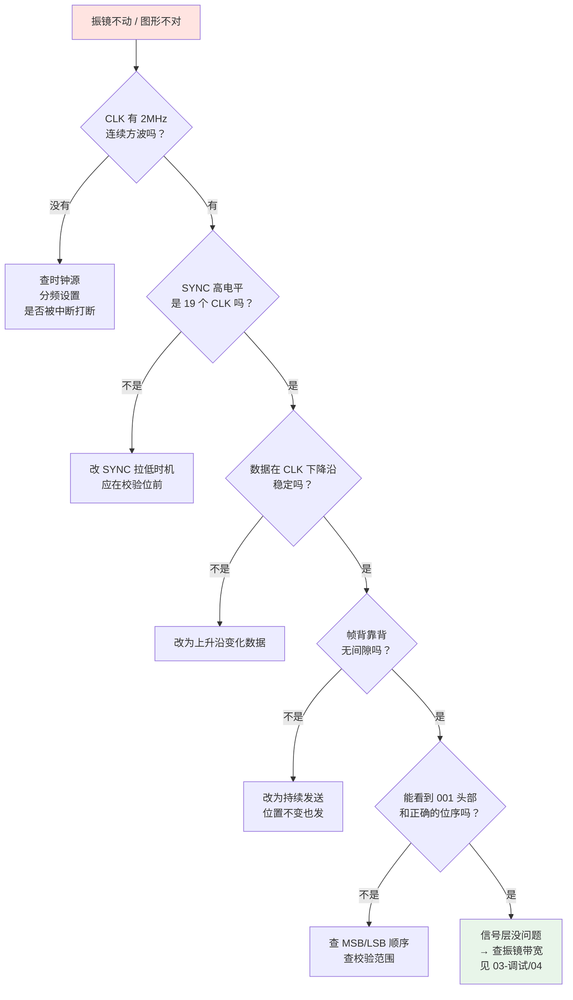

# 🔬 示波器测量方法

> [!info] 一句话版本
> 想验证 XY2-100 对不对，必须**同时看 CLK、SYNC、数据三条线**，
> 用 **SYNC 上升沿触发**，然后逐项核对位序、SYNC 宽度、采样沿关系。

---

## 1. 你需要什么

| 仪器 | 最低要求 | 说明 |
|---|---|---|
| **示波器** | 2 通道，≥100 MHz，≥100 MSa/s | 3~4 通道更好（能同时看 CLK/SYNC/DATA） |
| **探头** | 2~4 支 10:1 无源探头 | |
| 差分探头 | 可选 | 直接看差分信号质量，但贵 |
| **USB 逻辑分析仪** | 8 通道 24 MHz | ⭐ **比示波器更实用**，见 [[03-调试与排错篇/02-逻辑分析仪抓包]] |
| 万用表 | — | 先查接线通断 |

> [!tip] 💡 示波器 vs 逻辑分析仪
> | | 示波器 | 逻辑分析仪 |
> |---|---|---|
> | 看**信号质量**（上升沿、振铃、噪声） | ✅ 强 | ❌ 只能看高低 |
> | 看**协议内容**（位序、帧结构） | ⚠️ 费力 | ✅ 强（能自动解码） |
> | 通道数 | 2~4 | 8~16 |
> | 价格 | ¥300+ | ¥15+ |
>
> **两个都要**是最理想的。只买一个的话，**先买逻辑分析仪**——
> 协议对不对用逻辑分析仪一秒就能看出来。

---

## 2. 探头怎么接

### 2.1 基本接法（单端看每条线）

```text
        示波器
   CH1 ────┐
   CH2 ────┤
   CH3 ────┤
   GND ────┴──── 控制卡 GND  ← 地夹必须接!
```

| 通道 | 接什么 | 说明 |
|---|---|---|
| CH1 | **CLK+** | 时钟，作为参考 |
| CH2 | **SYNC+** | 同步信号 |
| CH3 | **X+** | X 轴数据 |
| CH4 | **Y+** | Y 轴数据（可选） |

> [!danger] ⚠️ 地夹接错会短路
> 示波器的**地夹是连到大地/机壳的**。
> 如果你把两个地夹接到**不同电位**的两个点 → **短路，可能烧设备**。
>
> **正确做法**：所有地夹接到**同一个参考点**（控制卡 GND）。
> XY2-100 无电气隔离，控制卡和振镜共地，所以接控制卡 GND 即可。

### 2.2 看差分信号（进阶）

想验证差分对的质量，有两个办法：

**办法 A：用差分探头**（最准确，但贵）

**办法 B：用两个通道做数学运算**

```text
CH1 → X+       CH2 → X−       数学: CH1 − CH2
```

> [!warning] ⚠️ 用办法 B 时必须注意
> 两个探头的地夹要接同一个点，且两个通道要**校准过延迟差**（deskew），
> 否则相减后会出现假的尖峰。
>
> 💡 **折中做法**：分别看 X+ 和 X−，确认它们**确实是互补的**
> （一个高时另一个低）。这通常就够了。

---

## 3. 触发设置（关键）

### 推荐设置

| 项目 | 设置 | 原因 |
|---|---|---|
| **触发源** | **SYNC** | 帧边界最稳定 |
| **触发类型** | **上升沿** | SYNC 上升沿 = 帧开始 |
| **触发电平** | 信号幅度的 50% | |
| **时基** | **1~2 μs/div** | 一帧 10 μs，屏上放 5~10 格 |
| **模式** | Normal（非 Auto） | 避免无信号时乱触发 |
| **单次/连续** | 先单次抓一帧细看，再连续看稳定性 | |

```text
期望看到的画面 (时基 2μs/div, 共 10μs = 5 格):

        ├───── 一帧 10 μs (5 格) ─────┤
CLK     ┌┐┌┐┌┐┌┐┌┐┌┐┌┐┌┐┌┐┌┐┌┐┌┐┌┐┌┐┌┐┌┐┌┐┌┐┌┐┌┐
        
SYNC    ┌───────────────────────────────┐
        │                               └────────
        ↑ 触发点
        └─ 高 19 位 ─┘└1位┘
                        ↑ 校验位期间拉低
```

---

## 4. 逐项核对清单

### ✅ 检查 1：时钟频率

| 项目 | 期望值 |
|---|---|
| CLK 周期 | **500 ns**（2 MHz） |
| CLK 占空比 | 接近 50%（规范未强制，但别太离谱） |

**测法**：把时基调到 200 ns/div，量一个完整周期。

> [!warning] ⚠️ 规范没规定占空比
> 我查过的所有原厂文档**都没有给出占空比的官方规格**。
> 只有"上升沿变化、下降沿采样"的边沿关系要求。
> 💡 工程上按 **50%** 设计最安全，但 ±10% 偏差通常没问题。
> 如果你的振镜对占空比敏感，只有实测才知道。

### ✅ 检查 2：SYNC 宽度

| 项目 | 期望值 |
|---|---|
| SYNC 高电平 | **19 个 CLK 周期 = 9.5 μs** |
| SYNC 低电平 | **1 个 CLK 周期 = 0.5 μs** |

**测法**：数 SYNC 高电平期间有几个 CLK 周期。

> [!danger] 这是最常见的错误
> SYNC 覆盖 19 位还是 20 位，肉眼看波形差不多（差 5%），
> 但**决定了振镜能不能正确识别帧边界**。
>
> **怎么数**：把时基放大到 500 ns/div，数 SYNC 高电平期间的时钟个数。
> 应该是 **19**，不是 20。

### ✅ 检查 3：数据与时钟的边沿关系

| 项目 | 期望 |
|---|---|
| 数据**变化**时刻 | CLK **上升沿** |
| 数据**稳定**时刻 | CLK **下降沿**前后 |
| 建立时间 tDS | ≥ 50 ns |
| 保持时间 tDH | ≥ 100 ns |

```text
                 ┌───────────────────┐
CLK     ─────────┘                   └──────────
                 ↑                   ↑
            上升沿: 数据变化      下降沿: 采样

DATA    ─────────┼────═══稳定═══════┼──────────
                 │                   │
                 │←─ 稳定期 ────────→│
                 
        tDS: 相对下降沿提前稳定 ≥ 50 ns
        tDH: 相对下降沿保持 ≥ 100 ns
```

**测法**：用**双通道**同时看 CLK 和 DATA，放大到 100 ns/div，
量数据跳变沿相对时钟沿的位置。

### ✅ 检查 4：帧结构（位序）

| 发送次序 | 1 | 2 | 3 | 4…19 | 20 |
|---|---|---|---|---|---|
| 内容 | `0` | `0` | `1` | 数据 D15…D0 | 校验位 |

**测法（示波器）**：
1. 先让程序发送**固定值**（例如中心 `0x8000`）
2. 期望帧 = `001 1000000000000000 0`
3. 在波形上逐位核对

> [!tip] 💡 用示波器数 20 位很累，用逻辑分析仪轻松
> 强烈建议用逻辑分析仪 + sigrok 解码器，直接读出数值。
> 示波器只用来**验证信号质量和边沿关系**。

### ✅ 检查 5：连续性

| 项目 | 期望 |
|---|---|
| 帧间间隙 | **无**（背靠背） |
| CLK 是否停 | **不停** |
| 位置不变时 | **持续重复发送** |

**测法**：把时基调到 20 μs/div（能看两帧），
确认 SYNC 是**等间隔**出现的，中间没有空档。

### ✅ 检查 6：信号质量

| 项目 | 期望 |
|---|---|
| 上升/下降时间 | 快且单调（无明显台阶） |
| 过冲/振铃 | < 20% 幅度 💡 |
| 噪声 | 干净，无明显毛刺 |
| 差分互补性 | X+ 与 X− 严格反相 |

> [!warning] 如果看到振铃
> 说明**阻抗不匹配**（反射）。
> 处理：加终端电阻（100~120 Ω，加在**接收端**）。
> 但注意——**很多振镜内部已集成终端电阻**，外部再加可能超载。
> 先测、后加，别盲加。

---

## 5. 常见波形异常对照

| 波形现象 | 可能原因 | 处理 |
|---|---|---|
| CLK 频率不对 | 分频系数算错 | 核对主时钟与分频比 |
| CLK 有停顿 | 软件生成被中断打断 | 改用硬件外设 |
| SYNC 覆盖 20 位 | 拉低时机错 | 在校验位开始前拉低 |
| SYNC 只有一个短脉冲 | 误当成"每字节一个脉冲" | 改为持续 19 位长的电平 |
| 数据与时钟同相变化 | 在下降沿改数据 | 改为上升沿变化 |
| 数据在下降沿后才稳定 | 建立时间不足 | 提前更新数据 |
| 帧之间有长间隔 | 没有持续发送 | 位置不变也要继续发帧 |
| X 或 Y 一直是 0 | 该轴数据线断 / 接反 | 查线 |
| X/Y 不同步 | 分两次发送 | 同一帧内同时发 |
| 差分对不对称 | P/N 走线不等长 | 重新布线 |
| 信号有大振铃 | 阻抗不匹配 | 加终端电阻 |
| 有周期性毛刺 | 附近电机/PWM 干扰 | 加屏蔽、远离干扰源 |

---

## 6. 上电安全流程 🔬

> [!danger] 首次上电一定要按这个顺序
> 1. **断电**，用万用表逐针核对接线（尤其电源针！）
> 2. 确认**没有双重供电**（振镜有独立电源时，断开控制卡的电源针）
> 3. 用**可调限流电源**，电流限值设到正常值的 **50%**
> 4. 接好示波器/逻辑分析仪探头
> 5. **上电**，立刻观察电流表
>    - 电流正常 → 继续
>    - 一上电就限流 → **立刻断电**查问题
> 6. 确认信号正常后，再把限流放到正常值
>
> 💡 这一步花 10 分钟，可能救你一台几千块的振镜。

---

## 7. 快速诊断流程图



---

## ✅ 自检

- [ ] 知道为什么 SYNC 上升沿是最好的触发源
- [ ] 会用示波器数出 SYNC 高电平期间的时钟个数
- [ ] 知道怎么测建立/保持时间
- [ ] 明白为什么地夹不能接不同电位的点
- [ ] 知道信号质量的三个观察点（上升时间、过冲、噪声）
- [ ] 记住上电安全的六步流程

---

## 📖 依据

> [!quote] 出处
> | 内容 | 出处 |
> |---|---|
> | CLK 2 MHz、上升沿变化、下降沿采样 | `Documents_TD_XY2-100_R0703.pdf` p.2 |
> | tDS ≥ 50 ns、tDH ≥ 100 ns | 同上 |
> | SYNC 高 19 位、校验位拉低 | `Raylase_Interface_XY2-100.pdf` p.1 |
> | 帧长 10 μs、帧率 100 kHz | `E1803D_Scanner_Controller_Manual.pdf` p.150 |
> | 占空比无官方规格 | 查阅全部已下载厂商文档，**未找到该项** |
>
> 💡 触发设置、探头接法、信号质量判据为通用工程实践。

---

## 🔗 相关

- 上一篇：[[02-硬件实现篇/06-开源参考实现导读]]
- 下一篇：[[03-调试与排错篇/02-逻辑分析仪抓包]]
- 故障速查：[[03-调试与排错篇/03-常见故障速查]]
- 回到入口：[[🏠 开始这里]]
