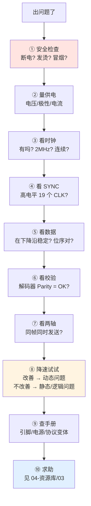

# 🚑 常见故障速查

> [!tip] 怎么用这一篇
> **按"现象"找**。左边是你的症状，右边是原因和解决。
> 先看**最可能**的那一栏，别一上来就怀疑最复杂的。

---

## 快速索引

| 现象 | 跳到 |
|---|---|
| 振镜完全不动 | [[#A. 振镜完全不动]] |
| 振镜乱甩 / 撞限位 | [[#B. 振镜乱甩或撞限位]] |
| 图形镜像 / 颠倒 | [[#C. 图形镜像颠倒]] |
| 图形尺寸不对 | [[#D. 图形尺寸不对]] |
| 图形变形（圆角、多边形） | [[#E. 图形变形]] |
| 偶尔卡顿 / 丢点 | [[#F. 偶尔卡顿丢点]] |
| 起点有"爆点" | [[#G. 起点爆点]] |
| 图形整体偏移 | [[#H. 图形整体偏移]] |
| 线条粗细不均 | [[#I. 线条粗细不均]] |
| 用一会儿就出问题 | [[#J. 发热后出问题]] |
| 换了一台振镜就不行 | [[#K. 换振镜后不工作]] |

---

## A. 振镜完全不动

> [!danger] 先做安全检查
> **在怀疑协议之前，先确认：**
> - 振镜供电了吗？电压对吗？
> - 有没有冒烟/发烫？有的话立刻断电！

### 排查顺序（从易到难）

| # | 检查项 | 怎么查 | 可能问题 |
|---|---|---|---|
| 1 | **供电** | 万用表量振镜电源针 | 没供电 / 电压不对 / 极性反了 |
| 2 | **接线** | 万用表逐针通断 | 断线 / 接错针 |
| 3 | **CLK 有波形吗** | 示波器/逻辑分析仪 | 没时钟 → 振镜肯定不动 |
| 4 | **CLK 频率对吗** | 应该是 2 MHz | 分频算错 |
| 5 | **SYNC 有波形吗** | 应该有 10 μs 周期 | SYNC 逻辑错 |
| 6 | **数据线有变化吗** | 看 X+/Y+ | 数据恒为 0 → 没在发 |
| 7 | **X/Y 都发了吗** | 两根线都要看 | **只发一个轴 → 另一轴跑零位** |
| 8 | **差分方向对吗** | P/N 有没有接反 | 接反 → 数据全反 |
| 9 | **STATUS 有输出吗** | 看 STATUS 线 | 有输出说明振镜活着 |
| 10 | **协议参数对吗** | 校验、位序、SYNC 宽度 | 见下 |

> [!warning] 最容易被忽略的第 7 条
> **X 和 Y 必须同一帧内同时发送。**
> 振镜每收到一帧就认为 X/Y 数据同时到达。
> 你如果只发 X 不管 Y，**Y 轴会跑到 0 位或满量程**。
>
> 见 [[00-入门篇/04-常见误区]] 误区 5。

### 如果波形都对但就是不动

| 可能原因 | 验证方法 |
|---|---|
| **字节序错**（MSB/LSB） | 用 sigrok 解码看解出的值对不对 |
| **校验位错** | 看解码器的 `Parity` 是否 `NOK` |
| **SYNC 覆盖 20 位** | 数 SYNC 高电平里的时钟数 |
| **时钟太快** | 降频试试 |
| **振镜需要额外使能** | 查手册有没有 EN 引脚 |

---

## B. 振镜乱甩或撞限位

> [!danger] 立刻断电！
> 乱甩可能损坏镜片或撞坏机械限位。

| 可能原因 | 说明 | 处理 |
|---|---|---|
| **只发了一个轴** | 未发送的轴跑到 0 或满量程 | 同一帧内同时发 X/Y |
| **数据超范围未钳位** | `+40000` 转 uint16 回绕成负数 → 镜片瞬间甩到另一端 | 发送前 clamp 到 [−32768, 32767] |
| **校验/位序错导致数据乱** | 振镜解出随机值 | 用解码器验证 |
| **中心值用错** | 用了 `0x0000` 而不是 `0x8000` | 修正偏移 |
| **帧同步丢失** | SYNC 时序错 | 修正 SYNC |
| **上电瞬间的随机值** | 复位时数据未定义 | 复位时输出中心位置 |

> [!danger] ⚠️ 最危险的一条：超范围回绕
> ```c
> // ❌ 危险! 没有钳位
> uint16_t wire = target + 32768;      // target = +40000 → 回绕成负数
>
> // ✅ 安全
> if (target >  32767) target =  32767;
> if (target < -32768) target = -32768;
> uint16_t wire = target + 32768;
> ```
> 回绕会让镜片**瞬间从一端甩到另一端**，全速冲击机械限位。

---

## C. 图形镜像 / 颠倒

| 现象 | 原因 | 处理 |
|---|---|---|
| **左右镜像** | X 差分对 P/N 接反 | 交换 X+/X− |
| **上下镜像** | Y 差分对 P/N 接反 | 交换 Y+/Y− |
| **中心对称翻转** | X 和 Y 都接反 | 交换两对 |
| **旋转 90°** | X/Y 通道互换 | 交换 X 和 Y 两对线 ⚠️ |
| **正负颠倒（数值反）** | 用了补码而不是偏移二进制 | 最高位取反 |
| **整幅镜像（不是差分问题）** | 振镜安装方向 / 场镜装反 | 机械检查 |

> [!warning] ⚠️ X/Y 引脚定义厂商间不兼容！
> **RAYLASE 定义 X 轴 = 先被激光打到的那个轴（小镜），
> 但部分厂商定义相反。**
> 换品牌时必须重新查引脚定义——**X/Y 通道引脚可能是互换的**。
>
> 症状：图形旋转 90°（正方形变正方形但方向不对，或者长方形方向反了）。

---

## D. 图形尺寸不对

| 现象 | 原因 | 处理 |
|---|---|---|
| **尺寸差 2 倍** | 用了机械角当光学角（或反之） | 光学角 = 2 × 机械角 |
| **尺寸偏小** | 速度太快，振镜跟不上，幅度被"削" | 降速 |
| **尺寸随位置变化** | 场镜畸变未校正 | 做畸变标定 |
| **比例不对（长方形变正方形）** | X/Y 增益不一致 | 分别标定 X/Y 比例系数 |
| **整体偏小但比例对** | 满量程映射算错 | 核对角度↔码值换算 |

> [!tip] 💡 最省事的判断法
> **先画一个正方形，量它的实际物理尺寸。**
> - 如果边长比例对但整体缩小 → 大概率是速度问题
> - 如果边长比例不对 → 增益/标定问题
> - 如果形状歪斜 → 机械/畸变问题

---

## E. 图形变形

| 现象 | 原因 | 处理 |
|---|---|---|
| **直角变圆角** | 振镜跟不上拐角 | 降速 / 加拐角延时 |
| **圆变成多边形** | 点密度不够 或 速度太快 | 增加插补点 / 降速 |
| **直线变弧线** | 加减速不平滑 | 加前瞻（look-ahead） |
| **起点/终点变形** | 加速段/减速段画到了图形上 | 用**空中画线**（Sky Writing） |
| **边缘变形比中心严重** | F-θ 场镜畸变 | 做畸变标定 |
| **枕形/桶形失真** | 场镜畸变 + 二维耦合 | 做二维校正表 |

> [!important] 变形的三大来源
> ```mermaid
> flowchart LR
>     A["动态变形<br/>（振镜跟不上）"] --> D["图形失真"]
>     B["静态畸变<br/>（场镜/机械）"] --> D
>     C["时序错配<br/>（激光与振镜不同步）"] --> D
> ```
> **先判断是哪一类**，再对症下药：
> - 降速后改善 → **动态变形**
> - 降速后不改善 → **静态畸变**（要标定）
> - 只在开/关激光处有问题 → **时序错配**

详见 [[03-调试与排错篇/04-图形失真与标定]]。

---

## F. 偶尔卡顿 / 丢点

| 可能原因 | 验证 | 处理 |
|---|---|---|
| **校验位错**（振镜丢弃该帧） | 解码器看 `Parity` | 修正校验范围（19 位） |
| **软件生成被中断打断** | 示波器看时钟有无停顿 | 改用硬件外设（PIO/FPGA） |
| **DMA 抢总线导致抖动** | 看时钟周期是否均匀 | 用 FIFO 缓冲 / 提高优先级 |
| **CPU 来不及喂数据** | 加计数器统计欠载次数 | 加 FIFO / 降低点速率 |
| **电源纹波导致误码** | 看差分信号质量 | 加去耦、换电源 |
| **接插件接触不良** | 轻触线缆看现象 | 重新压接/焊接 |
| **地弹（ground bounce）** | 多轴同时动时出现 | 加大地线、降低驱动电流 |
| **X/Y 不同步** | 看两轴采样时刻 | 用同步机制（见 PIO 方案的仲裁） |

> [!tip] 💡 定位"偶尔"类问题的技巧
> 这类问题最难查。方法：
> 1. **长时间抓包**（几秒 = 几十万帧）
> 2. 用脚本统计**错误帧的比例和分布**
> 3. 看错误是否**周期性**出现（周期性 → 干扰源相关）
> 4. 看错误是否与**特定动作**相关（多轴同时动？激光开？）

---

## G. 起点爆点

**现象**：每条线的起点有一个明显的深色坑/粗点。

| 原因 | 说明 |
|---|---|
| **激光开得太早** | 振镜还在加速，光已经在打 |
| **振镜启动慢** | 从静止到设定速度需要时间 |
| **LaserOnDelay 设置不对** | 延时补偿参数没调好 |

**解决方案**：

| 方法 | 说明 |
|---|---|
| ⭐ **空中画线（Sky Writing）** | 在图形外的空白处提前加速，达到速度后再开激光 |
| **调 LaserOnDelay** | 增加开激光的延迟 |
| **降低速度** | 让加速段变短 |
| **增加起步辅助点** | 在起点前加几个过渡点 |

> [!success] ✅ 官方量化数据
> RAYLASE SP-ICE 3 给出：
> - `TD_TX = 13 μs + 20 μs + T_Int`
> - `TD_RX = 36 μs`
> - **定位延时 = 传输延时 + 跟踪滞后**
>
> 据此设置 LaserOnDelay / LaserOffDelay。
> 这两个值可用 Enhanced 命令 **0x0556 / 0x0557** 在线读取。
>
> ⚠️ 若使用了 SCANLAB XY2-100 Converter，
> **LaserOn/OffDelay 各需再加 10 μs**。

---

## H. 图形整体偏移

| 原因 | 处理 |
|---|---|
| **中心值算错**（用了 `0x0000`） | 中心应为 `0x8000` |
| **转换时没加 0.5**（没四舍五入） | 所有值系统性偏小 0.5 LSB |
| **零点漂移（温漂）** | 预热后重新标定 |
| **地电位差** | 检查共地，加隔离 |
| **场镜安装偏心** | 机械调整 |
| **振镜零点未校准** | 使用振镜的调零功能 |

> [!warning] ⚠️ "没加 0.5" 是个隐蔽的坑
> ```c
> uint16_t v = (uint16_t)(norm * 65535.0);        // ❌ 向下取整，系统偏小
> uint16_t v = (uint16_t)(norm * 65535.0 + 0.5);  // ✅ 四舍五入
> ```
> 中心点比例是 0.5，`0.5 × 65535 = 32767.5`：
> - 不加 0.5 → 32767 = `0x7FFF`（**中心偏了 1 LSB**）
> - 加 0.5 → 32768 = `0x8000` ✅
>
> 详见 [[01-协议篇/04-位置数据编码]] 第 6.1 节。

---

## I. 线条粗细不均

| 原因 | 说明 |
|---|---|
| **速度波动** | 激光能量沉积 = 功率/速度，速度变了线宽就变 |
| **加减速段** | 起停处速度低 → 线更粗 |
| **拐角处** | 减速 → 变粗 |
| **激光功率不稳定** | 电源问题 |
| **焦点位置漂移** | 场镜平面度 / 工件不平 |

**处理**：
- 用**恒速扫描**（让轨迹算法保证匀速）
- 起停段用**空中画线**移出图形外
- 加**功率随速度调制**（部分控制卡支持）

---

## J. 发热后出问题

| 现象 | 原因 | 处理 |
|---|---|---|
| **用一会儿图形变形** | 振镜过热，伺服性能下降（温度告警位会置位） | 加强散热 / 降低占空比 |
| **图形慢慢偏移** | 温漂 | 预热后标定；缩短连续加工时间 |
| **突然不动** | 过热保护 | 停机冷却，检查散热 |

> [!tip] 💡 用 STATUS 温度位提前预警
> 把 STATUS 的 **temperature state** 位接到逻辑分析仪或 MCU，
> 在过热**之前**就降速——避免加工到一半出废品。
> 见 [[01-协议篇/05-STATUS状态回读]]。

---

## K. 换振镜后不工作

> [!danger] ⚠️ 换振镜必须重查这几项
> | 项目 | 为什么 |
> |---|---|
> | **协议版本（XY2-100 / XY3-100）** | 🚨 **CLK 与 SYNC 引脚互换！**见下 |
> | **引脚定义** | ⚠️ **X/Y 可能互换！电源针也不同** |
> | **供电电压** | ±15V / ±24V / +30V 都有 → **接错烧设备** |
> | **供电方式** | 控制卡供电还是独立电源？**不能双重供电** |
> | **校验位** | 偶/奇校验，校验范围可能不同 |
> | **16 位还是 18 位** | 增强模式兼容性 |
> | **STATUS 定义** | 各家自定义 |
> | **最大帧率** | 有的不支持 200 kHz |
>
> **铁律：换一台振镜，重新看它的手册。**

### 🚨 第一危险项：XY3-100 与 XY2-100 的 CLK/SYNC 互换

> [!danger] 这是会导致通信**完全失效**的硬陷阱
> | 协议 | Pin 1 / 14 | Pin 2 / 15 |
> |---|---|---|
> | **XY2-100** | **CLK** | **SYNC** |
> | **XY3-100** | **SYNC**（文档叫 A） | **CLK**（文档叫 B） |
>
> **换协议版本时，任何声明"引脚兼容、无需改硬件"的说法都不可信。**
> XY3-100 标准原文就写着 "Same pinout as XY2-100(E), no hardware changes needed"，
> **但实际控制线是互换的**——只在数据线上兼容。
>
> **症状**：把 XY3-100 振镜接到 XY2-100 控制卡上（或反之）→ **完全不动**，
> 但用示波器量每条线都"有信号"，容易误判成协议/校验问题而查错方向。
>
> **排查**：把接在 1/2 脚的两对线**对调**试试。
>
> 详情见 [[01-协议篇/08-物理层与连接器]] 第 2.5 节。

### 已知的厂商差异（实测）

| 厂商/型号 | 电源 | 备注 |
|---|---|---|
| RAYLASE Ray-Motion | **±15 V** @ 9/10/22、12/13/25 | X 轴 = 小镜（先被打到的） |
| SCANLAB RTC4 | **+30 V** @ 9/10/22，12/13/25 = GND | ⚠️ **与 RAYLASE 完全不同！** |
| halaser E1803D 输出 | +12~24 V / −12~24 V | 由外部三针电源直通 |

> [!danger] ⚠️ RAYLASE 与 SCANLAB 的电源引脚完全不同
> - RAYLASE：9/10/22 = **+15V**，12/13/25 = **−15V**
> - SCANLAB：9/10/22 = **+30V**，12/13/25 = **GND**
>
> **把 RAYLASE 的振镜插到 SCANLAB 定义的控制卡上 → 可能烧设备。**
> 反过来也一样。**务必逐针核对。**

---

## 万能排查流程



---

## 📖 依据

> [!quote] 出处
> | 内容 | 出处 |
> |---|---|
> | X/Y 必须同帧发送 | `xy2-100-arduino/src/XY2_100.h` 注释（振镜行为）+ 规范 |
> | SYNC 高 19 位 | `Raylase_Interface_XY2-100.pdf` p.1 |
> | 校验覆盖 19 位 | sigrok `xy2-100/pd.py` + 3 个解码器交叉验证 |
> | RAYLASE ±15V / SCANLAB +30V 引脚差异 | 各自手册（已归档） |
> | LaserOn/OffDelay 量化数据、0x0556/0x0557 | `RAYLASE_SP-ICE3_Datasheet.pdf` |
> | 转换器 +10 μs | SCANLAB RTC6 手册 §4.5.2 |
> | STATUS 温度/跟踪误差位 | `E1803D_Scanner_Controller_Manual.pdf` p.112 |
>
> 💡 排查顺序、经验判断为工程实践总结。

---

## 🔗 相关

- 上一篇：[[03-调试与排错篇/02-逻辑分析仪抓包]]
- 下一篇：[[03-调试与排错篇/04-图形失真与标定]]
- 误区清单：[[00-入门篇/04-常见误区]]
- 求助渠道：[[04-资源库/03-开源项目清单]]
- 回到入口：[[🏠 开始这里]]
