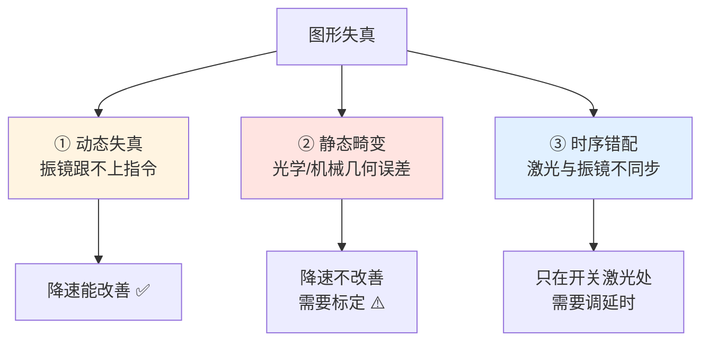
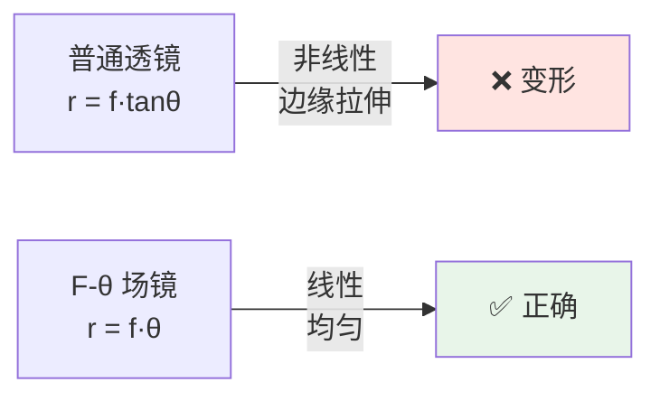
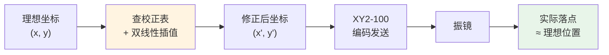
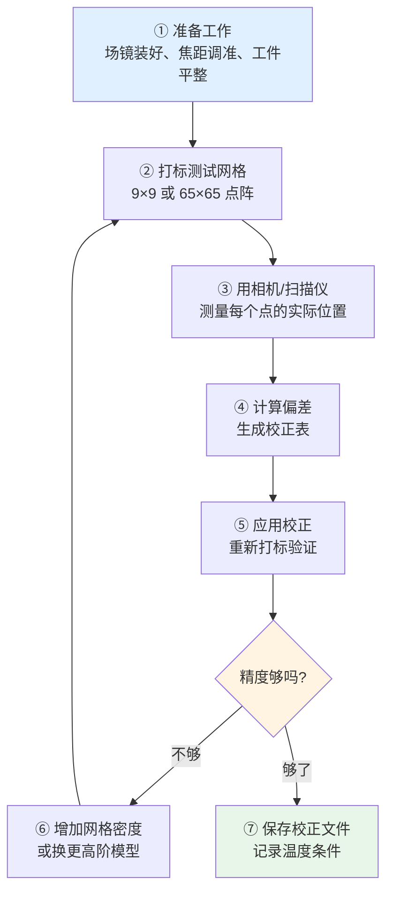

# 🎯 图形失真与标定

> [!info] 一句话版本
> 图形失真有**三大来源**：振镜跟不上（动态）、场镜有畸变（静态）、激光与振镜时序错配。
> **先判断是哪一类，再对症下药**——降速能改善的是动态问题，改造不了的是静态畸变。

---

## 1. 三大失真来源



### 一分钟判断法

| 试验 | 结果 | 结论 |
|---|---|---|
| **降速一半** | 明显改善 | **动态失真** |
| **降速一半** | 基本没变 | **静态畸变** |
| **只在起点/终点/拐角有问题** | — | **时序错配** |
| **只在大幅面边缘有问题** | — | **场镜畸变** |

---

## 2. 静态畸变：认识 F-θ 场镜

### 为什么需要 F-θ 镜

激光经振镜偏转角度 θ 后，普通透镜在焦平面上的落点是：

```text
r = f × tan(θ)        ← 普通透镜
```

**tan 是非线性的**！θ 越大，误差越大。所以打大幅面时边缘会严重变形。

F-θ 场镜经过特殊设计，让落点变成：

```text
r = f × θ            ← F-θ 场镜 (线性!)
```



> [!important] 但 F-θ 镜也只是"近似线性"
> 真实的 F-θ 镜在边缘仍有残差畸变，而且：
> - **X/Y 两轴存在耦合**（打对角时的误差不只是两轴误差之和）
> - 不同场镜的畸变特性不同
> - 加工幅面越大，畸变越明显
>
> **所以必须做二维校正。**

---

## 3. 常见的畸变类型

| 畸变类型 | 现象 | 主要来源 |
|---|---|---|
| **枕形畸变** | 方形变成"枕头"形（四边内凹） | 场镜 |
| **桶形畸变** | 方形变成"桶"形（四边外凸） | 场镜 |
| **梯形畸变** | 方形变成梯形 | 振镜安装角度偏差 |
| **平行四边形畸变** | 方形变成斜的 | 两轴不正交 |
| **比例误差** | 长方形变正方形 | X/Y 增益不一致 |
| **平移误差** | 图形整体偏移 | 零点未校准 |
| **旋转误差** | 图形整体旋转 | 振镜/工件安装角度 |

```text
理想          枕形          桶形         梯形        平行四边形
┌────┐      ┌────┐      ┌──────┐     ┌────┐      ┌────┐
│    │      │    │      │      │     │    │       │   ╱│
│    │      ╰    ╯      │      │     │    │       │  ╱ │
│    │      │    │      │      │     │    │       │ ╱  │
└────┘      └────┘      └──────┘     └────┘      └────┘
```

---

## 4. 二维标定怎么做

### 4.1 基本模型：仿射变换

最简单的校正是**仿射变换**（2×3 矩阵），能修正：
平移、旋转、缩放、错切（平行四边形）

```text
┌ x' ┐   ┌ m11  m12 ┐ ┌ x ┐   ┌ dx ┐
│    │ = │          │ │   │ + │    │
└ y' ┘   └ m21  m22 ┘ └ y ┘   └ dy ┘
```

**6 个参数**：`m11, m12, m21, m22, dx, dy`

> [!note] 控制卡的实际做法
> halaser E1803D 提供 `E180X_set_xy_correction_matrix()` 接口，
> 参数正是 `m11, m12, m21, m22` 四个矩阵元素 + 平移。
> 这是**工业控制卡的标准做法**。

### 4.2 高级模型：二维校正表

仿射变换修不了**非线性畸变**（枕形/桶形）。
要修正这些，需要**二维查找表（LUT）**：

```text
思路:
  1. 把工作幅面划成 M × N 网格（例如 65 × 65）
  2. 每个网格点，测量"指令位置"与"实际位置"的偏差
  3. 存成校正表
  4. 加工时: 双线性插值查表，修正指令值
```



> [!success] 工业标准格式
> 各家控制卡的校正表格式不同，但可以互相转换：
> | 格式 | 厂商 |
> |---|---|
> | `.ctb` / `.ct5` | SCANLAB |
> | `.gcd` | RAYLASE |
> | `.ucf` | SCAPS |
> | `.xml` | Cambridge Technology |
> | `.txt` | Sino-Galvo（世纪桑尼） |
>
> 来源：halaser E1803D 手册（支持上述多种格式）

### 4.3 标定流程



> [!warning] ⚠️ 标定的前提条件
> **标定之前必须先满足这些，否则标定没意义：**
> 1. **工作面严格在焦平面上**（大多数"光路不对"其实是焦距没调准）
> 2. 场镜安装到位、锁紧
> 3. 振镜安装稳固（不能有松动）
> 4. 工件表面平整
> 5. 设备已预热到工作温度
>
> 💡 行业经验：**90% 以上"光路不对"的问题，实际是工作面没在焦距上。**

---

## 5. 动态失真及其补偿

### 5.1 现象与来源

| 现象 | 来源 |
|---|---|
| 直角变圆角 | 拐角处振镜来不及换向 |
| 圆变多边形 | 点密度不足或速度过快 |
| 起终点变形 | 加减速段画在了图形上 |
| 整体缩小 | 大幅摆动时跟不上 |

### 5.2 补偿技术

| 技术 | 原理 | 代价 |
|---|---|---|
| **降速** | 直接降低要求 | 效率下降 |
| **空中画线（Sky Writing）** | 在图形外提前加速/延后减速 | 需要额外空间 |
| **拐角延时** | 拐角处停顿等振镜到位 | 效率下降 |
| **前瞻（Look-ahead）** | 提前读入轨迹，拐角前预减速 | 算法复杂 |
| **前馈（Feedforward）** | 按加速度预施加力矩 | 需要精确模型 |
| **激光延时补偿** | 调整开关激光的时刻 | 需实测标定 |

### 5.3 空中画线详解

```text
问题: 起点处振镜还在加速, 激光已经开 → 起点烧个坑

      图形起点
         ↓
    ┌─────────┐
    │●────────│  ← ● 是爆点
    │         │
    └─────────┘

解决: 在图形外"助跑"
       
       助跑段(激光关)  图形段(激光开)
         ↓              ↓
    ○───→●═══════════╗
                      ║
              ┌───────╝
              │
              └────────
    
    ○: 起点(激光关) → 加速 → 到达速度后开激光 ═: 正式画线
```

---

## 6. 时序错配与激光延时

### 关键参数

| 参数 | 作用 |
|---|---|
| **LaserOnDelay** | 开激光相对振镜指令的延迟 |
| **LaserOffDelay** | 关激光相对振镜指令的延迟 |
| **Jump Delay** | 跳转（不加工移动）时的延时 |
| **Corner Delay** | 拐角处的停留时间 |
| **Mark Delay** | 每条线结束后的停留时间 |
| **Polygon Delay** | 多边形顶点处的停留时间 |

### 官方量化数据 ✅

> [!success] RAYLASE SP-ICE 3 官方公式
> ```text
> TD_TX = T_K + T_C + T_Int
>   T_K   = 13 μs        常数部分
>   T_C   = 20 μs        插值计算时间
>   T_Int                插值周期 (T_Int = 0 时 TD_TX = 14 μs)
>
> TD_RX = 36 μs          接收方向, 恒定
> ```
> **定位延时（Positioning Delay）= 传输延时 + 跟踪滞后**
>
> 这两个值可通过 Enhanced Protocol 命令 **0x0556 / 0x0557** 在线读取。

> [!note] 转换器引入的固定延迟
> **SCANLAB XY2-100 Converter**（SL2-100 20bit → XY2-100 16bit，配件 #125377）
> **引入 10 μs 传播延迟**。
> 使用时 **LaserOnDelay 与 LaserOffDelay 各需增加 10 μs**。
> 来源：SCANLAB RTC6 手册 §4.5.2

### 怎么标定 LaserOnDelay

> [!example] 🔬 实操标定法
> 1. 画一条水平直线，**故意设 LaserOnDelay = 0**
> 2. 观察起点：会有一个明显的粗点/坑
> 3. **逐步增大 LaserOnDelay**（每次 +5 μs）
> 4. 直到起点变得和线身一样粗细
> 5. 记录该值，再微调 ±2 μs 找最优
>
> LaserOffDelay 同理，看终点。
>
> 💡 **画"梳子"图形更快**：一排平行短线，一眼就能看出起终点是否整齐。

---

## 7. 画质检查清单

> [!example] 做一次完整画质评估
> - [ ] **正方形**：四边是否等长？角是否直角？
> - [ ] **圆**：是否圆？接缝处有无台阶？
> - [ ] **大幅面方框**：四条边是否直？中间有无凹陷/外凸？
> - [ ] **满幅对角直线**：是否直？
> - [ ] **细线（hairline）**：整条线粗细是否一致？
> - [ ] **密集填充块**：有无条纹、色差？
> - [ ] **汉字/精细图形**：笔画是否清晰、有无粘连？
> - [ ] **重复打同一图形**：多次是否重合（重复精度）？
> - [ ] **隔 30 分钟再打**：是否偏移（温漂）？
>
> 这 9 项覆盖了动态、静态、时序三类问题。

---

## 8. 验收标准参考

| 指标 | 典型要求 💡 | 怎么测 |
|---|---|---|
| 定位精度 | ±50 μm @ 100mm 幅面 | 打网格，量偏差 |
| 重复精度 | ±10 μm | 同一图形打 10 次比对 |
| 直线度 | ±20 μm / 100mm | 打长直线，量弯曲 |
| 圆度 | ±30 μm | 打大圆，量半径变化 |
| 正交度 | ±0.05° | 打正方形，量角度 |

> [!warning] ⚠️ 这些是通用参考值
> **实际要求取决于你的应用**（打标 vs 焊接 vs 3D 打印差别很大）。
> 以**你们公司的验收规范**为准。

---

## ✅ 自检

- [ ] 能说出失真的三大来源
- [ ] 会用"降速试验"区分动态/静态问题
- [ ] 理解 F-θ 镜的作用（r = f·θ 而不是 f·tanθ）
- [ ] 知道仿射变换能修什么、不能修什么
- [ ] 知道标定前必须先保证工作面在焦平面上
- [ ] 会标定 LaserOnDelay
- [ ] 知道 RAYLASE 的延迟公式量级

---

## 📖 依据

> [!quote] 出处
> | 内容 | 出处 |
> |---|---|
> | 校正矩阵接口、支持多种校正表格式 | `E1803D_Scanner_Controller_Manual.pdf` |
> | TD_TX / TD_RX 公式、命令 0x0556/0x0557 | `RAYLASE_SP-ICE3_Datasheet.pdf` |
> | 转换器 +10 μs | SCANLAB RTC6 手册 §4.5.2 |
> | 场镜畸变、镜台联动（IFOV） | Springer OA 论文《New linkage control methods...》（已归档） |
> | 前馈控制建模 | `EUSPEN_Galvo_Feedforward_Control.pdf`（已归档） |
> | 共聚焦扫描中的振镜应用 | Evident/Olympus 交互教程（见资源库） |
>
> 💡 失真的分类框架、标定流程、验收数值为工程实践总结。
> ⚠️ "90% 光路问题实为焦距问题"来自中文行业经验帖，**非官方统计**。

---

## 🔗 相关

- 上一篇：[[03-调试与排错篇/03-常见故障速查]]
- 性能基础：[[02-硬件实现篇/05-更新率与振镜带宽匹配]]
- 状态诊断：[[01-协议篇/05-STATUS状态回读]]
- 深入论文：[[04-资源库/04-论文书籍]]
- 回到入口：[[🏠 开始这里]]
