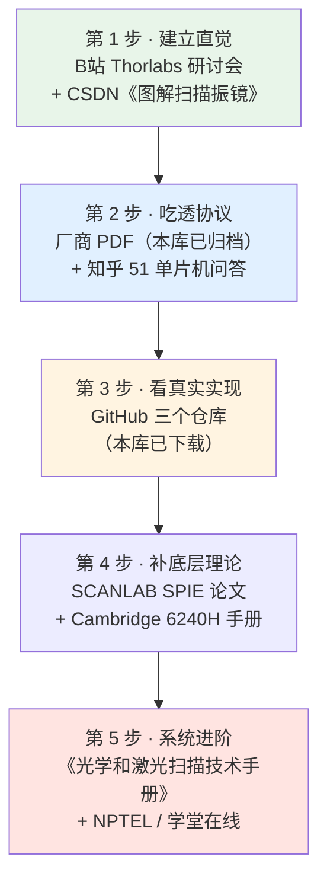

# 🎓 在线课程与视频

> [!warning] ⚠️ 关于链接有效性
> 下面的链接来自**搜索引擎的真实返回**和已下载页面，但我**无法逐条验证**——
> 部分站点（CSDN、知乎、B站、百度文库）在本机网络下无法直接抓取。
> **以"标题 + UP主/作者名"作为二次检索关键词**是最保险的做法。

---

## 📌 先说一个重要结论

> [!danger] 没有"XY2-100 协议专题课"
> 实际调研结果（**这是检索结论，不是漏搜**）：
>
> | 平台 | 结果 |
> |---|---|
> | 中国大学 MOOC | ❌ **无**振镜/XY2-100 专题课 |
> | 学堂在线 | ❌ **无** |
> | 网易云课堂 | ❌ **无** |
> | 腾讯课堂 | ❌ 已转型为 T-Learning 内部平台，无公开课 |
> | Coursera / edX / Udemy | ❌ **无**专门讲振镜协议的 |
>
> **为什么**：振镜控制属于**工程实践知识**，不在高校课程体系里。
> 中文高校课程只覆盖到「激光加工」「激光原理」这个层级。
>
> **所以你的学习路径必须是**：
> ```text
> 高校课程（补激光/光学基础）
>         +
> 厂商文档（学协议本身）    ← 本知识库已整理
>         +
> B站/博客（看工程实操）
>         +
> 开源代码（学实现）
> ```

---

## 一、中文视频（B站为主）

### ⭐ 最相关的两个

| 名称 | 链接 | 说明 |
|---|---|---|
| **视频教程：运动控制器激光振镜控制** | https://www.bilibili.com/video/BV14K4y1n7At/ | ⭐ **中文里唯一直接讲 XY2-100 实操的视频**。正运动技术官方，ZMC420SCAN + ZDevelop 通过 XY2-100 控制振镜轴。播放 1.1 万 |
| **【研讨会公开课】振镜激光扫描方案：设计和应用** | https://www.bilibili.com/video/av804370353/ | ⭐ **体系化程度最高的中文振镜原理视频**。Thorlabs 官方，Brian Candiloro 主讲：闭环振镜原理、光束操控特性、系统应用 |

### 原理入门

| 名称 | 链接 | 难度 |
|---|---|---|
| 光电子制造：振镜 | https://www.bilibili.com/video/BV1VdrVYMEfF/ | 初级（Thorlabs 官方） |
| 激光振镜工作原理 | https://www.bilibili.com/video/BV1acmuB8E99/ | 初级（动画讲偏转原理） |
| 激光振镜科普 | https://www.bilibili.com/video/BV1jomdBBEze/ | 初级（电子爱好者视角） |
| 振镜教程（合辑） | https://www.bilibili.com/video/av237604282/ | 初级（多条聚合） |

### DIY 实战

| 名称 | 链接 | 说明 |
|---|---|---|
| [硬件] 自制激光振镜 | https://www.bilibili.com/video/BV1sy4y1r7Xv/ | 历时 4 个月，播放 2.7 万 |
| 自制激光振镜系统 | https://www.bilibili.com/video/BV1qh4y1x7YJ/ | 步进电机方案，播放 3.2 万 |
| 打标机振镜基础知识教学 | https://www.bilibili.com/video/BV1yzCQBfEDk/ | 面向设备操作/调试 |
| DIY 振镜激光打标机使用教程 | https://www.bilibili.com/video/BV1EiTvzcEVL/ | 脱机操作指南 |

### 付费课程

| 名称 | 链接 | 说明 |
|---|---|---|
| 激光打标教学入门和实战技巧 | https://www.bilibili.com/cheese/play/ss132900091 | B站课堂，**付费**，含振镜系统章节 |

### 值得关注的 UP 主

| UP 主 | 链接 | 特点 |
|---|---|---|
| **Thorlabs 索雷博** | https://space.bilibili.com/412643769/upload/video | 光电类官方视频，持续更新 |
| 激光打标教学指导 | https://space.bilibili.com/1397128057 | 20 年激光行业经验，专答实操问题 |

### 基础补充（激光/光学）

| 名称 | 链接 | 说明 |
|---|---|---|
| 激光原理与技术【厦门大学】【国家级精品课】全30讲 | https://www.bilibili.com/video/BV1t2RhY5EZd/ | 免费，补光学/激光物理基础 |

---

## 二、中文图文教程

### ⭐ XY2-100 协议专项（核心）

| 名称 | 链接 | 说明 |
|---|---|---|
| **XY2-100 协议详解：光学振镜控制接口与拓展应用** | https://blog.csdn.net/CrowLWZ/article/details/109050977 | ⭐ 阅读 1.7 万。**中文引用率最高的 XY2-100 入门文** |
| **XY2-100 振镜控制协议（博客园）** | https://www.cnblogs.com/xymotion/p/12987507.html | ⭐ 差分传输、DB25/IDC 接口、时序、BACK 信号。**博客园无广告，阅读体验好** |
| xy2-100 协议驱动原理，基于 STM32F103 | https://blog.csdn.net/2501_93091150/article/details/150452592 | 含 **Verilog 代码实现** |
| 从原理到实践：手把手教你用 XY2-100 控制激光振镜 | https://blog.csdn.net/weixin_30505225/article/details/159307426 | 接口定义 → 时序 → Verilog 实现 |
| XY2-100 振镜控制协议详解：从时序到调试实战 | https://blog.csdn.net/weixin_29179311/article/details/164417955 | 帧格式、偶校验、实现要点 |
| **在 i.MX RT10xx 使用 FlexIO 实现 XY2-100** | https://www.elecfans.com/d/2084844.html | ⭐ **NXP 官方供稿**，**含逻辑分析仪实测波形对比** |
| STM32 XY2-100 技术专题 | https://m.elecfans.com/zt/365074/ | 专题聚合页 |
| 基于 XY2-100 协议的振镜控制转换板的设计与实现 | https://www.zhangqiaokeyan.com/academic-journal-cn_detail_thesis/0201293138765.html | 期刊论文（DSP F2812） |

> [!warning] ⚠️ 读中文教程时的注意事项
> 我核对了多篇中文教程，**发现几个流传的错误**：
> 1. **校验范围**：不少文章只说"对 16 位数据求偶校验"，
>    实际规范是**对前 19 位（含控制字）求校验**。见 [[01-协议篇/02-帧结构详解]]。
> 2. **带宽数字**：流传的"小信号带宽 1–10 kHz"**没有厂商依据**，
>    厂商实际只给时域指标。见 [[02-硬件实现篇/05-更新率与振镜带宽匹配]]。
> 3. **"保持最后位置"**：有时钟停掉时振镜"保持位置"的说法
>    **未找到任何厂商文档支持**。厂商把 "Continuously running clock" 写死在引脚定义里。
>
> **以厂商文档为准，教程只作参考。**

### 振镜原理与系统设计

| 名称 | 链接 | 说明 |
|---|---|---|
| **图解扫描振镜 - 新手必看** | https://blog.csdn.net/u010440456/article/details/89424686 | ⭐ 阅读 5.1 万。**新手首选图文** |
| [激光原理与应用] 振镜的光路图原理 | https://blog.csdn.net/HiWangWenBing/article/details/138504564 | 阅读 2.4 万，焊接光路设计 |
| 振镜技术原理与激光加工应用全解析 | https://blog.csdn.net/weixin_29164091/article/details/165391846 | 打标系统五大构成 |
| 激光扫描振镜：从核心原理到高级控制 | https://www.qinwei.fun/posts/laser-galvanometer-scanner-control/ | ⭐ 个人博客，讲闭环伺服、畸变校正、IFOV |
| 激光振镜运动控制实战：基于 ZMC420SCAN | https://blog.csdn.net/weixin_29169505/article/details/158551026 | 正运动控制器 C++ 开发 |
| 基于立创 EDA 与 Arduino UNO 的振镜式激光打标机 DIY | https://blog.csdn.net/weixin_29025501/article/details/159136369 | ⭐ **端到端 DIY 全流程** |
| 激光振镜驱动扫描绘画（驱动板原理图） | https://blog.csdn.net/qq_59480567/article/details/141679738 | 驱动放大电路 |

### 厂商官方技术页

| 名称 | 链接 | 说明 |
|---|---|---|
| 运动控制器激光振镜控制（正运动技术官方） | https://www.zmotion.com.cn/support_info_76.html | ⭐ 视频教程 + 文档 |
| 开放式激光振镜 + 运动控制器（六）：双振镜运动 | https://zmotion.com.cn/support_info_185.html | 轴类型 21、示波器检测双振镜轨迹 |
| ZMC420SCAN 用户手册 PDF | https://file.zmotion.com.cn/upload/ZMC420SCAN激光振镜运动控制器用户手册V1.6.0.pdf | ⭐ **明确写有 XY2-100 支持** |

### 知乎

| 名称 | 链接 | 说明 |
|---|---|---|
| **如何用 51 单片机基于 XY2-100 协议控制扫描振镜？** | https://www.zhihu.com/question/596454803 | ⭐ **高价值问答**。GPIO 实现思路、关中断调时序、示波器验证 |
| 数字激光振镜是如何工作和接线的？ | https://www.zhihu.com/question/27745444 | 金海创振镜接线 |
| 振镜激光扫描方案：设计和应用（专栏） | https://zhuanlan.zhihu.com/p/382718035 | ⭐ Thorlabs 研讨会的**中文图文整理版** |
| Scanlab 和瑞镭振镜参数对比 | https://zhuanlan.zhihu.com/p/1953390527287399463 | 选型参考 |
| 有哪些讲激光应用比较深入全面的书籍推荐？ | https://www.zhihu.com/question/53533969 | 书单与阅读顺序 |

### 论坛

| 名称 | 链接 | 说明 |
|---|---|---|
| 拆解激光打标机的扫描振镜看内部电路 | https://bbs.eeworld.com.cn/thread-1081971-1-1.html | ⭐ EEWorld「以拆会友」，实拆 + 电路分析 |
| 解析振镜起点爆点问题及解决方案 | https://bbs.elecfans.com/jishu_2388066_1_1.html | ⭐ 现场工艺问题排查 |
| EEWorld 论坛 | https://bbs.eeworld.com.cn/ | 站内搜"振镜" |
| 21ic 电子技术开发论坛 | https://bbs.21ic.com/ | 站内搜"振镜" |

---

## 三、大学 / MOOC 课程（只能补基础）

> [!note] 这些课**不讲振镜**，但能补齐激光/光学基础

### 中文

| 课程 | 学校 | 链接 |
|---|---|---|
| 激光加工技术 | 浙江工业大学 | https://www.icourse163.org/spoc/course/ZJUT-1460186167 |
| 激光加工创新训练 | 湖南大学 | https://www.icourse163.org/course/HNU-1002608029 |
| 激光原理与技术 | 厦门大学 | https://www.icourse163.org/spoc/course/XMU-1002710006 |
| 激光原理与技术 | 电子科技大学 | https://www.icourse163.org/course/UESTC-1003660001 |
| **激光及其应用** | **清华大学（学堂在线）** | https://www.xuetangx.com/course/THU00001000965 |
| 光学 | 清华大学（学堂在线） | https://www.xuetangx.com/course/THU07021000313 |
| 激光加工（工程训练） | 国家高等教育智慧教育平台 | https://higher.smartedu.cn/course/65aafd53bb5c5a8025652f28 |

### 国际（英文，免费）

| 课程 | 机构 | 链接 |
|---|---|---|
| **NOC: Laser Based Manufacturing** | IIT Guwahati (NPTEL) | https://nptel.ac.in/courses/112103312 |
| NOC: Laser: Fundamentals and Applications | IIT Kanpur (NPTEL) | https://nptel.ac.in/courses/104104085 |
| NOC: An Introduction to Lasers and Laser Systems | Homi Bhabha (NPTEL) | https://nptel.ac.in/courses/115101639 |
| **Fundamentals of Photonics: Quantum Electronics** | MIT OCW | https://ocw.mit.edu/courses/6-974-fundamentals-of-photonics-quantum-electronics-spring-2006/ |
| Photonics & Lasers 课程聚合 | Class Central | https://www.classcentral.com/subject/photonics |

> [!tip] 💡 推荐组合
> **清华《激光及其应用》（学堂在线）+ NPTEL《Laser Based Manufacturing》**
> 一门中文一门英文，都是免费且体系完整的。

---

## 四、英文厂商培训与网络研讨会

| 名称 | 链接 | 说明 |
|---|---|---|
| **Thorlabs 教育网络研讨会（含录像）** | https://www.thorlabs.com/zh/educational-webinar-series/?tabName=Recorded+Webinars | ⭐ 有录制回放，含振镜专场 |
| **Aerotech：Dynamic Error Reduction via Galvo Compensation** | https://www.aerotech.com/webinar/dynamic-error-reduction-via-galvo-compensation/ | ⭐ 高级，动态误差补偿 |
| Aerotech：How Does a Galvo Head Work? | https://go.aerotech.com/in-motion/how-does-a-galvo-head-work-galvo-scanning-explained | 初级科普 |
| Photonics.com 白皮书：Principle and Application of Galvanometer | https://www.photonics.com/White-Papers/Principle-and-Application-of-Galvanometer/wpp2363 | 中级 |
| **Evident/Olympus：Galvanometer Confocal Scanning** | https://evidentscientific.com/en/microscope-resource/tutorials/galvanometerscanning | ⭐ **可交互 Java 教程**，讲共聚焦扫描 |
| RAYGUIDE – Click & Teach (YouTube) | https://www.youtube.com/watch?v=GSMM9M3XT-s | RAYLASE 官方软件教学 |
| 振镜工作原理（YouTube 动画） | https://www.youtube.com/watch?v=xWYjiJEFtOA | 初级动画 |
| Inside Galvo Scanner Head（YouTube 拆解） | https://www.youtube.com/watch?v=3XLB0hF1shc | 拆解振镜头内部 |

---

## 五、社区与求助渠道

| 渠道 | 链接 | 适合问什么 |
|---|---|---|
| **LightBurn 官方论坛** | https://forum.lightburnsoftware.com/ | DIY 振镜选型、控制器兼容 |
| **LinuxCNC 论坛** | https://forum.linuxcnc.org/ | `xy2mod`、Mesa 卡、开源控制 |
| 电子发烧友「电机控制」版 | https://bbs.elecfans.com/ | 电路与驱动问题 |
| EEWorld「以拆会友」版 | https://bbs.eeworld.com.cn/ | 拆机与硬件分析 |
| 知乎 XY2-100 话题 | https://www.zhihu.com/question/596454803 | 协议实现细节 |
| **Reddit r/ECE** | https://www.reddit.com/r/ECE/comments/toszj/xy2100_for_galvo_control_anyone/ | ⭐ 英文，有人用 XY2-100 直驱 Raylase |
| Reddit r/ResinPrinterBuilders | https://www.reddit.com/r/ResinPrinterBuilders/comments/f13q3h/diy_laser_galvo_controller/ | ⭐ 实战帖（作者折腾一年才成功） |
| **PJRC 论坛（Teensy）** | https://www.pjrc.com/opengalvo/ | ⭐ OpenGalvo 项目起源，含 10 MHz 时钟讨论 |
| Hackaday XY2-100 标签 | https://hackaday.com/tag/xy2-100/ | 项目报道 |

> [!tip] 💡 提问技巧
> 在论坛提问时，**附上逻辑分析仪抓的波形截图**（PulseView 的解码结果）。
> 这比文字描述有效 10 倍——懂的人一眼就能看出问题。

---

## 六、推荐学习顺序



---

## 📖 说明

> [!warning] 来源可信度分级
> | 标记 | 含义 |
> |---|---|
> | ⭐ | 高价值，优先看 |
> | 无标记 | 一般参考 |
> | 🟢 高可信 | 厂商官网 / 大学官方平台 |
> | 🟡 中可信 | CSDN / 知乎 / 论坛（可能被删或需登录） |
> | 🔴 低可信 | 聚合站 / 文库（可能付费或下架） |
>
> ⚠️ **本页链接全部来自搜索引擎返回结果，我无法逐条验证可访问性。**
> 建议以"**标题 + UP主/作者名**"作为二次检索关键词。
>
> **本知识库自身的协议结论全部来自已下载的厂商文档**，
> 不依赖这些外部链接——链接失效不影响学习。

---

## 🔗 相关

- 上一篇：[[04-资源库/01-官方文档索引]]
- 下一篇：[[04-资源库/03-开源项目清单]]
- 学习路线：[[00-入门篇/00-学习路线图]]
- 回到入口：[[🏠 开始这里]]
