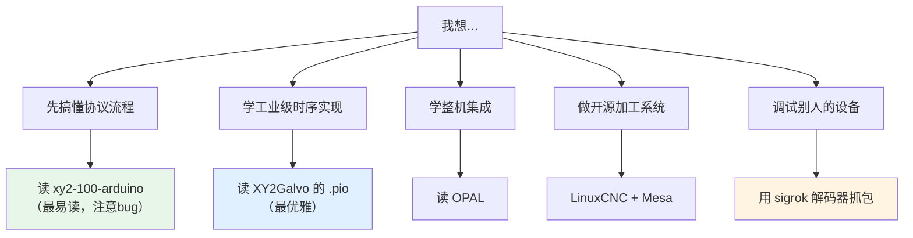

# 💻 开源项目清单

> [!success] 四个仓库已下载到本地
> 见 `99-附件与下载/代码/`，**离线可读，不依赖 GitHub 可访问性**。
> 详细代码导读见 [[02-硬件实现篇/06-开源参考实现导读]]。

---

## 1. ⭐ 已下载的四个（重点）

### ① sigrok 协议解码器 ⭐⭐⭐⭐⭐

| 项目 | 信息 |
|---|---|
| 仓库 | sigrokproject / libsigrokdecode |
| 路径 | `decoders/xy2-100/` |
| 语言 | Python |
| 本地位置 | `99-附件与下载/代码/sigrok-xy2-100-decoder/` |
| 在线 | https://sigrok.org/wiki/Protocol_decoder:Xy2-100 |
| 源码 | https://raw.githubusercontent.com/sigrokproject/libsigrokdecode/master/decoders/xy2-100/pd.py |

**为什么最权威**：它是**接收端**实现，被 PulseView 广泛使用，经过大量真实设备验证。

**关键贡献**：
- 确认**数据在 CLK 下降沿采样**
- 确认**偶校验覆盖前 19 位**（不是 16 位）
- 识别 16 位 / 18 位 / 命令帧三种类型

> [!tip] 💡 实用场景
> ¥20 逻辑分析仪 + PulseView = **一秒读出振镜收到的每一帧数值**，
> 自动检查校验位。这是调试 XY2-100 最强的工具。

### ② XY2Galvo（RP2040 PIO）⭐⭐⭐⭐⭐

| 项目 | 信息 |
|---|---|
| 仓库 | earlynerd / XY2Galvo |
| 语言 | C++ / PIO 汇编 |
| 本地位置 | `99-附件与下载/代码/XY2Galvo-rp2040/` |
| 在线 | https://github.com/earlynerd/XY2Galvo |

**为什么最优雅**：
- 用 RP2040 的 **PIO 硬件状态机**生成精确波形，不受中断影响
- **side-set 机制**同时设置相邻的 P/N 引脚
- **双核分工**：core1 专职信号生成，core0 跑应用
- **用程序流跟踪奇偶校验**（PIO 没有 ALU，这是唯一办法）
- **第三个状态机仲裁 X/Y 同步**

**学习价值**：想理解"工业级实现怎么保证时序"，看这一份就够。

### ③ xy2-100-arduino ⭐⭐⭐（有 bug）

| 项目 | 信息 |
|---|---|
| 仓库 | georgemihaila / xy2-100 |
| 语言 | C++ (Arduino) |
| 本地位置 | `99-附件与下载/代码/xy2-100-arduino/` |
| 在线 | https://github.com/georgemihaila/xy2-100 |
| Arduino 官方库页 | https://docs.arduino.cc/libraries/xy2-100/ |

**优点**：**最容易读**，是理解协议流程的最佳入门材料。仓库内还附带了协议 PDF。

> [!danger] ⚠️ 但有三个缺陷（务必注意）
> 1. **校验位算错**：只对 16 位数据求异或，实际变成了整帧奇校验
>    （规范要求覆盖前 19 位）
> 2. **SYNC 时序不对**：在校验位之后才拉低，导致 SYNC 覆盖 20 位而不是 19 位
> 3. **达不到 2 MHz**（作者自己在 README 承认）
>
> **学思路可以，抄代码要改。** 详见 [[02-硬件实现篇/06-开源参考实现导读]]。

### ④ OPAL（G 代码 → XY2-100）⭐⭐⭐

| 项目 | 信息 |
|---|---|
| 仓库 | opengalvo / OPAL |
| 语言 | C |
| 本地位置 | `99-附件与下载/代码/OPAL-gcode-to-xy2-100/` |
| 在线 | https://github.com/opengalvo/OPAL |

**定位**：完整的 **G 代码 → XY2-100 输出**固件，适合学习"整机集成"。

- 测试振镜：SinoGalvo SG7110
- 激光：Synrad 48 系列 + SSR 控制

> [!warning] ⚠️ 两个注意点
> 1. **作者明确警告**：固件可能随时崩溃，导致振镜与激光处于**未知状态**
>    → 💡 激光设备必须有**独立硬件安全联锁**，不能只靠软件
> 2. **同样有校验位 bug**（只算 16 位）——说明这个坑很容易踩

---

## 2. 其他值得看的仓库

> [!warning] ⚠️ 以下来自搜索结果，**我未能验证仓库当前状态**
> （star 数、最后更新、是否归档）。使用前请自行检查。

### 逻辑分析仪解码器

| 项目 | 说明 |
|---|---|
| `danmcb/Saleae-XY2-100` | Saleae 解码器（GPL） |
| `earlynerd/XY2-100_HLA` | Saleae 高等级分析插件 |
| **sigrok `xy2-100`** | ⭐ 已下载，最权威 |

### MCU / FPGA 实现

| 项目 | 平台 | 说明 |
|---|---|---|
| `earlynerd/XY2Galvo` | RP2040 | ⭐ 已下载 |
| `Tuet/XY2_100` | Teensy | Teensy 4.x 实现 |
| `hyperchao0/qspi4xy2-100` | STM32 | QSPI + DMA，含 **KiCad 原理图** |
| `phychrax/embassy` | Rust | Embassy 异步框架 |
| `txpzyr/xy2_100` | ? | 待查 |
| `belikoff16/XY2-100-` | ? | 待查 |
| `galvoMC` | ? | 待查 |

### 完整系统

| 项目 | 说明 |
|---|---|
| `opengalvo/OPAL` | ⭐ 已下载，G 代码固件 |
| `Megatokio/Laseroids` | XY2Galvo 的灵感来源 |
| `georgemihaila/galvo-controller` | 串口收 G 代码 → 控制 XY2-100 |
| `NiklasHammerstone/GalvoStep` | 用**步进电机**做廉价振镜（含机械/电气图纸） |
| `NOBIC-NTU/MiniGalvoControl` | 小型振镜控制 |

### 运动控制平台集成

| 项目 | 说明 |
|---|---|
| **LinuxCNC `xy2mod`** | LinuxCNC 的 XY2-100 固件模块 |
| LinuxCNC `hostmot2` | Mesa 卡 FPGA 固件，支持 XY2-100 |
| Mesa 7i95T / 7i96 | 支持差分输出的运动控制卡 |

> [!note] LinuxCNC 路线的价值
> 如果你要做一个**开源的激光加工系统**（而不是产品），
> LinuxCNC + Mesa 卡是一条成熟路线。
> 相关讨论：
> - https://forum.linuxcnc.org/27-driver-boards/42011-xy2-100-protocol-and-pid-usage
> - https://forum.linuxcnc.org/27-driver-boards/56411-using-mesa-7i95t-for-laser-galvo-xy2-100-control

---

## 3. 四份代码横向对比

| 项目 | 位顺序 | 校验范围 | SYNC 19位 | 时钟 | 可上板 |
|---|---|---|---|---|---|
| **sigrok 解码器** | MSB first ✅ | **19 位 ✅** | ✅ | — | 接收端 |
| **XY2Galvo** | MSB first ✅ | 19 位 ✅ | ✅ | 8MHz→2MHz ✅ | ✅ |
| **xy2-100-arduino** | MSB first ✅ | ❌ 只 16 位 | ❌ 覆盖20位 | ⚠️ <2MHz | ⚠️ 仅实验 |
| **OPAL** | MSB first ✅ | ❌ 只 16 位 | ⚠️ 待核 | ⚠️ | ⚠️ |

> [!important] 有意思的观察
> **两个发送端实现都犯了同样的校验位错误，而三个接收端实现都做对了。**
>
> 💡 原因推测：接收端（解码器）需要处理真实设备的数据，
> 一旦算错就会解码失败，所以被"逼"对了；
> 发送端如果遇到容错性强的振镜，错了也能跑，就一直没发现。
>
> **这提醒你：自己实现时务必用逻辑分析仪验证校验位。**

---

## 4. 怎么选一个开始读

---

## 5. 自己贡献

如果你想参与开源（对实习生是不错的经历）：

| 可以做的事 | 难度 |
|---|---|
| 给 sigrok 解码器提 bug/PR | ⭐⭐ |
| 给 xy2-100-arduino **修校验位和 SYNC 的 bug** | ⭐⭐ ⭐ 推荐 |
| 写一个 FPGA（Verilog）开源实现 | ⭐⭐⭐ |
| 翻译中文文档 | ⭐ |

> [!tip] 💡 一个具体的机会
> **`georgemihaila/xy2-100` 的校验位和 SYNC 时序确实有 bug**
> （已用三个独立解码器验证）。
> 给它提一个修复 PR，是很好的入门贡献——**有明确的技术依据，容易通过**。

---

## ✅ 自检

- [ ] 知道四个已下载仓库各自的价值
- [ ] 记得 sigrok 解码器为什么最权威
- [ ] 知道两个发送端实现共同的校验位 bug
- [ ] 知道想学什么该读哪一份
- [ ] 会用 PulseView + ¥20 分析仪调试

---

## 📖 依据

> [!quote] 出处
> - 四个已下载仓库的代码分析基于**本地实际源码**（非搜索摘要）
> - 校验位应为 19 位的结论：sigrok + danmcb-Saleae + earlynerd-HLA **三个独立解码器交叉验证**
> - 其余仓库信息来自搜索引擎返回，**未经仓库状态验证**

---

## 🔗 相关

- 上一篇：[[04-资源库/02-在线课程与视频]]
- 下一篇：[[04-资源库/04-论文书籍]]
- 代码导读：[[02-硬件实现篇/06-开源参考实现导读]]
- 抓包调试：[[03-调试与排错篇/02-逻辑分析仪抓包]]
- 回到入口：[[🏠 开始这里]]
