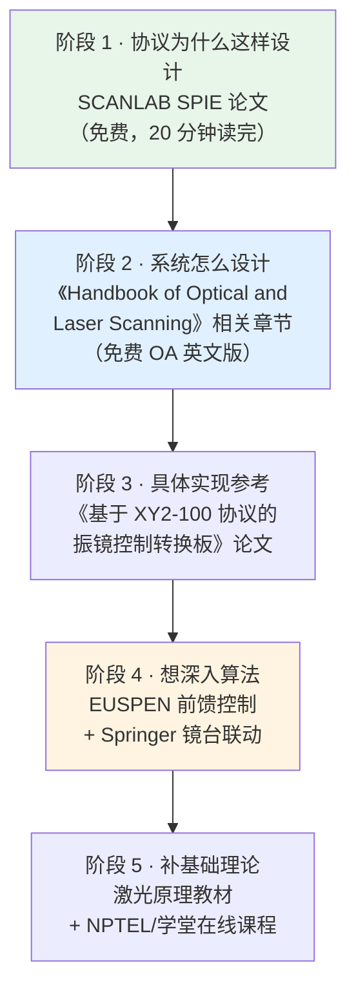

# 📖 论文与书籍

> [!success] 已下载的学术资料
> | 文件 | 类型 |
> |---|---|
> | `SCANLAB_SPIE_Digital_Servo_Amplifiers.pdf` | ⭐ SPIE 会议论文 |
> | `EUSPEN_Galvo_Feedforward_Control.pdf` | ⭐ EUSPEN 论文 |
> | `Springer_Galvo_Linkage_Control_OA.pdf` | OA 期刊论文 |
> | `Handbook_Optical_Laser_Scanning_Preview.pdf` | 书籍试读 |
>
> 都在 `99-附件与下载/pdf/`

---

## 一、⭐ 必读的一本书

### 《Handbook of Optical and Laser Scanning》第 2 版

| 项目 | 信息 |
|---|---|
| 主编 | Gerald F. Marshall、Glenn E. Stutz |
| 出版社 | CRC Press / Taylor & Francis |
| 版次 | 2nd Edition |
| **英文版** | ✅ **开放获取（OA）免费** |
| **中文版** | 《光学和激光扫描技术手册（原书第2版）》 |

> [!success] 🎉 有一个重要的免费资源
> **英文原版在 Taylor & Francis 上是开放获取（OA）的，可以合法免费下载：**
> https://www.taylorfrancis.com/books/oa-edit/10.1201/9781315218243/handbook-optical-laser-scanning-glenn-stutz-gerald-marshall
>
> 备用入口（Archive.org）：https://archive.org/details/oapen-20.500.12657-41669
>
> **这是本领域最权威的参考书**，前身是 1985 年的 *Laser Beam Scanning*。

### 中文版信息

| 项目 | 信息 |
|---|---|
| 书名 | **《光学和激光扫描技术手册（原书第2版）》** |
| **ISBN** | **9787111594949** |
| 出版社 | 机械工业出版社 |
| 出版时间 | 2018-08 |
| 页数 | **552 页** / 88.9 万字 |
| 译者 | **周海宪**（清华大学金国藩院士弟子） |
| 定价 | ¥179 |

> [!note] 内容概览
> 汇集美、英、日等国 **26 位专家**的研究成果，涵盖：
> - 光束偏转控制基础
> - 图像保真度与质量因素
> - 扫描器系统设计技术
> - **振镜扫描器**（与你的项目直接相关）
> - 共 16 类核心技术

> [!tip] 💡 给实习生的建议
> **先读免费的英文 OA 版**，重点看"Galvanometer Scanners"相关章节。
> 如果英文吃力，再考虑买中文版（¥179 不算贵，是长期投资）。

---

## 二、⭐ 已下载的论文

### 2.1 SCANLAB SPIE 论文（最重要）

| 项目 | 信息 |
|---|---|
| 标题 | *Advantages of digital servo amplifiers for control of a galvanometer scanner* |
| 来源 | SPIE 会议（2005-08） |
| 作者 | SCANLAB 官方 |
| 本地 | `SCANLAB_SPIE_Digital_Servo_Amplifiers.pdf` |
| **在线** | https://www.scanlab.de/sites/default/files/2020-06/2005-08_spie_meeting_digital_servo_amplifiers.pdf |

**为什么必读**：这是**数字伺服放大器设计方**的一手论述，讲清了：

- **为什么数字伺服取代了模拟伺服**
- "extended status messages"（扩展状态信息）的需求从何而来
- 工业激光加工的动力学要求

> [!warning] ⚠️ 但别说"协议的制定者"
> SCANLAB **不是** XY2-100 标准的制定方——
> 标准由 **LasIA** 以 **LIA202001** 发布（见 [[01-协议篇/01-XY2-100协议总览]] 第 0 节）。
> SCANLAB 自研的是 **SL2-100**（20 位，专有封闭协议）。
>
> 准确说法：**"XY2-100 标准的主要实现方之一"**。
> 这篇论文讲的是**数字伺服的技术动机**，不是协议条文的制定过程。

> [!success] 这是理解"XY2-100 为什么存在"的一手资料
> 比任何二手教程都权威——**它从厂商实现者的角度解释了数字化的动因**。

### 2.2 EUSPEN 前馈控制论文

| 项目 | 信息 |
|---|---|
| 标题 | *Modeling and feedforward control for high performance galvanometer scanners* |
| 来源 | EUSPEN |
| 本地 | `EUSPEN_Galvo_Feedforward_Control.pdf` |
| 在线 | https://www.euspen.eu/knowledge-base/PMC20111.pdf |

**内容**：考虑电机轴转动惯量、反射镜与编码器的**多自由度集中质量建模**，
为高性能扫描设计**前馈控制**。

**适合**：想做控制算法、想让振镜跑得更快的人。

### 2.3 Springer 镜台联动论文（OA）

| 项目 | 信息 |
|---|---|
| 标题 | *New linkage control methods based on trajectory distribution of galvanometer scanner* |
| 期刊 | International Journal of Advanced Manufacturing Technology |
| 本地 | `Springer_Galvo_Linkage_Control_OA.pdf` |
| 在线 | https://link.springer.com/article/10.1007/s00170-023-11743-0 |

**内容**：振镜 + 机械伺服系统**联动控制**，实现大范围高进给率激光加工。
这是 **IFOV（镜台联动）** 的学术版本。

**适合**：想突破振镜幅面限制、做大幅面加工的人。

---

## 三、中文期刊与学位论文

> [!note] 需要机构订阅（学校图书馆通常有）
> **知网（CNKI）/ 万方** 收录，学校 IP 一般可免费下载。

### ⭐ 主题直接命中的

| 标题 | 作者 | 说明 |
|---|---|---|
| **《基于 XY2-100 协议的振镜控制转换板的设计与实现》** | 王文毅、吕勇、陈青山、孔凡辉 | ⭐ **标题就直接命中你的项目**。以 TI DSP F2812 为核心，解决"多数控制板需连 PC 在 Windows 下工作"的痛点 |
| 《激光扫描振镜控制系统研究》 | 权晓（中北大学，2021） | ⭐ 建立数学模型，提出**双闭环控制**算法，Scilab/Xcos 仿真验证 |
| 《高速扫描振镜控制系统设计研究》 | — | 针对扫描频率、线性度、抗干扰特性 |

### 检索入口

| 平台 | 链接 |
|---|---|
| 中国优秀硕士学位论文全文数据库 | https://cn.oversea.cnki.net/kns55/brief/result.aspx?dbPrefix=CMFD |
| 中国知网国际版 | https://chn.oversea.cnki.net/ |
| 万方数据 | https://d.wanfangdata.com.cn/ |

**推荐检索词**：
```text
振镜 控制
XY2-100
激光扫描 振镜 伺服
振镜 校正 / 振镜 标定
振镜 双闭环
```

> [!tip] 💡 一个检索技巧
> 《基于 XY2-100 协议的振镜控制转换板》这篇的**参考文献列表**
> 本身就是很好的二次检索线索——列出了同主题的 FPGA 振镜控制器、
> 共聚焦显微镜振镜控制系统等论文。

---

## 四、其他相关论文

| 标题 | 来源 | 说明 |
|---|---|---|
| *Modelling and control of a galvanometer for laser marking* | IEEE Xplore（付费） | https://ieeexplore.ieee.org/document/7793217 |
| *Design of a new type of high-speed scanning galvanometer* | ScienceDirect（付费） | 高速扫描振镜结构设计 |
| 激光扫描控制系统设计与振镜校正技术资料合集 | CSDN 文库（付费） | 系统设计、失真与校正方法 |

---

## 五、激光/光学基础教材

> [!note] 想补激光物理基础看这些

| 书名 | 说明 |
|---|---|
| **《激光原理及应用》** 陈鹤鸣 主编 | ⭐ 知乎高赞推荐的入门教材 |
| 《激光原理》周炳琨 | 经典教材，理论性强 |
| 《光学》 | 波光学基础 |

**知乎推荐书单**：https://www.zhihu.com/question/53533969
（三本激光原理教材的特点对比与阅读顺序建议）

---

## 六、阅读路线建议



> [!tip] 💡 给实习生的优先级
> 如果时间有限，**只读阶段 1（SCANLAB SPIE 论文）**就够了——
> 它用 20 分钟就能让你理解整个协议的设计哲学，
> 这在和同事/厂商交流时非常有用。

---

## ✅ 自检

- [ ] 知道《Handbook of Optical and Laser Scanning》有免费 OA 英文版
- [ ] 记得中文版 ISBN 9787111594949
- [ ] 知道 SCANLAB SPIE 论文讲什么、为什么重要
- [ ] 会用知网检索"XY2-100"找相关论文
- [ ] 知道 IFOV（镜台联动）是什么

---

## 📖 依据

> [!quote] 来源
> - SCANLAB SPIE 论文为**官网免费 PDF**，已下载
> - EUSPEN 论文为**官方知识库免费 PDF**，已下载
> - Springer 论文为 **OA 开放获取**，已下载
> - 《Handbook of Optical and Laser Scanning》OA 状态来自 Taylor & Francis 页面
> - 中文版书目信息来自出版社/电商页面（ISBN、页数、译者）
>
> ⚠️ 中文期刊论文均需机构订阅，**我未能验证具体下载链接**。
> 建议通过学校图书馆的知网/万方入口检索标题。

---

## 🔗 相关

- 上一篇：[[04-资源库/03-开源项目清单]]
- 官方文档：[[04-资源库/01-官方文档索引]]
- 性能理论：[[02-硬件实现篇/05-更新率与振镜带宽匹配]]
- 标定：[[03-调试与排错篇/04-图形失真与标定]]
- 回到入口：[[🏠 开始这里]]
