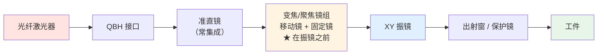
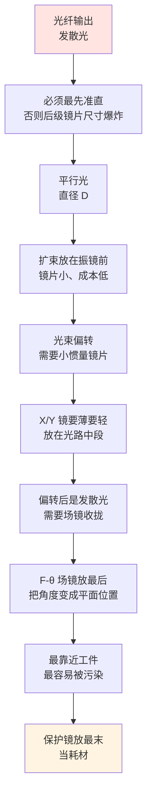

# 🔍 光路总览：从 3 轴到 5 轴

> [!info] 一句话版本
> **「5 轴振镜」在业界不是一个标准化术语**——至少 5 种互不兼容的用法。
> 但其中有一种是**技术上真正需要 5 个电机**的：**X/Y 扫描 + Z 调焦 + 2 轴光学变焦**。
> 厂商原话：*"True optical zooming would require a total of 5 axes."*
> 这篇先分清术语，再讲清两条光路架构和每一片镜片。

---

## 1. ⚠️ 先解决"5 轴"到底指什么

> [!danger] 这个词有五种用法，采购前必须问清
> | 说法 | 实际含义 | 电机数 |
> |---|---|---|
> | **RAYLASE「4D」** | XY + Z + **ZoomZ 光学变焦** | RAYLASE 自己叫 **4 轴** |
> | **RAYLASE「5 轴」** | 4D + 一路 **Extra Z / Auxiliary**（给相机/传感器对焦） | 5~6 |
> | **Aerotech AGV5D** | X,Y 定位 + Z 聚焦 + **A,B 进动**（控孔锥度） | **5** |
> | **Scanner Optics 五轴微加工** | 五轴用于加工直孔/倒锥孔 | **5** |
> | **PMDi "5-axis"** | **5 轴机械平台**（XYZ + A/C 回转）+ 3D 振镜 | 振镜只有 3 |
>
> **判定口诀**：看第 4、5 轴是**振镜电机**，还是**机械伺服轴**。
> 后者是"振镜 + 五轴机床"，和"五轴振镜"完全是两件事。

### 1.1 反直觉的一手证据

RAYLASE SP-ICE 3 控制卡手册把 **XY + Z + ZoomZ** 明确定义为 **4D（4 轴）**，
并解释了为什么"真变焦"才需要第 5 个轴：

> "Although 4D coordinates can be sent to the card, beam magnification (in the 4th dimension)
> is achieved by **defocusing**. **True optical zooming would require a total of 5 axes**,
> but the SL protocol is limited to 2 axes per connector."
> —— SP-ICE 3 User's Manual §7.1.1

**翻译成人话**：
- 只有 4 个轴时，"变光斑"只能靠**离焦**（把焦点挪出加工面来"看起来变粗"）——这是**劣化方案**
- 要做到**真正的光学变焦**（焦点不动、光斑变），必须再加一个可动镜组 → **第 5 个轴**

> [!important] 这就是"5 轴振镜"的技术根源 ⭐
> **5 个电机 = X/Y 扫描 + Z 调焦 + 2 个变焦镜组**
>
> 为什么变焦要 **2 个**电机？因为"改倍率"和"保焦点"是两个独立自由度：
> ```text
> 镜 1（移动，正焦距）：同时影响【焦点位置】和【成像倍率】
> 镜 2（移动，负焦距）：专门修正【成像倍率】
> 固定镜（正焦距）：收尾
> ```
> 专利 US 11,402,626 原文：
> *"allows **any possible combination** of the imaging ratio and the focal distance to be obtained…
> Therefore the operating beam can **always remain focused** on the work area."*
>
> **一句话**：只有 2 个可动镜片联动，才能做到「**焦点钉住不动，光斑随意变**」。

### 1.2 ⚠️ U/V 不是振镜的轴名

| 名称 | 实际是什么 |
|---|---|
| **U / W** | **XY3-100 标准的第 4/5 通道名**（DB25 上 X/Y/Z/U/W 五对差分线） |
| **U / V** | **激光切割机床的平板轴名**（与振镜无关） |

所以"5 轴 = X/Y/Z/U/V 五个振镜电机"这个说法**没有依据**。

---

## 2. 五个电机分别驱动什么

以 RAYLASE AM MODULE III 这类 **in-focus zoom** 架构为例：

| 轴 | 驱动对象 | 作用 | 关键指标（有实测值的） |
|---|---|---|---|
| **M1** | 变焦镜组第 1 片（可动） | 影响**焦点位置 + 倍率** | 移动速度 **900 mm/s** |
| **M2** | 变焦镜组第 2 片（可动） | 独立修正**倍率** | 同上 |
| **M3** | X 振镜 | 光束左右偏转 | 拖曳延迟 **0.23 ms** |
| **M4** | Y 振镜 | 光束上下偏转 | 同上 |
| **M5** | Z 聚焦镜组 | 改变焦距，补偿场曲 / 加工 3D 曲面 | 拖曳延迟 **1.1 ms** |

⚠️ **注意 M5 与 M1/M2 的分工会因架构而异**：在 SCANLAB varioSCAN II 这类
**单移动镜组**产品上，"改焦面"和"改光斑"是**耦合**的（一个电机同时干两件事）；
而在 in-focus zoom 架构里，靠**两个独立移动镜**把两者**解耦**。

### 2.1 ⚠️ 各轴延迟差近 5 倍——这是 5 轴最真实的麻烦

> [!danger] 一手数据
> | 轴 | 拖曳延迟 |
> |---|---|
> | XY 振镜 | **0.23 ms** |
> | 聚焦单元（Z / 变焦） | **1.1 ms** |
> | **差值** | **近 5 倍** |
>
> 来源：RAYLASE AM MODULE III 数据手册
>
> **控制卡怎么处理**：
> - RAYLASE SP-ICE 3：**逐轴**跟踪误差补偿（"Tracking Error compensation for all axes individually"）
> - SCANLAB RTC6：`set_timelag_compensation(HeadNoXY, TimelagXY, TimelagZ)`，单位 10 µs，
>   原理原文——**"Faster axes are held back towards the slower axes."**（**快的等慢的**）
>
> **这条命令的存在本身，就是"各轴延迟不一致"最权威的承认。**
>
> 💡 **工程含义**：5 轴系统的精度瓶颈**往往不在振镜**，而在**最慢的那个轴**。
> 选型时要把"最慢轴"的延迟写进加工节拍计算。

---

## 3. 两条光路架构（差别很大）

> [!important] 这是本篇第二个重点
> 同样是"动态聚焦"，**聚焦镜组放在振镜前面还是后面，是完全不同的架构**。

### 架构 A：Pre-scan（前置聚焦）—— 可以没有 F-θ 场镜



**代表产品**：RAYLASE AM-MODULE III、AXIALSCAN RD-14、SCANLAB varioSCAN II **PR 型**

**关键特点**（厂商原文）：
> "In contrast to a solution with an F-Theta lens, the laser is **focused in front of the scan mirrors**,
> allowing the **deflection angle to be fully utilized**."

- ✅ **没有 F-θ 场镜**——靠动态调焦做平场补偿
- ✅ 能**充分利用振镜全偏转角** → 幅面更大
- ✅ 光斑直径可连续调（1.0~2.0×），且**不离开焦面**

### 架构 B：Post-scan（后置场镜）—— 经典 2D + 动态聚焦


**代表产品**：SCANLAB varioSCAN II **FT 型**、excelliSHIFT、Novanta LIGHTNING II

⚠️ SCANLAB varioSCAN II 数据手册明确说明两种配置：
> "This results in two optics configurations: **Type FT (F-Theta)** or **Type PR (PRefocus)**
> … with or without an F-Theta objective."

**这是本库其余笔记默认的架构**（也是打标机最常见的）。

### 3.1 对比表

| | 架构 A：Pre-scan | 架构 B：Post-scan |
|---|---|---|
| **F-θ 场镜** | ❌ 不需要 | ✅ 需要 |
| 聚焦镜组位置 | 振镜**之前** | 振镜**之后** |
| 幅面利用率 | 高（全偏转角可用） | 受场镜限制 |
| 光斑调节 | 光学变焦（1.0~2.0×） | 变焦或离焦 |
| 复杂度 / 成本 | 高 | 较低 |
| 典型场景 | 增材制造、大幅面精密加工 | 打标、通用焊接 |

---

## 4. 完整光路：后置架构（架构 B）的镜片清单

```text
① 激光器/光纤 → ② 准直镜 → ③ 变焦扩束镜组 → ④ 折转镜(可选)
   → ⑤ X 振镜 → ⑥ Y 振镜 → ⑦ 动态聚焦镜组 → ⑧ F-θ 场镜
   → ⑨ 保护镜 → ⑩ 工件
```

**配套图**：`99-附件与下载/图片/5轴振镜光路图.svg`

### 逐片说明

| # | 镜片 | 作用 | 不给它会怎样 | 详见 |
|---|---|---|---|---|
| ② | **准直镜** | 把光纤输出的发散光变成平行光 | 后级全部失效 | [[05-光学篇/05-准直镜：光纤输出后第一片镜]] |
| ③ | **变焦扩束镜组** | 调光束直径 → 调光斑大小 | 光斑不可调 | [[05-光学篇/04-扩束镜与变焦扩束镜组]] |
| ④ | **折转镜** | 改变光路方向 | 只是省空间 | [[05-光学篇/01-振镜反射镜：X 镜与 Y 镜]] |
| ⑤⑥ | **X / Y 振镜** | 把光束偏转到任意角度 | 只能打一个点 | [[05-光学篇/01-振镜反射镜：X 镜与 Y 镜]] |
| ⑦ | **动态聚焦镜组** | 改焦距，补偿离焦 | 边缘打不实，曲面打不了 | [[05-光学篇/03-动态聚焦镜组（Z 轴）]] |
| ⑧ | **F-θ 场镜** | 角度 → 平面位移，线性化 | 边缘严重变形 | [[05-光学篇/02-F-θ 场镜（平场聚焦镜）]] |
| ⑨ | **保护镜** | 挡飞溅 | 场镜被污染 | [[05-光学篇/09-保护镜与窗口片]] |

> [!note] 💡 哪些元件可以省
> | 元件 | 能省吗 | 依据 |
> |---|---|---|
> | F-θ 场镜 | **能**（架构 A 用动态聚焦替代） | varioSCAN II："replace costly objectives for providing a plane focusing surface" |
> | 保护镜 | **不建议省**，形式可变 | RD-14 称 "Second protective glass"；准直模块用可更换保护窗 |
> | 独立准直模块 | **能**（振镜若已集成） | AM-MODULE III 有 "integrated collimating optics" |
> | 变焦镜组 | **能** | SP-ICE 3：没有变焦硬件时可用**离焦**近似 |
> | Z 轴动态聚焦 | **能**（退回 2D） | RTC6 的 z 输出需启用 Option "3D" |

### 还有几片"编外"镜片

| 镜片 | 装在哪 | 干什么 | 详见 |
|---|---|---|---|
| **λ/2 / λ/4 波片** | 准直后、振镜前 | 控制偏振（影响金属吸收与切割一致性） | [[05-光学篇/07-偏振元件（半波片、四分之一波片、PBS）]] |
| **合束镜 / 二向色镜** | 准直后、扩束前 | 指示光与工作光合束 | [[05-光学篇/08-合束镜与二向色镜]] |
| **分光取样镜** | 常在振镜后 | 在线功率监测 | [[05-光学篇/10-分光取样镜与在线功率监测]] |
| **光阑** | 扩束后 | 挡杂散光 | [[05-光学篇/11-光阑、杂散光与回光防护]] |
| **DOE / 轴锥镜 / 微透镜阵列** | 扩束后、振镜前 | 光束整形（分束、平顶、环形） | [[05-光学篇/06-光束整形元件（DOE、轴锥镜、微透镜阵列）]] |

---

## 5. 为什么每片镜片在那个位置



**三条硬约束**：
1. **镜片尺寸随光束直径走** → 越靠前光束越细、镜片越便宜 → "缩小的"尽量往前提
2. **振镜镜片越轻越快** → 振镜处希望光束别太粗；但细光斑又需要粗光束 → **变焦扩束存在的理由**
3. **场镜必须在最后一个偏转元件之后** → 它要做的是"把最终角度变成平面位置"

> [!warning] 架构 A 打破的正是第 3 条
> Pre-scan 架构把聚焦镜组挪到振镜**前面**，因此**不需要场镜**——
> 代价是聚焦镜组要接受**更粗的光束**（还没被振镜"分流"），镜片更大、成本更高。
> 这就是为什么架构 A 更贵，也是它主要用于增材制造等高价值场景的原因。

---

## 6. ⭐ 接口层面：XY2-100 其实只有 3 路

> [!danger] 这一条对用 XY2-100 的项目最关键
> **XY2-100 架构上只有 3 路（X / Y / Z），无法原生承载 5 轴。**

| 接口 | 轴数上限 | 带 5 轴的方式 | 备注 |
|---|---|---|---|
| **XY2-100** | **3**（X/Y/Z） | ❌ 做不到 | 需用 XY2-100 Adapter Board 扩展 |
| **XY2-100-E** | 3 | ❌ | 每轴独立数据通道 + 独立回传通道 |
| **XY3-100**（LasIA 标准） | **5**（X/Y/Z/**U/W**） | ✅ **DB25 单连接器五对差分线** | ⚠️ **DB15 变体只有 X/Y/Z，最多 3 轴** |
| **SL2-100** | **2 / 连接器** | ⚠️ 需**两根线** | 见下面的警告 |
| **RL3-100**（RAYLASE） | **6 / 连接器** | ✅ **单线** | "3D + Zoom + 第二 Z 轴也能单缆运行" |
| **GSBus**（Novanta） | 3 | ❌ | 24 bit |

> [!danger] SL2-100 的多轴陷阱
> 厂商手册原文：
> *"The SL2-100 protocol has **no third channel for the Z-Axis**, so the third channel is taken
> instead from the **X-channel of the second SL2 interface**… it can happen that the
> **Z-channel data is not updated synchronously** with the X- and Y-channels."*
>
> **后果**：Z 轴数据与 X/Y 不同步——**Z 会在已经关闭之后仍显示为"活动"**。
> 这是"多接口拼轴"架构的固有问题。

**结论**：
- **真正能"一根线带 5 轴"的只有 RL3-100（RAYLASE 专有）和 XY3-100（LasIA 公开标准，DB25 版）**
- 用 XY2-100 做 5 轴 → **必须多根线 + 跨接口同步补偿**
- **这条硬约束在选设备阶段就要问清**，否则后期无法实现

> [!note] 与协议篇的呼应
> XY2-100 的 CHANNELZ（Z 轴数据）在 DB25 的 5/18 脚，见 [[01-协议篇/02-帧结构详解]]。
> XY3-100 的 5 轴引脚与 CLK/SYNC 互换陷阱，见 [[01-协议篇/08-物理层与连接器]]。

---

## 7. 🔬 动手：把这条光路算一遍

> [!example] 🔬 练习 0.1 —— 从需求反推光路配置
> **需求**：1064 nm 光纤激光，纤芯 50 μm、NA 0.12，要打 110×110 mm，
> 光斑约 50 μm，工件是平面。
>
> **① 准直**
> ```text
> 取准直镜 f = 100 mm
> 准直后光斑 D = 2 × 100 × 0.12 = 24 mm
> 发散角 = 0.05 / 100 = 0.5 mrad
> ```
> ⚠️ 24 mm 已接近常见 Ø25 mm 准直组件的上限 → 要么换 D50 组件，要么把 f 降到 60~83 mm。
>
> **② 反推场镜焦距**
> ```text
> 振镜光学半角取 ±20° = 0.349 rad
> 由幅面：f ≥ 55 / 0.349 = 157.6 mm
> 由光斑：f ≤ 0.050 × D / (1.83 × 1.064e-3)
> ```
> → 选标准档 **f = 254 mm**（幅面够），然后用扩束把 D 调到合适值。
>
> **③ 决定要不要变焦扩束**
> ```text
> 若 f = 254 mm、直接用 D = 24 mm：光斑 = 20.6 μm ← 太细，效率低
> 若把光束缩到 D = 10.9 mm：光斑 = 49.9 μm ← 正好
> ```
> → 需要约 **0.45× 的缩束**（注意：高功率光纤激光常常需要**缩束**而不是扩束）。
>
> **④ 决定要不要 Z 轴**
> ```text
> 场曲估算 ≈ (55)² / (2×254) = 5.96 mm  💡
> 焦深 DOF = 8 × 1.064e-3 × 1.1 × (254/10.9)² / π = 1.58 mm
> 5.96 mm ≫ 1.58 mm → 边缘必然离焦，需要 Z 轴
> ```
>
> 复核：
> ```bash
> cd 05-光学篇/代码
> python optics_calc.py lens 1064 110 50 24 20
> python optics_calc.py curvature 254 110
> ```

---

## 8. ⚠️ 常见误解

| # | 说法 | 核查结果 |
|---|---|---|
| 1 | 5 轴振镜 = X/Y/Z/U/V 五个振镜电机 | ❌ 业界无此命名。**U/W 是 XY3-100 的通道名，U/V 是切割机床的轴名** |
| 2 | 5 轴振镜 = 3 轴振镜 + 5 轴平台 | ❌ 两回事。后者是 "5-axis **XYZ-AC stage** with a 3D galvo scanner" |
| 3 | 变焦和 Z 轴是同一个电机 | ⚠️ 在**单移动镜组**产品（如 varioSCAN II）上确实耦合；但 **in-focus zoom 架构用 2 个独立移动镜解耦**——这正是"5 轴"的理由 |
| 4 | 变焦靠离焦实现就行，不用加硬件 | ❌ RAYLASE 明确称离焦等效是**劣化方案**；环形/平顶光斑在离焦下**完全丢失形状** |
| 5 | 有 5 轴就一定用 5 根线 | ❌ RL3-100 单线 6 轴、XY3-100 DB25 单线 5 轴；反之 **SL2-100 带 3 轴就要两根线**且 Z 会不同步 |
| 6 | 5 轴就是 2D 振镜的简单升级，光路一样 | ❌ Pre-scan 架构**取消 F-θ 场镜**，聚焦镜组放到振镜**之前** |
| 7 | 所有 5 轴系统的第 4/5 轴用途相同 | ❌ 三种用途：① 光学变焦（ZoomZ）② 进动/锥度（A/B）③ 辅助 Z（相机对焦） |
| 8 | 5 个电机速度一样快 | ❌ 实测：XY 拖曳延迟 0.23 ms vs 聚焦单元 1.1 ms，**差近 5 倍** |

---

## ✅ 自检

- [ ] 能说出"5 轴"至少三种不同含义，以及怎么快速区分
- [ ] 知道 RAYLASE 把 XY+Z+变焦叫 **4D**，以及为什么"真变焦"要第 5 个轴
- [ ] 能解释变焦为什么需要 **2 个**电机
- [ ] 知道 U/W 是 XY3-100 的通道名，不是"轴 4/轴 5"
- [ ] 能说出 pre-scan 与 post-scan 架构的核心差别（有没有 F-θ 场镜）
- [ ] 知道 **XY2-100 只有 3 路**，做 5 轴必须多线并处理同步
- [ ] 知道各轴延迟可能差 5 倍，瓶颈在最慢的轴

---

## 📖 原厂依据

> [!quote] 来源
> - **「4D」定义与"真变焦需要 5 轴"**：RAYLASE SP-ICE 3 用户手册 §7.1.1 Scan Head Format Definitions
>   <https://www.raylase.de/en/products/electronics-control-cards/sp-ice-3.html>
>   （另载 "Controls 2-, 3-, 4- and 5-axis deflection units"）
> - **in-focus zoom 专利原文**：US 11,402,626 B2 "Deflector"（受让人 Raylase GmbH）
>   <https://patents.google.com/patent/US11402626B2/en>
>   （分类号 G02B15/142 + G02B7/04，佐证为真变焦而非调焦）
> - **AM MODULE III 光路顺序、延迟数据、变焦倍率 1.0–2.0×**：RAYLASE 数据手册 v3.0
>   <https://www.raylase.de/_Resources/Persistent/f/7/a/e/f7ae6ea7fe0b85465ca3d9a09ec0960c3d7aad95/2026-03-11_ds_AM-MODULE_III_EN_v3.0.pdf>
> - **pre-scan 架构与"无 F-θ 场镜"**：RAYLASE AXIALSCAN RD-14
>   <https://www.raylase.de/en/products/prefocusing-deflection-units/axialscan-rd-14.html>
> - **离焦 vs 光学变焦的对比（含"离焦是劣化方案"）**：RAYLASE 应用页
>   <https://www.raylase.de/en/applications/additive-manufacturing/in-focus-spot-magnificantion-in-additive-manufacturing.html>
> - **Type FT / Type PR 两种配置、Z 轴行程与跟踪误差**：SCANLAB varioSCAN II 数据手册
>   <https://www.scanlab.de/sites/default/files/2026-03/SCANLAB-varioSCANII-eBox-EN.pdf>
> - **excelliSHIFT 反射式 Z 轴（无透射元件）**：SCANLAB excelliSHIFT 数据手册
>   <https://www.scanlab.de/sites/default/files/2025-06/SCANLAB-excelliSHIFT-EN.pdf>
> - **准直模块与可更换保护窗**：SCANLAB Collimation Module
>   <https://www.scanlab.de/en/products/scan-components/collimation-module>
> - **`set_timelag_compensation` 与"快的等慢的"**：SCANLAB RTC6 手册
>   <https://www.scanlab.de/en/products/control-electronics/rtc-control-boards>
> - **AGV5D 五轴构成（X,Y,Z,A,B 进动）**：Aerotech 数据手册
>   <https://www.aerotech.com/wp-content/uploads/2021/01/agv5d-1.pdf>
> - **五轴微加工系统**：Scanner Optics
>   <https://www.scanneroptics.com/products/5-axis-laser-micro-machining-system/>
> - **「5 轴机械平台 + 3D 振镜」的区分**：PMDi Infinite Field of View
>   <https://pmdi.com/capabilities/infinite-field-of-view/>
> - **XY3-100 DB25 五对差分线；DB15 变体最多 3 轴**：LasIA LIA202307 v1.1
>   <https://sourceforge.net/p/lasia/blog/2023/07/xy3-100-digital-scanner-interface-version-11/>
> - **LIGHTNING II 为 3 轴（非 5 轴）**：Novanta 产品页
>   <https://novanta.com/precision-manufacturing/product/lightning-ii-3-axis-scan-head/>
> - **振镜镜片大小顺序（X = small mirror，Y = big mirror）**：RAYLASE SS-III XY2-100-E 接口文档
>   <https://www.raylase.de/en/products/2-axis-deflection-unit/superscan-iie.html>
>
> ⚠️ **诚实声明（本库调研明确"未找到"的项）**：
> 1. **AM MODULE III 是否"共 5 个电机"，厂商手册未明写**——手册只给两组延迟指标；
>    专利可作旁证，但**不是产品级确认**。
> 2. **Novanta 无 5 轴产品的公开资料**——其 LIGHTNING II 官网只标 **3-Axis**。
>    网上"LIGHTNING II + 变焦模块 = 5 轴"的说法**未找到官方依据**。
> 3. **"5 轴振镜"没有 ISO / IEC / 行业协会的规范定义**。
> 4. **SL2-100 无公开规范**（厂商专有）。
>
> 💡 标 💡 的数值（场曲估算、缩束建议、节拍影响）为按标准公式的推算或工程经验，
> **不是厂商规范**。轴行程与指标**以具体型号数据手册为准**。

---

## 🔗 相关

- 下一篇：[[05-光学篇/01-振镜反射镜：X 镜与 Y 镜]]
- 光斑与焦深怎么算：[[05-光学篇/13-光斑尺寸与焦深计算]]
- 选型决策流程：[[05-光学篇/14-镜片选型流程与配置清单]]
- Z 轴深挖：[[05-光学篇/03-动态聚焦镜组（Z 轴）]]
- 光学速查卡：[[07-速查卡/04-光学速查卡]]
- 光学篇入口 ← 你在这里
- 返回总入口：[[🏠 开始这里]]
