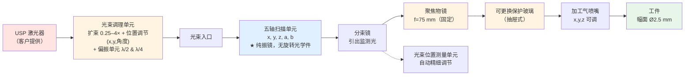
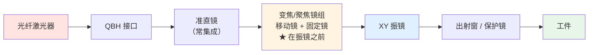
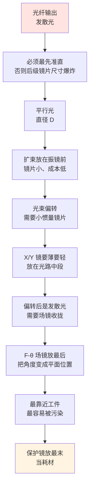

# 🔍 光路总览：从 3 轴到 5 轴

> [!info] 一句话版本
> **「5 轴振镜」在业界不是标准化术语**——至少五种互不兼容的用法。
> 本篇以 **SCANLAB precSYS** 为代表讲清最主要的一支：
> **5 个轴 = x, y, z 焦点三维定位 + a, b 入射角（AOI）控制**。
> 厂商规格表原文：`Axes: 5 factory calibrated axes (x, y, z coordinates and 2 incidence angles a, b)`
>
> 这篇先分清术语，再讲清这类系统的光路与镜片。

---

## 1. ⚠️ 先解决"5 轴"到底指什么

> [!danger] 这个词有五种用法，采购前必须问清
> | 说法 | 实际含义 | 电机数 |
> |---|---|---|
> | **SCANLAB precSYS** ⭐ | **x,y,z 焦点定位 + a,b 入射角**（纯振镜式，无旋转光学件） | **5** |
> | **Aerotech AGV5D** | X,Y 定位 + Z 聚焦 + **A,B 进动**（同类思路，第 4/5 轴同样控锥度） | **5** |
> | RAYLASE「4D」 | XY + Z + **ZoomZ 光学变焦**（靠改光斑，不控角度） | RAYLASE 自己叫 **4 轴** |
> | RAYLASE「5 轴」 | 4D + 一路 **Extra Z / Auxiliary**（给相机/传感器对焦） | 5~6 |
> | PMDi "5-axis" | **5 轴机械平台**（XYZ + A/C 回转）+ 3D 振镜 | 振镜只有 3 |
>
> **判定口诀**：看第 4、5 轴是什么
> - **控光束入射角** → 进动式（precSYS / AGV5D 这一类）← **本篇主线**
> - **改光斑大小** → 变焦式（RAYLASE 4D / 5 轴）
> - **是机械伺服轴** → 那是"振镜 + 五轴机床"，与"五轴振镜"是两件事

### 1.1 ⭐ precSYS 的 5 轴：为什么要控"入射角"

> [!important] 一句话：**因为孔的形状是由入射角决定的**
> 普通 2D 振镜只能让光束**垂直**（或近似垂直）打下来，所以只能打直孔、或靠环切做简单锥孔。
> precSYS 让光束**倾斜着**打，并且**在环切过程中连续改变倾角** →
> 就能做出**正锥（V 形）、倒锥（L 形）、零锥度直壁（II 形）**，且孔壁洁净无毛刺。
>
> 官方原文：
> *「precSYS 让你把焦斑 3D 定位到工件上，并**精确跟踪入射角（AOI）**。
> 可以同时改变**焦点运动轨迹、入射角与激光强度**。」*
>
> *「螺旋式加工配可定义的光束倾斜，可做出高质量的孔入口与出口——
> 洁净、无毛刺、无熔渣。由此可以做出**正锥、倒锥或理想圆柱形**的孔壁轮廓，且深径比高。」*

**5 个轴的分工**：

| 轴 | 作用 | 官方规格 |
|---|---|---|
| **x, y** | 焦斑在像场内的平面定位 | 理论定位分辨率 **17 nm**（1030 nm 型） |
| **z** | 焦斑沿光轴定位 | 焦程 **±1.0 mm**；最大速度 **10 mm/s** |
| **a, b** | **光束入射角（两个方向）** | **最大 AOI ±7.5°**；理论角分辨率 **2 µrad** |

### 1.2 ⭐ 关键：它**没有 F-θ 场镜**，也**没有变焦**

> [!danger] 这是与"变焦派 5 轴"最根本的差别
> | | precSYS（进动派） | RAYLASE AM-MODULE III 类（变焦派） |
> |---|---|---|
> | 第 4/5 轴 | **入射角 a, b** | 光学变焦（改光斑） |
> | 场镜 | ❌ **没有**，用**固定物镜**（f=75 mm） | ✅ 有 F-θ 场镜 |
> | 幅面 | **Ø2.5 mm**（打标 Ø5 mm） | 100+ mm |
> | 光斑 | Ø20 µm（1030 nm）/ Ø10.2 µm（515 nm） | 几十 µm 可调 |
> | 主要用途 | **微孔、切割、刻蚀**（USP 激光） | 大幅面打标/焊接/增材 |
>
> **两者的"5 轴"除了都叫 5 轴，几乎没有共同点。**
> 一个管**孔的形状**，一个管**光斑的大小**；一个幅面毫米级，一个幅面分米级。

**为什么 precSYS 不需要变焦**：它的工艺目标不是"改光斑"，而是"控角度"。
光斑大小由**物镜 + 光束调理单元**一次性定好（Ø8.2~20 µm），加工中不需要变。

### 1.3 术语澄清（沿用本库的其他口径）

| 名称 | 实际是什么 |
|---|---|
| **U / W** | **XY3-100 标准的第 4/5 通道名**（DB25 上 X/Y/Z/U/W 五对差分线） |
| **U / V** | **激光切割机床的平板轴名**（与振镜无关） |
| **`CHANNELZ`** | ⚠️ **不是厂商用词**，见 [[01-协议篇/02-帧结构详解]] |

所以"5 轴 = X/Y/Z/U/V 五个振镜电机"这个说法**没有依据**。

---

## 2. 五个电机分别驱动什么

### 2.1 主线：precSYS 的 5 个振镜轴

> [!important] 是**五个振镜电机**，不是"3 个振镜 + 2 个机械轴"
> 官方原文：*「precSYS 的专利技术，**首次**实现了稳定的、**纯振镜式（purely galvo-based）**的
> 5 轴微加工子系统」*；且 *「系统工作时**不使用任何旋转光学元件**」*。
>
> 实现方式：**高端振镜技术配小镜面转角与低运动质量** →
> 环切/进动频率可达 **≤650 Hz（39 000 rpm）**，且**伺服闭环稳定定位**。
>
> 💡 之所以能做到"纯振镜"，是因为**幅面只有 Ø2.5 mm**——
> 小角度、小镜子、高频率，正好落在振镜的强项区间。

| 轴 | 驱动什么 | 官方指标 |
|---|---|---|
| **x** | 焦斑平面定位（水平） | 理论分辨率 **17 nm** |
| **y** | 焦斑平面定位（垂直） | 同上 |
| **z** | 焦斑轴向定位 | 焦程 **±1.0 mm**，速度 **10 mm/s** |
| **a** | 光束入射角（一个方向） | 最大 **±7.5°**，分辨率 **2 µrad** |
| **b** | 光束入射角（正交方向） | 同上 |

**重复性**：像场内 **≤0.5 µm**（在 AOI −7.5°…+7.5°、Ø0.09~0.3 mm、
50~650 Hz、z −1…+1 mm 的 **6 小时**运行负载下测得的直径与圆度偏差）。

> [!note] 注意这个"5 轴"与"5 个独立光路"无关
> 5 个轴是**同一条光束**的 5 个自由度，不是 5 束光。
> 这也解释了为什么它能保持**偏振**且**结构紧凑**。

### 2.2 ⭐ 自校准：用这 5 个轴把自己调回零位

> [!important] precSYS 的一个独特设计（厂商称 Automatic Fine Adjustment）
> 光路里有一片**分束镜**，把一小部分光引到**光束位置测量单元**。
> 光束位置一旦超出应用容差，软件就用**系统内部这 5 个振镜轴**
> 把光束**调回原始零位**。
>
> 官方原文：*「如果光束位置超出应用容差，可用软件把光束重新调回其原始零位——
> **通过系统内部的五个振镜轴**（regulation via system-internal galvo axes）。」*
>
> **工程意义**：激光器到工件之间的光路漂移（热漂移、机械漂移）
> **不需要人工调光路**，系统自己用振镜补偿掉。
> 这是"5 轴"带来的一个**额外好处**——多出来的自由度可以拿来自校正。

### 2.3 对照：变焦派的 5 个电机（保留作对比）

以 RAYLASE AM MODULE III 这类 **in-focus zoom** 架构为例：

| 轴 | 驱动对象 | 作用 | 关键指标 |
|---|---|---|---|
| M1 / M2 | 变焦镜组两片可动镜 | 一片影响**焦点+倍率**，一片独立修正**倍率** | 移动速度 **900 mm/s** |
| M3 / M4 | X / Y 振镜 | 光束偏转 | 拖曳延迟 **0.23 ms** |
| M5 | Z 聚焦镜组 | 改焦距，补偿场曲/3D 曲面 | 拖曳延迟 **1.1 ms** |

> [!danger] 变焦派最真实的麻烦：各轴延迟差近 5 倍
> | 轴 | 拖曳延迟 |
> |---|---|
> | XY 振镜 | **0.23 ms** |
> | 聚焦单元（Z / 变焦） | **1.1 ms** |
>
> 来源：RAYLASE AM MODULE III 数据手册
>
> **控制卡怎么处理**：
> - RAYLASE SP-ICE 3：**逐轴**跟踪误差补偿
> - SCANLAB RTC6：`set_timelag_compensation(HeadNoXY, TimelagXY, TimelagZ)`，
>   原理原文——**"Faster axes are held back towards the slower axes."**（**快的等慢的**）
>
> 💡 **对照 precSYS**：因为它的 5 个轴**全是振镜轴、指标同级**，
> 不存在"最慢的轴拖后腿"这个问题——这是"纯振镜式"的另一个好处。

---

## 3. 三条光路架构

> [!important] 这是本篇第二个重点
> 同样是"多轴"，**关键镜组放在哪、有没有场镜，是完全不同的架构**。

### 架构 ①：precSYS 式（进动 / 入射角控制）



**代表产品**：SCANLAB precSYS

**关键特点**：
- ✅ **没有 F-θ 场镜** —— 用**固定物镜**（f=75 mm，有效焦距 25 mm）
- ✅ **没有变焦** —— 光斑由物镜 + 光束调理单元一次定好
- ✅ 5 个轴**全是振镜轴**，指标同级，所以环切能到 **650 Hz**
- ✅ **密封 + 吹扫气（微正压）光路**，保证洁净度
- ✅ **保持偏振**，输出**圆偏振**
- ⚠️ 幅面只有 **Ø2.5 mm**（打标 Ø5 mm）——这是"能到 650 Hz"的代价

> [!note] 一个独特的自校准设计
> **分束镜 + 光束位置测量单元**构成闭环：光束位置超差时，
> 软件用**内部这 5 个振镜轴**把光束调回零位——**不用人工调光路**。
> 见本篇第 2.2 节。

### 架构 ②：Pre-scan（前置聚焦）—— 可以没有 F-θ 场镜



**代表产品**：RAYLASE AM-MODULE III、AXIALSCAN RD-14、SCANLAB varioSCAN II **PR 型**

**关键特点**（厂商原文）：
> "In contrast to a solution with an F-Theta lens, the laser is **focused in front of the scan mirrors**,
> allowing the **deflection angle to be fully utilized**."

- ✅ **没有 F-θ 场镜**——靠动态调焦做平场补偿
- ✅ 能**充分利用振镜全偏转角** → 幅面更大
- ✅ 光斑直径可连续调（1.0~2.0×），且**不离开焦面**

### 架构 ③：Post-scan（后置场镜）—— 经典 2D + 动态聚焦


**代表产品**：SCANLAB varioSCAN II **FT 型**、excelliSHIFT、Novanta LIGHTNING II

⚠️ SCANLAB varioSCAN II 数据手册明确说明两种配置：
> "This results in two optics configurations: **Type FT (F-Theta)** or **Type PR (PRefocus)**
> … with or without an F-Theta objective."

**这是打标机最常见的架构**，也是本库其余笔记默认的架构。

### 3.1 三条架构对比

| | ① precSYS 式（进动） | ② Pre-scan（前置聚焦） | ③ Post-scan（后置场镜） |
|---|---|---|---|
| **F-θ 场镜** | ❌ 用固定物镜 | ❌ 不需要 | ✅ 需要 |
| 第 4/5 轴的作用 | **控入射角 (a, b)** | 光学变焦 | （无第 4/5 轴） |
| 关键镜组位置 | 振镜**之后**（物镜） | 振镜**之前** | 振镜**之后** |
| 幅面 | **Ø2.5 mm** | 大（全偏转角） | 受场镜限制 |
| 光斑 | 固定（Ø8~20 µm） | 可调（1.0~2.0×） | 可调或离焦 |
| 典型场景 | **微孔 / 切割 / 刻蚀** | 增材、大幅面精密 | 打标、通用焊接 |

> [!warning] ⚠️ 别把架构 ① 与 ② 混为一谈
> 两者都"没有 F-θ 场镜"，但原因完全不同：
> - 架构 ① 物镜在**振镜之后**，只是它**不负责平场**（幅面小到不需要）
> - 架构 ② 聚焦镜组在**振镜之前**，靠**动态调焦**替代平场
>
> 判据：看"没有场镜"之后，**聚焦元件在振镜前还是后**。

---

## 4. 完整光路与镜片清单

### 4.1 架构 ①（precSYS 式）的镜片清单

```text
激光器 → ⑪光束调理单元[扩束0.25–4× + 位置调节(x,y,角度) + λ/2 + λ/4]
       → ⑫五轴扫描单元(x,y,z,a,b 五个振镜轴)
       → ⑬分束镜 → ⑭聚焦物镜(f=75mm) → ⑮保护玻璃 → ⑯加工气喷嘴 → 工件

       ⑬分束镜 旁路 → ⑰光束位置测量单元（自动精细调节闭环）
       （可选）过程监测：⑱分束镜 + ⑲相机物镜（880nm±10）
```

| # | 镜片 / 组件 | 作用 | 详见 |
|---|---|---|---|
| ⑪ | **光束调理单元** | 扩束 **0.25×~4×**、发散角可调、**位置调节（x, y, 角度）**、（可选）**λ/2 + λ/4 波片**调圆偏振 | [[05-光学篇/04-扩束镜与变焦扩束镜组]]、[[05-光学篇/07-偏振元件（半波片、四分之一波片、PBS）]] |
| ⑫ | **五轴扫描单元** | x,y,z 焦点定位 + a,b 入射角；纯振镜式 | 本篇第 2.1 节 |
| ⑬ | **分束镜** | 引出监测光（自动精细调节 / 过程监测） | [[05-光学篇/10-分光取样镜与在线功率监测]] |
| ⑭ | **聚焦物镜**（f=75 mm） | 会聚到工件；**不是 F-θ 场镜** | [[05-光学篇/02-F-θ 场镜（平场聚焦镜）]]（对比看差异） |
| ⑮ | **保护玻璃**（抽屉式，可更换） | 挡飞溅，快换 | [[05-光学篇/09-保护镜与窗口片]] |
| ⑯ | **加工气喷嘴**（x,y,z 可调） | 工艺气体，最大 6 bar | — |
| ⑰ | **光束位置测量单元** | 闭环自校准，用 5 个振镜轴回零 | 本篇第 2.2 节 |
| ⑱⑲ | **相机物镜 + 适配器**（可选） | 过程监测，观测波长 880 nm±10 | — |

> [!note] 架构 ① 特有的一点：**光路是密封 + 吹扫气（微正压）**
> 官方原文：「密封、充气的光学光路（过压）保证即使在恶劣工业条件下也有最佳洁净度
> ——从而提高系统寿命与加工精度。」
> 这比单纯加保护镜更彻底：**整条光路都在正压洁净环境里**。

### 4.2 架构 ③（后置场镜）的镜片清单

```text
① 激光器/光纤 → ② 准直镜 → ③ 变焦扩束镜组 → ④ 折转镜(可选)
   → ⑤ X 振镜 → ⑥ Y 振镜 → ⑦ 动态聚焦镜组 → ⑧ F-θ 场镜
   → ⑨ 保护镜 → ⑩ 工件
```

**配套图**：`99-附件与下载/图片/5轴振镜光路图.svg`

### 逐片说明

| # | 镜片 | 作用 | 不给它会怎样 | 详见 |
|---|---|---|---|---|
| ② | **准直镜** | 把光纤输出的发散光变成平行光 | 后级全部失效 | [[05-光学篇/05-准直镜：光纤输出后第一片镜]] |
| ③ | **变焦扩束镜组** | 调光束直径 → 调光斑大小 | 光斑不可调 | [[05-光学篇/04-扩束镜与变焦扩束镜组]] |
| ④ | **折转镜** | 改变光路方向 | 只是省空间 | [[05-光学篇/01-振镜反射镜：X 镜与 Y 镜]] |
| ⑤⑥ | **X / Y 振镜** | 把光束偏转到任意角度 | 只能打一个点 | [[05-光学篇/01-振镜反射镜：X 镜与 Y 镜]] |
| ⑦ | **动态聚焦镜组** | 改焦距，补偿离焦 | 边缘打不实，曲面打不了 | [[05-光学篇/03-动态聚焦镜组（Z 轴）]] |
| ⑧ | **F-θ 场镜** | 角度 → 平面位移，线性化 | 边缘严重变形 | [[05-光学篇/02-F-θ 场镜（平场聚焦镜）]] |
| ⑨ | **保护镜** | 挡飞溅 | 场镜被污染 | [[05-光学篇/09-保护镜与窗口片]] |

> [!note] 💡 哪些元件可以省
> | 元件 | 能省吗 | 依据 |
> |---|---|---|
> | F-θ 场镜 | **能**（架构 ② 用动态聚焦替代；架构 ① 幅面小到不需要） | varioSCAN II："replace costly objectives for providing a plane focusing surface" |
> | 保护镜 | **不建议省**，形式可变 | RD-14 称 "Second protective glass"；准直模块用可更换保护窗；precSYS 是抽屉式可更换保护玻璃 |
> | 独立准直模块 | **能**（振镜若已集成） | AM-MODULE III 有 "integrated collimating optics" |
> | 变焦镜组 | **能** | SP-ICE 3：没有变焦硬件时可用**离焦**近似；precSYS 干脆不要变焦 |
> | Z 轴动态聚焦 | **能**（退回 2D） | RTC6 的 z 输出需启用 Option "3D" |
> | 分束镜 + 光束位置测量 | 架构 ① **不建议省** | 它承担**自动精细调节**闭环（用 5 个振镜轴回零） |

### 还有几片"编外"镜片

| 镜片 | 装在哪 | 干什么 | 详见 |
|---|---|---|---|
| **λ/2 / λ/4 波片** | 准直后、振镜前 | 控制偏振（影响金属吸收与切割一致性） | [[05-光学篇/07-偏振元件（半波片、四分之一波片、PBS）]] |
| **合束镜 / 二向色镜** | 准直后、扩束前 | 指示光与工作光合束 | [[05-光学篇/08-合束镜与二向色镜]] |
| **分光取样镜** | 常在振镜后 | 在线功率监测 | [[05-光学篇/10-分光取样镜与在线功率监测]] |
| **光阑** | 扩束后 | 挡杂散光 | [[05-光学篇/11-光阑、杂散光与回光防护]] |
| **DOE / 轴锥镜 / 微透镜阵列** | 扩束后、振镜前 | 光束整形（分束、平顶、环形） | [[05-光学篇/06-光束整形元件（DOE、轴锥镜、微透镜阵列）]] |

---

## 5. 为什么每片镜片在那个位置



**三条硬约束**（这是架构 ③ 的排布逻辑）：
1. **镜片尺寸随光束直径走** → 越靠前光束越细、镜片越便宜 → "缩小的"尽量往前提
2. **振镜镜片越轻越快** → 振镜处希望光束别太粗；但细光斑又需要粗光束 → **变焦扩束存在的理由**
3. **场镜必须在最后一个偏转元件之后** → 它要做的是"把最终角度变成平面位置"

> [!warning] 架构 ② 打破的正是第 3 条
> Pre-scan 架构把聚焦镜组挪到振镜**前面**，因此**不需要场镜**——
> 代价是聚焦镜组要接受**更粗的光束**（还没被振镜"分流"），镜片更大、成本更高。
> 这就是为什么架构 ② 更贵，也是它主要用于增材制造等高价值场景的原因。

> [!warning] 架构 ① 走的是另一条路
> precSYS 的物镜**在振镜之后**（符合第 3 条），但它**不承担平场任务**——
> 因为幅面只有 **Ø2.5 mm**，小到焦面弯曲可以忽略。
>
> 它把"第 4/5 个自由度"用在**控入射角**上，而不是控光斑。
> **代价与收益是一体的**：幅面小 → 镜面转角小 → 镜片轻 → 能做到 **650 Hz 环切**。
> 反过来，想要 100 mm 幅面，就不可能同时有 650 Hz 的进动。

---

## 6. ⭐ 接口层面：XY2-100 其实只有 3 路

> [!danger] 这一条对用 XY2-100 的项目最关键
> **XY2-100 架构上只有 3 路（X / Y / Z），无法原生承载 5 轴。**

| 接口 | 轴数上限 | 带 5 轴的方式 | 备注 |
|---|---|---|---|
| **XY2-100** | **3**（X/Y/Z） | ❌ 做不到 | 需用 XY2-100 Adapter Board 扩展 |
| **XY2-100-E** | 3 | ❌ | 每轴独立数据通道 + 独立回传通道 |
| **XY3-100**（LasIA 标准） | **5**（X/Y/Z/**U/W**） | ✅ **DB25 单连接器五对差分线** | ⚠️ **DB15 变体只有 X/Y/Z，最多 3 轴** |
| **SL2-100** | **2 / 连接器** | ⚠️ 需**两根线** | 见下面的警告 |
| **RL3-100**（RAYLASE） | **6 / 连接器** | ✅ **单线** | "3D + Zoom + 第二 Z 轴也能单缆运行" |
| **GSBus**（Novanta） | 3 | ❌ | 24 bit |

> [!danger] SL2-100 的多轴陷阱
> 厂商手册原文：
> *"The SL2-100 protocol has **no third channel for the Z-Axis**, so the third channel is taken
> instead from the **X-channel of the second SL2 interface**… it can happen that the
> **Z-channel data is not updated synchronously** with the X- and Y-channels."*
>
> **后果**：Z 轴数据与 X/Y 不同步——**Z 会在已经关闭之后仍显示为"活动"**。
> 这是"多接口拼轴"架构的固有问题。

**结论**：
- **真正能"一根线带 5 轴"的只有 RL3-100（RAYLASE 专有）和 XY3-100（LasIA 公开标准，DB25 版）**
- 用 XY2-100 做 5 轴 → **必须多根线 + 跨接口同步补偿**
- **这条硬约束在选设备阶段就要问清**，否则后期无法实现

> [!important] ⚠️ 但架构 ①（precSYS）**根本不走这些振镜协议**
> 这是一个重要的认知切换：
> - precSYS 对外是**以太网 / EtherCAT**（`DrillControl` GUI + `DrillServer` 跑在嵌入式 PC 上），
>   作业用 **XML** 定义，另带 `external job start/stop trigger`
> - 内部才是 **RTC6 控制卡 + 振镜**；5 个轴由 SCANLAB 自己闭环，
>   **用户不需要、也不能直接给 5 个轴写 XY2-100 帧**
>
> | | 架构 ②③（外购振镜自己搭） | 架构 ①（precSYS 这类成品子系统） |
> |---|---|---|
> | 你发的命令 | **XY2-100 帧**（每 10 µs 一帧） | **作业（XML / EtherCAT）** |
> | 谁管 5 轴协同 | **你**（+ 控制卡的补偿功能） | **厂商**（内部闭环 + 预校准） |
> | 精度由谁保证 | 你的时序与标定 | 出厂预校准 + 自动精细调节 |
>
> **所以"XY2-100 带不了 5 轴"这个问题，在架构 ① 里不存在**
> ——它压根不把 5 个轴暴露给用户。
> 代价是：工艺自由度受厂商软件约束，且无法自己改底层时序。

> [!note] 与协议篇的呼应
> XY2-100 的 Z 轴差分线（厂商称 `Z− / Z+` focus axis）在 DB25 的 **5/18 脚**，
> 与 X/Y **共用 CLK/SYNC、同一 20 bit 帧结构**——所以 Z 与 XY 在协议层天然同帧，
> **不存在独立的 Z 时间戳队列**。见 [[01-协议篇/02-帧结构详解]]。
>
> ⚠️ 本库早期笔记里写的 `CHANNELZ` **不是厂商用词**（未找到一手出处）：
> 规范用 `X+/Y+/Z+`（LasIA），RAYLASE 用 `Z−/Z+ (focus axis)`，
> SCANLAB 转换器侧只有 `CHAN1/CHAN2`（仅 2 路）。
>
> XY3-100 的 5 轴引脚与 CLK/SYNC 互换陷阱，见 [[01-协议篇/08-物理层与连接器]]。

---

## 7. 🔬 动手：把这条光路算一遍

> [!example] 🔬 练习 0.1 —— 从需求反推光路配置
> **需求**：1064 nm 光纤激光，纤芯 50 μm、NA 0.12，要打 110×110 mm，
> 光斑约 50 μm，工件是平面。
>
> **① 准直**
> ```text
> 取准直镜 f = 100 mm
> 准直后光斑 D = 2 × 100 × 0.12 = 24 mm
> 发散角 = 0.05 / 100 = 0.5 mrad
> ```
> ⚠️ 24 mm 已接近常见 Ø25 mm 准直组件的上限 → 要么换 D50 组件，要么把 f 降到 60~83 mm。
>
> **② 反推场镜焦距**
> ```text
> 振镜光学半角取 ±20° = 0.349 rad
> 由幅面：f ≥ 55 / 0.349 = 157.6 mm
> 由光斑：f ≤ 0.050 × D / (1.83 × 1.064e-3)
> ```
> → 选标准档 **f = 254 mm**（幅面够），然后用扩束把 D 调到合适值。
>
> **③ 决定要不要变焦扩束**
> ```text
> 若 f = 254 mm、直接用 D = 24 mm：光斑 = 20.6 μm ← 太细，效率低
> 若把光束缩到 D = 10.9 mm：光斑 = 49.9 μm ← 正好
> ```
> → 需要约 **0.45× 的缩束**（注意：高功率光纤激光常常需要**缩束**而不是扩束）。
>
> **④ 决定要不要 Z 轴**
> ```text
> 场曲估算 ≈ (55)² / (2×254) = 5.96 mm  💡
> 焦深 DOF = 8 × 1.064e-3 × 1.1 × (254/10.9)² / π = 1.58 mm
> 5.96 mm ≫ 1.58 mm → 边缘必然离焦，需要 Z 轴
> ```
>
> 复核：
> ```bash
> cd 05-光学篇/代码
> python optics_calc.py lens 1064 110 50 24 20
> python optics_calc.py curvature 254 110
> ```

---

## 8. ⚠️ 常见误解

| # | 说法 | 核查结果 |
|---|---|---|
| 1 | 5 轴振镜 = X/Y/Z/U/V 五个振镜电机 | ❌ 业界无此命名。**U/W 是 XY3-100 的通道名，U/V 是切割机床的轴名** |
| 2 | 5 轴振镜 = 3 轴振镜 + 5 轴平台 | ❌ 两回事。后者是 "5-axis **XYZ-AC stage** with a 3D galvo scanner" |
| 3 | **5 轴就是"能变光斑"** | ❌ 至少两支：**控入射角**（precSYS：x,y,z + a,b）与**控光斑**（RAYLASE：XY+Z+变焦）。**买之前必须问清第 4/5 轴是哪个** |
| 4 | 5 轴微加工一定需要旋转光学元件 | ❌ precSYS 是**纯振镜式**，官方原文 *"works without any rotary optics"*，靠小镜面转角 + 低运动质量做到 650 Hz |
| 5 | 5 轴系统的幅面都很大 | ❌ precSYS 幅面只有 **Ø2.5 mm**——**正是"小"才换来了 650 Hz** |
| 6 | 变焦靠离焦实现就行，不用加硬件 | ❌ RAYLASE 明确称离焦等效是**劣化方案**；环形/平顶光斑在离焦下**完全丢失形状** |
| 7 | 有 5 轴就一定用 5 根线 | ❌ RL3-100 单线 6 轴、XY3-100 DB25 单线 5 轴；反之 **SL2-100 带 3 轴就要两根线**且 Z 会不同步 |
| 8 | 5 轴子系统也要你自己发 5 轴指令 | ❌ precSYS 这类成品子系统对外是 **Ethernet/EtherCAT + XML 作业**，5 个轴由厂商内部闭环，**不暴露给用户** |
| 9 | 所有 5 轴系统的第 4/5 轴用途相同 | ❌ 三种用途：① **入射角/进动**（precSYS、Aerotech A/B）② 光学变焦（RAYLASE ZoomZ）③ 辅助 Z（相机对焦） |
| 10 | 5 个电机速度一样快 | ⚠️ 变焦派实测：XY 拖曳延迟 0.23 ms vs 聚焦单元 1.1 ms，**差近 5 倍**；<br>但 precSYS 这类**纯振镜式 5 轴指标同级**，没有这个短板 |

---

## ✅ 自检

- [ ] 能说出"5 轴"至少三种不同含义，以及怎么快速区分（看第 4/5 轴干什么）
- [ ] 知道 **precSYS 的 5 轴 = x,y,z 焦点定位 + a,b 入射角控制**
- [ ] 能解释**为什么控入射角**（做正锥/倒锥/零锥度直壁）
- [ ] 知道架构 ① **既没有 F-θ 场镜、也没有变焦**，用的是固定物镜 f=75 mm
- [ ] 知道架构 ① 幅面只有 Ø2.5 mm，而**小幅面正是 650 Hz 的前提**
- [ ] 知道架构 ① 对外是 **Ethernet/EtherCAT + XML 作业**，不走 XY2-100
- [ ] 知道 RAYLASE 把 XY+Z+变焦叫 **4D**，以及为什么"真变焦"要第 5 个轴
- [ ] 能说出三条架构的核心差别（场镜有无、第 4/5 轴作用、聚焦元件位置）
- [ ] 知道 **XY2-100 只有 3 路**，自建 5 轴必须多线并处理同步

---

## 📖 原厂依据

> [!quote] 来源
> - **⭐ precSYS 5 轴定义、轴构成、规格表**：SCANLAB precSYS 数据手册（02/2026）
>   <https://www.scanlab.de/sites/default/files/2026-03/SCANLAB-precSYS-EN.pdf>
>   - 规格表原文：`Axes: 5 factory calibrated axes (x, y, z coordinates and 2 incidence angles a, b)`
>   - 系统图 Legend：`Gas-purged 5-axis scan unit (x, y, z, incidence angles a, b)`
>   - 关键指标：AOI ±7.5°、进动 ≤650 Hz（39 000 rpm）、z 焦程 ±1.0 mm、
>     物镜 f=75 mm、光斑 Ø20 µm/Ø10.2 µm、脉冲能量 ≤300 µJ@1030、功率 ≤50 W
> - **precSYS 产品页（纯振镜式、无旋转光学件、自动精细调节）**：SCANLAB
>   <https://www.scanlab.de/en/products/advanced-scanning-solutions/precsys-micromachining-system>
> - **「4D」定义与"真变焦需要 5 轴"**：RAYLASE SP-ICE 3 用户手册 §7.1.1 Scan Head Format Definitions
>   <https://www.raylase.de/en/products/electronics-control-cards/sp-ice-3.html>
>   （另载 "Controls 2-, 3-, 4- and 5-axis deflection units"）
> - **in-focus zoom 专利原文**：US 11,402,626 B2 "Deflector"（受让人 Raylase GmbH）
>   <https://patents.google.com/patent/US11402626B2/en>
>   （分类号 G02B15/142 + G02B7/04，佐证为真变焦而非调焦）
> - **AM MODULE III 光路顺序、延迟数据、变焦倍率 1.0–2.0×**：RAYLASE 数据手册 v3.0
>   <https://www.raylase.de/_Resources/Persistent/f/7/a/e/f7ae6ea7fe0b85465ca3d9a09ec0960c3d7aad95/2026-03-11_ds_AM-MODULE_III_EN_v3.0.pdf>
> - **pre-scan 架构与"无 F-θ 场镜"**：RAYLASE AXIALSCAN RD-14
>   <https://www.raylase.de/en/products/prefocusing-deflection-units/axialscan-rd-14.html>
> - **离焦 vs 光学变焦的对比（含"离焦是劣化方案"）**：RAYLASE 应用页
>   <https://www.raylase.de/en/applications/additive-manufacturing/in-focus-spot-magnificantion-in-additive-manufacturing.html>
> - **Type FT / Type PR 两种配置、Z 轴行程与跟踪误差**：SCANLAB varioSCAN II 数据手册
>   <https://www.scanlab.de/sites/default/files/2026-03/SCANLAB-varioSCANII-eBox-EN.pdf>
> - **excelliSHIFT 反射式 Z 轴（无透射元件）**：SCANLAB excelliSHIFT 数据手册
>   <https://www.scanlab.de/sites/default/files/2025-06/SCANLAB-excelliSHIFT-EN.pdf>
> - **准直模块与可更换保护窗**：SCANLAB Collimation Module
>   <https://www.scanlab.de/en/products/scan-components/collimation-module>
> - **`set_timelag_compensation` 与"快的等慢的"**：SCANLAB RTC6 手册
>   <https://www.scanlab.de/en/products/control-electronics/rtc-control-boards>
> - **AGV5D 五轴构成（X,Y,Z,A,B 进动）**：Aerotech 数据手册
>   <https://www.aerotech.com/wp-content/uploads/2021/01/agv5d-1.pdf>
> - **五轴微加工系统**：Scanner Optics
>   <https://www.scanneroptics.com/products/5-axis-laser-micro-machining-system/>
> - **「5 轴机械平台 + 3D 振镜」的区分**：PMDi Infinite Field of View
>   <https://pmdi.com/capabilities/infinite-field-of-view/>
> - **XY3-100 DB25 五对差分线；DB15 变体最多 3 轴**：LasIA LIA202307 v1.1
>   <https://sourceforge.net/p/lasia/blog/2023/07/xy3-100-digital-scanner-interface-version-11/>
> - **LIGHTNING II 为 3 轴（非 5 轴）**：Novanta 产品页
>   <https://novanta.com/precision-manufacturing/product/lightning-ii-3-axis-scan-head/>
> - **振镜镜片大小顺序（X = small mirror，Y = big mirror）**：RAYLASE SS-III XY2-100-E 接口文档
>   <https://www.raylase.de/en/products/2-axis-deflection-unit/superscan-iie.html>
>
> ⚠️ **诚实声明（本库调研明确"未找到"的项）**：
> 1. **precSYS 内部 5 个振镜轴的逐轴独立规格**（各自行程/带宽/延迟）——数据手册只给系统级指标。
> 2. **precSYS 那个"有效焦距 25 mm"与"物镜焦距 75 mm"的换算关系**——手册并列给出但未解释口径。
> 3. **AM MODULE III 是否"共 5 个电机"，厂商手册未明写**——手册只给两组延迟指标。
> 4. **Novanta 无 5 轴产品的公开资料**——LIGHTNING II 官网只标 **3-Axis**。
> 5. **"5 轴振镜"没有 ISO / IEC / 行业协会的规范定义**。
> 6. **SL2-100 无公开规范**（厂商专有）。
>
> 💡 标 💡 的数值与推断（例如"小幅面是 650 Hz 的前提"）为工程解释，
> **不是厂商原话**。轴行程与指标**以具体型号数据手册为准**。

---

## 🔗 相关

- 下一篇：[[05-光学篇/01-振镜反射镜：X 镜与 Y 镜]]
- **precSYS 光路与镜片专题**：[[05-光学篇/16-precSYS 五轴微加工：进动架构与镜片]]
- 光斑与焦深怎么算：[[05-光学篇/13-光斑尺寸与焦深计算]]
- 选型决策流程：[[05-光学篇/14-镜片选型流程与配置清单]]
- Z 轴深挖（变焦派）：[[05-光学篇/03-动态聚焦镜组（Z 轴）]]
- 光学速查卡：[[07-速查卡/04-光学速查卡]]
- 光学篇入口 ← 你在这里
- 返回总入口：[[🏠 开始这里]]
