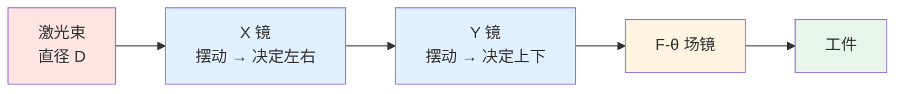
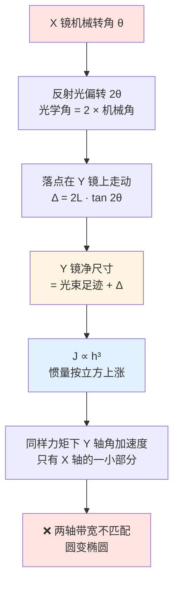

# 🔍 振镜反射镜：X 镜与 Y 镜

> [!info] 一句话版本
> 振镜反射镜（galvo mirror）是整条光路上**唯一会动的镜子**：X 镜、Y 镜各粘在一个有限转角电机的轴上，靠"转几度"把光束偏到任意方向。
> 它必须**又轻又薄**（否则转不快）、**又平又硬**（否则光斑变形）、**镀膜按大入射角设计**（否则功率白丢）——而"轻"和"平"天生打架。
> 其它镜片见 [[05-光学篇/00-光路总览：从 3 轴到 5 轴]]；XY2-100 决定**加速度剖面** → 角加速度 → 动态面型与胶层疲劳 💡。

---

## 1. 它的三个身份



| 身份 | 含义 | 忽略了会怎样 |
|---|---|---|
| **光学元件** | 面型 / 粗糙度 / 镀膜决定波前与反射率 | 光斑变形、功率损失、焦漂 |
| **运动部件** | 转动惯量 J 是伺服负载，决定加速度与带宽 | 振镜跟不上指令 → 图形失真 |
| **结构件** | 靠胶粘固定在电机轴上，承受往复角加速度 | 掉镜、崩边、两镜相撞 |

> [!important] **振镜镜片不是"随便买一块反光玻璃"，它是伺服环里的一个惯性负载。**
> 惯量、电磁力矩、反馈环阻尼共同决定系统的固有频率与稳定裕度；有限机械带宽使扫描器表现为**低通滤波器**，会衰减驱动信号的高频分量（Applied Physics B ✅）。**镜片换错，图形的高频细节先烂。**

![[光学-振镜反射镜角度.svg]]

---

## 2. 为什么镜片必须又轻又薄

```text
角加速度 α = M / J        α = 角加速度 (rad/s²)   M = 力矩 (N·m)   J = 转动惯量 (kg·m²)
```

M 由电机和功放给定（电流来自 [[02-硬件实现篇/04-差分驱动电路]]），**J 却是你选镜片时定的**。J 越大，同样力矩换来的角加速度越小 → 加速耗时越长 → 加工速度越低。

> [!danger] Aerotech 原话（一手）：**"heavier mirrors restrict the maximum angular acceleration and resulting processing speed"**
> ——更重的镜子**限制了可达的最大角加速度，以及由此决定的加工速度**。
> <https://go.aerotech.com/in-motion/how-to-choose-the-right-galvo-scanner-essential-selection-guide>

| 减重手段 | 说明 | 取证 |
|---|---|---|
| 减薄 + 边缘修形 / 蜂窝背板 | 20–30 mm 硅镜常减薄 + 边缘修形；SiC 镜用 honeycomb back 结构 | ⚠️ 二手 |
| 换低密度基材 | 铍 ρ = 1.85 g/cm³ 🟡；硅 ρ = 2.328 g/cm³ ✅ | 🟡/✅ |
| 改形状 | 行业默认**矩形薄镜**，按光斑足迹裁尺寸 | ⚠️ 二手 |

> [!warning] ⚠️ 厂商未公开：**动平衡（dynamic balancing）工艺与残余不平衡量指标**，本库检索**未找到任何公开来源**，只有"惯量 / 力矩 / 阻尼决定固有频率与稳定裕度"这条期刊结论（✅）。高速下振动、啸叫时**不要**把动平衡当成已知量去推算。

---

## 3. X 镜与 Y 镜不一样大——把理由算出来

[[00-入门篇/01-振镜是什么]] 已给出结论：**X 镜偏转时，光束在 Y 镜上的落点会移动，所以 Y 镜要更大**。这里把它加深成可计算的量。



```text
① 45° 足迹椭圆：沿入射面方向 = D / cos(AOI)，垂直方向 = D     D = 光束直径，AOI = 入射角
② X 镜造成的落点走动：Δ_pp = 2 · L · tan(2θ)                L = X 镜到 Y 镜距离，θ = X 镜机械半角
   走动方向 ⟂ Y 镜转轴 → 直接吃 Y 镜的有效高度
```

> [!example] 🔬 算例 3.1 —— Y 镜到底要大多少
> **已知**：D = 10 mm，AOI = 45°，L = 15 mm（💡 典型镜间距），X 镜机械半角 ±10°（光学 ±20°）。
> **① 足迹**：`10 / cos45° = 14.1 mm`（入射面方向）× `10 mm`（垂直方向）
> **② 落点走动**：`Δ_pp = 2 × 15 × tan20° = 10.9 mm`（即 ±5.46 mm）
> **③ Y 镜净尺寸需求**：沿走动方向 `14.1 + 10.9 = 25.0 mm`；垂直方向 ≥ 10 mm
> **④ X 镜**：只需覆盖**自己的足迹** 14.1 × 10 mm——落点走动发生在 Y 镜上，不在 X 镜上
> **⑤ 惯量代价**（同宽、同厚、同材料，`J ∝ h³`）：`J_Y / J_X ≈ (25.0 / 14.1)³ ≈ 5.6 倍`
> **结论**：Y 镜更大不是"贵一点"，是**惯量差 5 倍以上**，同样力矩下 Y 轴角加速度只有 X 轴的 1/5.6。
> 对策：L 做小（X 镜贴近 Y 镜）、控制扫描角、Y 镜减薄或换低密度基材 💡。实际产品两轴带宽看着接近，是因为厂商在**镜厚、基材、电机磁路**上给 Y 轴补了课——代价转移到**成本、发热和动态面型**，并没有消失 💡。

---

## 4. 基材：硅、熔融石英、SiC、ULE、Zerodur、铍

| 基材 | 密度 (g/cm³) | CTE (10⁻⁶/K) | 热导率 (W/(m·K)) | 定位 | 取证 |
|---|---|---|---|---|---|
| **单晶硅 Si** | **2.328** | 2.6 | **150** | ⭐ 通用打标 / 清洗 | ✅ |
| **熔融石英** | ⚠️ 未确认 | ≈ 0.5 | ⚠️ 未确认 | 高功率、短波（UV）、低吸收 | 🟡 |
| **碳化硅 SiC**（optoSiC+） | ⚠️ 未确认 | ⚠️ 未确认 | ⚠️ 未确认 | 高刚度、高谐振频率、动态面型最好 | ✅（厂商定性） |
| **ULE**（Corning 7972） | ⚠️ 未确认 | 0 ± 0.030（保证值） | 1.31 | 极低膨胀，静态精密光学血统 | ✅/🟡 |
| **Zerodur** | ⚠️ 未确认 | 六个等级；TAILORED ±0.020 | ⚠️ 未确认 | 同上，按等级供货 | ✅ |
| **铍 Be** | **1.85** | ⚠️ 未确认 | ⚠️ 未确认 | 最轻（E = 287 GPa、比刚度 164） | 🟡 |
| **铝 / 铜 / 钼** | — | — | — | CO₂ 镜常用铜和硅，另有铝镜 | 🟡 |

> 来源：硅 <https://ssd-rd.web.cern.ch/data/si-general.html>（✅）；铍 <https://www.photonics.com/Articles/Beryllium-Mirrors-Refinements-Enable-New/a25113>（🟡）；ULE <https://en.wikipedia.org/wiki/Ultra_low_expansion_glass>（🟡）+ 保证限值 <https://www.corning.com/media/worldwide/csm/documents/7f674d33bf65415991f66861245349d32.pdf>（✅）；Zerodur <https://media.schott.com/api/public/content/3395a24104204531be2839378a783e3d?v=bca70f55&download=true>（✅）。
> ⚠️ **本库未找到来源**：各基材**成本**的定量对比（❌ 只能定性说硅 "economical" ⚠️）；熔融石英 / ULE 的**密度**、Si / 石英 / ULE 的**弹性模量**（❌）。**因此本文不做 `E/ρ` 比刚度的定量对比。**

### 4.1 ⭐ 反直觉的一条：Coherent 说硅"热稳定性优于熔融石英"

> [!important] Coherent 官方：galvo 镜采用 **mirror-grade silicon substrates**，且 **"Greater thermal stability than fused silica substrates"**——热稳定性优于熔融石英基材。<https://www.coherent.com/optics/general-optics/lenses-mirrors/galvo-mirrors>
> **为什么反直觉**：熔融石英 CTE ≈ 0.5×10⁻⁶/K，硅是 2.6×10⁻⁶/K——**石英的热膨胀系数低 5 倍**。

> [!note] 💡 本库分析（非厂商原文）
> **① CTE 低只解决"整体温升不胀缩"，不解决"局部温度梯度"**，而镜面变形的主要驱动量是温度梯度：`硅 k = 150 W/(m·K)` ✅ vs `ULE k = 1.31 W/(m·K)` 🟡，**差约 115 倍**。局部吸收的热量在硅里瞬间摊开，在石英里堆在原地 → 石英的**局部面型变形**反而更大。
> **② "低密度 → 低惯量"这条在硅 vs 石英上不成立**：硅 ρ = 2.328 g/cm³ ✅；熔融石英密度本库**未从权威来源确认**（❌），常引的 💡 约 2.2 g/cm³ **比硅还低**。所以**硅相对石英的优势主要来自导热，不是密度**；"低密度降惯量"只对**铜、钼、不锈钢**这类金属基材成立。
> **③ 石英的真实优势在高功率与短波**：UV 低吸收、高 LIDT、更低热膨胀。中文厂商汇总也把硅定位成"轻量 + 导热 + 低成本"（通用打标/清洗）、石英定位成"高透 + 热稳定"（高功率焊接/精密检测）⚠️ 二手汇总。
> **结论**："石英比硅高级"**不成立**，两者是场景分工，不是等级关系。

---

## 5. 镀膜：银、金、介质、介质增强金

| 镀膜 | 反射率 | 波段 | 优点 | 缺点 | 取证 |
|---|---|---|---|---|---|
| **保护银** | R_avg > 98% | 450–2000 nm；2000–10000 nm | 可见-近红外最高；保护层防氧化、易清洁 | **仍会缓慢失泽**，湿度加速 | ✅ |
| **保护金** | > 96% 平均 | 800 nm – 20 µm | 中远红外首选；金本身不氧化 | 可见光（< 600 nm）反射率低 | ✅ |
| **介质高反 HR** | **可超 99.99%**，吸收 < 10 ppm | 带宽仅**中心波长 5–15%** | 吸收极低、LIDT 高 | **强角度依赖**，AOI 一变中心波长蓝移 | 🟡 |
| **介质增强金** | 金属膜基底 + 介质外覆层 | SCANLAB SCANcoat 1064-M | **大角度入射 + 宽带均匀** | 参数按型号定 | ✅ |

> 来源：保护银 <https://www.edmundoptics.com/ViewDocument/CURV_88542.pdf>（✅）；保护金 <https://www.thorlabs.com/newgrouppage9.cfm?objectgroup_id=744>（✅）；介质 HR <https://photonedgeoptics.com/coatings/hr-coatings/>（🟡）；SCANcoat 1064-M <http://www.apertureos.com/wp-content/uploads/2016/08/SCANcoat-1064-M-rev03.pdf>（✅）。另有一类**增强银**（超快用）：>98.5% 绝对反射率 @750–1000 nm，基本保留金属膜固有的低 GDD（✅）。

### 5.1 银为什么必须加保护层

> [!warning] 裸银是"性能最好、寿命最差"的选项
> **"propensity to oxidize over time"（随时间氧化的倾向）**；介质保护外覆层有帮助，但**最终仍会失泽（tarnish）**，而且**湿度等环境因素会加速这个过程** ⚠️ 二手镀膜厂商技术页 <https://advancedoptics.com/technical-optical-coating-data.html>。**保护银的定义**就是"银 + SiO₂ 保护外覆层防氧化"（Thorlabs ✅）<https://www.thorlabs.co.jp/protected-silver-mirrors-for-microscopy>。
> **含义**：① 银镜不是"装上就不管"的；② 高湿车间 / 无除湿机房寿命明显更短；③ 清洗不能磨掉保护层，见 [[05-光学篇/12-激光损伤阈值与光学件清洁维护]]。

### 5.2 介质膜的角度依赖：AOI 增大 → 中心波长蓝移

> [!danger] Laseroptik 原厂表述：**"With increasing angle of incidence (AOI) the central wavelength of a dielectric coating shifts to shorter wavelengths."**
> 入射角增大时，介质膜的中心波长**向短波漂移（蓝移）** <https://www.laseroptik.com/en/coating-guide/thin-film-basics/hr-standards>（✅ 一手机理）。

机理（💡 薄膜光学基本关系）：四分之一波长膜堆的高反条件里，每层等效厚度正比于**层内折射角余弦**；AOI 增大 → 层内折射角增大 → 余弦变小 → 满足高反的波长变短。

```text
1064 nm 设计中心 + 带宽 5%~15% → 高反平台只有约 53~160 nm 宽
AOI 从 0° 变到 45°，中心波长蓝移"几个百分点"（💡 量级估算）→ 几十 nm
→ 蓝移量足以吃掉平台一大块，甚至把工作波长推到高反平台之外
```

> [!important] 所以镀膜必须按**实际工作的 AOI 范围**设计，不能拿 0° 入射的标准 HR 片直接装。金属膜（银 / 金 / 介质增强金）的**宽带 + 角度不敏感**，正是它在大 AOI 场景无法被纯介质膜取代的原因。

### 5.3 按波长选镀膜

| 工作波长 | 推荐路线 | 为什么 | 注意 | 取证 |
|---|---|---|---|---|
| **1064 nm** | 介质 HR（SCANcoat 1064-H）或**介质增强金**（1064-M） | 介质吸收 <10 ppm 🟡 vs 金属吸收 2–15% 🟡 | 必须按 AOI 定制；**1064-H 与 1064-M 命名相近、机理不同**，勿混 | ✅ |
| **532 nm** | 介质 HR（1064-H 同时覆盖 1064 & 532） | 一片覆盖双波长 | 确认 AOI 范围 | ✅ |
| **355 nm** | **只有介质膜可行** | 金属膜在 UV 的反射率与 LIDT **双低**（期刊） | 基材用 UV 级熔石英；选 355-H / 355-Dxy 这类按 AOI 优化的型号 | ✅ / 期刊 |
| **10.6 µm** | **金膜 + 保护层**（硅基） | 金在远红外反射率高且不氧化 | 要同轴可见指示光时选**双波长镀膜** | ✅ |

10.6 µm 实例：金膜硅镜 **R > 99.6% @10.6 µm 且 R > 85% @650 nm**（后者供红光指示）<http://www.bri-elec.com/CO2-Laser-Scanning-Mirror-Galvo-Mirror-CO2-Laser-Mirror.html>（✅）；保护金 R > 97% @10.6 µm（⚠️ 渠道页）。Coherent 覆盖 **1.0–12.0 µm** 并提供 IR + 可见双波长镀膜（✅）。

---

## 6. ⚠️ 振镜镜片工作在很大的入射角下

本库推导、但极重要的一条：镜片不是垂直放着的，它**斜 45° 摆着，还在 ±十几度地摆**。

```text
AOI 范围 = 45° ± θ_mech      θ_mech = 镜片机械转角（半幅）
反射光偏转 = 2 × θ_mech      ← 这才是厂商标称的"光学角"
```

> [!danger] 最容易算错的一步：AOI 跟随的是**机械角**，不是光学角
> 镜面法线转 θ_mech，入射角就变 θ_mech；而光束偏转是 **2θ_mech**。**拿厂商标称的"光学角 ±20°"去算 AOI，会把 AOI 范围算大一倍。**

| AOI 窗口 / 设计点 | 数值 | 反推的机械角 | 取证 |
|---|---|---|---|
| Mersen optoSiC+ `opto-1064/532 R` 的 **LIDT 条件** | **27.5° – 55°** | 约 ±13.75° | ✅ |
| SCANLAB SCANcoat **355-Dxy 的优化设计点** | **45° 与 37.5°** | 约 0° 与 −7.5° | ✅ |
| 本库推导：机械 ±10° / ±20°（光学 ±20° / ±40°） | 35°–55° / **25°–65°** | ±10° / ±20° | 💡 推导 |

> [!important] 证据链：厂商确实在"按 AOI 定制"
> - **SCANLAB optoSiC `SCANcoat 355-Dxy`**：明确针对 **45° 与 37.5°** 两个 AOI 做高反优化 <https://optosic.de/wp-content/uploads/2022/12/2023-06-21-coat-355-Dxy.pdf>（✅）——一片镜片给出**两个 AOI 优化点**，说明 X 镜和 Y 镜的工作角本来就不同。
> - **`SCANcoat 1064-H`**：定位就是"大 AOI"介质膜 <https://intech-jp.com/spec_sheet/SCANcoat%201064-H%20rev03.pdf>（✅）；**`SCANcoat 355-H`**：低表面张力镀膜，**抑制镀膜引起的波前变形**，面向大 AOI 高功率 <https://www.apertureos.com/wp-content/uploads/2016/08/SCANcoat-355-H-rev02-.pdf>（✅）。
> - **选镜片时要问的不是"反射率多少"，而是"在我这个 AOI 范围、这个波长上，反射率和 LIDT 分别是多少"。**
>
> ⚠️ 厂商间的 AOI 口径也不统一：27.5°–55° 是**测试覆盖范围**、45°/37.5° 是**优化设计点**，不是同一套坐标；各家扫描头机械转角也不同（有的 ±7.5°，有的 ±20°）。**不要拿 A 家的 AOI 范围去套 B 家的镜片。**

---

## 7. 面型精度：λ/4 够不够？

面型（surface flatness）= 镜面相对参考平晶的**最大偏差**，用参考波长的分数表示 ⚠️（二手术语页）。

> [!important] 别再无脑追 λ/10、λ/20
> Edmund Optics 一手结论：面型做到 **λ/10 或更好**时 **"practically indistinguishable"**（实际效果几乎无法区分），**与镜片尺寸无关**；但要求 **λ/20** 时 **"additional analysis beyond just the mirrors in your system is likely warranted"**——瓶颈通常已不在镜片本身。<https://www.edmundoptics.com/knowledge-center/application-notes/optics/effects-of-laser-mirror-surface-flatness/>（✅）
> 商品镜也确实**多为 λ/4**：紫外熔石英 1064 nm 振镜镜片标 **1/4λ** ⚠️；硅基 CO₂ 镜标 **λ/4 @633 nm** ⚠️。**λ/4 是"够用档"，λ/10 是"高要求档"，λ/20 通常不是钱该花在镜片上的地方。**

**PV → RMS → Strehl 换算链**（💡 估算链，非厂商数据）：

```text
PV → RMS: λ/4 PV ≈ 0.07 λ RMS（离焦取值，亚利桑那大学课程讲义）    RMS → Strehl: S ≈ exp[−(2πσ)²]
σ = RMS 波前误差（波长分数），Marechal 近似
```

| 面型 PV | RMS σ | Strehl S | 峰值照度 | 含义 |
|---|---|---|---|---|
| **λ/4** | ≈ 0.07 λ | **≈ 0.82** | 掉约 **18%** | 仍在衍射极限内，能量重分布 + 旁瓣上升 |
| λ/10 | ≈ 0.028 λ | ≈ 0.97 | 掉约 3% | 与理想镜"几乎无法区分"（Edmund ✅） |
| λ/20 | ≈ 0.014 λ | ≈ 0.99 | 掉约 1% | 再提升要查系统其它环节 |

> [!warning] 关键读法：λ/4 **不是"光斑变大"**
> λ/4 面型 → 焦斑**峰值照度掉约 20%，但衍射极限包络宽度不变**，表现是**能量重分配 + 旁瓣 / 散射上升**。排错时看到"光斑变粗"，先怀疑热透镜、装调、光束质量，**别急着怪面型** 💡。

### 7.1 动态变形：90% 是线性斜像散

| 结论 | 来源 | 取证 |
|---|---|---|
| 动态镜面变形会 **"substantially degrade the performance of optical instruments using resonant scanners"** | PMC 全文 | ✅ |
| 电流计式扫描器的动态波前像差 **90% 由线性斜像散（oblique astigmatism）主导**；MEMS 扫描器则以水平彗差 30% + 斜三叶草 27% 为主 | 威斯康星大学 | ✅/🟡 |
| 测试对象：galvo 电机 + **碳化硅**镜基材，谐振 13.8 kHz；谐振式扫描器角加速度 ∝ 角位移，力矩**随扫描过程动态变化** | academia.edu / Semantic Scholar | 🟡 |
| 动态变形"静态化分析"的前提：**扫描频率远低于镜片自身最低谐振** | scispace | 🟡 |

> [!danger] 动态变形 ≠ 各向同性变大
> 焦斑会变成**斜着的椭圆 / 十字星**——形状不对称、能量重分布。现场判断：降低功率用感光纸或相机看焦斑，**若形状随扫描速度改变而改变**，那就是动态变形（镜片 / 伺服问题），不是镀膜或场镜问题 💡。镜片越薄、越大、角加速度越高，斜像散越严重——这正是第 8 节"最优厚度"存在的物理原因。

---

## 8. 厚度与惯量的权衡

> [!warning] 本节全部是**标度律推导，不是任何厂商的规范原文**。公式来自材料力学与结构动力学的基本关系，**指数与结论需自行验证**；但"存在最优厚度"与行业实践一致。

| | 效应（以厚度 t 减半为例） | 标度关系 | t 减半后 | 取证 |
|---|---|---|---|---|
| ✅ 收益 | 转动惯量 ↓ | `J ≈ ρ·w·h³·t/12` → **J ∝ t** | 约 **0.5×** | 💡 推导 |
| ❌ 代价 1 | 一阶谐振频率 ↓ | `f₁ ∝ (t/h²)·√(E/ρ)` → **f₁ ∝ t** | 约 **0.5×** | 💡 推导 |
| ❌ 代价 2 | 弯曲挠度 ↑ | `δ ∝ q·h⁴/(E·t³)` → **δ ∝ t⁻³** | 约 **8×**（指数见下） | 💡 推导 |
| ❌ 代价 3 | 镀膜应力致面型畸变 ↑ | 膜层应力 × 镜厚决定弯曲量 | 恶化 | 💡 推导 |
| ❌ 代价 4 | 加工 / 夹持难度、边缘崩缺风险 ↑ | — | 恶化 | 💡 |

```text
J ≈ ρ·w·h³·t/12   ρ = 密度  w = 沿转轴方向尺寸  h = 垂直转轴方向尺寸  t = 厚度
δ ∝ q·h⁴/(E·t³) 均布载荷 q 下的最大挠度（简支板）    f₁ ∝ (t/h²)·√(E/ρ) 一阶弯曲谐振频率
```

> [!note] ⚠️ 挠度指数的一个诚实补充：`δ ∝ t⁻³` 的前提是**载荷 q 固定**。若载荷本身随厚度线性变化（**自重、惯性力**都属于这种），代入 `q = ρ·t·a` 后指数降到 **t⁻²**：固定面载荷时 t 减半挠度 ×8，自重 / 惯性力时 ×4。**两者都是超线性代价，量级结论不变**，但做定量预算时要用对指数 💡。

**尺寸三选一的代价排序** ⭐（`J ∝ w · h³ · t`）：

```text
加 h（加高/加宽）→ 惯量 ∝ h³ ❌ 最贵，且不改善弯曲刚度
加 w（沿转轴加长）→ 惯量 ∝ w ⚠️ 中等，也不改善弯曲刚度
加 t（加厚）    → 惯量 ∝ t  ✅ 最划算，同时刚度 ∝ t³
```

> [!important] 一句话工程结论：**缺刚度、缺谐振频率时，先加厚，别加宽。** 加厚：惯量只涨 1 次方、刚度涨 3 次方；加高：惯量涨 3 次方、刚度几乎不涨。

> [!example] 🔬 算例 8.1 —— 从尺寸算到惯量
> **已知**：硅镜 20 × 30 × 1.0 mm，ρ(Si) = 2.328 g/cm³ ✅。
> **① 质量**：`V = 600 mm³ = 0.6 cm³` → `m = 2.328 × 0.6 = 1.397 g = 1.397e-3 kg`
> **② 绕面内轴的转动惯量**（h = 30 mm 为垂直转轴方向）：
> ```text
> J = (m/12)·(h² + t²) = (1.397e-3/12) × (0.030² + 0.001²) = 1.05e-7 kg·m² = 1.05 g·cm²
> ```
> **③ 减薄到 0.5 mm**：`J ≈ 0.50 × 1.05e-7`（收益只是线性的）；`f₁ × 0.5`（直接吃掉控制带宽）；挠度 ×4 ~ 8。
> **④ 交叉校验**：⚠️ 某渠道页给出的整机转动惯量是 **0.12×10⁻⁶ kg·m² = 1.2 g·cm²**（Sino-Galvo SG7110，口径未说明）。本库算出的**单是镜片**就有 1.05 g·cm²——**与整机量级相当**。
> **💡 结论：镜片往往贡献了总惯量的一大块**，所以"换一片更厚的镜片不会有事"是错的。
> **最优厚度由谁定界**：`f₁ ≫ 控制带宽` 与 `动态面型 ≤ λ/10 量级` 把厚度往下顶，`α = M/J` 把厚度往上顶 → 取满足前两条的最薄值；工程上通常由 **f₁（控制带宽）** 定界，而不是静力挠度 💡。镜片的 f₁ 是"指令 → 光斑位置"这条链路的硬上限之一，见 [[02-硬件实现篇/05-更新率与振镜带宽匹配]]。

---

## 9. 安装与胶合

振镜镜片**不是夹持的，是粘上去的**，这带来一整套只在光学装调里出现的失效模式。

| 结论 | 来源 | 取证 |
|---|---|---|
| 胶粘是光学元件装调的常用方案（**"adhesives can provide a particularly attractive solution"**） | Master Bond 案例 | ✅ |
| 胶层要经历**固化、热真空、后固化处理**，其固化 / 温度 / 压力 / 湿度的应力-应变行为会**导致镜面变形** | 期刊 | ✅ |
| 棱镜 / 平面镜 / 干涉仪用**低应力、低收缩 UV 胶**，以在粘接后**保持面型与角向** | 行业技术页 | 🟡 |
| **失效三分类**（Henkel LOCTITE 手册 ✅）：**界面失效** = 胶整片留在**一侧**、两侧残留斑块**互为镜像**；**内聚失效** = 胶**两边都有**、断在胶层内部；**基材失效** = 镜片或轴头**本体**破裂 | 现场读法 💡：界面→表面处理/底涂没做好；内聚→胶强度不够或胶层太厚；基材→应力集中或机械冲击 | ✅ |
| **差异热膨胀会在粘接界面引入应力**，使失效判断复杂化 | 胶粘技术页 | 🟡 |
| 环氧树脂泊松比约 0.3–0.7，对变形影响较小；**固化收缩低**是它被选作粘接材料的原因 | 期刊 | ✅ |

> [!warning] ⚠️ 本库未找到来源
> 1. 原厂（SCANLAB / RAYLASE / Novanta）公开发布的**胶合工艺规范、胶种型号、胶层热稳定性指标、掉镜 MTBF**——❌ 全部未找到。
> 2. **胶层老化 ↔ 具体光学现象**（面型变化多少、角漂多少）的定量对应——❌ 未找到。
> 3. **光学接触（optical contacting）**用于振镜镜片-电机轴装配的公开来源——❌ 未找到；镜片要承受高角加速度，光学接触通常只用于静态场合，**此处不做推测**。真实案例（说明胶种选择确实是返修点）：论坛实录中有用户用 **JB Weld 1 分钟快干环氧**自行粘接替换振镜镜片 ⚠️ 论坛来源。💡 **不要这么干**——快干环氧收缩大、固化应力大、耐温低，粘上去后面型基本是随机的。

---

## 10. 冷却：热源不只是光

> [!important] Aerotech 的一手拆解：连续高功率运行时**热源有两个**——① **振镜电机快速加减速本身发热**（不是激光！）；② 镜片与透镜吸收光能。内部温度波动使机械件胀缩 → **导致光学焦平面漂移**。<https://go.aerotech.com/in-motion/galvanometer-optical-scanners-for-industrial-laser-marking-machining>（✅）

| 方案 | 说明 | 取证 |
|---|---|---|
| **闭路水冷电机 + 扫描头外壳** | Aerotech AGV-HPO：水冷回路**串联**连接，出厂前做泄漏检测 | ✅ |
| **可选强制风冷镜片** | "optional forced-air mirror cooling"，**increases laser power handling** | ✅ |
| **商品水冷振镜** | 20 mm 孔径、面向 **2000 W** 连续光纤激光、标称 XY2-100 接口 | ⚠️ 渠道页 |

AGV-HPO 公开规格：**10 / 14 / 20 / 30 mm** 输入孔径；标准高反镀膜覆盖 **UV（<300 nm）至 CO₂（>10600 nm）**；数字位置分辨率 **>24 bit** ✅。

> [!danger] "水冷就够了"是错的
> Aerotech 是**两级**方案：水冷电机和外壳 **加** 强制风冷镜片——因为镜片在光路里，**电机的水冷回路管不到镜面**。而且即使完全不吸收激光，**电机加减速本身就在发热**：扫描越密、图形越复杂，发热越大。
> **现场现象**：连续加工几十分钟后**焦点慢慢漂移、打深变浅 / 焊缝变宽**。这不是"激光器功率掉了"，很可能是热致焦平面漂移 ✅。相关研究：30 kW 远程扫描系统的焦点漂移需要**实时补偿与控制**（Procedia CIRP ✅）；高功率切割头在 **>20–30 kW** 功率段，现有基材 / 镀膜**尚未优化**（WLT 会议 PDF ✅）。

---

## 11. LIDT 数据：**不同测试条件不可横比** ⚠️

| 产品 / 镀膜 | 标称 LIDT | 测试条件 | 取证 |
|---|---|---|---|
| Mersen optoSiC+ `opto-1064/532 R` | **>5 J/cm² @532 nm 和/或 >25 J/cm² @1064 nm** | **10 ns 单脉冲**，AOI **27.5°–55°** | ✅ |
| Materion Balzers Nd:YAG 线镜 | **>70 J/cm² @1064 nm** | **10 ns** 脉冲，R > 99.5%（s/p） | ✅ |
| CASTECH 振镜镜片 | ⚠️ **未公布数值** | 自建 **355 / 532 / 1064 nm @ 5 ns** 脉宽 LIDT 测试系统 | ✅ |
| SCANLAB SCANcoat 355-H | ⚠️ **未公开 LIDT 数值** | 低表面张力镀膜，抑制镀膜致波前变形，面向大 AOI 高功率 | ✅ |

> 来源：<https://intech-jp.com/spec_sheet/opto%201064-532%20R.pdf>、<https://www.materionbalzersoptics.com/userdata/pdf_files/obj-014-pe-1.pdf>、<https://www.castech.com/product/Galvo-Mirrors-234.html>、<https://www.apertureos.com/wp-content/uploads/2016/08/SCANcoat-355-H-rev02-.pdf>。

> [!danger] 这四行**没有一个可以直接对比**
> **① 脉宽不同**：10 ns vs 10 ns vs **5 ns**（脉宽越短、峰值功率越高，同样能量密度更容易打坏）；**② AOI 不同**：只有 Mersen 明确标了 27.5°–55°，其它家根本没标；**③ 单脉冲 vs 多脉冲**不是一个物理量，高重频下热积累会让阈值显著下降；**④ 光斑面积不同**，LIDT 有尺寸效应，大光斑更容易命中缺陷。
>
> **LIDT 测试本身没有统一标准**——ISO 21254-1:2011 只定义口径，不定义测试流程（展开见 [[05-光学篇/12-激光损伤阈值与光学件清洁维护]]）。**唯一正确的做法**：向厂商要**"你的波长 + 脉宽 + AOI 范围 + 重复频率"**下的数据，或自己按实际工况做破坏性试验 🔬。可比性较好的一条：Materion 金属膜扫描镜 **>98%(avg) @450–5000 nm，优化后 @1064 nm >99%**，带保护层保证长期环境稳定性（✅）。

---

## 12. 厂商规格对比

> [!warning] ⚠️ 先看这条警告，再看表：**没有一家厂商提供统一口径的"镜片级规格表"**（基材 / 面型 / 反射率-波长曲线 / LIDT 测试条件）。下表的"反射率 >99%"、"LIDT >X J/cm²"**定义口径各不相同，不可直接横比**；只用来判断"这家有没有这条产品线、大致什么定位"。

| 厂商 | 镜片相关公开信息 | 取证 |
|---|---|---|
| **SCANLAB** | SCANcoat 系列：`1064-H`（介质，P/S/无偏 @1064&532，大 AOI）、`1064-M`（**介质增强金**）、`355-H`（低表面张力抑制波前变形）、`355-Dxy`（**@45°/37.5° 优化**）；intelliSCAN III 10 标准镀膜覆盖 YAG/光纤/绿光/UV/DUV/CO₂ + 多波长/宽带/短脉冲/保偏 | ✅ |
| **RAYLASE** | 镜片基材与镀膜可按**标准激光类型 / 波长 / 功率密度定制**；MS-III-10 手册确认 "scan mirrors and objectives with optimized mounts" | ✅ |
| **Novanta / Cambridge** | 62xxK & 83xxK：**8 µrad 线性度、40° 扫描角**；XY Galvanometer Sets 含多种**镜片镀膜选项** | ✅ |
| **Thorlabs** | GVS002 2D 振镜：**保护银石英镜**，500 nm–2.0 µm，5 mm 光束，**±12.5° 扫描角，15 µrad 重复性** ⚠️ 第三方目录转述；保护银镜商品尺寸 **25×36×1 mm 与 35×52×2 mm** ✅；保护金 800 nm–20 µm @ >96% ✅ | ✅/⚠️ |
| **Coherent** | galvo 镜：**mirror-grade 硅基材**，热稳定性优于熔融石英；按 OEM 规格定制几何；镀膜覆盖 Nd:YAG / CO₂ / CO₂+同轴 HeNe 或半导体指示光；**1.0–12.0 µm** | ✅ |
| **Mersen（optoSiC）** | optoSiC+ 碳化硅镜，30 mm 孔径通用扫描镜，强调高刚度 / 动态面型 / 高谐振频率 / 低惯量 | ✅ |
| **Materion Balzers** | 金属膜扫描镜 >98%(avg) @450–5000 nm，@1064 nm 优化 >99%，带保护层 | ✅ |
| **Aerotech** | AGV-HPO：10/14/20/30 mm 孔径，UV<300 nm ~ CO₂>10600 nm 镀膜，>24 bit 分辨率，闭路水冷 + 强制风冷镜片 | ✅ |
| **国内：金橙子 JCZ** | G3 Pro-DLC / FalconScan-14 / G3-3D 系列；**官网未公布镜片基材与镀膜参数** | ✅（**无镜片级参数**） |
| **国内：CASTECH / Crylink / 微米光学 / 高飞** | 硅 + 石英双路线；Crylink 称 **>6 kW** 用硅/石英扫描镜；CASTECH 自建 355/532/1064 nm @5 ns LIDT 测试 | ✅/⚠️ |
| **国内：思特光学 / Sino-Galvo** | 思特发布基材-应用对照：硅 = 轻量+导热+低成本、石英 = 高透+热稳定、SiC = 高硬度 ⚠️ 二手汇总；SG7110：铝合金外壳（2.7 g/cm³），转动惯量 **0.12×10⁻⁶ kg·m²**（口径未说明，仅用于第 8 节量级校验），双红光同轴 635±5 nm | ⚠️ 渠道页/二手 |

---

## 13. 失效现象对照表

| 失效类型 | 现场表现 | 怎么快速区分 | 取证 |
|---|---|---|---|
| **镀膜损伤 / 镜片污染** | 焦点位置漂移、**扫描场内特征尺寸不一致**、脉冲重叠不规则形成异常热影响区；功率下降、光轴失准、**振镜标定漂移** | 全幅面都变 vs 只有某区域变；看镜面有无白斑 / 彩虹纹；功率计前后对比、换保护镜试 | ⚠️ 二手 |
| **热致漂移** | 焦平面偏移 + 图形位置漂移，**随时间单调变化** | 冷机打一次、热机打一次，比位置 | ✅ |
| **胶层老化 / 掉镜** | 镜片角向漂移、面型变化，最终脱落 | 停机目视胶缝有无变色；**切勿用手按压镜面** | ❌ 无定量来源 |
| **两镜相撞崩边** | 镜片边缘缺口、异响、扫描异常 | 停机目视；听有无撞击声 | ⚠️ 论坛 |
| **机-电失效** | 电机自锁、无摆动、啸叫、无激光输出 | 与光学无关，先查驱动与反馈 | ⚠️ 二手 |
| **标定退化** | 角度-电压线性度变差、**两轴正交性变化** → 圆变椭圆、方变菱形 | 打标准圆 / 方，量两轴比例 | ⚠️ 二手（建议年度校验） |

> [!important] 排错顺序（💡 工程经验）
> ```text
> 1. 现象随时间变化？      → 是：热问题（第 10 节）
> 2. 换新镜片/保护镜会好？ → 会：污染或镀膜损伤
> 3. 降低扫描速度会好？    → 会：动态问题（惯量 / 带宽 / 动态面型）
> 4. 打标准图形成比例？    → 不成比例：标定或镜片正交性；以上都不是 → 机电、驱动、协议时序
> ```
> 完整决策树见 [[05-光学篇/15-光学失效排错对照表]] 与 [[03-调试与排错篇/04-图形失真与标定]]。
> ⚠️ 本库另**未找到**：原厂给出的**镜片寿命 / 失效阈值判据**（如"反射率下降 X% 判定报废"），以及胶层老化与具体光学现象的定量对应。这两条只能靠**定期实测功率 + 打标准图形**建立你自己的经验阈值 💡。

---

## 14. ⚠️ 常见误解

| # | 常见说法 | 核查结果 |
|---|---|---|
| 1 | "高速振镜必须用熔融石英，石英比硅高级" | **不成立**。Coherent 明确称硅基材**热稳定性优于熔融石英** ✅；硅热导率 **150 W/(m·K)** ✅，玻璃类代表值 ULE 仅 **1.31** 🟡。石英的优势场景是**高功率 / 短波（UV）与低吸收**，不是"整体更高级" |
| 2 | "面型一定要 λ/10 甚至 λ/20 才有好光斑" | Edmund 一手结论：λ/10 或更好时 **"practically indistinguishable"**；追 λ/20 时瓶颈通常已不在镜片 ✅。**λ/4 常已够用**，商品镜确实多为 λ/4 ⚠️ |
| 3 | "银膜反射率最高，直接用裸银最好" | 裸银会**氧化 / 硫化失泽**，湿度加速；必须加介质保护层，**保护后仍会缓慢失泽** ⚠️ |
| 4 | "介质高反膜 99.99%，全面优于金属膜" | **只在设计波长与设计角度成立**。AOI 增大 → 中心波长**蓝移** ✅；标准 HR 带宽仅中心波长 **5–15%** 🟡。金属膜的优势正是**宽带、角度不敏感** |
| 5 | "镀膜只影响反射率，与面型无关" | **错误**。膜层应力会引入面型畸变——SCANLAB 专门开发 **"surface-tension reduced coating to minimize coating induced wavefront deformation"** ✅ |
| 6 | "镜片越薄越好，惯量小就快" | 厚度减半：惯量约减半（J ∝ t），但**一阶谐振频率也约减半**（f₁ ∝ t），挠度增至 4~8 倍，镀膜应力畸变更严重 💡。存在最优厚度，通常由**控制带宽**定界 |
| 7 | "高功率振镜主要靠水冷解决散热" | Aerotech 是**两级**：水冷电机 + 外壳 ✅ **加** 可选强制风冷镜片 ✅；且热源不只是光吸收，**电机加减速本身发热** ✅ |
| 8 | "厂商标称 LIDT 可以直接横向对比选型" | 不可。optoSiC 标 10 ns 单脉冲 @27.5°–55° AOI ✅，Materion 标 10 ns ✅，CASTECH 用 **5 ns** ✅——**测试条件不同，数值不可比** |
| 9 | "动态变形会让光斑变大" | 更准确：动态变形以**线性斜像散为主（占 90%）** ✅/🟡，表现为**焦斑形状不对称 / 能量重分布**，而非各向同性变大 |
| 10 | "两轴带宽相同 → 两轴镜片一样大" | **错误**。Y 镜因落点走动必须更大（几何推导 ✅），`J ∝ h³` 意味着惯量差好几倍 💡；厂商靠减薄 / 换基材 / 加大电机把带宽补回来 |

---

## ✅ 自检

- [ ] 能用 `α = M/J` 说清"为什么镜片要轻"，并复述 Aerotech 那句原话
- [ ] 能推导"Y 镜为什么更大"，并算出落点走动量 `Δ = 2L·tan2θ`
- [ ] 知道 Coherent 说硅**热稳定性优于熔融石英**，真正原因是**导热 150 W/(m·K)**（不是密度）
- [ ] 能说出保护银为什么必须加保护层，以及"保护后仍会失泽"
- [ ] 能解释 AOI 增大为什么让介质膜中心波长**蓝移**，以及为什么镀膜要按 AOI 定制
- [ ] 分得清 λ/4 面型的后果是"峰值照度掉 20%"而不是"光斑变大"
- [ ] 知道厚度减半时 J 约减半、f₁ 约减半、挠度增 4~8 倍，以及为什么**加厚比加宽划算**
- [ ] 能区分胶粘的三种失效模式（界面 / 内聚 / 基材）
- [ ] 知道振镜发热有**两个**热源，电机加减速也发热
- [ ] 记住 LIDT 数值**不可跨测试条件横比**，以及为什么

---

## 📖 原厂依据

> [!quote] 参考来源
> **惯量与伺服**：Aerotech 选型指南（"heavier mirrors restrict the maximum angular acceleration and resulting processing speed"）<https://go.aerotech.com/in-motion/how-to-choose-the-right-galvo-scanner-essential-selection-guide>；固有频率 / 稳定裕度 / 低通滤波器（期刊 PDF）<https://link.springer.com/content/pdf/10.1007/s00340-026-08693-2.pdf>
> **硅**：密度 / CTE / 热导率 <https://ssd-rd.web.cern.ch/data/si-general.html>；CTE 复核 <https://www.periodic-table.org/silicon-thermal-expansion/>；Coherent galvo 镜（mirror-grade 硅基材、热稳定性优于熔融石英、1.0–12.0 µm）<https://www.coherent.com/optics/general-optics/lenses-mirrors/galvo-mirrors>
> **其它基材**：熔融石英 <https://www.quarzwerke.com/en/products/high-performance-fillers/fused-silica>、<https://www.crystran.com/optical-materials/fused-silica-sio2/>；ULE <https://www.corning.com/media/worldwide/csm/documents/7f674d33bf65415991f66861245349d32.pdf>、<https://en.wikipedia.org/wiki/Ultra_low_expansion_glass>；Zerodur <https://media.schott.com/api/public/content/3395a24104204531be2839378a783e3d?v=bca70f55&download=true>、<https://mss-p-009-delivery.stylelabs.cloud/api/public/content/fb07e80a830b4434a3f92574e1273773?v=caa0ff8c&download=true>；铍 <https://www.photonics.com/Articles/Beryllium-Mirrors-Refinements-Enable-New/a25113>、<https://pdf.benchchem.com/148/A_Technical_Guide_to_the_Unique_Physical_Properties_of_Beryllium_Metal_at_Room_Temperature.pdf>；SiC <https://www.mersen.com/en/products/boostec-silicon-carbide-sic/laser-processes-galvo-scanning-and-fast-steering-mirrors>、<https://www.intech-jp.com/spec_sheet/sic%20spec.pdf>；CO₂ 镜 <https://www.lasercomponents.com/en/product/mirrors-for-co2-lasers/>、<https://chenyuoptics.com/co2-laser-mirror/>；基材-应用对照（二手）<https://www.scanneroptics.cn/galvo-mirror-materials-and-applications.html>、<https://www.scanneroptics.com/galvo-mirror-materials-and-applications-a-comprehensive-guide.html>、<https://www.soar-laser.cn/galvo-scanner-selection-guide/>、<https://www.umoptics.cn/galvo-scanning-mirrors-1064nm/>、<https://www.laser-crylink.com/laser-products/scanning-mirror/>
> **镀膜**：保护银曲线 <https://www.edmundoptics.com/ViewDocument/CURV_88542.pdf>；保护金 <https://www.thorlabs.com/newgrouppage9.cfm?objectgroup_id=744>；增强银 <https://www.thorlabs.com/ultrafast-enhanced-silver-mirrors-for-750---1000-nm/>；保护银定义 <https://www.thorlabs.co.jp/protected-silver-mirrors-for-microscopy>；介质 HR <https://photonedgeoptics.com/coatings/hr-coatings/>；银膜失泽（二手）<https://advancedoptics.com/technical-optical-coating-data.html>；**AOI → 蓝移**（Laseroptik）<https://www.laseroptik.com/en/coating-guide/thin-film-basics/hr-standards>；SCANcoat `1064-H` <https://intech-jp.com/spec_sheet/SCANcoat%201064-H%20rev03.pdf>、`1064-M` <http://www.apertureos.com/wp-content/uploads/2016/08/SCANcoat-1064-M-rev03.pdf>、`355-H` <https://www.apertureos.com/wp-content/uploads/2016/08/SCANcoat-355-H-rev02-.pdf>、`355-Dxy` <https://optosic.de/wp-content/uploads/2022/12/2023-06-21-coat-355-Dxy.pdf>；10.6 µm 金膜 <http://www.bri-elec.com/CO2-Laser-Scanning-Mirror-Galvo-Mirror-CO2-Laser-Mirror.html>；10.6 µm LIDT 对比（期刊）<https://www.sciencedirect.com/science/article/pii/S0925346721001373>
> **面型与动态变形**：**λ/10 即 "practically indistinguishable"**（Edmund）<https://www.edmundoptics.com/knowledge-center/application-notes/optics/effects-of-laser-mirror-surface-flatness/>；面型定义 <https://www.meetoptics.com/academy/surface-flatness>；Strehl / Rayleigh <https://eikonaloptics.com/blogs/tutorials/image-quality-metrics-the-strehl-ratio-and-the-marechal-approximation>、<https://en.wikipedia.org/wiki/Strehl_ratio>、<https://www.edmundoptics.com/knowledge-center/application-notes/lasers/beam-quality-and-strehl-ratio/>；λ/4 ≈ 0.07 λ RMS <https://wp.optics.arizona.edu/jsasian/wp-content/uploads/sites/33/2019/10/Opti517-Optical-Quality-2019.pdf>；动态变形（PMC）<https://pmc.ncbi.nlm.nih.gov/articles/PMC8887785/>；**90% 线性斜像散** <https://www.ophth.wisc.edu/blog/2021/12/20/dynamic-wavefront-distortion-in-resonant-scanners/>；SiC 基材 + 13.8 kHz <https://www.academia.edu/106160242/Dynamic_wavefront_distortion_in_resonant_scanners>；力矩动态变化 <https://pdfs.semanticscholar.org/f750/67a491fe38dde0aafa4241a4925f02fc221e.pdf>；静态化前提 <https://scispace.com/pdf/dynamic-deformation-of-scanning-mirrors-3rlvfhqhbs.pdf>；商品镜面型实例（渠道页 ⚠️）<https://www.alibaba.com/product-detail/Optical-Galvanometer-Mirrors-for-Scanning-System_1601586709793.html>、<https://www.alibaba.com/product-detail/Custom-Gold-Coating-Reflectivity-97-Galvanometer_1601645670106.html>
> **胶合**：胶粘方案 <https://www.masterbond.com/case-study/bonding-optical-components-in-laser-system>；胶层致镜面变形（期刊）<https://www.sciencedirect.com/science/article/pii/S0141635923001964>；低应力 UV 胶（二手）<https://incurelab.com/wp/uv-curing-for-high-precision-instrument-assembly>；**失效三分类**（LOCTITE）<https://www.loctitex.com/en/manuals/bonding/7.1.1-adhesive-failure/>；差异热膨胀（二手）<https://www.stevenabbott.co.uk/practical-adhesion/fmodes.php>；环氧低收缩（期刊）<https://www.sciencedirect.com/science/article/pii/S0030402618301220>；自粘案例（论坛 ⚠️）<https://www.photonlexicon.com/forums/showthread.php/29364-Glavo-mirrior-replacement-and-tuning>；失效机理研究 <https://link.springer.com/article/10.1007/s12541-024-01133-1>
> **冷却与热漂移**：Aerotech（两个热源 → 焦平面漂移）<https://go.aerotech.com/in-motion/galvanometer-optical-scanners-for-industrial-laser-marking-machining>；AGV-HPO <https://www.aerotech.com/product/agv-hpo-high-accuracy-laser-scan-heads/>、<https://help.aerotech.com/active-products-pdfs/AGV-HP-O-Hardware-Manual.pdf>、<https://www.aerotech.com/wp-content/uploads/2020/09/AGV-HPO-Data-Sheet-D20240122-3.pdf>、<https://www.alldatasheet.com/datasheet-pdf/pdf/2238802/AEROTECH/AGV-HPO.html>；水冷振镜实例（渠道页 ⚠️）<https://www.greenstone-tech.com/machinery-equipment/lc2820-gst-high-power-galvo-scanner-20-mm-laser-input-aperture-water-cooled-xy2-100-for-2000-w-fiber-lasers/>；30 kW 焦点漂移补偿 <https://www.sciencedirect.com/science/article/pii/S2212827120313056>；>20–30 kW 未优化（WLT）<https://www.wlt.de/sites/default/files/2023-09/Contribution_317.pdf>
> **LIDT 与厂商规格**：optoSiC+ `opto-1064/532 R` <https://intech-jp.com/spec_sheet/opto%201064-532%20R.pdf>、XY30G <http://intech-jp.com/spec_sheet/XY30G.pdf>、Mersen <https://www.mersen.com/sites/default/files/files_imported/5-gs-optosic-sic-optics-laser-process-mersen.pdf>；Materion LIDT <https://www.materionbalzersoptics.com/userdata/pdf_files/obj-014-pe-1.pdf>、产品页 <https://www.materionbalzersoptics.com/en/products/mirrors/laser-scanning-mirrors.html>；CASTECH <https://www.castech.com/product/Galvo-Mirrors-234.html>；SCANLAB intelliSCAN III 10 <https://www.scanlab.de/en/products/scan-systems/intelliscan/iii-series/intelliscan-iii-10>；RAYLASE <https://static.rayllie.com/products/202412/25bfBe4S3QHaN8P8jC.pdf>、<https://www.raylase.de/en/products/2-axis-deflection-unit/miniscan-iii.html>；Novanta <https://novanta.com/precision-manufacturing/product/62xxk-and-83xxk-series-galvanometers/>、<https://novanta.com/precision-manufacturing/product/xy-galvanometer-sets/>；Thorlabs GVS002（转述 ⚠️）<https://www.meetoptics.com/electro-optics-and-electronics/electro-optics/2D-Galvo/s/thorlabs/p/GVS002>、<https://www.thorlabs.com/newgrouppage9.cfm?objectgroup_id=3770&partnumber=GVSM001-JP>；金橙子 JCZ <https://www.bjjcz.cn/product/155.html>、<http://www.szjczlaser.cn/product/171.html>；Sino-Galvo SG7110（渠道页 ⚠️）<https://chinese.alibaba.com/product-detail/High-Speed-Galvanometer-SINO-GALVO-SG7110-1600907291442.html>
> **失效现象**：镀膜损伤表现（二手）<https://www.hseoforum.com/how-to-troubleshoot-beam-delivery-and-galvo-calibration-challenges-in-industrial-mopa-uv-laser-modules/>；污染致标定漂移（二手）<https://www.linkedin.com/pulse/fiber-laser-troubleshooting-guide-common-issues-sinogalvo-dhjkc>；机电失效（二手）<https://www.scanneroptics.com/common-issues-and-solutions-for-laser-scanner-galvanometer.html>；两镜相撞（论坛 ⚠️）<https://forum.lightburnsoftware.com/t/galvo-head-mirrors-hitting-and-now-chipped/185044>、<https://forum.lightburnsoftware.com/t/diagnosing-a-galvo-problem/161259>；年度校验角度线性度与正交性（二手）<https://www.venuslabtech.com/knowledge/9-scanning-with-precision%253A-a-technical-guide-to-galvo-mirror-scanners>、<https://www.venox.com/en/media-center/laser-marking-machine-maintenance-calibration-and-troubleshooting-guide>
>
> ⚠️ **诚实声明**：下列条目本库**未找到任何公开来源**，正文中**一律不填数字**，只标"⚠️ 厂商未公开"：
> 1. 各基材**成本**的定量对比；2. 厂商公布的**表面粗糙度 Ra** 规格；3. **动平衡**工艺与残余不平衡量指标；4. **椭圆镜 vs 圆镜**的系统性对比；5. 原厂**胶合工艺规范 / 胶种型号 / 胶层热稳定性 / 掉镜 MTBF**；6. **光学接触**用于镜片-电机轴装配；7. **胶层老化 ↔ 光学现象**的定量对应；8. 原厂**镜片寿命 / 失效阈值判据**；9. 统一口径的**镜片级规格表**；10. 熔融石英 / ULE 的**密度**与 Si / 石英 / ULE 的**弹性模量**（故不做 E/ρ 定量对比）；11. 介质膜**蓝移量的数值化曲线**（只确认"蓝移"这一方向性结论）。
>
> 💡 本文所有标 💡 的内容（标度律推导、算例、排错顺序、工程建议）为**公式推算或工程经验**，**不是厂商规范**。选型与验收请以**你手上那款镜片的数据手册**为准。

---

## 🔗 相关

- 上一篇：[[05-光学篇/00-光路总览：从 3 轴到 5 轴]]
- 下一篇：[[05-光学篇/02-F-θ 场镜（平场聚焦镜）]]
- 基础概念：[[00-入门篇/01-振镜是什么]]
- 镜片背后的伺服环：[[02-硬件实现篇/04-差分驱动电路]]
- 镜片频率与更新率的关系：[[02-硬件实现篇/05-更新率与振镜带宽匹配]]
- 损伤阈值与清洁：[[05-光学篇/12-激光损伤阈值与光学件清洁维护]]
- 失效排错全景：[[05-光学篇/15-光学失效排错对照表]]
- 畸变与标定实操：[[03-调试与排错篇/04-图形失真与标定]]
- 术语：[[00-入门篇/03-术语表]]
- 速查：[[07-速查卡/04-光学速查卡]]
- 回到入口：[[🏠 开始这里]]
