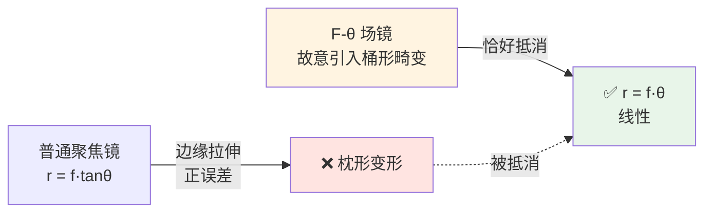
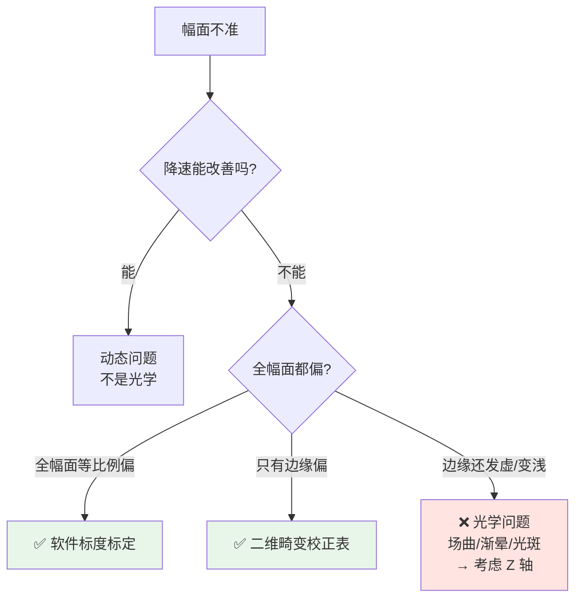

# 🎯 F-θ 场镜（平场聚焦镜）

> [!info] 一句话版本
> 振镜只会"偏转角度"，是**场镜把角度变成平面上均匀的位置**（`r = f·θ`）。
> 没有它，图形边缘会严重变形——**而且它决定了你能打多大、光斑多细、工作距离多远**。
> 场镜是整条光路上**最贵、最容易选错**的一片。

> [!tip] 名字怎么来的
> 它让落点距离正比于**焦距 f** 和**扫描角 θ** 的乘积，所以叫 **F-Theta**。
> 中文叫"场镜"是因为它负责**整个场（幅面）**的成像；也叫"平场聚焦镜"，
> 因为它同时把焦面**压平**。三个名字说的是同一片镜子。

---

## 1. 没有场镜会怎样——用数字说话

### 1.1 普通透镜的两个毛病

激光经振镜偏转 θ 后，如果只用一个普通球面聚焦镜：

```text
毛病一：焦面是球面（场曲），不是平面
毛病二：落点按 r = f·tanθ 分布，不是线性
```

**tan 是非线性的**，所以越往边缘，实际落点比"应该的位置"偏得越多：

| 扫描角 θ（光学角） | r = f·tanθ | r = f·θ | 差值 Δ | **相对误差 Δ/r** |
|---|---|---|---|---|
| 10° | 0.17633 f | 0.17453 f | 0.00179 f | **1.03%** |
| 20° | 0.36397 f | 0.34907 f | 0.01490 f | **4.27%** |
| 30° | 0.57735 f | 0.52360 f | 0.05375 f | **10.27%** |

> [!danger] 最直观的一行：f = 254 mm 时的实际落点误差
> | 扫描角 | 落点误差 |
> |---|---|
> | 10° | 0.46 mm |
> | 20° | **3.79 mm** |
> | 30° | **13.65 mm** |
>
> 13.65 mm —— 如果你的图形边框要求 ±0.1 mm，这已经错了一百多倍。
> **这就是为什么必须用 F-θ 场镜，而不是随便一片聚焦镜。**

### 1.2 F-θ 场镜怎么做到线性的

它**故意设计成带桶形畸变**，用这个"负向误差"去抵消 tanθ 的"正向误差"：



> [!note] 💡 "故意做歪"是一种设计手法
> 光学里这叫"像差平衡"——不是把所有像差都消掉，而是**留一个去补另一个**。
> 所以 F-θ 镜**不能装反**，也不能随便换焦距：它的畸变是按特定焦距和特定镜间距配好的。

---

## 2. 四个核心参数（选型只看这四样）

> [!important] 厂商标称的约束链
> **波长 → 光斑尺寸 → 扫描场直径(SFD) → 入瞳光束直径 → 振镜偏转量 → 镜片位置**
> 这 5 项是**耦合**的，不是独立可选的。改一个，其余全变。

| 参数 | 记号 | 含义 | 怎么定 |
|---|---|---|---|
| **焦距** | f | 决定幅面、光斑、工作距离 | 由幅面和光斑共同反推 |
| **扫描幅面** | SFD | 能有效加工的方形场边长的最大值 | `= 2 f θ_max` |
| **工作距离** | WD | 场镜最后一片到工件的距离 | 由机械结构定，要留余量 |
| **入瞳直径** | EP | 允许的最大光束直径 | 光束直径应 ≤ 它的 50%~75% |

### 2.1 焦距怎么反推

```text
由幅面：  f ≥ r / θ_max
由光斑：  f ≤ d · D / (1.83 · λ · M²)

r     = 幅面半对角 (mm)
θ_max = 振镜可用光学半角 (rad)   ← 查振镜手册！
d     = 想要的聚焦光斑直径 (mm)
D     = 场镜处的光束直径 (mm)
```

**注意这两个不等式夹出一个区间**，不是唯一解——然后从标准档位里挑。

### 2.2 标准焦距档位

| 焦距 f (mm) | ±20° 幅面 (mm) | D=10 mm 时光斑 (μm) | 常见用途 |
|---|---|---|---|
| 100 | 69.8 | 19.5 | 精细打标、小范围 |
| 160 | **111.7** | 31.2 | ⭐ 最常用的打标场镜 |
| 210 | 146.6 | 41.0 | 中等幅面 |
| 254 | **177.3** | 49.5 | ⭐ 大幅面打标 |
| 330 | 230.4 | 64.3 | 大幅面、深雕 |
| 420 | 293.2 | 81.8 | 大面积清洗/焊接 |
| 500+ | 更大 | 更粗 | 远距离、大工件 |

> [!warning] 厂商标称幅面 ≠ 2fθ 的方形内切值
> 实际厂商手册的标称幅面**通常大于**你按 `2fθ` 算的方形内切值——
> 因为厂家标的是"可用的方形场"，且**已经按最大 1% 渐晕计算过**。
> 例：VONJAN f-254M-10-1064 标 **175×175 mm**，入瞳 10 mm。
>
> **所以选型时以厂商手册的标称值为准**，`2fθ` 只用来做粗筛和交叉验证。

---

## 3. 聚焦光斑：两个系数千万别混用 ⚠️

> [!danger] 这是本篇最值钱的一条
> 光斑公式有两个"长得差不多"的版本，**差了 43.7%**：

| 式子 | 系数 | 适用于 |
|---|---|---|
| `d = 1.83 · λ · f · M² / D` | **1.83** | 入瞳在 **1/e² 处被硬截断**的高斯光 ★ **厂商标称口径** |
| `d = 4λfM² / (πD)` | 4/π = 1.273 | **未截断**的理想高斯光 |

两式里 `D` 的含义**完全相同**，只是系数不同：`1.83 / 1.273 = 1.4373`。

**1.83 是怎么来的**：入瞳边缘把高斯光"硬切"掉之后，孔径衍射的主瓣变宽、旁边长出旁瓣，
等效系数就从 1.273 抬到了 1.83。

> [!important] 工程上怎么用
> **Thorlabs、LINOS、Sill 等厂商目录的光斑值用的就是 C = 1.83。**
> 所以：
> - **和手册对比 → 用 1.83**
> - 想估算物理极限 → 用 4/π
> - **绝对不要拿两个结果互相对照**，会以为哪里算错了

**实证差异**（λ=1064 nm、f=254 mm、D=8 mm、M²=1.1）：

```text
C = 1.83 口径：d = 68.0 μm
C = 4/π  口径：d = 47.3 μm
差 44% ← 同一个系统，两个答案
```

### 3.1 另一个坑：光斑的"定义"

| 口径 | 含义 |
|---|---|
| **1/e² 直径** | 高斯光束强度降到峰值 1/e² 处的宽度 |
| **86.5% 功率直径** | 含 86.5% 总功率的束腰直径 |

**对理想高斯光，这两个是同一个数**——SCANLAB 和 Sill 都用这个定义。
所以你不需要换算，但要知道"厂商说的光斑直径"有明确口径，不是"肉眼看到的光点大小"。

> [!note] 💡 实际光斑总比理论值大
> 波前误差、装调偏差、镜面粗糙度、镀膜应力都会加宽光斑。
> 💡 工程上按**理论值的 1.1~1.3 倍**预估比较靠谱。

---

## 4. 焦深：被忽视的隐形约束

```text
DOF = 8 · λ · M² · (f/D)² / π
```

**注意 `(f/D)²`** —— 这是平方关系，非常敏感：

| 场镜 f (mm) | D=10 mm 焦深 | D=20 mm 焦深 |
|---|---|---|
| 100 | 226 μm | 57 μm |
| 160 | 579 μm | 145 μm |
| 254 | 1459 μm | 365 μm |

> [!danger] 焦深必须 ≥ 你的工艺容差
> 焦深要同时吃掉：**工件平面度 + 装夹误差 + 热漂移 + 场曲残余**。
> 如果工件本身不平 0.5 mm，而焦深只有 0.15 mm —— **怎么调都打不均匀**。
>
> **这是"该不该上 Z 轴"的判据**：
> `残余场曲（≈0.2 mm，查你的场镜场曲曲线）` vs `焦深 DOF`。
> ⚠️ **不要用 `r²/(2f)`**——那算的是"完全没做平场校正"的球面焦面，会大出一个数量级。
> 而且**决定因素是你想要多小的光斑**：光斑 ≥50 µm 时 0.2 mm 残差只占焦深 11%（不需要 Z 轴）。
> 见 [[05-光学篇/03-动态聚焦镜组（Z 轴）]]。

---

## 5. 畸变：哪些能标定，哪些不能

### 5.1 畸变类型

| 类型 | 现象 | 来源 |
|---|---|---|
| **F-θ 畸变 / 线性度误差** | 幅面按比例不准（大图形尺寸偏） | 场镜设计残余 |
| **桶形 / 枕形畸变** | 方形变鼓/变凹 | 场镜残余畸变 |
| **渐晕（vignetting）** | 边缘功率下降 | 光束超出有效孔径 |
| **场曲（field curvature）** | 边缘离焦、发虚 | 焦面不平 |
| **像散 / 斜像散** | 焦斑形状不对称 | 大角度入射 |

厂商规格里 **F-θ 畸变典型在 < 0.1% ~ < 1%** 区间（💡 不同型号差别大，看手册）。

### 5.2 可校正 vs 不可校正 ⚠️

> [!important] 这条决定了你排错的方向
> | 问题 | 软件标定能解决吗 |
> |---|---|
> | 图形整体尺寸偏大/偏小 | ✅ 能（标度因子 / F-Theta Factor） |
> | 图形局部变形（四角不准） | ✅ 能（二维校正表） |
> | **光斑尺寸变化** | ❌ 不能 |
> | **渐晕导致的边缘功率损失** | ❌ 不能 |
> | **场曲导致的边缘离焦** | ❌ 不能（Z 轴可部分弥补） |
> | **热致焦移** | ❌ 不能（要主动补偿/水冷） |



**官方工具都在做这件事**：RAYLASE SPICE3 有专门的
"Correction of Marking Field Distortion"章节；SCAPS SAMLight 有
**F-Theta Factor Calibration**（在非 z=0 高度打标时修正 x/y）。
但开源标定工具的结论是：**几乎所有高精度应用都还需要额外的实测标定**。

> [!warning] 标定误差会按比例放大
> 论坛实例：200×200 幅面配 F290 场镜，"100 mm 处短 2 mm"——
> 意味着小尺寸图形也画不出正确的比例。
> 所以标定要在**接近实际加工尺寸**下做，见 [[03-调试与排错篇/04-图形失真与标定]]。

---

## 6. 机械接口与安装

### 6.1 螺纹标准

| 接口 | 用在哪 |
|---|---|
| **M85×1** | ⭐ **打标机场镜的事实标准**，绝大多数兼容机型都用它 |
| **M95×1** | 水冷场镜、大口径 |
| **M112×1** | 大口径长焦（如入瞳 30 mm、幅面 350×350 mm 的型号） |

型号后缀常直接标接口，例如 `f-550-30-915-**M112**`。

> [!note] 有专门的转接环
> 市面上有"场镜螺纹反向转接环"（18 mm / 34 mm 高）和"场镜调节座"，
> 用来解决**螺纹高度不匹配**、把场镜装到**正确的焦面**上。
> 💡 换非原厂场镜时，工作距离对不上是常见坑——转接环就是干这个的。

### 6.2 制造公差：±1.5% ⚠️

> [!danger] 别把名义值当实际值
> Jenoptik 明确声明：**后工作距离、法兰焦距、焦距都有 ±1.5% 的制造公差**。
> 也就是说 f = 350 mm 的场镜，实际焦距可能在 344.7 ~ 355.3 mm 之间。
>
> **后果**：机械行程**不能按名义值卡死**，装调时必须留出调焦余量。
> 设计夹具/镜筒时按 ±2% 留量比较稳妥 💡。

### 6.3 装反了会怎样

> [!warning] ⚠️ 本库未找到厂商的公开说明
> 检索了 Sill / Jenoptik / Thorlabs 等厂商资料，**没有找到"场镜装反"后果的原文描述**。
> （Sill 技术指南目录里有 "Reversed Mode" 条目，但正文无法打开确认其含义。）
>
> 💡 **以下为光路推理，非厂商结论，需实测验证**：
> 场镜是**强非对称的多片结构**，反向入射会：
> - 改变工作距离与法兰距离的匹配（焦点位置不对）
> - 破坏已优化好的场曲与畸变补偿（边缘质量变差）
> - 让**回返光**落在未设计的位置
>
> **最接近的厂商风险表述**是 Jenoptik 的声明：回返光图仅对**准直光束和正确使用**有效，
> "改变系统设置或工况会导致回返位置变化**并造成损伤**"。
>
> 实践建议：**装之前照一张相**，注意场镜上通常有箭头或"→ workpiece"标记。🔬

---

## 7. 多波长与大功率

### 7.1 波长必须匹配 ⚠️

> [!danger] 1064 nm 的场镜不能拿来打 532 nm
> 532 nm 场镜**不是** 1064 nm 场镜的"高分辨率版"。
> 场镜必须按**实际使用波长**设计（材料色散 + 镀膜），除非型号明确声明覆盖双波长。

**消色差（多光谱）场镜**是干什么的：Ronar-Smith 的设计目标原文是
「限制球差与色差，把**两个不同波长（工作光与可见光）**带到同一焦面」——
即让**红光指示光和工作激光共焦**，这样指示光指着哪儿，激光就打哪儿。

Sill 有 532/1064 nm 多光谱产品线，**共用同一个安装螺纹**（可直接替换单波长型号）。

**可核对的 LIDT 数值**（少见的厂商硬数据）：

```text
Sill 多光谱场镜（1064/532 nm）：
  脉冲：2.5 J/cm²  @ 1 ns, 50 Hz
  连续：2.5 MW/cm²
```

### 7.2 大功率场镜

| 措施 | 说明 |
|---|---|
| **全熔石英设计** | 低吸收；Jenoptik Silverline 定位高功率短脉冲 |
| **材料升级** | Coherent 高功率系列可选熔石英 / CaF₂ / 蓝宝石，面向 **>6 kW**，焦距 32~920 mm |
| **UV 专用** | 355 nm 用 **UV 级熔石英**（低吸收、高 LIDT）；深紫外用 CaF₂ |
| **水冷** | 水冷石英场镜确实存在（幅面 100² ~ 255² mm，M85×1 / M95×1） |

> [!danger] 热透镜效应：高功率下的隐形杀手
> 高功率辐射在镜片里造成**非均匀（梯度）加热** → 折射率梯度 → **热透镜** → **焦移 + 像差 → 光斑改变**。
> 论文级结论，现象包括：
> - ZnSe 场镜的热致焦移（仿真 + 实测）
> - 1064 nm 高功率系统中，热透镜引起的**焦移是最显著的效应**
> - Sill 把 "**Absorption and thermal focus shift**"（吸收与热致焦移）**单列为一项规格**
>
> **工程含义**：连续高功率加工时，开机后焦点会随时间漂移。
> 对策：预热、定期校准焦点、主动水冷、或用 Z 轴做在线补偿。

---

## 8. 选型决策链

```text
1. 定波长 λ
   → 决定材料与镀膜，不可跨用（1064 ≠ 532）

2. 定幅面 → 算半对角 r
   → r = 幅面对角线 / 2

3. 查振镜可用光学扫描角 θ_max（看振镜手册！）
   → f_min = r / θ_max
   ⚠️ 厂标幅面已含 1% 渐晕前提，换振镜后幅面会变

4. 定目标光斑 d → 反解需要的输入光束直径
   → D = 1.83 · λ · f · M² / d        ← 用 C=1.83

5. 校验：D ≤ 入瞳直径 × (50%~75%)
   → 超了会削光、光斑变差、边缘功率掉

6. 校验焦深：DOF = πd²/(2M²λ) ≥ 工艺容差
   → 工件平面度 + 装夹误差 + 热漂移

7. 校验机械：法兰焦距 / 后工作距离（含 ±1.5% 公差）
   ↔ 振镜镜间距 ↔ Z 轴行程

8. 校验热与损伤：功率密度 vs 镀膜 LIDT
   → 数百 W 以上考虑熔石英 / 水冷

9. 校验回返光：查厂方的 back-reflection 图
   → Jenoptik 每型场镜都提供
```

> [!example] 🔬 练习 2.1 —— 完整走一遍
> **需求**：1064 nm、M² = 1.1、准直后光束 D = 8 mm、目标幅面 110×110 mm、
> 振镜光学扫描角 ±0.35 rad（SCANLAB hurrySCAN 级别）。
>
> **① 场景对角线半径**
> ```text
> r = 110 × √2 / 2 = 77.8 mm
> ```
>
> **② 反推焦距**
> ```text
> f_min = 77.8 / 0.35 = 222 mm  → 取标准档 f = 254 mm
> ```
>
> **③ 校验幅面**
> ```text
> r = 254 × 0.35 = 88.9 mm  → 方形内切 125.7 × 125.7 mm ✅ 覆盖 110×110
> ```
>
> **④ 算光斑**
> ```text
> d = 1.83 × 1.064e-3 × 254 × 1.1 / 8 = 68.0 μm   （C = 1.83 口径）
> 若误用 C = 4/π：47.3 μm ← 差 44%，别混用
> ```
>
> **⑤ 算焦深**
> ```text
> DOF = π × 0.068² / (2 × 1.1 × 1.064e-3) = 6.2 mm
> ```
> 6.2 mm 焦深对平面工件足够 —— **这个配置不需要 Z 轴**。
>
> **⑥ 如果要把光斑做到 25 μm？**
> ```text
> D = 1.83 × 1.064e-3 × 254 × 1.1 / 0.025 = 21.8 mm
> → 光束要从 8 mm 扩到 21.8 mm（2.7×）
> → 需要入瞳 ≥ 29~44 mm 的大口径场镜 + 扩束镜
> → 焦深同时骤降（DOF ∝ 1/D²）
> ```
> **这就是"光斑、幅面、焦深不可兼得"的量化体现。**
>
> 用计算器复核：
> ```bash
> cd 05-光学篇/代码
> python optics_calc.py lens 1064 110 50 8 20
> python optics_calc.py spot 1064 254 8 --m2 1.1
> ```

---

## 9. 常见误解

| # | 说法 | 核查结果 |
|---|---|---|
| 1 | 场镜让光斑全幅面一样大 | ❌ 厂商原文是 "**almost** constant"，Ronar-Smith 给出光斑随双镜角度变化的波动图 |
| 2 | 光斑公式随便挑一个 | ❌ C=1.83 与 4/π 差 **44%**，厂商标称用 1.83 |
| 3 | 标称幅面就是能用的最大方场 | ❌ 含 **1% 渐晕**前提，且按"典型镜间距"算；换振镜后幅面会变 |
| 4 | 焦距名义值就是机械尺寸 | ❌ Jenoptik：后工作距离/法兰焦距/焦距均有 **±1.5%** 公差 |
| 5 | 1064 镜可以拿来打 532 | ❌ 必须按实际波长选 |
| 6 | 畸变全都能软件标定掉 | ⚠️ 落点几何畸变能；光斑尺寸/渐晕/离焦/热漂移**不能** |
| 7 | 入瞳直径 = 可用光束直径 | ❌ 光束应 ≤ 入瞳的 **50%~75%** |
| 8 | 扫描角就是振镜机械角 | ⚠️ 厂商标的是**光学角**；算幅面时差 2 倍 |
| 9 | LIDT 数值可以跨条件搬用 | ❌ 依赖波长/脉宽/光斑直径，且**测试本身未标准化**（ISO 21254-1:2011 只定义口径） |

---

## ✅ 自检

- [ ] 能用数字说出不用 F-θ 镜会差多少（30° 时误差 10.27%，f=254 时 13.65 mm）
- [ ] 知道 F-θ 镜是靠**故意引入桶形畸变**来实现线性的
- [ ] 记住光斑两个系数（1.83 / 4π）**不能混用**，厂商用哪个
- [ ] 能由"幅面 + 光斑"夹出焦距区间
- [ ] 知道焦深 ∝ (f/D)²，并能判断该不该上 Z 轴
- [ ] 能区分"可软件标定"和"不可软件标定"的问题
- [ ] 知道 M85×1 是打标机场镜的通用接口
- [ ] 知道 ±1.5% 制造公差意味着机械设计要留余量

---

## 📖 原厂依据

> [!quote] 参考来源
> - **F-θ 定义、桶形畸变设计、平场性**：Sill Optics 技术指南
>   <https://www.silloptics.de/en/service/sill-technical-guide/laser-optics/f-theta-lenses>
> - **故意引入桶形畸变抵消 tanθ**：亚利桑那大学光学硕士报告《Design of Large Working Area F-Theta Lens》
>   <https://wp.optics.arizona.edu/alumni/wp-content/uploads/sites/113/2023/06/msreport-gong-chen.pdf>
> - **选型三参数与耦合关系**：Thorlabs F-Theta 教程
>   <https://www.thorlabs.com/newgrouppage9.cfm?objectgroup_id=10766>；
>   SCANLAB Scan Lenses <https://www.scanlab.de/en/products/scan-components/scan-lenses>
> - **C = 1.83 系数及来历**：GIAI《F-Theta Lens Spot Size vs Beam Diameter》
>   <https://www.giaiphotonics.com/f-theta-lens-spot-size-vs-beam-diameter/>；
>   上海光学 <https://www.shanghai-optics.com/assembly/f-theta-lenses/>
> - **光斑 86.5% 功率口径**：SCANLAB 术语表
>   <https://www.scanlab.de/en/service/glossary/focal-diameter-focal-spot>
> - **±1.5% 制造公差**：Jenoptik JENar 数据手册
>   <https://www.jenoptik.us/-/media/websitedocuments/optics/f-theta/data-sheets/f-theta-017700-009-26-ft-03-424ft-350-1030.pdf>
> - **1% 渐晕前提 / 光阑位置定义**：Sill Optics 技术指南；
>   Edmund Optics 版 Sill 数据手册 <https://www.edmundoptics.com/ViewDocument/spec_70146.pdf>
> - **多光谱场镜与 LIDT 数值**：Edmund Optics Sill 多光谱产品页
>   <https://www.edmundoptics.com/f/sill-optics-multispectral-f-theta-lenses/40164/>
> - **大功率与材料**：Coherent 高功率 F-Theta
>   <https://www.coherent.com/optics/laser-optics/f-theta-scan-lenses/high-power-f-theta-lenses>；
>   Jenoptik Silverline <https://www.jenoptik.com/products/optical-systems/objective-lenses-for-high-precision-laser-material-processing/f-theta-lens/standard-portfolio>
> - **热致焦移**：DGaO 论文《Simulation and measurement of thermo-optical effects in an f-theta lens》
>   <https://dgao-proceedings.de/download/117/117_c15.pdf>；
>   Laser Focus World「热透镜引起焦移是最显著效应」
>   <https://www.laserfocusworld.com/optics/article/14104004/careful-optical-system-design-enables-cutting-edge-high-power-laser-applications>
> - **LIDT 定义与不可跨条件套用**：ISO 21254-1:2011；
>   Edmund Optics《Laser Damage Threshold Testing》
>   <https://www.edmundoptics.com/knowledge-center/application-notes/lasers/laser-damage-threshold-testing/>
> - **回返光风险**：Jenoptik 回返光图说明
>   <https://www.jenoptik.us/-/media/websitedocuments/optics/f-theta/rueckreflexgraphen/f-theta-017700-405-26-rr.pdf>
> - **M85×1 通用接口**：Cloudray F-Theta 说明书 <https://manuals.plus/asin/B07CD8KJK2.pdf>
> - **软件标定**：RAYLASE SPICE3 手册「Correction of Marking Field Distortion」；
>   SCAPS SAMLight「F-Theta Factor Calibration」
>   <https://download.scaps.com/downloads/Software/SAMLight/Manual/html/f-theta_factor_calibration.htm>
> - **实测标定必要性**：GitHub `matthewSorensen/scanner-calibration`
>   <https://github.com/matthewSorensen/scanner-calibration>
>
> ⚠️ **两条诚实声明**：
> 1. **场镜装反的后果**（第 6.3 节）**未找到任何厂商公开来源**，文中已明确标注为推理而非结论。
> 2. 厂商**未公开**"平场性 flatness = ±X μm over Y mm"的可核对数值，本文因此只给量级估算（标 💡）。
>
> 💡 标 💡 的数值（实际光斑放大系数、场曲估算、设计留量建议）为工程经验/公式推算，
> **不是厂商规范**。选型时以**你手上那款场镜的数据手册**为准。

---

## 🔗 相关

- 上一篇：[[05-光学篇/00-光路总览：从 3 轴到 5 轴]]
- 下一篇：[[05-光学篇/03-动态聚焦镜组（Z 轴）]]
- 前置：[[05-光学篇/04-扩束镜与变焦扩束镜组]]（决定入射光束直径 D）
- 光斑与焦深完整算法：[[05-光学篇/13-光斑尺寸与焦深计算]]
- 畸变标定实操：[[03-调试与排错篇/04-图形失真与标定]]
- 速查：[[07-速查卡/04-光学速查卡]]
- 回到入口：[[🏠 开始这里]]
