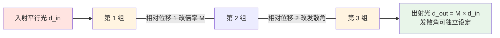

# 🔍 扩束镜与变焦扩束镜组

> [!info] 一句话版本
> 扩束镜是整条光路上**光斑尺寸的总开关**：它接在**振镜前面**（属于**预扫描**光路），
> 把细光束放大 M 倍，从而把聚焦光斑缩小约 1/M、把发散角压到 1/M。
> **它也是光路上第一个同时被"功率密度"和"孔径"卡住的元件**——倍率选错，后面全废。

> [!tip] 位置：为什么必须在振镜之前
> 标准顺序是 **激光器 → 准直镜 → 扩束镜 → 振镜 → F-θ 场镜 → 工件** ✅。
> 扩束镜要待在**光束最细**处：那里镜片最小、最便宜、LIDT 压力最小。放到振镜后面，光已经会聚，
> 口径要翻几倍，而且越靠近焦点功率密度越高。


---
## 1. 它是什么：一个"不聚焦的望远镜"

扩束镜是**无焦系统**（afocal）：自己不聚焦，只把光束**直径变大、发散角变小**。
Sill 的表述：直径与发散角之积在同一波长下是**常数**，扩大 M 倍就把发散角压到 1/M ✅。
光斑公式里 `d ∝ 1/D`，所以**扩束镜真正操盘的对象是 D，不是 d**。

| 形态 | 倍率 | 轴数 | 典型用途 |
|---|---|---|---|
| **固定倍率** | 单一值（2×…8×） | 0（手动发散微调） | 打标机标配，便宜可靠 |
| **手动变倍** | 连续（1–3×、0.9–4×…） | 0（两个环手调） | 实验室、多工艺切换 |
| **电动变倍（zoom）** | 连续（1–8× 等） | **2 个独立位移自由度** | 5 轴振镜、增材制造、精粗一体加工 |

RP Photonics 定义原文：变倍扩束镜是"**至少三片透镜**、改变透镜位置来调整倍率"的器件 ✅；
固定倍率"robust and cost-effective"、变倍"mechanically more complex" ✅。💡 **能不动就不动，需要动才买电动**。

> [!note] 💡 反向可当缩束镜用，但要重算
> Sill 支持 reversed usage（手册里有 `reversed usage` 字段与 `for beam reduction` 示意）✅。
> **但镀膜与 LIDT 是按正向入射优化的**：反向时入射面变成原出射面，功率密度分布改变，必须重新核算。

---
## 2. 三大作用与定量公式

| # | 作用 | 定量 | 依据 |
|---|---|---|---|
| ① | **减小聚焦光斑** | `d ∝ 1/D`，`D_out = M·d_in` → **`d ∝ 1/M`** | Sill Formulary `β′ = d_out/d_in` ✅ |
| ② | **压缩发散角** | `θ_out = θ_in / M`（直径×发散角之积守恒） | Sill 产品页 ✅ |
| ③ | **提高远场能量密度 / 降低元件上的功率密度** | 同一份功率摊到更大面积，远处光斑更小更集中 | Edmund Optics ✅ |

EO 把三大作用写成"**减少远处光束直径、最小化聚焦光斑、降低元件上的功率密度**"✅——②与③是同一件事的两端：
"远处光束直径变小"就是"远场能量密度提高"；**③是好事**，它让扩束镜本身比后面的场镜更"抗烧"。

### 2.1 ⚠️ 公式里的 D 是"场镜处的光束直径"，不是"激光器出射光斑"

```text
聚焦光斑（厂商标称口径）：  d = 1.83 · λ · f · M² / D

λ  = 波长 (mm)          M² = 光束质量因子（理想高斯 = 1）
f  = 场镜焦距 (mm)      D  = 【场镜处的】1/e² 光束直径 (mm)  ← 不是激光器出射光斑
```

**D 是经过准直镜与扩束镜之后、到达场镜时的 1/e² 直径。** ULO 手册专门强调：用有效焦距 F 代入时，
"provided D is the **input** beam diameter"✅（input 指**聚焦镜的入射光束**）。
把"激光器出射 3 mm"直接代进去，是**本领域最常见的数量级错误**。

> [!example] 🔬 练习 4.1 —— D 取错一次，选型错一个量级
> **场景**：某光纤激光标称"出射光斑 3 mm"，用户认为这就是 D；实际准直后到场镜的光束是 8 mm
> （💡 工程经验量级：20 W / 50 µm 光纤经准直通常在 6–10 mm；素材给出的量级，未附一手来源）。
> ```text
> λ=1064 nm, f=160 mm, M²=1.1（A 套 4/π 系数）
> D=3 mm（误用）：d = 4 × 1.1 × 1.064e-3 × 160 / (π × 3) = 0.7491 / 9.4248 ≈ 79.5 μm
> D=8 mm（真实）：d = 4 × 1.1 × 1.064e-3 × 160 / (π × 8) = 0.7491 / 25.133 ≈ 29.8 μm
> D=6 mm（2× 扩束后）                                  ≈ 39.7 μm
> ```
> **后果**：真实 D 是 8 mm 却按 3 mm 选型，你会去买一个**根本不需要的 3× 扩束镜**，把 8 mm 顶到 24 mm
> —— 几乎必然超过振镜孔径被截断（第 9、10 节）。🔬 **量 D 不能靠卷尺**：用光束分析仪或刀口法在**场镜位置**实测；
> 复核 `python optics_calc.py spot 1064 160 3 --m2 1.1`（05-光学篇/代码/optics_calc.py）。

---
## 3. ⚠️ 系数陷阱：两套光斑公式差 43.7%

| 式子 | 系数 | 适用于 | 等级 |
|---|---|---|---|
| `d = 4 · M² · λ · f / (π · D)` | 4/π = **1.273** | **未截断**的理想高斯光 | 🟡 网络计算器通用 |
| `d = 1.83 · λ · f · M² / D` | **1.83** | 入瞳在 1/e² 处被**硬截断**的高斯光，**厂商场镜规格口径** | 🟡 见下 |

**`1.83 / 1.2732 = 1.4373`，同参数下差 43.7%**（素材写"约 44%"，同一个比值的取整；反过来 `4/π ÷ 1.83 = 0.696`）。
同一组参数（λ=1064 nm、f=160 mm、D=3 mm、M²=1）的两个"正确答案"：B 套 **103.9 µm**，A 套 **72.3 µm**。

> [!danger] 选型前必须确认对方用哪一套
> **和厂商手册对比 → 永远用 1.83**；想估算物理极限 → 用 4/π；**绝不要拿两个结果互相对照**。
> 素材原始引文只写作 `Spot size = 1.83 · λ · f / D`（省略 M² 项，即默认理想光束）🟡；
> 工程上沿用完整写法 `1.83·λ·f·M²/D`，与 Thorlabs / LINOS / Sill 目录口径一致。
> ⚠️ 这条差异会直接改变选型结论：第 10 节算例在 A 套下"2× 扩束可行"，换成 B 套后同一个 2×
> 只有 57.1 µm、不再达标，要 2.5× 才够。**"用哪套系数"必须在报价前写进技术协议。**

---
## 4. 伽利略式 vs 开普勒式

| | **伽利略式** | **开普勒式** |
|---|---|---|
| 透镜组合 | 负 + 正 | 双正 |
| 镜间距 | 两焦距之**差** \|f₁ − f₂\| | 两焦距之**和** f₁ + f₂ |
| **内部焦点** | **无** | **有（实焦点）** |
| 总长 / 大功率 | 短 / ⭐ 主流 | 长 / 需规避焦点温升 |

> [!important] Sill 原文：伽利略式"没有内部焦点"
> > "The Galilei principle enables beam expanders with short overall lengths.
> > **In contrast to the Kepler structure there is no internal focus point, which can result in a
> > critical rise of temperature inside the lens if the distance to the neighbored lenses is too small.**
> > Therefore this type is suitable for short pulsed lasers."
> >
> > 译：伽利略原理使总长更短。与开普勒相反，**它没有内部焦点**；内部焦点若离相邻镜片过近，
> > 会导致镜片内部温度**危险升高**。故该型适用于短脉冲激光器。—— Sill 技术指南 ✅

机理：开普勒的内焦点把全部功率聚到极小一点，高峰值功率下会**电离空气并损伤镀膜** 🟡；伽利略避开这个点。
厂商把它当**独立规格字段**写进手册：Sill `optical principle: Galilei (no internal focus)` ✅；
Jenoptik `No internal foci & no internal reflections in elements **for all magnifications**` ✅；
LBTEK"专为衍射极限优化……**无内部焦点**"✅。
⚠️ **固定倍率无内焦点 ≠ 变倍全程无内焦点**——镜组在移动，这正是 Jenoptik 强调 "for all magnifications"
的原因 ✅，**这句话要写进变焦型号的验收条件**。对照：Special Optics 用 **5 片 3 组**专有设计
"以减少内部焦点"、前两组熔融石英 ✅；其手册指出"其他扩束镜是 **4 片 3 组**、正—负—正"✅——两种流派在做同一件事。

---
## 5. 变焦结构：3 组透镜、2 个自由度（本篇重点）

> [!important] LBTEK 原文：谁管倍率、谁管发散角
> > "LBTEK 高精度变倍扩束镜主要由 **3 组**紫外熔融石英（UVFS）制成的透镜组成，以**伽利略结构**
> > 集成于机械外壳中。其中**第 1 组和第 2 组透镜的相对位移会改变扩束镜的放大倍率，
> > 第 2 组和第 3 组透镜的相对位移会改变扩束镜的发散角**。" —— 麓邦（LBTEK）产品页 ✅

三组之间是**空气隙**间隔安装（非胶合）✅——这是"能相对移动"的物理前提。



**为什么变焦需要 2 个独立位移自由度**：改倍率就是改镜组的焦距分配 → 出射光必然不再是平行光（准直被破坏）；
所以必须有一个**独立于倍率**的第二自由度，把发散角拉回零（准直）或主动设到目标值（有意离焦，做焦深/焦点位置补偿）。

**Sill 用反向验证确认了这条耦合**：**"A decreasing distance between the first and second lens group makes the output beam more divergent"**（减小第 1、2 组间距使输出更发散）✅——**动第 1/2 组间距，发散角跟着变，这就是耦合的证据。** Sill 同时给出第二自由度的能力 ✅：
发散调节行程 **±3 mm**（总长最多增加 3 mm），支持"发散、倍率、或**两者一起**由计算机电动调节"。

**第二轴在各家的叫法不同，但是同一个自由度**：Sill 叫 **divergence**（±3 mm）✅；Optosigma BEZM 叫 **diopter**（屈光度，软件预设；1×→8× 运行 **<1 s**；USB + RS232C）✅；Thorlabs ZBE 叫 **focusing distance**（红色环调节并可锁紧）✅；
Special Optics / LINOS 叫 **focus / focus position**（与倍率**可独立控制**）✅。

> [!warning] ⚠️ "2 个电机"是反推结论，没有厂商明文
> 素材明确记录：**Sill / Jenoptik / ULO 的公开手册里都没有"电机数量 / 轴数"字段** ❌。"2 轴"是由光学结构
> （两个独立位移自由度）**反推**的必然结果。**向厂商确认时直接问 axis / motor count。**
> 同理，**两轴联动公式 / 凸轮曲线没有任何厂商公开** ❌（机械设计 know-how）；可迁移的方法学见变焦镜头学术界：机械补偿式变焦的两条曲线必须"足够平滑、避免拐点" 🟡。

---
## 6. ⚠️ 焦点漂移：两种对立的设计哲学

**采购高频问题："变倍时焦点会不会跑？"——默认会跑，这正是各家的核心卖点差异。**

| | **哲学 A：把漂移补掉** | **哲学 B：把漂移做成可调自由度** |
|---|---|---|
| 宣称 | 变倍全程**准直不变** | 倍率与焦点/发散**可独立设定** |
| 代表 | **Thorlabs ZBE**："Collimation Remains Constant During Magnification Change" ✅（外壳机械长度固定、两端不旋转、滑动透镜减少 beam walk-off ✅） | **Sill**（每型号带独立发散调节 ±3 mm ✅）、**Optosigma**（diopter 预设 ✅）、**Special Optics**（ratio 与 focus 独立 ✅）、**LINOS**（焦斑直径/焦点位置分别可调 ✅） |
| 用户要做什么 | 改完倍率直接用 | **改完倍率必须用第二轴把焦点找回来** |
| 风险 | 💡 厂商未明说时，不能假设它属于这一类 | 忘记补偿 → **变倍后整场离焦** |

> [!danger] 采购时必须问清是哪一类
> Sill / Optosigma / Special Optics 的哲学原文是"**焦点会跑，但给你第二个轴去独立补偿它**"；
> Thorlabs 的哲学是"**我帮你补好了**"。**两者不可混为一谈。** 照抄这四个问题：
> 1. 变倍时**场镜处焦点位置**漂移多少 mm？要曲线。 2. 准直度（残余发散角）全倍率范围内的最大值是多少 mrad？
> 3. 第二轴是**自动联动**（电子凸轮表）还是**需上位机手动设定**？ 4. 不做第二轴补偿，变倍后**必须重新调焦**吗？
> 旁证：Special Optics 新 1×–4× 给出**光束游走 0.15 mrad** 🟡；Jenoptik 给出**指向稳定性 ≤0.3 mrad** ✅——**这些都是"变倍时焦点/指向会动"的量化表述。**

---
## 7. 预扫描 vs 后扫描，以及一个致命术语陷阱

> [!danger] ⚠️ 中文语境的"前聚焦 / 后聚焦"说的不是扩束镜的位置
> | 中文术语 | 实际含义 |
> |---|---|
> | **前聚焦（pre-scan）** | **动态聚焦振镜**：聚焦镜组在振镜**之前**，靠 Z 轴动态调焦把焦点压在平面上 |
> | **后聚焦（post-scan）** | **普通振镜 + F-θ 场镜**：聚焦发生在扫描**之后** |
>
> 它讲的是**聚焦**发生在扫描之前还是之后，**不是扩束镜在振镜前还是后** 🟡。
> **这是选型沟通中最容易产生致命歧义的术语**——你说"前置扩束"，对方可能理解成"这是前聚焦系统"。

两个问题要分开看：**(A) 扩束镜放哪** → ⭐ 放振镜**前面**（唯一工业标准做法）✅；
**(B) 动态聚焦 vs F-θ 场镜** → 是另一件事，见 [[05-光学篇/03-动态聚焦镜组（Z 轴）]]。

**为什么扩束镜不能放振镜后面**：① 振镜后是**会聚光束**，在会聚光里扩束需要**极大**的镜片口径 🟡；② 越靠近焦点**功率密度越高**，LIDT 压力越大 🟡；③ 光束位置漂移在**扫描场边缘被放大** 🟡；
④ 核心矛盾：振镜"追求高速需要小转动惯量，而处理高功率激光则需要大孔径镜片"🟡——放前面，D 只被约束一次；
放后面，D 要同时被振镜孔径与场镜入瞳约束。

> [!warning] ⚠️ 诚实声明
> 素材明确记录：**未找到任何厂商明文的 "post-scan beam expansion" 产品规格或定量优劣对比** ❌，上面 ①②③
> 只能作定性推理，**不能作为核查结论引用**。学术文献中确实存在"扩束预扫描 / 后扫描"的对比研究 🟡，但那是特定场景，不是工业打标/切割的常规做法。

---
## 8. 关键参数表（厂商实际产品）

**Sill Optics**（1050 nm 段参数最全的一家）

| 型号 | 倍率 | 波长 (nm) | 通光 / 推荐光束 | 片数 | 透过率 | LIDT | 机械接口 |
|---|---|---|---|---|---|---|---|
| S6EXK0020-328（固定） | 2.0× | 1064 | 入瞳 **12.0 mm**；出瞳 26.0 mm；推荐 Ø10.0 mm | 2 | **>99%** | **5.0 J/cm²**（脉宽条件在摘要中被截断） | — |
| S6EXZ5310-574（变倍） | 1.0–3.0× | 355 | 入瞳 10.5 mm；出瞳 20.0 mm；最大入射 **9.0 mm(1×) → 6.0 mm(3×)** | **4** | **>97%** | — | — |
| S6EXZ5076-328（变倍） | 1.0–8.0× | 1030–1090 | — | — | **>97%**；镀膜 R<0.20% 低吸收 | — | **C-Mount**；Ø58 mm；长 162.0 mm；0.60 kg |
| S6EXZ0940-574（变倍） | 0.9–4× | — | — | — | — | — | **M30×1**（转 C-mount 附件 S6MEC0107） |
| S6EXK0010-328（固定） | 1.0× | 1030–1090 | — | — | — | — | **M30×1 6g**；长 42 mm |
| S6EZM0940-574（**电动**） | 0.9–4× | 355 | — | — | — | **0.3 J/cm² (1 ps, 100 Hz)** | — |
| S6EXZ9313-684 / -681 | 1–3× | 9.3 / 10.6 µm | 全 **ZnSe** 透镜 | — | — | — | — |

**Sill 通用设计口径（✅）**：光学元件**全部为熔融石英**；因**入瞳处功率密度最高**，**低吸收镀膜为标准配置**；
每种倍率**至少有一款无内部鬼像**的型号；**每种型号都提供手动或电动发散角调节**；固定倍率 LIDT 上限 **5.0 J/cm² (1 ns, 50 Hz)** ✅。

| 厂商 / 型号 | 关键参数 | 等级 |
|---|---|---|
| **Jenoptik** 电动 1×–8× | 1030–1080 nm（另有 515–540 nm）；**熔融石英**；透过率 **≥97%**；指向稳定性 **≤0.3 mrad**；**全倍率衍射极限、无内部焦点与内部反射**；mm 主尺 + 游标尺调焦；Steadfast 1×–4×：**M30×1 或 Ø45.0 (+0.0/−0.04) mm 两端均可**、0.37 kg、残余发散 ≤1 mrad；**LIDT ⚠️ 厂商未公开数值** ❌（仅说明 UV 激光的 LIDT 适用于脉宽 >10 ps，更短需实测） | ✅ / 🟡 |
| **Special Optics** | 2×–8×、2×–10×、1×–4×、1×–5×，可达 **2×–40×**；输入孔径 **1.3–20 mm**；输出通光 **1.3 mm – >100 mm**；248–1550 nm；损伤阈值 **typically 500 MW/cm²**；**5 片 3 组**减少内部焦点；波前 **< λ/4 @632.8 nm** 🟡；新 1×–4× 光束游走 **0.15 mrad** 🟡 | ✅ / 🟡 |
| **EKSMA** 高功率 zoom | IBS 镀膜 UVFS 薄透镜；**LDT >80 J/cm² @10 ns, 100 Hz, 1064 nm**；**>0.5 J/cm² @200 fs, 1 kHz, 1030 nm**；**总透过率 >98.5%**；低 GDD | ✅ |
| **Thorlabs ZBE11** / **Optosigma BEZM** | 0.5×–2.5×，980–1130 nm，UVFS，**>96%**，**20 J/cm²**，变倍全程准直不变 🟡 / 1×–8× 连续，倍率 + 屈光度软件预设，<1 s，USB/RS232C ✅ | 🟡 / ✅ |
| **Coherent**（CO₂）/ **Novanta** | ZnSe 元件 **>99.4% @10.6 µm** ✅ / 3×/4×/5×、单体铝块、**IP6** ✅ | ✅ |
| **ULO CO2mpact** / **LINOS/Qioptiq** | 9.3–10.6 µm，长 70 (+5/−4) mm 🟡，定位 **sub 500 W** CO₂ 传输，**透过率与 LIDT ⚠️ 厂商未公开** ❌ / 1×–4×、2×–8×，材料**熔融石英 和/或 光学玻璃**，焦斑直径/焦点位置分别可调 ✅ | ✅ |
| **CASTECH 福晶** / **LBTEK 麓邦** | 固定 + 可变倍率，伽利略型，**电动变倍 + 水冷变倍**，193/266/355/532/632.8/1030/1064/1550 nm ✅ / 3 组 UVFS、伽利略、空气隙，355/532/1064 nm，固定倍率 2X–8X 带**输入端发散角微调** ✅ | ✅ |
| **Dimension-Labs / JCOPTIX / 维什** | 伽利略、UVFS 或 ZnSe、高 LIDT 增透膜 ✅ / 2×/5×/10×、波前 < λ/4 @633 nm 🟡 / **BE** = 固定倍率、**BEZ** = 连续变倍 🟡 | ✅ / 🟡 |

> [!warning] ⚠️ 国内厂商的数据缺口（本次调研最大空白）
> **CASTECH / LBTEK / Dimension-Labs / 大族 / 维什 都没有公开的逐型号数值 datasheet**（透过率 %、LIDT 数值、通光孔径、机械螺纹）❌——官网只给系列描述。**选型时直接索要 datasheet 与实测曲线，不要用宣传页参数做设计输入。**
> 另：某电商页把 "IR2-8X" 同时写成"5 倍固定"，**自相矛盾，不可采信** 🟡。

---
## 9. 孔径与截断：T = d_L / d_EP

```text
截断比  T = d_L / d_EP      d_L = 入射光束直径 (1/e², mm)    d_EP = 扫描器入瞳直径 (mm)
```

**厂商原始依据（Sill Formulary 3.1 逐字）**："The outgoing beam diameter d_out is **limited by the
beam expander or by the aperture of the scanner**"（出射光束直径受扩束镜或振镜孔径限制）✅。
**Sill 的量化判据：`T < 0.5` 时光束近似无截断** ✅。

| T | 状态 | 后果 |
|---|---|---|
| **< 0.5** | ⭐ 近似无截断 | 设计值可信 |
| 0.5 ~ 0.7 | 轻微截断 | 边缘功率损失；**峰值强度有时反而提高**（见下） |
| > 0.7 | 明显截断 | **能量损失 + 幅面缩小 + 光斑变形** |

> [!important] ⭐ 反直觉：轻微截断可能提高峰值强度（EO 原文 ✅）
> > "using a higher magnification beam expander that **clips the edges of the beam** may result in a **higher intensity final spot**"
>
> EO 的案例中 **7× 扩束仅截断 3% 功率**就达到了设计强度要求 ✅。前提：系统能承受功率损失且有热管理（截断掉的功率要在扩束镜前用光阑挡掉 🟡）。**⚠️ 这是有条件的工程权衡，不是"截断无所谓"**——第 10 节算例会说明：截断比冲到 0.75 时，光斑质量的下滑**会吃掉**扩束带来的全部收益。
> 💡 中方工程界实测后果（🟡 二手，但很具体）：**10 mm 光斑振镜 + 8 mm 入瞳场镜**，场镜标称 110×110 mm 幅面，实际可能只能打 **80×80 mm**——"光束被场镜边缘遮挡了一部分"🟡。**所以"幅面不够"有时不是场镜选小了，是光束太粗了。**

---
## 10. ⭐ 反直觉的选型结论：3 mm → 50 µm 做不到

> [!important] 先给结论
> **λ=1064 nm、f=160 mm、入射 D=3 mm，想要 50 µm 光斑——物理上做不到**（不扩束最好 72.3 µm）。
> 正确解法是**换 f≈100 mm 的场镜**（约 **49.7 µm**，且不增加截断风险），
> **而不是硬加 5× 扩束镜**——后者出射 15 mm，几乎必然超过振镜入瞳被截断，实际光斑反而更差。

> [!example] 🔬 练习 4.2 —— 完整算例：3 mm 输入 → 50 µm 光斑
> **给定**：`D_in = 3 mm`（1/e²）、`λ = 1064 nm`、`f = 160 mm`、目标 `50 µm`、`M² = 1.1`。
> **全部用 A 套（4/π）系数**，以便与素材第 7 节数字对齐。
> ```text
> ① 可行性判断（取 M²=1，给出现有系统最好情况）：
>    d_min = 4 × 1 × 1.064e-3 × 160 / (π × 3) = 0.6810 / 9.4248 ≈ 0.0723 mm = 72.3 μm
>    → 72.3 μm > 50 μm ⇒ 当前配置无论怎么调都达不到 50 μm
> ② 反解需要多大的 D 和倍率（M²=1.1）：
>    D_req = 4 × 1.1 × 1.064e-3 × 160 / (π × 0.050) = 0.7491 / 0.15708 ≈ 4.77 mm
>    M = 4.77 / 3 ≈ 1.59×  →  标准档只有 1.5×（欠）或 2×（过）
> ③ 校验 2× 扩束：D_out = 6 mm
>    d   = 4 × 1.1 × 1.064e-3 × 160 / (π × 6) = 0.7491 / 18.850 ≈ 39.7 μm
>    DOF = π · d² / (2 · M² · λ) = π × 0.0397² / (2 × 1.1 × 1.064e-3) ≈ 2.115 mm（约 ±1.06 mm）
> ④ 孔径校验（最易翻车的一步）：D_out = 6 mm 必须同时 ≤ 振镜镜片孔径 且 ≤ 场镜入瞳
>    常见 10 mm 振镜：T = 6/10 = 0.60 → 轻微截断，可接受但要留意削光
>    若场镜入瞳仅 8 mm：T = 6/8 = 0.75 → 明显截断，能量损失 + 幅面缩小 + 光斑变形
> ⑤ 另一条路：什么都不加，换短焦场镜 ⭐（保持 D = 3 mm，场镜换 f = 100 mm）
>    d   = 4 × 1.1 × 1.064e-3 × 100 / (π × 3) = 0.4682 / 9.4248 ≈ 0.0497 mm = 49.7 μm  ✅ 达标
>    DOF = π × 0.0497² / (2 × 1.1 × 1.064e-3) ≈ 3.31 mm（±1.66 mm，比 2× 方案还深）；代价：幅面按 2fθ 同比缩小——±20° 时 f=160 → 111.7 mm，f=100 → 69.8 mm
> ⑥ 系数一换，结论就变（呼应第 3 节）：改用 B 套后所有光斑 × 1.4373。3 mm + f=160 → 114.3 μm；2× 扩束 → 57.1 μm（不再达标）；换 f=100 → 71.4 μm（要 f≈70 mm）
>    要在 f=160 达标：需 D = 6.85 mm ⇒ M ≈ 2.28×，取 2.5× → D_out = 7.5 mm ⇒ T = 0.75，明显截断
> ```
> | 方案 | 光斑 | 焦深 | 评价 |
> |---|---|---|---|
> | 不变（3 mm + f=160） | 79.5 µm | ±4.2 mm | ❌ 达不到 50 µm |
> | **2× 扩束 + f=160** | **39.7 µm** | ±1.06 mm | ✅ 可行（前提：振镜孔径与入瞳 ≥ 10 mm） |
> | **换 f=100 场镜，不扩束** | **49.7 µm** | ±1.66 mm | ⭐ **达标且无截断风险**，代价是幅面缩到 69.8 mm |
> | 5× 扩束 | 理论 15.9 µm | 极浅 | ❌ D_out = 15 mm，几乎必然超入瞳被截断，实际光斑反而更差 |
>
> > ⚠️ 素材该行原写 45 µm，用本节同一公式复核为 **15.9 µm**，两个数字对不上，
> > 此处按公式重算。**选型时以你自己复算的数为准。**
>
> **先算"不扩束的极限"，再决定要不要加镜子**——加镜子是最后手段，不是第一反应。换短焦场镜与加扩束镜都能缩小光斑，
> 但**前者牺牲幅面、后者牺牲孔径余量**。复核：`python optics_calc.py spot 1064 160 6 --m2 1.1`；`python optics_calc.py expand 3 4.77`。

---
## 11. 调校方法：怎么把扩束镜调到最佳准直

| 方法 | 判据 | 适用 |
|---|---|---|
| **① 剪切干涉法** ⭐ | 改透镜间距看条纹：**准直 = 直条纹**，离焦 = 条纹弯曲 ✅ | 最定量，实验室/验收 |
| **② 双位置光斑法** / **③ Shack-Hartmann** | 近处光斑 ≈ 远处光斑 → 准直 / 直接读透射波前误差 ✅ | 现场最常用，无需干涉仪 / **验收用，不是调准用** |

- **①** 原理原文："改变光束准直系统——本例中即两透镜间距——并**观察干涉条纹**"✅；工程实现用**楔形板横向剪切 + 傅里叶条纹分析**，可量化判定、消除人眼主观误判 🟡；反射式扩束镜另有专用做法："用一块**平行度极好的平板以 45° 放在准直光束前**，两侧反射光干涉"🟡。
- **②** 中国专利明确记载了这套工业方法："基于沿光束的出射方向间隔设置的扩束镜和**观测板**；移动所述观测板至**第一位置**……形成**第一光斑**"🟡。判据 💡：远处光斑更大 → 仍在**发散**；远处更小 → **会聚**；两者相同 → 准直。
- **③** EO 原文："**Shack-Hartmann 波前传感器**用于测试激光扩束镜的**透射波前误差**，以预测实际性能"✅。

> [!important] ⭐ 唯一有厂商明文的方向性判据（Sill）
> > **"A decreasing distance between the first and second lens group makes the output beam more divergent."**
> > —— **减小第 1、2 组间距 ⇒ 输出更发散**；反之更会聚。 ✅
>
> 调准时照这条方向试，能少走弯路。注意它和第 5 节的结构说明是同一句话的两种用法：
> **结构上它管倍率，方向上它同时也是发散的调节旋钮。**

> [!danger] 没调准会怎样：波前误差被 M 同步放大
> 中文工程分析的近似式（🟡 **科普性近似，未见于厂商或论文，仅供定性理解**）：
> ```text
> PV_out ≈ M · PV_in + PV_e        M = 倍率  PV_in = 输入波面误差  PV_e = 扩束镜自身误差
> ```
> 即"原本 λ/10 的波面经 10× 扩束，**仅输入项就放大到 λ**"🟡——**倍率越大，对前级波面越残忍**。实测后果：`d ∝ 1/D`，光束未准直 → 场镜处有效 D 偏离设计值 → 光斑偏离设计值；`DOF ∝ d²` 🟡，光斑放大 1.4 倍焦深翻倍，反之焦深急剧缩短。
> 🟡 二手说法"焦点偏差 0.1 mm 导致切口宽度增加 15%"——**来源为内容农场式站点、无实验条件说明，可信度低，务必自行验证**。⚠️ **未找到任何厂商对"未调准导致锥度"的定量说明** ❌。

---
## 12. 高功率与热透镜

> [!important] Sill 原文：热管理的关键位置是"入瞳"
> > "Because of the **high-power density (especially at the entrance lens element)**
> > we advise our **low absorption coating** as standard product."
> >
> > 译：由于（尤其是**入口镜片处**的）**高功率密度**，我们把**低吸收镀膜**作为标准配置。 ✅

**为什么是入口镜片**：光束在入口处最细（D_in），出射时已放大 M 倍，功率密度沿光路**递减**——入口是全场最危险的地方，这也与第 9 节"扩束镜放在振镜前"互为依据 ✅。Sill 电动高功率型的额外设计 ✅：
"**The beam diameter does not fall below the minimum value on all inside lens surfaces**... the energy input even on the usually critical **second lens** is so low"。

| 波长 | 首选材料 | 关键理由 |
|---|---|---|
| 355 / 532 / 1030–1090 nm | **熔融石英（UVFS）** ⭐ | 低吸收、低 CTE、高 LIDT；**全行业默认**（Sill/Jenoptik/EKSMA/LBTEK 一致）✅ |
| 可见/近红外、低功率 | N-BK7 可接受 🟡 | 成本低；高功率/大温变下不安全 🟡 |
| 9.3 / 10.6 µm | **ZnSe（激光级 CVD）** | 吸收 **<0.0005 cm⁻¹ @10.6 µm** 🟡（比 GaAs/ZnS 低 1–2 个数量级）；Sill 全 ZnSe 变倍 ✅ |
| 高功率 CO₂ >4 kW | ZnSe + 低吸收 AR/AR 🟡 | 最小化热透镜；ZnSe 质软（Knoop 120），外露表面须镀 DLC/硬质 AR 🟡 |

> [!danger] 热透镜：>50 W 连续，连石英也会出问题
> - 熔融石英 **`dn/dT ≈ 11 × 10⁻⁶ /K`** 🟡；**"At high average powers (>50 W CW), even fused silica can develop thermal lens effects"** 🟡；机理：非均匀（梯度）加热 → 折射率梯度 → **热透镜 → 焦移 + 像差 → 光斑改变**；
>   Fraunhofer WLT："thermal lensing leads to quality losses or, in extreme cases, to the abortion of the whole laser machining process" 🟡。
> - **工程含义**：连续高功率加工时**开机后焦点会随时间漂移**。对策：预热、定期校焦、主动水冷、用 Z 轴做在线补偿（[[05-光学篇/03-动态聚焦镜组（Z 轴）]]）。
> ⚠️ **两点数据缺口**：**未找到任何厂商给出的"扩束镜热致焦点漂移量"（µm/W 或 mm/kW）** ❌；N-BK7 的 `dn/dT ≈ 3.0 × 10⁻⁶/K` 是学术常识值，**未找到可逐字引用的 SCHOTT 手册来源** ❌。

---
## 13. 常见误解

| # | 说法 | 核查结果 |
|---|---|---|
| 1 | "扩束倍率 = 焦距比"和"= 出/入射光斑直径比"是一回事 | ⚠️ 理想无焦系统里等价，**实际系统中发散角非零时二者不等** 🟡；**厂商规格书用的是直径比**（Sill `β′ = d_out/d_in`）✅ |
| 2 | 光斑公式随便挑一个 | ❌ 4/π 与 1.83 差 **43.7%**；与厂商手册对比必须用 1.83 |
| 3 | 公式里的 D 是"激光器出射光斑" | ❌ **D 是到场镜处的 1/e² 光束直径**（ULO 原文强调 ✅）；取错差 2.67 倍 |
| 4 | 倍率越大光斑越小，所以越大越好 | ❌ 三条硬约束锁死上限：① `d_out` 受扩束镜/振镜孔径限制 ✅ ② 截断后光斑**变形并可能变大**、幅面缩小 🟡 ③ 波前误差被 M 同步放大 🟡 |
| 5 | "变倍时焦点不变"是普遍特性 | ❌ 这是**型号相关的设计选择**：Thorlabs 宣称准直不变 ✅；Sill/Optosigma/Special Optics 则是"给你第二个轴去补偿" ✅。**采购必须问清** |
| 6 | 扩束镜应放到振镜后面以避开振镜孔径限制 | ❌ 振镜后是会聚光束，镜片口径需求急剧增大、功率密度更高；标准光路是**扩束 → 振镜 → 场镜** ✅ |
| 7 | "前聚焦 / 后聚焦" = 扩束镜在振镜前 / 后 | ❌ 那是**动态聚焦架构**（pre-scan 动态 Z vs post-scan F-θ）🟡，**与扩束镜位置无关** |
| 8 | 出射光束必须"完整无截断" | ⚠️ 不完全对：EO 明确说**轻微截断有时反而提高峰值强度**（案例仅截断 3% 功率）✅；但截断比冲到 0.75 会吃掉全部收益 |

---
## 14. 现场排错对照表

| 现象 | 可能原因 | 先查什么 |
|---|---|---|
| 变倍后整场离焦、图形发虚 | 属于"哲学 B"型号，**第二轴没补偿** | 用调焦轴找回焦点（第 6 节） |
| 光斑比设计值大 1.44 倍左右 | **用 A 套系数去对厂商标称值** | 换成 1.83 口径重算（第 3 节） |
| 光斑远大于计算值 | **D 取错**（用了激光器出射光斑） | 在场镜位置实测 D（练习 4.1） |
| 边缘功率掉、幅面打不满、中心能打边缘打不动 | **截断 / 渐晕**：`T = d_L/d_EP` 超 0.5 | 算 T，降倍率或换大入瞳场镜（第 9 节）；见 [[07-速查卡/04-光学速查卡]] |
| 光斑变粗 + 焦点变差 + 条纹歪 | 未调准，**波前误差被 M 放大** | 剪切干涉 / 双位置光斑法重调（第 11 节） |
| 连续高功率跑一段时间后焦点漂移 | **热透镜** | 预热、冷却、Z 轴在线补偿（第 12 节） |

---
## ✅ 自检

- [ ] 能说出扩束镜在光路中的位置，以及"前聚焦/后聚焦"到底指什么；记住 `d = 1.83·λ·f·M²/D` 里的 **D 是场镜处的 1/e² 光束直径**
- [ ] 能说出两套光斑公式差 **43.7%**，以及和厂商手册对比时该用哪一套
- [ ] 能解释伽利略式为什么适合高功率（**无内部焦点**），并说清变焦 3 组透镜各管什么、为什么需要 **2 个独立位移自由度**
- [ ] 采购时会问："变倍时焦点漂移多少？第二轴是自动联动还是手动？"
- [ ] 能用 `T = d_L/d_EP` 判断截断，并知道 T < 0.5 近似无截断
- [ ] **拿到"要更小光斑"的需求时，会先算不扩束的极限，再决定加镜子还是换场镜**

---
## 📖 原厂依据

> [!quote] 参考来源
> - **D 的定义 / 三大作用**：Edmund Optics《Beam Expanders》✅ <https://www.edmundoptics.com/knowledge-center/application-notes/lasers/beam-expanders/>；ULO CO2mpact 手册（`S = 4M²λF/(πD)`、"M² is **not** the magnification"、×7 聚焦 1400 mm 时有效焦距取 1400/7 = 200 mm、"provided D is the input beam diameter"）✅ <https://optotec.co.jp/update/wp-content/uploads/2020/08/CO2MPACT-Beam-Delivery-Components.pdf>
> - **`β′ = d_out/d_in`、d_out 受扩束镜/振镜孔径限制、d_F / d_EP / d_L / T 符号体系**：Sill Formulary ✅ <https://www.silloptics.de/en/service/sill-technical-guide/laser-optics/formelsammlung>；**T < 0.5 近似无截断** ✅ <https://www.silloptics.de/en/service/sill-technical-guide/laser-optics/laser-optik-grundlegende-erklaerungen>
> - **伽利略"无内部焦点"原文、独立发散调节 ±3 mm、"减小第 1、2 组间距使输出更发散"**：Sill 技术指南 ✅ <https://www.silloptics.de/en/service/sill-technical-guide/laser-optics/beam-expanders>
> - **Sill 通用设计口径（全熔融石英、入瞳功率密度最高→低吸收镀膜、无内部鬼像、每型号带发散调节）** ✅ <https://www.silloptics.de/en/products/laser-optics/beam-expanders-1>
> - **Sill 逐型号参数**：S6EXK0020-328 ✅ <https://www.unice-eo.com/archive/Download/Sill%20Optics/Beam%20Expanders/Compact%20Beam%20Expanders/S6EXK0020-328.pdf>；S6EXZ5310-574 ✅ <https://www.edmundoptics.com/ViewDocument/spec_70169.pdf>；S6EXZ5076-328 ✅ <https://www.edmundoptics.com.tw/p/sill-optics-1030-1090nm-1x---8x-variable-beam-expander-s6exz5076-328/54684/>、<https://www.silloptics.de/fileadmin/Downloads/Laseroptik/Laser_Optics_Datasheet/Strahlaufweiter/S6EXZ5076-328.pdf>；S6EZM0940-574 ✅ <https://www.edmundoptics.com/p/sill-optics-355nm-09x---4x-motorized-variable-beam-expander-s6ezm0940-574/54697/>；S6EXK0010-328 ✅ <https://www.silloptics.de/fileadmin/Downloads/Laseroptik/Laser_Optics_Datasheet/Strahlaufweiter/S6EXK0010-328.pdf>；S6EXZ0940-574（M30×1）✅ <https://www.optoscience.com/our-vendors/silloptics/qip10g0000009col-att/S6EXZ0940-574-1.pdf>；固定倍率 LIDT 5.0 J/cm² (1 ns, 50 Hz) ✅ <https://www.edmundoptics.com/c/sill-optics-beam-expanders/1502/>；全 ZnSe 红外 ✅ <https://www.silloptics.de/en/news/company-news/news/new-zincselenide-beam-expanders-for-high-power-lasers>；电动高功率型"第二片镜能量注入低" ✅ <https://www.silloptics.de/en/news/company-news/news/motorized-beam-expander-for-high-power-lasers>
> - **Jenoptik**（≥97%、≤0.3 mrad、全倍率无内部焦点、熔融石英、专利号）✅ <https://www.jenoptik.com/-/media/websitedocuments/optics/f-theta/beam-expander-1x-8x/beamexpander_1x-8x_1064nm.pdf>；Steadfast 1×–4× ✅ <https://www.jenoptik.us/-/media/websitedocuments/optics/optics/product-beam-expander-1x-4x-steadfast.pdf>；mm 主尺 + 游标尺 ✅ <https://www.jenoptik.us/-/media/websitedocuments/optics/optics/product-beam-expander-1x-4x.pdf>；"残余发散角"字段 🟡 <https://www.jenoptik.com/-/media/websitedocuments/optics/optics/product-beam-expander-motorized-1x-8x.pdf>
> - **Special Optics**（倍率/孔径/波长/损伤阈值/5 片 3 组/倍率与焦点独立控制）✅ <https://www.navitar.com/products/special-optics/laser-beam-expanders>、<https://store.navitar.com/beam-expanders/>；0.15 mrad beam wander 与"其他家 4 片 3 组" 🟡 <https://manuals.plus/m/9027c00fd92f6ed331347aca382f4b209725608c81266a234d887c1d03a1a732.pdf>；波前 < λ/4 @632.8 nm 🟡 <https://www.photonics.com/Products/ZOOM-BEAM-EXPANDER/pr8835>
> - **Thorlabs ZBE**（准直全程不变、滑动透镜减少 beam walk-off、外壳长度固定、两端不旋转）✅ <https://www.thorlabs.com/newgrouppage9.cfm?objectgroup_id=15055&partnumber=zbe1b>；调焦距离与红色锁紧环 ✅ <https://www.govolition.com/product/V40-ZBE11>；ZBE11 >96% / 20 J/cm² 🟡 <https://www.meetoptics.com/optical-assemblies/beam-expanders/variable-magnification-beam-expander/s/thorlabs/p/ZBE11>
> - **Optosigma BEZM**（diopter 预设、<1 s、USB/RS232C）✅ <https://sea.optosigma.com/en_sg/optics-optical-coatings/multi-element-optics/laser-beam-expander/bezm-series.html>；**EKSMA 高功率 zoom**（>80 J/cm² @10 ns/100 Hz/1064 nm；>0.5 J/cm² @200 fs/1 kHz/1030 nm；>98.5%）✅ <https://www.eksmaoptics.com/p/zoom-beam-expanders-for-high-power-lasers/57>；**Coherent CO₂ >99.4% @10.6 µm** ✅ <https://www.edmundoptics.com/f/CO2-Beam-Expanders/39479/>；**Novanta BE** ✅ <https://novanta.com/precision-manufacturing/product/co2-laser-beam-expanders/>
> - **LINOS/Qioptiq**（1×–4×、2×–8×；熔融石英和/或光学玻璃；焦斑直径/焦点位置分别可调）✅ <https://www.excelitas.com/sites/default/files/assets/product/document/26429.pdf>、<https://www.excelitas.com/product/motorized-variable-magnification-beam-expanders>；**LBTEK**（3 组 UVFS、伽利略、空气隙、第 1↔2 组改倍率、第 2↔3 组改发散角、无内部焦点）✅ <https://www.lbtek.com/product/705>、<https://www.lbtek.com/product/289>
> - **CASTECH 福晶**（固定/可变、伽利略、电动变倍、水冷变倍、波段）✅ <https://gb.castech.com/product/扩束镜-244.html>；**Dimension-Labs**（伽利略、UVFS/ZnSe、高 LIDT 增透膜）✅ <https://www.dimension-labs.com/product/spuDetail?id=1950>
> - **截断的后果（110×110 → 80×80）** 🟡 <https://www.soar-laser.cn/%E6%8C%AF%E9%95%9C%E3%80%81%E5%9C%BA%E9%95%9C%E3%80%81%E6%BF%80%E5%85%89%E5%99%A8%E9%80%89%E5%9E%8B%E9%85%8D%E5%A5%97%E6%8C%87%E5%8D%97/>；**轻微截断反提高峰值强度（7× 截断 3%）** ✅ <https://www.edmundoptics.com/knowledge-center/application-notes/lasers/unintuitive-balancing-beam-expander-max-focus-intensity/>
> - **剪切干涉测准直** ✅ <https://www.lighttrans.com/use-cases/application/collimation-testing-with-shearing-interferometry.html>；楔形板 + 傅里叶分析 🟡 <https://www.sciencedirect.com/science/article/pii/S0143816611001035>；反射式扩束镜 45° 平板法 🟡 <https://sensors.myu-group.co.jp/sm_pdf/SM3841.pdf>；**双位置光斑法（专利）** 🟡 <https://www.xjishu.com/zhuanli/20/202210181327.html>；**Shack-Hartmann 测透射波前** ✅ <https://www.edmundoptics.com/knowledge-center/application-notes/lasers/beam-expander-testing/>
> - **PV_out ≈ M·PV_in + PV_e** 🟡 <https://zhuanlan.zhihu.com/p/1997272942934000180>；**焦深 ∝ S²、∝ (f/#)²** 🟡 <http://experimentationlab.berkeley.edu/sites/default/files/MOT/Gaussian-Beam-Optical.pdf>；**热透镜导致质量损失/加工中断** 🟡 <https://wlt.de/sites/default/files/2023-09/Contribution_107.pdf>
> - **熔融石英 dn/dT ≈ 11×10⁻⁶/K、>50 W CW 出现热透镜** 🟡 <https://photonedgeoptics.com/products/fused-silica-laser-lenses/>；**ZnSe 吸收 <0.0005 cm⁻¹、Knoop 硬度 120** 🟡 <https://americanphotonics.com/materials/znse/>；**>4 kW 需专用低吸收 AR/AR** 🟡 <https://www.pleiger-laseroptics.com/substrates/zinc-selenide-(znse).html>；**N-BK7 手册入口**（未能逐字取到 dn/dT）🟡 <https://media.schott.com/api/public/content/41e799d0bf874807a0bb8e702fbb75b5?v=54856406>
> - **1.83 常数形式** 🟡 <https://zhuanlan.zhihu.com/p/146596754>；**4/π 形式** 🟡 <https://physicscalcs.com/physics-tools/optics/laser-beam-spot-size-calculator>、<https://formula.expert/solvers/focused-spot-diameter>；**"至少三片透镜"定义** ✅ <https://www.rp-photonics.com/beam_expanders.html>
> - **预扫描/后扫描扩束的学术对应** 🟡 <https://www.sciencedirect.com/science/article/pii/S1350449521003455>；**变焦凸轮曲线方法学** 🟡 <https://www.sciencedirect.com/science/article/pii/S0030402613007055>、<https://opg.optica.org/ao/abstract.cfm?uri=ao-63-3-816>；**"前聚焦/后聚焦"是动态聚焦架构** 🟡 <https://www.soar-laser.cn/pre-vs-post-focus-3d-galvo-scanner/>、<http://www.dght-laser.com/h-nd-85.html>
>
> ⚠️ **四条诚实声明**：
> 1. 本笔记全部事实来自**搜索摘要级别**的素材（素材明确记录 `web_fetch` 在会话级被阻断，100% 基于搜索引擎摘要）→ **凡标 🟡 的数据，正式引用前请自行打开原始 PDF 复核。**
> 2. **公式两套系数的来源等级都偏低**：1.83 一节只有 🟡（知乎），4/π 一节只有 🟡（计算器站）；✅ 等级只到"厂商目录的数值与 D 的定义"这一层。
> 3. **"2 个电机 / 2 轴"、"两轴联动公式 / 凸轮曲线"、"焦点漂移量 (µm/W)"、"Jenoptik 与 ULO 的 LIDT / 透过率数值"、"国内厂商逐型号 datasheet"——全部未找到公开来源** ❌，已逐条标注。
> 4. 第 10 节中素材原写的"5× 扩束 → 45 µm"与同一公式复核结果（15.9 µm）不一致，**文中已按公式重算并注明**。

---
## 🔗 相关

- 上一篇：[[05-光学篇/03-动态聚焦镜组（Z 轴）]]
- 下一篇：[[05-光学篇/05-准直镜：光纤输出后第一片镜]]
- 光路总览：[[05-光学篇/00-光路总览：从 3 轴到 5 轴]]
- 光斑公式与系数陷阱完整版：[[05-光学篇/13-光斑尺寸与焦深计算]]
- 决定光斑的另一半：[[05-光学篇/02-F-θ 场镜（平场聚焦镜）]]
- 速查：[[07-速查卡/04-光学速查卡]]
- 回到入口：[[🏠 开始这里]]
