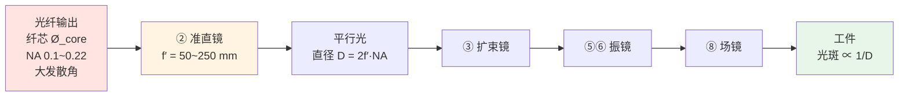

# 🎯 准直镜：光纤输出后第一片镜

> [!info] 一句话版本
> 光纤出来的是**大发散角的锥形光**，必须先用准直镜"拉直"成平行光，后面所有镜片才能正常工作。
> 这片镜子的焦距决定了**整条光路的光束直径**——**起点定错，后面全错**。
> 而且它有一个反直觉之处：**准直后并不是真的"零发散"**。

---

## 1. 为什么它是"起点"



**关键点**：准直后光束直径 `D` 是**后面所有计算的输入**。
光斑公式 `d = 1.83·λ·f·M²/D` 里的 `D` 就是它（经过扩束镜之后的值）。
**D 定错，光斑、焦深、镜片选型全都跟着错。**

---

## 2. 接头：QBH / QD / Q5

| 接头 | 来源与定位 | 功率上限 |
|---|---|---|
| **QBH** | 由 **Optoskand**（现属 Coherent）设计，业界成熟标准 | ≤ **10 kW** (CW) |
| **QD** | 欧洲汽车工业标准接口，内置传感器 | ≤ **20 kW** (CW) |
| **Q5 / LLK-B** | 兼容 TRUMPF LLK-B | — |

Optoskand 光纤可选芯径 **50–300 μm**。
准直单元通常兼容 QBH / QD / LLK-B(Q5)，接收座可接 RQB、HLC-8、LC-8、LLK-Q，
并内置**温度开关与安全互锁**。

> [!note] 💡 一个可主动利用的设计特性
> Optoskand 手册明确：**"每个准直单元都有一个孔径，用以确保 NA 过大的回返光无法被传输。"**
>
> 也就是说——**准直镜的通光孔径同时是一个 NA 光阑（空间滤波）**，
> 不只是"尺寸限制"。它既限制你放进来的光束，也挡住不请自来的回光。
> 见 [[05-光学篇/11-光阑、杂散光与回光防护]]。

---

## 3. 四个必须记住的公式

```text
① 准直后光斑直径    Ø_beam = 2 · f′ · NA            （多模，近场）
② 多模残余发散角    θ = Ø_core / (2 f′)              ★ 必然非零
③ 单模发散角        θ = 2λ / (π · Ø_beam) = λ / (π · f′ · NA_e²)
④ 瑞利长度          z_R = π · Ø_beam² / (8λ)
```

| 符号 | 含义 | 单位 |
|---|---|---|
| `f′` | 准直镜焦距 | mm |
| `NA` | 光纤数值孔径 | — |
| `Ø_core` | 纤芯直径 | mm |
| `λ` | 波长 | mm |
| `Ø_beam` | 准直后光束直径 | mm |

> [!important] 式 ② 是最反直觉的一条
> **多模光纤准直后必然存在几何发散角 `θ = Ø_core/(2f′)`，无法做到零。**
> 它在准直镜出口处**直径最小**，之后**线性增大**。
>
> 所以"准直"这个词本身有点误导——它不是"变成绝对平行光"，
> 而是"把发散角压到足够小"。**纤芯越粗、焦距越短，残余发散越大。**

### 3.1 ⚠️ NA 用哪个定义，差别很大

多模光纤标称的 `NA_nom` 是按高斯角分布的 **1%~5% 电平**定义的，
直接代进公式会**高估**光斑。换算到 **1/e²** 电平需要乘修正因子：

| NA 定义电平 | F_NA 修正因子 |
|---|---|
| 1% | 0.76 |
| 3% | 0.66 |
| 5% | 0.61 |

```text
Ø_beam = (1 / F_NA) · f′ · NA_nom
```

⚠️ **厂商手册的 NA 用哪个电平必须问清**，否则算出来的光斑差 30% 以上。

---

## 4. 🔬 关键算例：一个"看着合理其实偏紧"的配置

> [!example] 🔬 练习 5.1 —— 纤芯 50 μm、NA 0.12、f′ = 100 mm
> ```text
> ① 准直后光斑：Ø_beam = 2 × 100 × 0.12 = 24.0 mm
> ② 多模残余半角：θ = 0.05 / (2 × 100) = 0.25 mrad
> ③ 瑞利长度：z_R = π × 24² / (8 × 1.07e-3) ≈ 210 m   （λ = 1070 nm）
> ④ 若按 1/e² 电平（NA_e² ≈ 0.069）：Ø_beam = 13.8 mm
> ```
>
> **⚠️ 问题来了**：24 mm 已经**超出 Ø25 mm 准直镜组的可用范围**。
>
> Coherent 数据手册给出的 **Max Beam NA** 表（这才是选型的正确姿势）：
>
> | 组件 | f = 100 mm 允许的最大光束 NA（Gauss / Flat-top） |
> |---|---|
> | **D25**（Ø25 mm） | **0.069 / 0.098** |
> | **D50**（Ø50 mm） | **0.146 / 0.203** |
>
> 你的 NA = 0.12 **超过了 D25 的 0.098 上限** → 光束会被削。
>
> **两个解法**：
> 1. 换 **D50** 组件（Ø50 mm）
> 2. 把准直焦距降到 **约 60~85 mm**
>
> 💡 **这就是"先算再买"的价值**：这套配置看起来很常规，实际上偏紧。

> [!note] 为什么"截断"是坏事
> Sill 用**截断比 T = 入射光束直径 / 通光孔径**描述这件事：
> - `T = 1`：1/e² 光束直径正好等于通光孔径
> - **`T < 0.5`：近似无截断**（推荐做法是把光束限制在**不小于 1.5 倍** 1/e² 直径，把损耗压到 1% 以下）
>
> 截断不只是"损失功率"——它会**改变焦斑的形状与能量分布**（这正是 [[05-光学篇/02-F-θ 场镜（平场聚焦镜）]] 里
> C=1.83 那个系数的由来）。

---

## 5. 厂商一手规格（Coherent 准直单元，1030–1090 nm）

| 项目 | D25 | D50 |
|---|---|---|
| 最大 CW 功率 | 水冷 **10 kW** / 风冷 **3 kW** | 水冷 **12 kW** / 风冷 **5 kW** |
| 可选焦距 | 50 / 60 / 70 / 85 / 100 mm | 100 / 120 / 140 / 160 / 200 / 250 mm |
| 光学直径 | 25 mm | 50 mm |
| **Z 向焦距公差 Δzc** | **±100 μm** | **±100 μm** |
| 角向偏差 Δαc | <3.0 → <2.0 mrad | <2.0 → <1.0 mrad |
| **热致焦移 (Δz/z_R)/kW** | 典型 **<0.1** | 典型 <0.1 |
| 材料 / 表面质量 | 合成熔石英；40/20 | 同 |
| 冷却 | 水 2.0 L/min，15–35 °C | 同 |
| 温度开关 | 70 °C ± 5 °C | 同 |

> [!important] 三个工程含义
> 1. **Δzc = ±100 μm** —— 这就是"Z 向调焦"的**量化公差**。装调时焦面位置的重复性至少要优于这个量级。
> 2. **热致焦移 <0.1 (Δz/z_R)/kW** —— 千 W 级激光跑起来，焦点会漂。这是**必须能做在线补偿**的理由。
> 3. **焦距公差 ±0.5%（EFL @1070 nm）** —— 选型别把名义值当实际值。

**其他厂商规格佐证**：Wavelength OE 准直器覆盖 NA 0.11–0.22、f 50–250 mm；
功率分级 <1000 W @Ø25、<2000 W @Ø40、<3000 W @Ø50。

---

## 6. 怎么判断"准直调好了"——两套一手判据 ⭐

> [!danger] 不要靠"看远场光斑圆不圆"来判断
> 不可靠。下面两套判据都有厂商原文依据。

### 判据 A：台架法（打靶等径）

```text
把光打到约 z_R/2 = π·Ø_beam² / (8λ) 远的目标上
判据：靶上光斑直径 ≈ 准直器出口直径
      且中途【没有会聚焦点】
```

**算例**（Ø_beam = 24 mm、λ = 1070 nm）：`z_R/2 ≈ 105 m` —— 需要 100 米左右的距离。

⚠️ **`f′ > 30 mm` 时建议改用剪切干涉仪**（打靶法在这个量级已经不灵敏）。

### 判据 B：整机两点等径法（最实用）⭐

来自 RAYLASE AXIALSCAN-50 DIGITAL II 手册原文：

```text
1. 在振镜入光口十字线位置【A】打热敏纸
   → 光束直径必须小于手册规定的【输入孔径】
2. 移到位置【B】再打一次
3. 判据：B 处直径应与 A 处【相同】
   若 B 处大于 A 处 → 说明光束发散过大
   → 通过调整【扩束镜或准直器】把 B 处直径降下来
```

> [!important] 为什么这是"最贴近实际装机"的判据
> 它直接在**振镜入口**验收，而不是在实验室台架上。
> 装完机就能测，不需要 100 米距离，也不需要额外仪器。
> **日常维护就靠它。**

---

## 7. 准直不良的后果（含定量数据）

### 7.1 光斑变大、焦深变短

```text
d₀ = 4 M² λ f / (π D)                    （聚焦光斑）
d(Δz) = d₀ · √(1 + (Δz / z_R)²)          （离焦后的光斑）
z_R = π w₀² / (M² λ)                      （瑞利长度）
```

**离焦响应算例**（d₀ = 50 μm、M² = 1.1、z_R = 1.67 mm）：

| 离焦量 Δz | 光斑变成 | 倍数 |
|---|---|---|
| 1 mm | 58 μm | ×1.17 |
| 3 mm | 103 μm | ×2.06 |
| 5 mm | 158 μm | ×3.16 |

**M² 的影响**（同光斑 d₀ = 100 μm）：

| M² | z_R | 焦深 ≈ 2z_R |
|---|---|---|
| 1.05 | 6.99 mm | 14.0 mm |
| 4 | 1.84 mm | 3.7 mm |
| 8 | 0.92 mm | 1.8 mm |

> [!important] **M² 每增大一倍，同光斑下焦深减半。**
> 这就是为什么选激光器**不能只看功率**。

### 7.2 M² 与光纤激光器规格（一手）

IPG YLR 数据手册：

| 光纤 | 规格 |
|---|---|
| 单模 | **M² < 1.1**（≤3 kW） |
| BPP | **<2 / <5 / <10 mm·mrad** @ 50 / 100 / 200 μm 芯径 |

按 `BPP = M²λ/π`（λ=1070 nm）换算 ≈ **M² < 5.87 / 14.68 / 29.36**。

> [!warning] ⚠️ 这里有个口径陷阱
> 手册**未注明 BPP 的取值位置**（光纤输出端 vs 准直后）——两种口径不可混用。
> 而且"50 μm 多模的 M² 到底是多少"**未找到独立的一手数值**。
> 需要时**向激光器厂商索取你那个型号的实测 M²**。

### 7.3 离焦对焊缝成形的实测影响（论文数据）

Han 等（*Lasers in Engineering* 54, 2023）：5083 铝 + 5183 焊丝，TruDisk 10002，
1800 W，1.2 m/min，离焦 −9 … +15 mm。

| 离焦量 | 现象 |
|---|---|
| **+1 ~ +5 mm** | 大量飞溅、熔池剧烈波动、**表面成形差**；+3 mm 时熔深最大（2606 μm）、熔宽 2970 μm，但**内部有孔洞、截面不对称** |
| −9 < f ≤ +1 或 +7 ≤ f < +15 mm | 液桥稳定、**无飞溅**、表面光滑 |
| f = −9 或 +15 mm | 转为滴状过渡 |

**同设备同功率，仅改变离焦，熔深可在 290 ~ 2606 μm 间变化（约 9 倍）。**

⚠️ 本库**未找到**"准直偏差 (mrad) → 光斑增大量"的厂商级容差表，也没找到"准直不良 → 锥度增加多少度"的定量回归式。这两项**不存在公开的一手数据**，需要自己实测。

---

## 8. 功率与散热

| 现象 / 措施 | 说明 |
|---|---|
| **50 W 是分水岭** | Sill 指出：**从 1064 nm 约 50 W 平均功率起**，焦距位置偏移即可导致工艺质量下降，需要**在线调整** |
| 光学胶是瓶颈 | 高功率必须用**无胶/气隙设计**（胶层吸收会导致 CW 阈值骤降） |
| GRIN 热透镜 | 梯度折射率元件自带的额外热问题 |
| 方案 | 熔石英元件 + 低吸收镀膜；水冷/风冷分级 |

**热漂移的量化**（Coherent）：**热致焦移 <0.1 (Δz/z_R)/kW（典型）**。
💡 意味着 10 kW 时焦点可能漂出 1 个瑞利长度量级——**这就是高功率必须做在线焦点补偿的原因**。

---

## 9. ⚠️ 常见误解

| # | 说法 | 核查结果 |
|---|---|---|
| 1 | 准直后是平行光，发散角为零 | ❌ 单模仍有 `θ=2λ/(πØ)`；**多模必然有 `θ=Ø_core/(2f′)` 的几何发散**，且出口处直径最小、之后线性增大 |
| 2 | 直接用标称 NA 算光斑 | ⚠️ 会**高估**。NA_nom 按 1%~5% 电平定义，换算到 1/e² 要乘 F_NA = 0.76/0.66/0.61 |
| 3 | 准直镜焦距越长越好 | ❌ `Ø=2f′·NA` 随 f **线性增大**，很快撞上准直镜孔径与下游振镜孔径。Coherent 的 Max Beam NA 表就是这条约束的产品化 |
| 4 | 1/e² 直径内就是全部能量 | ❌ 直径 2w 内只有 **86.5%**，其余 13.5% 在圈外 |
| 5 | 准直镜孔径只是尺寸限制 | ⚠️ 不全面。它还**阻挡 NA 过大的回返光**，兼具 NA 光阑功能 |
| 6 | 用眼睛看远场光斑圆不圆就能判断准直 | ❌ 不可靠。用台架打靶等径法或**装机两点等径法**；f′>30 mm 用剪切干涉仪 |
| 7 | 50 μm 纤芯配 NA 0.12、f=100 mm 是常规配置 | ⚠️ **偏紧**：Ø=24 mm 已超 D25 组件上限，需换 D50 或把 f 降到 60~85 mm |

---

## ✅ 自检

- [ ] 能写出准直后光斑与残余发散的两个公式
- [ ] 知道**多模准直后必然有残余发散**，且与纤芯成正比、与焦距成反比
- [ ] 会算 `Ø_beam = 2f′·NA` 并**校验它对不对得上镜片孔径**
- [ ] 知道 NA 有电平定义问题（F_NA 修正）
- [ ] 会做**装机两点等径法**验收准直
- [ ] 知道 M² 每翻倍焦深减半
- [ ] 知道 50 W 以上就要担心热致焦移

---

## 📖 原厂依据

> [!quote] 来源
> - **准直公式（单模/多模/发散角/F_NA 修正）**：Schäfter+Kirchhoff（SUKH）技术文档
>   <https://www.sukhamburg.com/support/technotes/fiberoptics/coupling/collimatingsm/diameter.html>；
>   多模 <https://www.sukhamburg.com/support/technotes/fiberoptics/coupling/mm/collimatingmm.html>；
>   单模发散角 <https://www.sukhamburg.com/support/technotes/fiberoptics/coupling/collimatingsm/divergence.html>
> - **准直验收判据（台架法）**：SUKH 实用准直
>   <https://www.sukhamburg.com/support/technotes/fiberoptics/coupling/mm/collimatingmm/practicalcollimation.html>
> - **准直单元规格（D25/D50、焦距、Δzc、热致焦移、Max Beam NA 表）**：Coherent 数据手册
>   <https://www.coherent.com/resources/datasheet/components-and-accessories/collimating-units-1030-1090nm-ds.pdf>
> - **QBH/QD/Q5 接口、孔径兼作 NA 光阑**：Coherent/Optoskand Beam Delivery 手册
>   <https://cdn.komachine.com/media/product-catalog/laser-spectra_108901_zzmcpd.pdf>
> - **截断比 T 与"≥1.5× 1/e² 直径"规则、50 W 热漂移阈值**：Sill Optics 技术指南
>   <https://www.silloptics.de/en/service/sill-technical-guide/laser-optics/laser-optik-grundlegende-erklaerungen>
> - **装机两点等径法、输入孔径 20 mm**：RAYLASE AXIALSCAN-50 DIGITAL II 手册
>   <https://ilphotonics.com/wp-content/uploads/2025/11/RAYLASE-CSANNER-HEAD.pdf>
> - **M² 定义、瑞利长度与焦深、离焦响应公式**：RP Photonics
>   <https://www.rp-photonics.com/m2_factor.html>、<https://www.rp-photonics.com/rayleigh_length.html>
> - **高斯光束 86.5% 功率定义**：RP Photonics
>   <https://www.rp-photonics.com/gaussian_beams.html>
> - **准直器功率分级**：Wavelength Opto-Electronic
>   <https://www.wavelength-oe.com/laser-collimators/>
> - **离焦 → 焊缝成形实测数据**：Han 等，*Lasers in Engineering* 54 (2023) 377–389
>   <https://www.oldcitypublishing.com/wp-content/uploads/2023/04/LIEv54n4-6p377-389Han.pdf>
> - **IPG YLR M²/BPP 规格**：IPG 数据手册
>   <https://api.oe1.com/static-files/products/datasheet/6983716783507656704.pdf>
>
> ⚠️ **诚实声明（本库调研明确"未找到"的项）**：
> 1. **准直偏差 (mrad) → 光斑增大的厂商级容差表**——不存在，只能自算。
> 2. **"50 μm 多模 M² = ?" 的独立一手数值**——IPG 只给 BPP，且未注明取值位置。
> 3. **准直/离焦量 → 锥度角 (°) 的定量回归式**——未找到。
> 4. **"1/e² 直径 ≤ 孔径 × 60~70%"的厂商明文**——不存在。本文改用两条一手替代依据
>    （Coherent Max Beam NA 表 + Sill 的截断比 T 规则）。
>
> 💡 文中算例为按已标源公式自行代入计算，非厂商原文数值。

---

## 🔗 相关

- 上一篇：[[05-光学篇/04-扩束镜与变焦扩束镜组]]
- 下一篇：[[05-光学篇/06-光束整形元件（DOE、轴锥镜、微透镜阵列）]]
- 光束直径怎么用：[[05-光学篇/13-光斑尺寸与焦深计算]]
- 准直镜孔径与回光：[[05-光学篇/11-光阑、杂散光与回光防护]]
- 光学篇入口：[[05-光学篇/00-光路总览：从 3 轴到 5 轴]]
- 回到入口：[[🏠 开始这里]]
