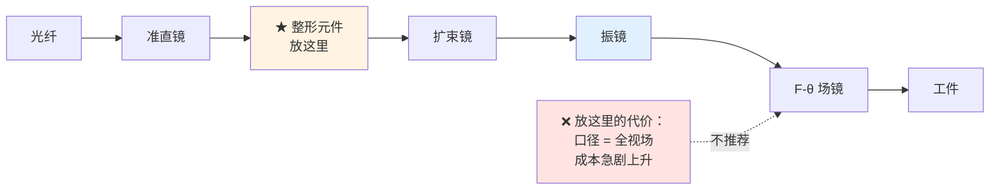

# 🎯 光束整形元件（DOE / 轴锥镜 / 微透镜阵列）

> [!info] 一句话版本
> 前面几篇的镜片都是"把光**搬运**到该去的地方"，光束整形元件干的是另一件事：
> **把光强分布改造成想要的样子**——平顶、环形、线形、多焦点。
> 它们**一律装在振镜之前**，而且**改造得越彻底，对离焦越敏感**。

---

## 1. 为什么装在振镜之前（不是之后）

> [!important] 三条理由，从硬到软
> 1. **场镜的限制**：振镜之后只有 F-θ 场镜，它的输入孔径、工作距离、远心度、畸变
>    必须与扫描系统**联合优化**——没有空间再插元件
> 2. **口径会爆炸**：振镜之后的元件口径必须覆盖**整个扫描视场**，口径随扫描角**线性增大**
> 3. **厂商原话**（Sill）：限制因素通常**不是** F-θ 镜的通光孔径（Ø35 mm），
>    而是**扫描系统的光束入射孔径**
>
> **结论**：整形元件放振镜前，用细光束，便宜且不影响扫描。



⚠️ **对振镜孔径的硬要求**：RAYLASE AXIALSCAN-50 DIGITAL II 输入孔径 **20 mm**，
明确"**不得超过允许的最大输入光束直径**"，开机前必须确认未超限。

---

## 2. 平顶光的两种技术路线 ⚠️ 机制完全不同

> [!danger] 这两条路线的机制不同，选型时**不能混着理解**
> | 路线 | 元件 | 机制 | 优点 | 限制 |
> |---|---|---|---|---|
> | **场映射**（field mapping） | 非球面镜 / DOE 整形器 | 对单模相干光做**确定性**能量重分布 | 边缘陡、波前平坦、景深大、**无散斑** | 对输入束径/指向**极敏感** |
> | **光束积分**（beam integration） | 微透镜阵列 / 复眼 / 光管 | 把光切成多子束再叠加，打乱波前 | 适合多模/非稳腔光源 | 相干光下产生**散斑/干涉条纹**；工作面被严格限定 |

**怎么选**：
- **单模激光 + 要干净平顶** → 场映射（非球面/DOE）
- **多模激光 + 只要均匀** → 光束积分（微透镜阵列）

**折射式场映射产品实例**：AdlOptica πShaper（非球面，准直高斯 → 准直平顶，波前平坦，长距离稳定）、
asphericon a|TopShape。

**微透镜匀化器的关键无量纲数**：**菲涅耳数 F_N**——实用非成像匀化器应取 **F_N > 10**。
周期阵列 + 空间相干照明会产生**光栅干涉条纹**（部分相干或旋转扩散片可平滑，
⚠️ 旋转扩散片**仅对连续光有效**）。

---

## 3. DOE：衍射光学元件

### 3.1 分束原理

周期性类光栅 DOE 把单束分成若干衍射级次，各分束在尺寸、发散、强度分布、偏振、光束质量上
互为**相同副本**。光栅方程：

```text
Λ · sinα = m · λ

Λ = 光栅周期     α = 衍射角     m = 级次
```

设计波长偏差 **1–2% 以内可接受**。

**最小输入光束**：`≥ 3 × 光栅周期 Λ`（否则分不出干净的级次）。

### 3.2 衍射效率：台阶数决定一切 ⭐

多台阶相位光栅的效率：

```text
η = (sinc(π/N))²

N = 相位台阶数
```

| 相位台阶数 N | 进入设计级次的效率 |
|---|---|
| **2（binary）** | ±1 级各 **40.5%**，两级合计 **≈81%** |
| 4 | ≈81% |
| 8 | ≈95% |
| 16 | ≈98.7% |
| **连续（kinoform）** | → **100%**（理想标量理论） |

⚠️ 上表是"进入设计级次"的**标量理论值**，**不等于含零级/杂散级的总透过率**。

**厂商实测口径**：

| 类型 | 效率 | 零级（残留） |
|---|---|---|
| binary 分束器 | 约 **80%** | **0.3–0.6%**（占输入） |
| 多台阶分束器 | **>95%** | **≤0.05%** |

**二元 vs 多台阶的权衡**：

| | binary | 多台阶 |
|---|---|---|
| 点阵 | 仅**中心对称**点阵 | **任意**点阵 |
| 全角 @1064 nm | 可达 **40°** | 约 **10°** |
| 成本 | 低 | 高 |

### 3.3 ⚠️ 零级问题——选型时一定要问

> [!danger] 零级是"漏过去的光"，偶数点阵时它不属于任何需要的级次
> 厂商实测：
> - **1×6（偶数）**：零级 = 输入的 **1.57%** → 纯粹是损耗
> - **1×7（奇数）**：零级 = 其他所需级次平均能量的 **74.9%** → 零级**本身就是所需输出之一**
>
> **工程建议**：对零级敏感的高功率/效率关键工艺，**推荐奇数点阵设计**。

### 3.4 分束器一手规格

| 项目 | 数值 |
|---|---|
| 双点（1×2）功率效率 | 近 **80%**（受物理限制） |
| 多点（>2）二元刻蚀 / 多层刻蚀 | 近 **85%** / 近 **95%** |
| 剩余功率去向 | 分配至其他（寄生）级次 |
| 零级强度 | 约 **1%** 输入（IR）；**UV 通常更高** |
| 点间距 / 焦面光斑 | `D = WD × tan(S.A.)`；`d = 4·WD·λ/(π·B.S.) × M²` |
| 均匀性 | 1×2 与 2×2 可达 **±1%**，其他设计明显更差 ⚠️ 需向厂商询具体值 |

### 3.5 平顶整形器一手规格（Holo/Or）

| 指标 | 数值 |
|---|---|
| 均匀性 / 效率 | 典型 **±5%** / **>95%**（StableTop 均匀性 **<5%**） |
| 过渡区 | 典型 ≈ 同口径同工作距离下的衍射极限光斑（约 1×DL；StableTop 约 0.5×DL） |
| X-Y 位移 / 输入直径容差 | 输入光束的 **5%** / **5%** |
| 波长 / 倾斜 / 椭圆度容差 | ±2% / ±5° / 5% |
| 工作距离容差 | **< 光斑尺寸的 50%** |
| 平顶光斑下限 | 不可小于衍射极限，实际取 **3–5×** |
| 输入要求 | 单模 TEM00、**M² < 1.3**；光路所有孔径 **≥2×**（最好 >2.5×）光束 1/e² 尺寸 |

> [!warning] 最后一行的"容差 5%"读起来吓人，但这就是场映射路线的本质
> 它对输入光束的尺寸和指向**极其敏感**——因为它是按"输入是什么样"来设计能量重分布的。
> 输入端一变，输出就不平了。**这也是它同时能给出"无散斑"的原因。**

---

## 4. 轴锥镜与贝塞尔光束

### 4.1 原理

轴锥镜是**锥面棱镜**，靠**干涉**在光轴上形成**焦线**；
在重叠区（景深内）复现贝塞尔特性。
⚠️ 真贝塞尔束需要无限能量，轴锥镜只给"**近似无衍射**"实现。

### 4.2 三个关键公式

```text
① 无衍射区长度（小角近似）
   DOF ≈ R / ((n − 1) · α)

② 环直径
   d_r ≈ 2 L · tan[(n − 1) · α]

③ 环厚度 ≈ R  且【与距离无关】★

R = 输入束半径     α = 锥面角     n = 折射率     L = 距元件距离
```

> [!important] 式 ③ 是个很有用的特性
> **环厚度 ≈ 输入束半径，且不随距离变化**；而**环直径随距离线性增大**。
>
> 也就是说：移动工件只改变环的**大小**，不改变环的**粗细**。
> 厂商实测（α=20°、4 mm 输入束）：
> - L = 228.6 mm → 环径 **73.66 mm**
> - L = 355.6 mm → 环径 **114.3 mm**
> - 两处**环厚都保持 2 mm** ✅

**输入束越大 → 重叠区越长。**

### 4.3 元件质量的门槛

| 指标 | 量级 |
|---|---|
| 锥尖圆角 | 普通 >50 μm；**精密 <10 μm** |
| 双轴锥组合角度偏差 | 需在 **0.05°** 内 |
| 倾斜 | **>1″ 即显著畸变环形状** |

💡 结论：轴锥镜是**对装调很敏感**的元件。

### 4.4 ⭐ 反射式 vs 透射式——集成关键结论

> [!danger] 想配合振镜做大面积加工，必须选反射式
> | | 透射式 | **反射式** |
> |---|---|---|
> | 锥尖曲率导致的轴向强度振荡 | ❌ 有 | ✅ 无 |
> | 色散 / 焦点漂移 | ❌ 有 | ✅ 无（无玻璃折射） |
> | 脉宽保持 | — | ✅ 保持 |
> | 配合振镜 + F-θ 做大面积加工 | **难以实现** | ✅ 可稳定配合 |
>
> **厂商手册明确**：透射式因锥尖曲率导致轴向强度振荡并有色散/焦点漂移，
> **难以配合振镜扫描做大面积加工**。

**反射式一手规格**（Cailabs CANUNDA-AXICON）：
轴锥角 0.25/0.5/1.0/2.0/3.0°（±1.5%）、口径 25.4 mm、通光孔径 >90%、
波前误差 **<15 nm RMS**、反射率 >99%、**LIDT 0.2 J/cm² @1030 nm @500 fs**。

### 4.5 为什么玻璃切割爱用它

贝塞尔束具备**延长的瑞利范围与自重建特性** → 形成**拉长焦区** →
使脉冲能量沿透明材料**深度均匀分布** → **减少锥度**。

| 一手证据 | 数值 |
|---|---|
| 专利工艺算例（178° 轴锥镜 + 3 mm 输入高斯束） | 近场交叠范围 ≈ **190 mm**，环宽 ≈1.5 mm；声称支持 **<1.1 mm** 玻璃 |
| 单脉冲飞秒贝塞尔束写出的纳米通道 | 直径 **200–800 nm**，**深宽比 >100**；通道壁近**平行** |
| 商业化模块 DeepCleave ZT-001-J | 1030/1064 nm、输入 6 mm、M²<1.3、**空气中 DOF ≈1 mm**、腰斑 1.8 μm、**总效率 >93%**、等效 NA≈0.35 |
| 焦区长度对比 | 贝塞尔束中心焦区比常规聚焦光学**长 10–100 倍**；反射式轴锥镜在 50×50 mm 幅面单道切透玻璃，过渡区 **<10 μm** |

---

## 5. 微透镜阵列 / 匀化器

**机制**：把光切成多子束再叠加，打乱波前 → 均匀。

**关键无量纲数**：**菲涅耳数 F_N**——实用非成像匀化器应取 **F_N > 10**。

### 5.1 ⚠️ "均匀性"数字不可横向比较

> [!danger] 这是本篇最实用的一个警告
> 不同厂商用的**定义不同**，数字看着差不多，实际不是一回事：
> - 厂商 A：`±2%`
> - 厂商 B：`非均匀性 1%`
> - 厂商 C：`CV < 2%`
> - 厂商 D：`±5% 峰值`
>
> **它们不能横向比较。**
>
> **ISO 13694** 的正规指标是：
> - **plateau uniformity** `U_p = ΔE_FWHM / E_max`（理想平顶 U_p = 0；仅高斯噪声 ≈0.022；多正弦模式 ≈0.275）
> - **edge steepness**：10% → 90% 强度的**过渡距离**
>
> 询价时**直接要 ISO 13694 定义下的数值**，不然比不了。

**效率**：DOE 扩散器 **75%–98%**。

**高功率注意**：kW 级下匀化器吸收引起**热透镜**，需低吸收熔石英；
脉冲工况须遵守 LIDT（**含光管内的中间焦点**——那里功率密度最高）。

---

## 6. 柱面镜：做"线光斑"

柱面镜只在**一个维度**有光焦度，另一维长度可任意延伸而不影响焦距。

```text
单轴准直线宽  d = 2 f · tan(θ/2)      （用于核算通光孔径）
              f = 该轴焦距    θ = 该轴发散角
```

> [!warning] 两个容易踩的点
> 1. **单柱面镜产生的"线"沿光轴呈三角形扩展**——真正的光片需要**两片正交柱面镜**
> 2. 圆化椭圆束的条件：两柱面镜**焦距比 = X/Y 发散角比**，**间距 = 两焦距之差**
>
> **制造误差的影响**：wedge → 非功率方向像移；centration → 光束偏折；
> axial twist → 像绕光平面旋转。

💡 **想要沿长度均匀的线光斑，用 Powell 透镜**（非球面屋脊形，把能量向线两端重分布，
消除简单柱面镜的中心热点与端部滚降）。

---

## 7. 平顶光 vs 高斯光：怎么选

### 7.1 基础差异

```text
高斯：    I(r) = (P/(πw²/2)) · exp(−2r²/w²)
          直径 2w 内含 86.5% 功率；FWHM ≈ 1.18w

超高斯：  I(r) = I_p · exp[−2(r/w)^(2n)]
          阶数越高边缘越陡
```

**边缘陡度**（10%~90% 过渡宽度 / 1/e² 直径）——本库按超高斯模型自算：

| 超高斯阶数 | 过渡宽度占比 |
|---|---|
| 2（高斯） | 42.2% |
| 4 | 27.8% |
| 8 | 16.3% |
| 16 | 8.8% |
| 20 | 7.2% |

> [!important] 平顶光的代价（核心取舍）
> **平顶光不是自由空间本征模**，传播中先收缩再扩张、边缘变圆滑；
> 而且 **M² 随边缘陡度无上限上升** → **焦深更短、对离焦更敏感**。
>
> 再加上场映射路线的输入端容差只有 **5%**——
> **"均匀"是用"娇气"换来的。**

### 7.2 工艺适配

| 工艺 | 更适合 | 依据 |
|---|---|---|
| 打标 / 划线 / 薄膜刻蚀 | **平顶** | Top-Hat 矩形光斑仅需 **8%** 重叠（圆形高斯需 ≥70%），速度提升约 **900%**；槽底 Ra = 10 nm；高斯光最多仅 **36.8%** 能量用于烧蚀 |
| 清洗 / 除漆 | **平顶** | 海洋钢除漆：平顶光下基体表面质量不变、效率比高斯高 **20%** |
| 焊接（钢/铜深熔） | **环芯 / 环形** | 环形光束显著提高匙孔稳定性、减少飞溅与气孔 |
| 焊接（紫铜，绿光 515 nm） | **椭圆 > 平顶** | 椭圆光斑飞溅最高减少 **93%**、颗粒平均小 **41%** |
| 增材制造 / SLM | **高斯仍为主流** | 环形-核心 80/20 等成形光斑可改变单道熔池几何 |

> [!warning] ⚠️ 一个广为流传但无依据的说法
> 网上常见"高斯焦深 ±17 mm vs 平顶 ±1 mm"这类对比——
> 本库**未追溯到一手来源，不采信**。
> 可信的定性结论只有：**平顶光焦深更短、对离焦更敏感**。

---

## 8. ⚠️ 常见误解

| # | 说法 | 核查结果 |
|---|---|---|
| 1 | 平顶光一定比高斯光好 | ❌ 边缘越陡 → M² 无上限上升、焦深更短、对离焦与输入尺寸极敏感（容差仅 5%） |
| 2 | DOE 分束能把 100% 功率分到各路 | ❌ 1×2 近 80%、多点二元 85%、多层 95%，其余进寄生级次；偶数点阵还有约 1% 零级（**UV 更高**） |
| 3 | 平顶光可以做到任意小 | ❌ 不可能小于衍射极限，实际取 **3–5×**；过渡区不能小于 0.5 倍 |
| 4 | 轴锥镜透射式反射式都一样 | ❌ 透射式有锥尖曲率导致的轴向振荡与色散，**难以配合振镜做大面积加工**；选反射式 |
| 5 | 匀化器的"±2%"和"±5%"能直接比 | ❌ 不同厂商定义不同，**不可横向比较**；要 ISO 13694 口径 |
| 6 | 整形元件可以放在振镜之后 | ❌ 口径会随视场线性增大，成本和风险急升；**一律放振镜前** |
| 7 | 单柱面镜就能做出均匀光片 | ❌ 单柱面镜的"线"沿光轴呈三角形扩展；需要**两片正交柱面镜**，均匀线光斑用 Powell 透镜 |
| 8 | 扩束比越大、振镜上光斑越小越好 | ❌ `d_out` 受**振镜入射孔径**限制，限制因素通常不是 F-θ 镜的通光孔径 |

---

## ✅ 自检

- [ ] 能说出整形元件为什么一律装在振镜前
- [ ] 能区分**场映射**与**光束积分**两条平顶光路线，并知道各自适合什么光源
- [ ] 记得 DOE 效率由台阶数决定（binary 81%、多台阶 >95%）
- [ ] 知道**零级问题**，以及为什么奇数点阵更受欢迎
- [ ] 会算轴锥镜的环直径与无衍射区长度，并知道环厚与距离无关
- [ ] 知道**配合振镜必须选反射式轴锥镜**（透射式不行）
- [ ] 知道匀化器的均匀性数字**不可横向比较**，要问 ISO 13694 口径
- [ ] 明白平顶光的代价是焦深更短、更娇气

---

## 📖 原厂依据

> [!quote] 来源
> - **DOE 分束原理、零级问题、二元/多台阶权衡、效率实测**：Holo/Or 应用笔记
>   <https://www.holoor.co.il/application/diffractive-beam-splitter-multispot-application-notes-2/>
> - **衍射效率理论 η=(sinc(π/N))²**：RP Photonics 衍射光学
>   <https://www.rp-photonics.com/diffractive_optics.html>
> - **平顶整形器规格（均匀性、过渡区、容差、孔径要求）**：Holo/Or 数据手册
>   <https://www.lasercomponents.com/fileadmin/user_upload/home/Datasheets/holo-or/top-hat_beam-shaper.pdf>
> - **分束器规格表（1×2/多点效率、零级、点间距公式）**：Holo/Or 数据手册
>   <https://www.lasercomponents.com/fileadmin/user_upload/home/Datasheets/holo-or/diffractive-beam-splitters.pdf>
> - **场映射 vs 光束积分两条路线**：RP Photonics 光束整形器 / 匀化器
>   <https://www.rp-photonics.com/beam_shapers.html>、
>   <https://www.rp-photonics.com/beam_homogenizers.html>
> - **F_N > 10、光栅干涉条纹、旋转扩散片限制**：微透镜匀化器论文
>   <http://ultra-jin.com/wp-content/uploads/2017/08/Microlens-Laser-Beam-Homogenizer-%E2%80%93-From-Theory-to-Application.pdf>
> - **ISO 13694 plateau uniformity 与 edge steepness**：DataRay
>   <https://dataray.com/blog/flat-top-beams-and-plateau-uniformity-calculations>；
>   Proton Optics（逐条转述 ISO 13694:2018）
>   <https://protonoptics.com/pages/iso-13694-2018-flat-top-beam-assessment-criteria>
> - **轴锥镜原理、DOF 与环直径公式、实测环厚**：Edmund Optics
>   <https://www.edmundoptics.com/knowledge-center/application-notes/lasers/an-in-depth-look-at-axicons/>
> - **轴锥镜锥尖圆角与角度容差**：RP Photonics 轴锥镜
>   <https://www.rp-photonics.com/axicons.html>
> - **反射式 vs 透射式、反射式一手规格**：Cailabs CANUNDA-AXICON 手册
>   <https://trokutsolutions.com/wp-content/uploads/2024/10/Cailabs_CANUNDA-AXICON_Brochure_EN_202307.pdf>
> - **贝塞尔束玻璃切割（拉长焦区、减少锥度）**：专利 WO2021035565A1
>   <https://patents.google.com/patent/WO2021035565A1/en>
> - **飞秒贝塞尔束纳米通道（深宽比 >100）**：Bhuyan et al., Appl. Phys. Lett. 97, 081102 (2010)
>   <https://pubs.aip.org/aip/apl/article/97/8/081102/339875/High-aspect-ratio-nanochannel-machining-using>
> - **DeepCleave 模块规格**：Holo/Or 数据手册
>   <https://www.lasercomponents.com/fileadmin/user_upload/home/Datasheets/holo-or/deepcleave_module.pdf>
> - **柱面镜公式与制造误差影响、Powell 透镜**：Edmund Optics 柱面镜应用说明
>   <https://www.edmundoptics.com/knowledge-center/application-notes/lasers/considerations-when-using-cylinder-lenses/>；
>   RP Photonics 光束整形器 <https://www.rp-photonics.com/beam_shapers.html>
> - **平顶 vs 高斯工艺适配（打标效率、清洗、焊接）**：JLMN 8(3) 2013
>   <https://doi.org/10.2961/jlmn.2013.03.0021>；Applied Optics 61(9) 2237；
>   nLIGHT 光束整形文章 <https://www.nlight.net/articles-content/is-beam-shaping-the-future-of-laser-welding-xfx2f>；
>   Springer 紫铜绿光椭圆光斑 <https://link.springer.com/article/10.1007/s00170-024-13180-z>
> - **超高斯传播特性与 M² 上升**：RP Photonics 平顶光束
>   <https://www.rp-photonics.com/flat_top_beams.html>
> - **振镜输入孔径 20 mm 硬限制、整形元件为何在振镜前**：RAYLASE AXIALSCAN-50 DIGITAL II 手册
>   <https://ilphotonics.com/wp-content/uploads/2025/11/RAYLASE-CSANNER-HEAD.pdf>；
>   Sill Optics 技术指南 <https://www.silloptics.de/en/service/sill-technical-guide/laser-optics/laser-optik-grundlegende-erklaerungen>
>
> ⚠️ **诚实声明（本库调研明确"未找到"的项）**：
> 1. **可引用的公开一手来源**给出"某品牌手机盖板玻璃产线用贝塞尔束切割"的具体型号/良率数据。
> 2. **"并行加工总吞吐量随分束数线性提升"的独立实测验证**（厂商声明不算）。
> 3. **"线长 = f(焦距)"的显式解析式**。
> 4. **"高斯 ±17 mm vs 平顶 ±1 mm"** 这类焦深对比的原始来源——本文明确**不采信**。
>
> 💡 文中"边缘陡度占比"表为按超高斯模型自行计算，非厂商原文数值。

---

## 🔗 相关

- 上一篇：[[05-光学篇/05-准直镜：光纤输出后第一片镜]]
- 下一篇：[[05-光学篇/07-偏振元件（半波片、四分之一波片、PBS）]]
- 扩束与孔径约束：[[05-光学篇/04-扩束镜与变焦扩束镜组]]
- 光斑与焦深：[[05-光学篇/13-光斑尺寸与焦深计算]]
- 光学篇入口：[[05-光学篇/00-光路总览：从 3 轴到 5 轴]]
- 回到入口：[[🏠 开始这里]]
