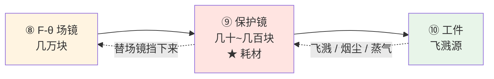
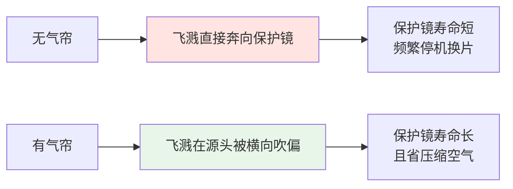

# 🔧 保护镜与窗口片

> [!info] 一句话版本
> 保护镜是光路上**最靠近工件、最脏、最便宜、也最先坏**的一片玻璃。
> 它存在的唯一理由是：**让几十块钱的耗材替几万块的场镜去死。**
> 行业术语叫**牺牲窗（sacrificial window）/ debris shield**——设计上就是准备被换掉的。

---

## 1. 它在光路的哪个位置



**为什么必须放在最后**：飞溅、金属蒸气、辅助气体里的油雾都是从工件产生的，
**谁离工件最近，谁就先挨打**。场镜是整条光路上最贵的一片，所以要在它前面挡一层可更换的。

> [!important] 更换成本对比（这才是设计逻辑）
> | 部件 | 相对成本 | 更换难度 |
> |---|---|---|
> | 保护镜 | 1× | 拆抽屉、几分钟 |
> | 场镜 | 10~100× | 需重新标定、调焦 |
>
> **"保护镜脏了就洗，洗不干净就换"** 之所以是标准做法，就是因为这个比值。

---

## 2. ⚠️ 先分清两个"保护窗"

> [!danger] 中文都叫"保护镜/保护窗"，英文都可能有 "protective window"，但是两件完全不同的东西
> | | **光路内保护镜** | **激光安全观察窗** |
> |---|---|---|
> | 装在哪 | **光路内部**，工件上方 | **设备外罩/观察门上** |
> | 保护对象 | **下游光学元件**（场镜、镜片） | **人眼** |
> | 镀膜要求 | **AR 增透**（要透光） | **高 OD 衰减**（要挡光） |
> | 关键指标 | 透过率、LIDT、厚度 | OD 值、防护波段 |
>
> ⚠️ **安全窗的 OD 额定值只在标定波段有效**：
> 标 "OD 6+ @190–540 nm" 的窗，**对 1064 nm 不提供该额定防护**。
> 采购与写文档时**必须区分**，混用会导致安全事故。

---

## 3. 材质选择

| 材质 | 适用波段 | 关键特性 | 备注 |
|---|---|---|---|
| **熔融石英**（含 JGS1 合成石英） | UV / VIS / NIR（1064、1070 nm） | 高功率激光器的**标准基材**；可耐约 500 °C | ⭐ 1064 nm 首选 |
| **硼硅玻璃** | VIS / NIR 低功率 | 便宜 | 与熔石英、蓝宝石并列出现在厂商标准配置表 |
| **蓝宝石** | VIS / NIR | 耐磨、耐刮擦、户外耐候 | 成本高；适合飞溅严重/需频繁清洁的场合 |
| **ZnSe** | CO₂ 10.6 μm（及 9.35 μm） | AR/AR @10.6 μm 总透射 **>99.4%**、单面反射 **<0.25%**；总吸收 <0.25%（标准）/ <0.15%（低吸收） | ⚠️ **有毒材料**，见下 |
| **N-BK7** | VIS / NIR 低功率 | 通用光学玻璃 | 高功率不用 |

> [!danger] ZnSe 是有毒材料
> ISO 21254-1 把 **ZnSe** 与 GaAs、CdTe、ThF₄、硫系材料、Be 一并列入**有毒材料警示清单**，
> 涉及**损伤测试后的样品处置**。
> 含义：CO₂ 激光的保护镜损坏后**不能随便当普通垃圾扔**，要按你的安规与环保要求处理。🔬

> [!warning] ⚠️ 一个数据缺口要如实说
> 本库**未找到**把"熔石英 / 蓝宝石 / ZnSe / 光学玻璃"四者的 LIDT 直接横向对比的
> **厂商一手数据表**。所以**不要**凭感觉说"熔石英的 LIDT 是 X J/cm²"。
> 需要时向厂商索取你那个型号的实测数据（见 [[05-光学篇/12-激光损伤阈值与光学件清洁维护]]）。

---

## 4. 镀膜与厚度

### 4.1 镀膜：AR 增透

| 配置 | 效果 |
|---|---|
| **双面 AR**（1064 nm 光纤激光典型值） | 透射 **>99%**、反射 **<0.2%** |
| 双面 AR（工业件厂商值） | 单面反射 **<0.1%**，1064 nm 总透射 **>99.5%** |
| **无镀膜** | 单面菲涅尔反射量级约 **4%**（双面约 8%） |

> [!important] 无镀膜 vs 镀膜：不只是"损失几个点"
> 未镀膜窗靠菲涅尔反射就有约 4%/面的损耗。
> 更麻烦的是**反射光会变成回返光与鬼像**（见 [[05-光学篇/11-光阑、杂散光与回光防护]]）。
> 💡 有一种二手说法："未镀膜熔石英约 96% 透射，≤3 kW 可接受，6 kW+ 不推荐"——
> ⚠️ **未在原厂处证实，谨慎引用**。工程上高功率一律用双面 AR。
>
> ⚠️ 另外：AR 膜**只在有限波段有效**，宽带膜抑制反射的能力弱于窄带激光线膜。

### 4.2 厚度

厂商标准品的常见厚度：**1.5 / 1.6 / 2.0 / 3.0 mm**（对应不同直径，例如 Ø19→3.0、Ø26.8→2.0、Ø30→1.5、Ø38→2.0 或 3.0、Ø50→1.5）。

> [!danger] 换保护镜时厚度不能随便变
> 厚度改变 → **安装位置改变** → 光程与焦面位置改变。
> **"直径相同"不等于"能互换"**——薄了或厚了都可能让焦点偏掉。
> 💡 换非原厂保护镜后，建议重新确认焦点位置。

⚠️ 本库**未找到**"何时必须用 1 mm、何时必须用 3 mm"的定量判据（如按气压载荷或热梯度给出的选型公式）。
公开资料只有"厚度必须与刀架/抽屉匹配"这类定性要求。

---

## 5. 更换判据

> [!danger] ⚠️ 没有公认的"功率掉 X% 就换"阈值
> 本库专门检索了 Precitec / TRUMPF / Bystronic / Raytools / WSX 等厂商的口径：
> **全部是按现象与报警判定，没有任何一家给出百分比阈值。**
>
> 网络上流传的"掉 5%/10% 就换"**没有一手依据**。
> **正确写法**：由**你的设备厂商维护手册**规定。
> 下表的现象判据是可靠的替代方案。

### 5.1 现象判据（多源一致）

| 现象 | 处理 |
|---|---|
| **雾状白斑** | 立即更换 |
| **黑色烧坑** | 立即更换——**烧坑擦不掉，涂层一旦损伤不可恢复** |
| **黄/褐色膜**（常见于辅助气体污染） | 立即更换 |
| **彩虹色热痕** | 更换 |
| **裂纹** | 更换 |
| **清洁后仍复现的热点** | 更换，**不要反复清洁** |
| **反复出现激光头温度/保护窗报警** | 更换 |
| 束内划伤、涂层缺陷 | 更换 |

### 5.2 检查方法（现场实用）

> [!example] 🔬 手电筒斜照法
> ```text
> 1. 停机、断电、确认安全
> 2. 拆出保护镜抽屉/卡匣
> 3. 在【暗背景】下用【强光低角度斜照】镜面
> 4. 观察：雾斑 / 烧坑 / 色膜 / 裂纹 / 指纹
> 5. 顺带检查密封圈（每次打开抽屉都应看）
> ```
>
> 💡 检查周期参考：**每班次**检查喷嘴与保护窗；每次打开抽屉检查密封圈。
> ⚠️ 这条周期来自维护指南类二手资料，**以你设备手册为准**。

> [!important] 为什么"污染物 → 功率下降"是一条链而不是一个点
> 厂商原文把机理说得很清楚：
> ```text
> 污染物吸收激光能量
>   → 局部过热
>   → 热透镜效应（thermal lensing）
>   → ① 不可逆热应力（基材）
>     ② 光束通过时功率损耗
>     ③ 焦点位置漂移          ← 容易被忽略！
>     ④ 涂层提前损伤
>     ⑤ 最终元件损坏
> ```
> **注意第 ③ 条**：污染不只是"变暗"，还会**改变焦点位置**。
> 所以"功率没掉但打不深"也可能是保护镜脏了。

---

## 6. 气帘保护（air knife / cross-jet）

厂商方案示例（Bergmann Steffen Tornadoblade）：在**飞溅产生点**就把焊接飞溅偏转开，
保持光学件与工艺区之间的空间洁净，从而提高保护玻璃寿命，
同时**大幅减少压缩空气消耗**。



⚠️ 本库**未找到**"有/无气帘时保护镜寿命提升倍数"的定量数据。💡 但方向是明确的。

**配套**：现代振镜扫描头普遍采用**密封壳体**防尘防水（例如 SCANLAB SCANcube III 系列明确宣传密封外壳）。

---

## 7. 光路里还有哪些"窗口"

| 窗口 | 位置 | 作用 |
|---|---|---|
| **保护镜 / 牺牲窗** | 场镜后、工件前 | 挡飞溅与工艺蒸气 |
| **激光器输出窗** | 激光器出光口 | 隔离环境 |
| **激光器壳体窗** | 激光器外壳 | 保持壳体无尘 |
| **扫描头密封窗 / 场镜后保护窗** | 扫描头内或出口 | 防尘防水 |
| **激光安全观察窗** | 设备外罩上 | **保护人眼**（⚠️ 与上面完全不是一类，见第 2 节） |

> [!note] 💡 输出窗为什么要做"楔角"
> 若输出耦合镜有显著透射，**基片后表面的反射会造成寄生标准具效应（etalon）或鬼光束**。
> 解决办法：后表面镀优质 AR 膜 + **基片做轻微楔角（例如 30 arcmin）**，
> 把鬼反射在**空间上分离**，避免它反馈回谐振腔。
>
> **这条思路贯穿整个光学篇**：凡是有平行表面的地方，就可能出现标准具条纹与回光
> ——这也解释了为什么取样镜、楔形窗都要做楔角（见 [[05-光学篇/10-分光取样镜与在线功率监测]]）。

**平行窗 vs 楔形窗**：
- **平行窗**：只产生轻微光束位移、不偏折，通常无需精密对准
- **楔形窗**：有确定楔角，会产生光束偏折，用于消除两表面寄生反射之间的干涉

---

## 8. 维护要点（详见下一篇）

> [!warning] 三条最容易犯的错
> 1. **干擦** → 灰尘颗粒划伤镀膜
> 2. **来回擦** → 只是把污物摊开
> 3. **反复清洁已损坏的保护镜** → 应直接更换（"Replace, do not over-clean"）
>
> 正确的清洁方法（drop-and-drag 法、指定溶剂、手势规范）
> 见 [[05-光学篇/12-激光损伤阈值与光学件清洁维护]]。

---

## ✅ 自检

- [ ] 能说出保护镜为什么装在最后、为什么是耗材
- [ ] 能区分"光路内保护镜"与"激光安全观察窗"（镀膜要求相反！）
- [ ] 知道 1064 nm 用熔石英、10.6 μm 用 ZnSe，且 ZnSe 有毒
- [ ] 知道"无镀膜约 4%/面损耗"和"双面 AR 透射 >99%"
- [ ] 知道更换判据是**按现象**，没有公认的百分比阈值
- [ ] 理解污染物 → 热透镜 → 功率损耗 **+ 焦点漂移** 这条链
- [ ] 知道换保护镜时厚度不能随便变

---

## 📖 原厂依据

> [!quote] 来源
> - **保护镜定义与作用**（"shield sensitive focusing and collimation optics from spatter, particles and process vapors"）：
>   SVS 激光保护窗 <https://www.svs-schweisstechnik.de/en/products/laser-protection-windows/>
> - **牺牲窗/debris shield 定义、镀膜与楔窗原理、擦拭方向要求、灰尘烧入**：RP Photonics 光学窗口
>   <https://www.rp-photonics.com/optical_windows.html>
> - **激光镜基片楔角（30 arcmin）与鬼反射**：RP Photonics 激光镜
>   <https://www.rp-photonics.com/laser_mirrors.html>
> - **飞溅沉积在保护窗导致停机**（Ilmenau 论文）：Cavitar
>   <https://www.cavitar.com/library/spatter-behavior-in-laser-beam-welding-process/>
> - **ZnSe 数据手册（透射 >99.4%、吸收 <0.25%）**：LASER COMPONENTS
>   <https://www.lasercomponents.com/fileadmin/user_upload/home/Datasheets/diverse-laser-optics/co2-laseroptics/znse-windows.pdf>
> - **ZnSe 属 ISO 毒性材料清单**：ISO 21254-1:2011 样本
>   <https://cdn.standards.iteh.ai/samples/43001/82e64c00f69642a3914423945df39eec/ISO-21254-1-2011.pdf>
> - **污染物 → 热透镜 → 功率损耗/焦点漂移/涂层损伤**（振镜厂商）：Scanner Optics
>   <https://www.scanneroptics.com/how-to-avoid-secondary-contamination-of-lens.html>
> - **气帘方案与"在源头偏转飞溅"**：Bergmann Steffen Tornadoblade
>   <https://www.bergmann-steffen.de/en/solutions/tornadoblade/>
> - **扫描头密封壳体**：SCANLAB SCANcube III 系列产品资料
>   <https://pdf.directindustry.com/pdf/scanlab-gmbh/scancube-iii-scan-heads/39164-400637.pdf>
> - **激光安全观察窗与 OD 波段限制**：Opt Lasers
>   <https://optlasers.com/laser-safety-window>
> - **更换判据（现象清单）与手电筒斜照法**：Lasvio（🟡 转销商，非原厂）
>   <https://lasvio.com/how-to-tell-when-your-fiber-laser-protective-window-needs-replacing/>；
>   Machinist's Vault 耗材周期 <https://machinistsvault.com/blogs/news/fiber-laser-consumable-replacement-intervals>
>
> ⚠️ **诚实声明**：
> 1. "功率下降 X% 即更换"的**定量阈值在本库调研中未找到任何一手来源**，
>    本文明确写为"由设备厂商维护手册规定"，**没有编造数值**。
> 2. 四类保护镜材质的 **LIDT 横向对照表**未找到厂商一手数据。
> 3. 保护镜厚度的**定量选型判据**未找到公开来源。
> 4. 💡 标 💡 的寿命提升、厚度影响为工程经验推断，不是厂商规范。

---

## 🔗 相关

- 上一篇：[[05-光学篇/08-合束镜与二向色镜]]
- 下一篇：[[05-光学篇/10-分光取样镜与在线功率监测]]
- 损伤阈值怎么算怎么比：[[05-光学篇/12-激光损伤阈值与光学件清洁维护]]
- 回返光的危害：[[05-光学篇/11-光阑、杂散光与回光防护]]
- 排错对照：[[05-光学篇/15-光学失效排错对照表]]
- 回到入口：[[🏠 开始这里]]
