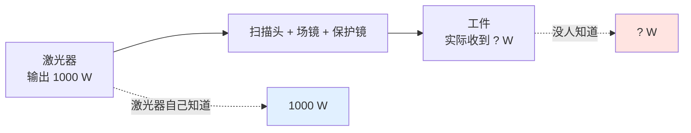
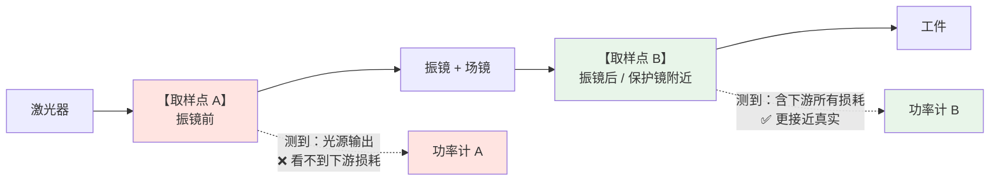

# 🔧 分光取样镜与在线功率监测

> [!info] 一句话版本
> 从主光路里"偷"一点点光（1%~10%）去打功率计，就能**实时知道激光实际出了多少力**。
> 关键不在"怎么偷"，而在**在哪偷**——取样点选错，测到的数就不是你要的数。

---

## 1. 为什么需要在线功率监测



**问题**：激光器报的功率是**它自己出口**的功率。
从出口到工件，中间经过振镜镜片、场镜、保护镜——每一片都会吃掉一点，
而且**这些损耗会随时间漂移**（保护镜污染、场镜热透镜……）。

> [!important] 一句话
> **工件处的功率损失 ≠ 激光器输出功率损失。**
> 两者是两个不同的量，混为一谈会导致误判"激光器坏了"。

---

## 2. 取样原理：菲涅尔反射法

最常见、最便宜的做法：**用一片未镀膜的光学面**，靠它天然的那点反射来取样。

厂家原文：用未镀膜光学面的**菲涅尔反射**"拾取入射光的 **1–10%**，
比例**取决于入射光的偏振态**"。

### 2.1 ⚠️ 分光比不是固定值

> [!danger] 这是最容易被忽略的一条
> **菲涅尔取样比随偏振态变化。**
>
> 后果链条：
> ```text
> 激光偏振态在传输中变化
>   （尤其经过振镜金属镜面多次反射后，s/p 比例会改变）
>     → 取样比漂移
>       → 功率监测读数漂移
>         → 你以为激光功率变了，其实只是偏振转了一点
> ```
>
> **工程含义**：如果要做**绝对**功率监测，必须要么
> ① 在取样前把偏振固定/净化，要么
> ② 用对偏振不敏感的取样方式（介质膜分光镜在近正入射时可做到非偏振）。

### 2.2 其他取样方式

| 方式 | 分光比 | 特点 |
|---|---|---|
| **未镀膜面菲涅尔反射** | 1–10%（随偏振变） | 最便宜，但比例不稳 |
| **介质膜部分反射镜** | 可按设计做到很宽的比例范围 | 比例稳定，但反射率**强烈依赖偏振**；近正入射时最易做到非偏振 |
| **级联两级取样** | 可做得更低 | 见第 3 节的专利结构 |

> [!warning] 关于 0.1% / 4% 这类数字
> **1%（乃至 1–10%）有厂商一手确认**（Thorlabs）。
> **0.1% 与 4% 未找到对应的厂商一手规格**——本库不写这两个数字，
> 需要时请在**具体型号的数据手册**上核实。

### 2.3 取样镜为什么要做楔角

取样镜的**后表面做成楔形**，目的是：
1. **避免内部条纹（internal fringes）**——平行平板内部多次反射干涉会产生
   随波长/角度变化的周期性透射纹波（标准具效应）
2. **消除鬼像**，并让前后表面反射偏折到**不同方向**，避免反馈回激光腔

**楔角与偏折量的关系**（小角度近似）：

```text
δ ≈ (n − 1) · α

δ = 偏折角      α = 楔角      n = 折射率
普通玻璃 n ≈ 1.5 时，偏折角约为楔角的一半
```

💡 楔角档位参考：2–10 arcmin（最小束偏折）/ 0.5°–2°（通用回光消除）/ 3°–10°（强分离）。
⚠️ 这一档位划分来自厂商技术页（二手），仅作参考。

---

## 3. 取样位置：本篇最重要的一节 ⭐

> [!important] 核心结论
> **振镜后取样能看到"实际到工件的功率"；振镜前取样只能看到"进入扫描头的功率"。**



### 3.1 证据链

**① 下游元件确实会显著改变到工件的功率**（✅ 一手）：
保护镜污染造成吸收↑ → 热透镜 → **功率损耗 + 焦点位置漂移 + 涂层提前损伤**。

**② 工艺侧的诊断共识也是"从最靠近工件的元件开始、向光源回溯"**（🟡 厂商技术文）：
> "Output power loss at the workpiece and output power loss at the laser source
> are not the same thing… trace the path of light backward, beginning with the
> component nearest the workpiece."

**③ 专利一手描述**（✅）：CN121261196A《高功率振镜焊接的**外部**激光功率闭环监测系统及监测方法》
公开了**级联分光取样**结构——一级反射镜倾斜安装在反射镜安装壳内，
其透过的激光再由二级反射镜反射，最后由集成式驱动采集模块采集功率信号，
目的是"提高监测精度、响应速度"。

> [!warning] ⚠️ 这里有一条要如实说明的边界
> 专利名里的"**外部**"说明：这类方案测的是**进入扫描头之前/之外**的功率，
> **不含**振镜镜片、场镜、保护镜的损耗。
>
> 而"振镜后取样更准"这一判断，本库**未找到任何对照实验数据**（振镜前 vs 振镜后的读数差异）
> ——它属于**机理论证**（由上面 ① ② 推出），不是文献直证。
> 本文明确标注，请勿当作已证实的结论引用。

### 3.2 怎么选

| 你的目的 | 取样点 |
|---|---|
| 监控**激光器本身**是否退化 | 振镜前（越靠近激光器越好） |
| 监控**到工件**的实际能量（闭环/工艺质量） | 振镜后、保护镜附近 |
| 两者都要 | 两处都放，用差值反推光路损耗 |

> [!note] 💡 一个实用推论
> **两处都放的价值 > 单放一处**：
> ```
> 振镜前读数 − 振镜后读数 ≈ 光路损耗
> ```
> 这个差值**突然变大**，就是"该查保护镜/场镜了"的早期信号——
> 比等到加工质量下降再查要早得多。

---

## 4. 功率闭环控制

| 环节 | 现状 |
|---|---|
| **取样** | 菲涅尔/介质膜分光，或级联两级取样（有专利公开） |
| **探测** | 光电二极管 + 积分/峰值保持 |
| **控制** | ⚠️ 厂商专有技术，**公开资料几乎没有** |
| **快速保护** | 扫描头可"检测到异常 10 ms 内自动关光"（厂商宣传） |

> [!warning] ⚠️ 本库未找到的内容
> **闭环控制律本身**（比例/积分参数、带宽、如何用取样功率去调激光器输出）
> 以及**闭环精度指标**，公开资料基本没有——这属于厂商专有技术。
> 有需求应直接向设备/控制卡厂商索取。

**一个重要的概念区分** ⚠️：
```text
材料反射率  ≠  实际回到激光器的回光功率
```
材料反射率高只说明"反射多"，但回光能不能真的回到激光器，
还取决于收集立体角、光纤耦合效率、光路几何等一连串因素。
**不要用材料的反射率去估算回光风险。**

---

## 5. 集成到光路时注意什么

| 注意点 | 原因 |
|---|---|
| **取样镜也要考虑 LIDT** | 它同样在光路里，同样会被打坏（见 [[05-光学篇/12-激光损伤阈值与光学件清洁维护]]） |
| **后表面做楔角 + AR** | 防标准具条纹与鬼像 |
| **取样光路要遮挡** | 取样后的杂散光不能乱跑（见 [[05-光学篇/11-光阑、杂散光与回光防护]]） |
| **偏振态要确认** | 菲涅尔取样比随偏振变（本篇第 2.1 节） |
| **探测器的响应波段要匹配** | 别用只标到 1100 nm 的探测器去测 10.6 μm |
| **探测器要有衰减** | 取样功率对你可能是 mW 级，对探测器可能仍然超标 |

> [!danger] 探测器很容易被打坏
> 1000 W 的 1% 就是 **10 W**——远超大多数光电二极管的承受能力。
> 取样光路里**必须**再加衰减片/积分球/漫射板，并核算探测器上的功率密度。
> 💡 这也是为什么工业设备的取样模块通常是**成品模块**而不是自己搭。

---

## ✅ 自检

- [ ] 能说出"工件处功率损失 ≠ 激光器输出功率损失"
- [ ] 知道菲涅尔取样的分光比**随偏振变化**，以及它为什么会漂移
- [ ] 能说出振镜前取样与振镜后取样**各能看到什么、各看不到什么**
- [ ] 知道楔形后表面的两个作用（消标准具条纹、消鬼像）
- [ ] 记住楔角偏折公式 `δ ≈ (n−1)·α`
- [ ] 知道探测器前面必须加衰减
- [ ] 明白"两处都放、用差值反推光路损耗"这个技巧的价值

---

## 📖 原厂依据

> [!quote] 来源
> - **菲涅尔取样 1–10%、随偏振变化**：Thorlabs 分光取样镜
>   <https://www.thorlabs.com/beam-samplers>
> - **楔形后表面避免内部条纹、镀 AR 消除鬼像**：Holmarc 分光取样镜
>   <https://www.holmarc.com/beam_samplers.php>（🟡 厂商页）
> - **介质膜分光比范围广、强烈依赖偏振、近正入射可非偏振**：RP Photonics 分光镜
>   <https://www.rp-photonics.com/beam_splitters.html>
> - **楔形窗的作用与 `δ ≈ (n−1)α`**：RP Photonics 楔形棱镜
>   <https://www.rp-photonics.com/wedge_prisms.html>
> - **激光镜基片 30 arcmin 楔角分离鬼反射**：RP Photonics 激光镜
>   <https://www.rp-photonics.com/laser_mirrors.html>
> - **污染物 → 热透镜 → 功率损耗 + 焦点漂移**（振镜厂商）：Scanner Optics
>   <https://www.scanneroptics.com/how-to-avoid-secondary-contamination-of-lens.html>
> - **级联两级取样专利**：CN121261196A《高功率振镜焊接的外部激光功率闭环监测系统及监测方法》
>   （北京正时精控科技，公开日 2026-01-02）
>   <https://www.imaibj.cn/patent/details/202511817087>
> - **"从最靠近工件的元件开始回溯"排查顺序**、**回光链路**、**材料反射率 ≠ 回光功率**：
>   whcstec 技术文 <https://whcstec.com/fiber-laser-back-reflection-damage-protection/>（🟡 非原厂手册）
> - **扫描头 10 ms 内自动关光**：Scanner Optics 振镜焊接页
>   <https://www.scanneroptics.com/galvo-laser-welding.html>（🟡 厂商宣传）
>
> ⚠️ **诚实声明**：
> 1. **"振镜后取样更准"这一比较本身，本库未找到对照实验数据**，
>    本文第 3 节明确标注为**机理论证**而非文献直证。
> 2. **闭环控制律与精度指标**未找到公开来源（厂商专有技术）。
> 3. **0.1% 与 4% 分光比**未找到厂商一手规格，本文未使用这两个数字。
> 4. 💡 标 💡 的楔角档位、两处取样差值技巧为工程经验推断。

---

## 🔗 相关

- 上一篇：[[05-光学篇/09-保护镜与窗口片]]
- 下一篇：[[05-光学篇/11-光阑、杂散光与回光防护]]
- 回返光的危害：[[05-光学篇/11-光阑、杂散光与回光防护]]
- 损伤阈值：[[05-光学篇/12-激光损伤阈值与光学件清洁维护]]
- 排错对照：[[05-光学篇/15-光学失效排错对照表]]
- 回到入口：[[🏠 开始这里]]
