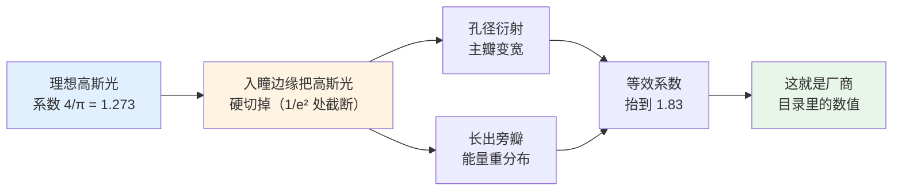
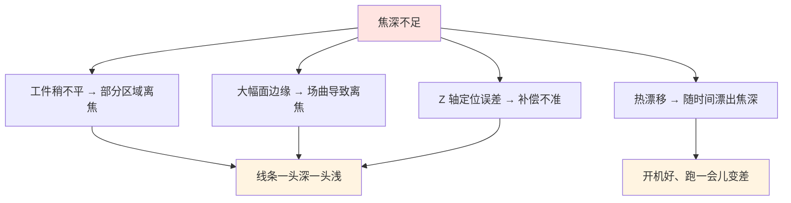
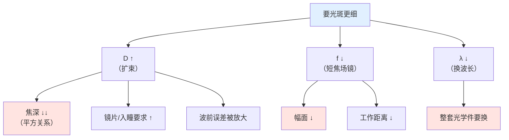

# 🎯 光斑尺寸与焦深计算

> [!info] 一句话版本
> 光斑多大、焦深多长，是**选型的两个硬指标**——它们决定了"能打多细"和"工件允许多不平"。
> 这篇把公式讲透：**哪来的、用哪个系数、怎么算、算完怎么用**。
> 配套计算器：`05-光学篇/代码/optics_calc.py`（自检 14 项，含厂商数据交叉验证）。

---

## 1. 先记住这个结论

```text
光斑 d ∝ λ · f · M² / D

λ = 波长 ↑  →  光斑 ↑
f = 场镜焦距 ↑  →  光斑 ↑
M² = 光束质量差  →  光斑 ↑
D = 入射光束直径 ↑  →  光斑 ↓
```

**四条反比/正比关系，工程上就是四个旋钮**：

| 想改光斑 | 手段 | 代价 |
|---|---|---|
| 光斑变小 | 缩短场镜焦距 f | 幅面变小 |
| 光斑变小 | 加大入射光束 D（扩束） | 焦深骤降、镜片要更大 |
| 光斑变小 | 换更短波长（1064 → 532） | 换整套光学件，成本高 |
| 光斑变小 | 用光束质量更好的激光器（M²↓） | 换激光器 |

> [!important] 而焦深与 D 的平方成反比
> ```text
> DOF ∝ (f/D)²
> ```
> 也就是说：**把光斑做细一倍（D 翻倍），焦深只剩四分之一。**
> 这就是"细光斑"的真实代价——不是换片镜子那么简单。

---

## 2. 光斑公式：两个系数，差 43.7% ⚠️

> [!danger] 本篇最重要的一条
> | 式子 | 系数 | 适用于 | 谁在用 |
> |---|---|---|---|
> | `d = 1.83 · λ · f · M² / D` | **1.83** | 入瞳在 **1/e² 处被硬截断**的高斯光 | ★ **Thorlabs / LINOS / Sill 等厂商标称口径** |
> | `d = 4λfM² / (πD)` | 4/π = 1.273 | **未截断**理想高斯光 | 教科书、部分在线计算器 |
>
> **两式里 D 的含义完全相同**，只是系数不同：
> ```text
> 1.83 / 1.273 = 1.4373   →  差 43.7%
> ```

### 1.83 是怎么来的



**实证差异**（λ=1064 nm、f=254 mm、D=8 mm、M²=1.1）：

```text
C = 1.83 口径：d = 68.0 μm
C = 4/π  口径：d = 47.3 μm
                ↑ 同一个系统，两个答案，差 44%
```

> [!warning] 怎么用才对
> - **和厂商手册对比 → 用 1.83**
> - 估算物理极限 → 用 4/π
> - **绝对不要拿两个结果互相对照**——那会让你以为厂商算错了
>
> 用计算器会同时打印两个值，标签写清楚了：
> ```bash
> python optics_calc.py spot 1064 254 8 --m2 1.1
> ```

### 2.1 还有一个坑：D 是哪里的直径

> [!danger] 公式里的 D 不是"激光器出射光斑"
> `D` = **场镜处的 1/e² 光束直径**，也就是**经过扩束镜之后**的直径。
> 把"激光器出射 3 mm"直接代进去，是本领域最常见的数量级错误。
>
> 正确链路：
> ```text
> 激光器出射（纤芯/NA）→ ② 准直镜 → 得 D₀
>                       → ③ 扩束镜（倍率 M）→ 得 D = D₀ × M
>                       → ⑧ 场镜处用这个 D 算光斑
> ```

### 2.2 光斑的"定义"也要对齐

| 口径 | 含义 |
|---|---|
| **1/e² 直径** | 强度降到峰值 1/e² 处的宽度 |
| **86.5% 功率直径** | 含 86.5% 总功率的束腰直径 |

**对理想高斯光，这两个是同一个数**——SCANLAB 与 Sill 都用这个口径。
所以不需要换算，但要知道厂商说的"光斑直径"有明确定义，不是肉眼看到的光点大小。

### 2.3 M² 的作用

`M²` 直接乘在直径上：

```text
d = C · λ · f · M² / D
```

| 激光类型 | M² 典型值 |
|---|---|
| 理想高斯 | 1.0 |
| 单模光纤激光 | ≲ 1.2 💡 |
| 多模 / 高功率固体 | 显著更高（可达 10 以上）💡 |

**工程含义**：同样标称功率的两台激光器，M² 差一倍 → 聚焦光斑差一倍 → 功率密度差四倍。
**选激光器时必须看 M²，不能只看功率。** ⭐

---

## 3. 焦深：被忽视的隐形约束

```text
DOF = 8 · λ · M² · (f/D)² / π            （瑞利长度定义，DOF = 2·z_R）
```

**注意 `(f/D)²`**——平方关系，极其敏感：

| 场镜 f (mm) | D = 10 mm | D = 20 mm | D = 30 mm |
|---|---|---|---|
| 100 | 0.226 mm | 0.057 mm | 0.025 mm |
| 160 | 0.579 mm | 0.145 mm | 0.064 mm |
| 254 | 1.459 mm | 0.365 mm | 0.162 mm |
| 330 | 2.462 mm | 0.616 mm | 0.274 mm |

> [!important] 焦深必须 ≥ 工艺容差
> 焦深要同时吃掉：
> ```text
> 工件平面度 + 装夹误差 + 热漂移 + 场镜残余场曲 + Z 轴定位误差
> ```
> **任何一项超了，就会出现"怎么调都打不均匀"。**

### 3.1 焦深不够的典型表现



---

## 4. 场曲：为什么边缘总是先出问题

场镜把焦面**压平**了，但只是"压得比较平"，不是绝对平。

> [!danger] ⚠️ 先分清三个完全不同的数字
> | 数字（f=160、y=100） | 含义 |
> |---|---|
> | **31.25 mm** | `y²/(2f)` 近似式 | ❌ 只是近似，偏高 9% |
> | **28.68 mm** | `√(f²+y²)−f` 精确值 | ⚠️ 但这是**完全没有平场校正的球面焦面** |
> | **≈ 0.2 mm** | **真实 F-θ 场镜的残余场曲** | ✅ Thorlabs FTH160-1064 官方曲线 |
>
> **28.68 mm ÷ 0.2 mm ≈ 143 倍**——场镜已经把场曲解决了约 99.3%。
> **拿 30 mm 去论证"边缘必然离焦"是错的**；真实残差是 0.2 mm 量级。

### 4.1 正确做法：查场曲曲线，不是套公式

```text
厂商数据表【不印】mm 级的平场偏差指标
但 Thorlabs 等厂商为每支镜头提供 "Field Curvature (mm) vs Deflection Angle (°)" 曲线图
→ 直接读你要用的偏转角处的离焦量
```

**FTH160-1064 官方曲线读数**（切向 / 弧矢）：

| 偏转角 | 切向面 | 弧矢面 |
|---|---|---|
| 轴上 0° | ≈ +0.199 mm | ≈ +0.199 mm |
| 20° | ≈ +0.14 mm | ≈ −0.137 mm（最大分离处） |
| 28°（额定最大角） | ≈ +0.11 mm | ≈ +0.19 mm |

→ **±28° 全幅面内，焦面偏离理想平面 ≲ 0.2 mm。**

### 4.2 上不上 Z 轴的判据（用残差，不用估算）

| 光斑直径 (1/e²) | 焦深 DOF | 0.2 mm 残差占比 | 要不要 Z 轴 |
|---|---|---|---|
| 12 µm | ±0.11 mm | 180% | ❌ 必须补偿 |
| 20 µm | ±0.30 mm | 68% | ⚠️ 需要 |
| 30 µm | ±0.66 mm | 30% | ⚠️ 边缘吃紧 |
| **50 µm** | **±1.85 mm** | **11%** | ✅ 不需要 |
| 100 µm | ±7.4 mm | 3% | ✅ 不需要 |

> [!important] 两个反直觉结论
> 1. **判据是「残余场曲 vs 焦深」，而"要不要 Z 轴"主要取决于【光斑大小】，不是幅面大小。**
> 2. **算幅面前先查场镜额定角**：`θ = r/f`。f=160 打 ±100 mm 需 **35.8°**，
>    而 FTH160-1064 只额定 **±28°** —— **幅面早就超规格了**，
>    这时该换长焦场镜或改预聚焦架构，而不是靠 Z 轴救。
>
> 详见 [[05-光学篇/03-动态聚焦镜组（Z 轴）]]。
>
> ⚠️ 另：`r²/(2f)` 这个估算式**只适用于"完全没有平场校正"的球面镜系统**（例如预聚焦架构的分析），
> **不能用来评估 F-θ 场镜的残余场曲**。

---

## 5. 🔬 三个完整算例

> [!example] 🔬 练习 13.1 —— 从需求算到配置（最常用）
> **需求**：1064 nm、M²=1.1、准直后 D=8 mm、要打 110×110 mm、希望光斑 50 μm 左右。
> 振镜可用光学扫描角 ±0.35 rad。
>
> **① 由幅面反推焦距**
> ```text
> r = 110 × √2 / 2 = 77.8 mm
> f_min = 77.8 / 0.35 = 222 mm  → 取标准档 f = 254 mm
> ```
>
> **② 校验幅面**
> ```text
> r = 254 × 0.35 = 88.9 mm → 方形内切 125.7 × 125.7 mm ✅ 覆盖 110×110
> ```
>
> **③ 算光斑**
> ```text
> d = 1.83 × 1.064e-3 × 254 × 1.1 / 8 = 68.0 μm
> ```
> 比目标 50 μm 粗了，两个选择：
> - 加大 D：`D = 1.83 × 1.064e-3 × 254 × 1.1 / 0.050 = 10.9 mm`
> - 换短焦场镜：`f = 160 mm` 时 `d = 42.8 μm`，但幅面只剩 79 mm ❌ 不够
>
> **结论**：需要把光束从 8 mm 扩到 **10.9 mm**（1.36×），或接受 68 μm 的光斑。
>
> **④ 算焦深**
> ```text
> 用 D = 10.9 mm：DOF = 8 × 1.064e-3 × 1.1 × (254/10.9)² / π = 1.58 mm
> ```
>
> **⑤ 判断要不要 Z 轴**
> ```text
> 场曲 ≈ 55² / (2×254) = 5.96 mm  ≫  1.69 mm  →  需要 Z 轴
> ```
>
> **复核**：
> ```bash
> python optics_calc.py lens 1064 110 50 8 20
> python optics_calc.py spot 1064 254 8 --m2 1.1
> python optics_calc.py curvature 254 110
> ```

> [!example] 🔬 练习 13.2 —— 极限在哪：细光斑的代价
> **问题**：想要 25 μm 光斑，f=254 mm，需要多大的光束？
>
> ```text
> D = 1.83 × 1.064e-3 × 254 × 1.1 / 0.025 = 21.8 mm
> ```
>
> **连带后果**：
> ```text
> ① 需要入瞳 ≥ 21.8 / 0.75 ≈ 29 mm 的大口径场镜（常见是 10~15 mm）→ 换型号
> ② 需要扩束镜把 8 mm 扩到 21.8 mm（2.7×）→ 大倍率、贵、波前误差被放大 2.7 倍
> ③ 焦深：8 × 1.064e-3 × 1.1 × (254/21.8)² / π = 0.42 mm
>    比原来 6.2 mm 少了 15 倍！
> ```
>
> **结论**：**光斑减半，焦深变 1/4**。工件必须非常平，或者必须上 Z 轴做在线补偿。
> 这就是"细光斑不是免费的"。

> [!example] 🔬 练习 13.3 —— 用厂商经验值反向验证公式
> 已知厂商经验（JHC 金海创）：
> - 10 mm 光斑 + F160 场镜 → 光斑约 **33 μm**
> - 10 mm 光斑 + F254 场镜 → 光斑约 **52 μm**
>
> 用 C = 1.83 反算：
> ```text
> F160：d = 1.83 × 1.064e-3 × 160 / 10 = 31.2 μm   （厂商 33 μm，差 5.5%）
> F254：d = 1.83 × 1.064e-3 × 254 / 10 = 49.5 μm   （厂商 52 μm，差 4.8%）
> ```
>
> 若误用 C = 4/π：
> ```text
> F160：21.7 μm   （与 33 μm 差 34% ❌ 明显对不上）
> F254：34.5 μm   （与 52 μm 差 34% ❌）
> ```
>
> **这条验证说明**：厂商确实用 **C = 1.83**。
> 这个检查已内置在计算器自检里：`python optics_calc.py selftest`

---

## 6. 参数联动速查



> [!important] 一句话总结
> **光斑、幅面、焦深三者只能取两个。**
> 想要三个都要 → 只能靠**变焦扩束 + Z 轴**这套 5 轴方案（这也是它存在的理由）。

---

## 7. 计算器全部命令

```bash
cd 05-光学篇/代码

python optics_calc.py selftest                 # 自检 14 项
python optics_calc.py spot 1064 254 8 --m2 1.1 # 光斑 + 焦深（含两种系数对比）
python optics_calc.py lens 1064 110 50 8 20    # 反推场镜焦距
python optics_calc.py table 1064               # 常用场镜对照表
python optics_calc.py curvature 254 110        # 场曲与离焦量
python optics_calc.py collimate 50 0.12 100    # 光纤准直参数
python optics_calc.py expand 3 12              # 扩束倍率
python optics_calc.py power 1000 50            # 功率密度
python optics_calc.py speed 160 20 628         # 扫描线速度
python optics_calc.py delay 160 2000 25        # 伺服滞后距离
```

---

## ✅ 自检

- [ ] 能说出光斑与 λ、f、M²、D 的四个关系
- [ ] 记住两个光斑系数（1.83 / 4π）**不能混用**，厂商用哪个
- [ ] 知道公式里的 D 是**场镜处**的光束直径，不是激光器出射直径
- [ ] 能算出焦深，并知道它 ∝ (f/D)²
- [ ] 会用"场曲 vs 焦深"判断要不要上 Z 轴
- [ ] 理解"光斑减半 → 焦深变 1/4"这个代价
- [ ] 知道 M² 为什么要看（同功率不同 M²，功率密度差几倍）

---

## 📖 原厂依据

> [!quote] 来源
> - **C = 1.83 系数与来历**：GIAI《F-Theta Lens Spot Size vs Beam Diameter》
>   <https://www.giaiphotonics.com/f-theta-lens-spot-size-vs-beam-diameter/>；
>   上海光学 <https://www.shanghai-optics.com/assembly/f-theta-lenses/>；
>   SUPERIOR <https://www.superiorcctv.com/f-theta-lenses-tutorial/>
> - **未截断高斯式 4λf/(πD)**：calculatorhub 激光光斑计算器
>   <https://calculatorhub.com/tools/laser-spot-size-calculator/>
> - **光斑 86.5% 功率口径**：SCANLAB 术语表
>   <https://www.scanlab.de/en/service/glossary/focal-diameter-focal-spot>
> - **DOF = πd²/(2M²λ) 形式**：激光光斑计算器（与本文 2z_R 形式等价）
>   <https://best-calculators.com/education-academic/laser-spot-size-calculator/>
> - **Sill 的 APO 因子形式** `d_min = λ·f·APO·M²/d_L`：Sill Optics 技术指南
>   <https://www.silloptics.de/en/service/sill-technical-guide/laser-optics/laser-optik-grundlegende-erklaerungen>
> - **光束应 ≤ 入瞳 50~75%**：思特光学选型指南
>   <https://www.scanneroptics.com/f-theta-lens-selection-guide.html>（🟡 经销经验准则）
> - **厂商经验值（F160 → 33 μm、F254 → 52 μm）**：JHC 金海创代理页
>   （见 `04-资源库/深度调研报告/调研笔记-电气与规格.md`）
> - **场曲随扫描角变化的厂商曲线**：Thorlabs F-Theta 教程
>   <https://www.thorlabs.co.jp/f-theta-lenses-tutorial>
>
> ⚠️ **两条诚实声明**：
> 1. 厂商**未公开**"场曲 = ±X μm over Y mm"的可核对数值——**数据表里根本不印这个指标**。
>    本文第 4 节因此给了两个层次：`r²/(2f)`（**仅适用于未校正球面焦面**，如预聚焦架构分析）
>    与 **≈0.2 mm 的真实残差**（读 Thorlabs FTH160-1064 官方场曲曲线得到）。
>    **判断"要不要 Z 轴"必须用后者 + 焦深，不能用前者。**
> 2. 💡 标注的 M² 典型值、实际光斑放大系数为行业常见范围，**不是规范要求**。
>
> 💡 本文所有算例均可用 `optics_calc.py` 复算，公式与系数已在自检中验证。

---

## 🔗 相关

- 上一篇：[[05-光学篇/12-激光损伤阈值与光学件清洁维护]]
- 下一篇：[[05-光学篇/14-镜片选型流程与配置清单]]
- 焦距怎么定：[[05-光学篇/02-F-θ 场镜（平场聚焦镜）]]
- 光束直径怎么来：[[05-光学篇/04-扩束镜与变焦扩束镜组]]、[[05-光学篇/05-准直镜：光纤输出后第一片镜]]
- Z 轴补偿：[[05-光学篇/03-动态聚焦镜组（Z 轴）]]
- 公式速查：[[07-速查卡/04-光学速查卡]]
- 回到入口：[[🏠 开始这里]]
