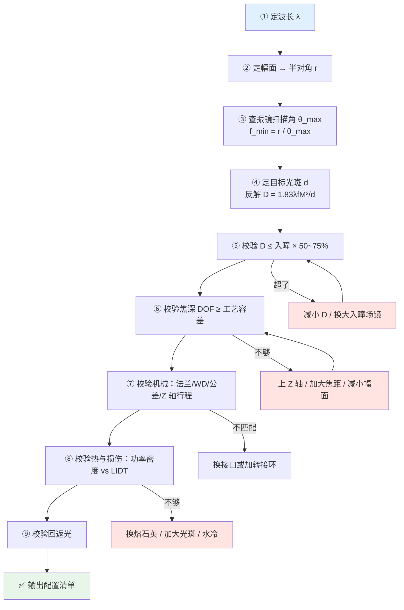

# 🎯 镜片选型流程与配置清单

> [!info] 一句话版本
> 这篇把前面 13 篇的结论**串成一条可以照着走的流程**：
> 从"我要加工什么"出发，九步推出**整套光学配置清单**，并告诉你每一步的**校验点**和**常见踩坑**。
> 配套：[[07-速查卡/05-选型一页纸]]（打印版）+ `optics_calc.py`（计算工具）。

---

## 1. 选型前必须问清的 8 个需求

> [!important] 需求不清楚，选型一定错
> 光学选型的输入**不是**"我要买场镜"，而是下面这 8 项。缺一项都可能推倒重来。

| # | 需求项 | 为什么要问 | 举例 |
|---|---|---|---|
| 1 | **激光波长** | 决定材料与镀膜，不可跨用 | 1064 nm / 532 nm / 355 nm / 10.6 μm |
| 2 | **激光功率（连续/峰值/占空比）** | 决定 LIDT 与散热要求 | 1000 W 连续 / 20 kW 峰值 |
| 3 | **M² 光束质量** | 直接乘在光斑上（同功率 M² 差 → 光斑差） | 单模 ≲1.2 |
| 4 | **光纤参数**（纤芯直径 + NA） | 决定准直后的 D 与 BPP 上限 | 50 μm / NA 0.12 |
| 5 | **加工幅面** | 反推场镜焦距 | 110×110 mm |
| 6 | **目标光斑尺寸** | 反推需要的 D（与焦距互相约束） | 50 μm |
| 7 | **工件：平面还是曲面？平面度多少？** | 决定焦深要求、要不要 Z 轴 | 平面 ±0.1 mm / 曲面 R200 |
| 8 | **振镜型号与可用扫描角** | ⚠️ 这一项最常被漏掉 | SCANLAB 级 ±0.35 rad 光学角 |

> [!danger] 第 8 项漏掉就是白干
> 场镜焦距**必须由振镜的实际扫描角反推**。很多人只按幅面算：
> ```text
> f = r / θ_max
> ```
> 但 θ_max 是**振镜**的参数，不是场镜的。用错（比如拿机械角当光学角）会差 2 倍。
> 详见 [[07-速查卡/03-公式速查]] 第 4 节。

---

## 2. 九步选型链



### 逐步说明

#### ① 定波长 → 定材料与镀膜

| 波长 | 场镜材料 | 镜片镀膜 | 备注 |
|---|---|---|---|
| 1064 nm | 光学玻璃 / 熔石英 | 介质 HR / 介质增强金 | 最常见 |
| 1030–1090 nm | 熔石英 | 介质 HR | 光纤激光宽带 |
| 532 nm | 玻璃 / 熔石英 | 介质 HR | ❌ 不能用 1064 镜 |
| 355 nm | **UV 级熔石英** | 介质 HR（唯一可行） | 金属膜 UV 性能差 |
| 10.6 μm | **ZnSe** / 硅 / 铜 | 金膜 | CO₂ |

#### ② 定幅面 → 半对角

```text
r = 幅面对角线 / 2 = (边长 × √2) / 2
```

⚠️ **用对角线，不是边长**——因为振镜要扫到四角。

#### ③ 查振镜扫描角 → 焦距下限

```text
f_min = r / θ_max
```

⚠️ **厂商标称幅面已含最大 1% 渐晕前提**，且按"典型镜间距"计算。
**换振镜后幅面会变**，所以要交叉验证。

#### ④ 定光斑 → 反解光束直径

```text
D = 1.83 · λ · f · M² / d          ← 用 C = 1.83（厂商标称口径）
```

⚠️ 另一个式子 `4λfM²/(πD)` 结果小 43.7%，**别混用**。

#### ⑤ 校验入瞳

```text
D ≤ 入瞳直径 × (50% ~ 75%)
```

**超了会怎样**：边缘光束被切 → 渐晕 → 边缘功率掉、光斑变形。
💡 工程上留 25%~50% 余量，因为装调会有偏心。

#### ⑥ 校验焦深

```text
DOF = 8 · λ · M² · (f/D)² / π    ≥    工艺容差
工艺容差 = 工件平面度 + 装夹误差 + 热漂移 + 场镜残余场曲
```

**不够怎么办**（按优先级）：
1. 加 Z 轴动态聚焦（最根本）
2. 缩短焦距（幅面变小）
3. 减小 D（光斑变粗）
4. 改善工装（把工件压平）

#### ⑦ 校验机械

| 要核对的 | 为什么 |
|---|---|
| **法兰距离 / 后工作距离** | 决定场镜能不能装到正确焦面 |
| **±1.5% 制造公差** | 机械件不能按名义值卡死，要留调焦余量 |
| **螺纹接口** | M85×1（打标机通用）/ M95×1 / M112×1 |
| **Z 轴行程** | 若上 Z 轴，行程要覆盖场曲 + 工件起伏 |
| **振镜镜间距** | 决定场镜光阑位置的匹配 |

#### ⑧ 校验热与损伤

```text
平顶：I = P / (π (d/2)²)
高斯峰值：I_peak = 2 × I         ← 拿这个比 LIDT
```

> [!danger] 三条铁律
> 1. 用**峰值**（高斯 ×2）比 LIDT，不是平均值
> 2. 留 **2~3 倍**余量
> 3. **LIDT 测试未标准化**（ISO 21254-1:2011 只定义口径），
>    波长/脉宽/光斑直径变了就**不可横比**
>
> 数百 W 以上考虑熔石英；上千 W 以上考虑水冷。
> 详见 [[05-光学篇/12-激光损伤阈值与光学件清洁维护]]。

#### ⑨ 校验回返光

查场镜厂商的 **back-reflection 图**（Jenoptik 每型场镜都提供）。

> [!warning] 厂方的原话大意
> 回返光数值**仅对"准直光束 + 正确使用"有效**；
> **改变系统设置或工况会导致回返位置变化，并可能造成损伤。**
>
> 所以：改动光路后（换场镜、改扩束倍率、调准直）**都要重新核对回返光**。

---

## 3. 配置清单模板（可直接抄）

> [!example] 🔬 一套完整的 5 轴配置（示例）
> **需求**：1064 nm 光纤激光 1000 W 连续、M²=1.1、纤芯 50 μm / NA 0.12、
> 幅面 110×110 mm、光斑 ~50 μm、曲面工件（起伏 ±2 mm）。
>
> ### 光路配置
>
> | # | 部件 | 规格 | 选型理由 |
> |---|---|---|---|
> | ① | 激光器 | 1064 nm、1000 W、M²=1.1 | 输入条件 |
> | ② | **准直镜** | f=100 mm、熔石英、QBH 接口 | D₀ = 2×100×0.12 = 24 mm；⚠️ 需核对镜片孔径是否够 |
> | ③ | **变焦扩束镜组** | 0.4×~2× 电动、2 轴 | 把 24 mm 调到所需 D；兼作光斑调节 |
> | ④ | 折转镜 | 1064 nm 介质 HR、45° | 纯光路布局，按实际机架决定 |
> | ⑤⑥ | **振镜** | 光学扫描角 ±0.35 rad、入瞳 ≥15 mm、XY2-100 接口 | θ_max 是选场镜的前提 |
> | ⑦ | **Z 轴动态聚焦** | 行程 ±3 mm、SL2-100/XY2-100 CHANNELZ | 曲面 + 场曲补偿 |
> | ⑧ | **F-θ 场镜** | f=254 mm、1064 nm、入瞳 ≥15 mm、M85×1 | f_min = 77.8/0.35 = 222 → 取 254 |
> | ⑨ | **保护镜** | 熔石英 + AR 镀膜、带气帘 | 耗材，多备几片 |
> | ⑩ | 取样镜（可选） | 0.1%~1% 分光 + 功率计 | 在线功率闭环 |
>
> ### 关键校验
>
> ```text
> ② 准直：D₀ = 2 × 100 × 0.12 = 24 mm，发散角 = 0.05/100 = 0.5 mrad
>    ⚠️ 24 mm 已接近常见 Ø25 mm 准直镜的上限 → 要么换 D50 组件，要么 f 降到 60~83 mm
>
> ③ 扩束：把 24 mm 调到 10.9 mm（缩束 0.45×）
>    光斑 d = 1.83 × 1.064e-3 × 254 × 1.1 / 10.9 = 50.0 μm ✅
>
> ⑤ 入瞳校验：D = 10.9 mm ≤ 15 × 0.75 = 11.25 mm ✅ 刚好通过
>    （如果 D 再大一点就要换更大入瞳的振镜/场镜）
>
> ⑥ 焦深：DOF = 8 × 1.064e-3 × 1.1 × (254/10.9)² / π = 1.58 mm
>    曲面起伏 ±2 mm ≫ 1.58 mm → ❌ 必须 Z 轴
>    Z 轴行程需求：±(2 + 场曲) → 场曲 ≈ 55²/(2×254) = 5.96 mm
>    → 总需求约 ±8 mm，选 ±10 mm 行程更稳
>
> ⑦ 功率密度：d = 50 μm、1000 W 高斯
>    I_peak = 2 × 1000 / (π × (0.0025)²) = 101.9 MW/cm²
>    → 场镜/保护镜 LIDT 必须 ≫ 101.9 MW/cm²（留 2~3 倍，即 ≥200~300 MW/cm²）
>    → 千 W 级必须选熔石英 + 低吸收镀膜；保护镜必须带气帘
> ```

> [!warning] ⚠️ 这个示例里藏了两个真实的坑
> 1. **准直镜选了 f=100 mm 就顶到 Ø25 mm 组件上限**（D=24 mm）——
>    实务上要么换 D50 准直组件，要么把 f 降到 60~83 mm。
>    **这是"先算再买"的典型价值。**
> 2. **"缩束"比"扩束"更常见**——高功率光纤激光经准直后往往太粗，
>    需要的其实是把光束变小。所以选型时不要默认"扩束"，要看算出来的 M 是 >1 还是 <1。

---

## 4. 各部件选型要点速查

| 部件 | 首要参数 | 次要参数 | 最容易错的地方 |
|---|---|---|---|
| **准直镜** | 焦距 f、孔径 | 镀膜、Z 向调节量 | 算出的 D 超出镜片孔径 |
| **扩束/变焦镜组** | 倍率范围 | 透过率、LIDT、是否 in-focus | 忘了要 2 个轴（倍率 + 焦点补偿） |
| **振镜** | **光学扫描角**、入瞳 | 带宽、接口、电源 | ⚠️ 把机械角当光学角 |
| **Z 轴** | 行程、精度 | 接口、响应 | 行程没算场曲，只算了工件起伏 |
| **F-θ 场镜** | 焦距、入瞳、波长 | 工作距离、接口、镀膜 | 光斑公式系数混用；忽略 ±1.5% 公差 |
| **保护镜** | 材质、镀膜、厚度 | 是否带气帘 | 用普通玻璃代替熔石英 |
| **波片** | 波长、口径、延迟精度 | LIDT | 装反、方向没对齐加工方向 |
| **合束镜** | 波长组合、AOI | 过渡带宽度 | 角度装偏导致合束效率低 |
| **取样镜** | 分光比 | 楔角（防回光干涉） | 取样位置不对导致监测不准 |

---

## 5. 采购前的 10 条清单

> [!important] 下单前逐条打勾
> - [ ] 波长确认了三遍（激光器型号、实际测量、镀膜规格一致）
> - [ ] 振镜的**扫描角是光学角**，且拿到了手册原文
> - [ ] 场镜焦距满足了**幅面**与**光斑**双约束，区间内有解
> - [ ] 光束直径 D 与场镜/振镜**入瞳**匹配，留了余量
> - [ ] 焦深算过，且 ≥ 工艺容差；否则已规划 Z 轴
> - [ ] Z 轴行程覆盖了**场曲 + 工件起伏**（不是只算起伏）
> - [ ] 机械尺寸按 **±1.5% 公差**留了调焦余量
> - [ ] 螺纹接口匹配（M85×1 等），必要时已订转接环
> - [ ] 功率密度（**高斯峰值**）比过 LIDT，留了 2~3 倍余量
> - [ ] 查过**回返光图**，确认当前工况下回返光不会打坏东西

---

## 6. 常见选型错误

| # | 错误 | 后果 | 纠正 |
|---|---|---|---|
| 1 | 只按幅面算焦距，不看光斑 | 光斑比预期粗一倍 | 两个约束一起解 |
| 2 | 把机械角当光学角算幅面 | 幅面差 2 倍 | 确认角的定义 |
| 3 | 光斑公式混用两个系数 | 选型偏 44% | 和手册比就用 1.83 |
| 4 | 公式里的 D 用激光器出射值 | 光斑算错数量级 | D 是场镜处的直径 |
| 5 | 忽略 ±1.5% 公差 | 装不上 / 焦面不对 | 机械留调焦余量 |
| 6 | Z 轴行程只算工件起伏 | 边缘仍离焦 | 加上场曲 |
| 7 | 默认"需要扩束" | 买错倍率方向 | 先算 M 是 >1 还是 <1 |
| 8 | 用平均值比 LIDT | 低估一倍，烧镜片 | 用高斯峰值 |
| 9 | 场镜入瞳刚好等于 D | 装调偏心就削光 | 留 25%~50% 余量 |
| 10 | 换部件后不重算回返光 | 可能烧镜片/激光器 | 工况变了就重查 |

---

## ✅ 自检

- [ ] 能说出选型的 8 个需求输入，特别是"振镜扫描角"这一项
- [ ] 能独立走完九步，并说清每一步的校验目的
- [ ] 知道焦深不够时的四个对策及其优先级
- [ ] 能算功率密度并正确比 LIDT（用峰值、留余量）
- [ ] 明白为什么"缩束"比"扩束"更常见
- [ ] 下单前会照着 10 条清单核一遍

---

## 📖 依据

> [!quote] 来源
> - **选型三参数与耦合关系**：Thorlabs F-Theta 教程
>   <https://www.thorlabs.com/newgrouppage9.cfm?objectgroup_id=10766>；
>   SCANLAB Scan Lenses（波长、功率、光斑、像场、工作距离 5 项耦合）
>   <https://www.scanlab.de/en/products/scan-components/scan-lenses>
> - **入瞳与截断比**：Sill Optics 技术指南（目录幅面按最大 1% 渐晕计算）
>   <https://www.silloptics.de/en/service/sill-technical-guide/laser-optics/f-theta-lenses>
> - **光束 ≤ 入瞳 50~75%**：思特光学选型指南
>   <https://www.scanneroptics.com/f-theta-lens-selection-guide.html>（🟡 经验准则）
> - **±1.5% 制造公差**：Jenoptik JENar 数据手册
>   <https://www.jenoptik.us/-/media/websitedocuments/optics/f-theta/data-sheets/f-theta-017700-009-26-ft-03-424ft-350-1030.pdf>
> - **回返光风险**：Jenoptik 回返光图说明
>   <https://www.jenoptik.us/-/media/websitedocuments/optics/f-theta/rueckreflexgraphen/f-theta-017700-405-26-rr.pdf>
> - **LIDT 定义与不可跨条件套用**：ISO 21254-1:2011；Edmund Optics LIDT 测试说明
>   <https://www.edmundoptics.com/knowledge-center/application-notes/lasers/laser-damage-threshold-testing/>
> - **准直单元规格与 Z 向公差**：Coherent 准直单元数据手册
>   <https://www.coherent.com/resources/datasheet/components-and-accessories/collimating-units-1030-1090nm-ds.pdf>
> - **M85×1 通用接口**：Cloudray F-Theta 说明书 <https://manuals.plus/asin/B07CD8KJK2.pdf>
> - **5 轴配置实例**：RAYLASE AM MODULE III（in-focus zoom + 动态 Z 轴）
>   <https://www.raylase.de/en/products/prefocusing-deflection-units/am-modul-III.html>
>
> ⚠️ **本文是"流程综合"**：九步链条由本库根据各厂商的选型约束整理（逻辑依据均在上列来源中），
> **不是某一家厂商发布的官方流程**。具体项目请以**你所用器件的数据手册**为准。
>
> 💡 标 💡 的余量建议（25%~50% 入瞳余量、2~3 倍 LIDT 余量）为工程经验，不是规范要求。
> 第 3 节示例中的所有数值均可用 `optics_calc.py` 复算。

---

## 🔗 相关

- 上一篇：[[05-光学篇/13-光斑尺寸与焦深计算]]
- 下一篇：[[05-光学篇/15-光学失效排错对照表]]
- 打印版：[[07-速查卡/05-选型一页纸]]
- 各部件详解：[[05-光学篇/00-光路总览：从 3 轴到 5 轴]]
- 场镜选型：[[05-光学篇/02-F-θ 场镜（平场聚焦镜）]]
- Z 轴判断：[[05-光学篇/03-动态聚焦镜组（Z 轴）]]
- 回到入口：[[🏠 开始这里]]
