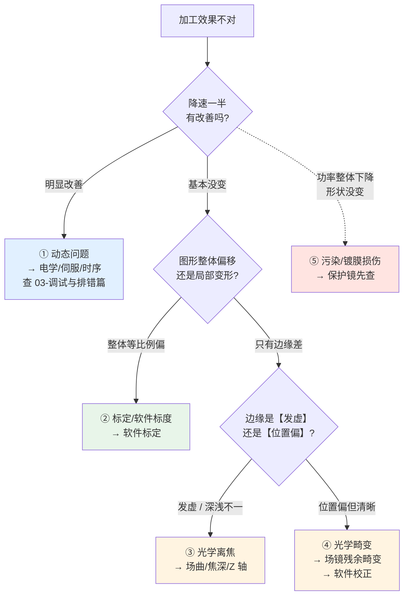

# ⚠️ 光学失效排错对照表

> [!info] 一句话版本
> 加工效果不对时，**先分清是光学、电学还是工艺问题**——三者的排查方向完全不同。
> 这篇给一张"现象 → 光学原因 → 怎么验证 → 怎么处置"的对照表，
> 配合 [[03-调试与排错篇/03-常见故障速查]]（电学侧）一起用。

---

## 1. 第一步：先分清是哪一类



> [!important] 三句话记住分类逻辑
> 1. **降速能改善 → 不是光学问题**（是伺服跟不上）
> 2. **全幅面等比例偏 → 大概率不是硬件问题**（是标度/焦距选错）
> 3. **只有边缘不对 → 基本都是光学**（场曲、渐晕、畸变）

---

## 2. 光路"从便宜到贵"的排查顺序 ⭐

> [!danger] 这是本篇最值钱的一条
> 排错顺序**必须从最便宜、最容易换的部件开始**——否则你会拆了半天发现是块 50 块的保护镜脏了。
>
> ```text
> ⑨ 保护镜（几十元，5 分钟）        ← 先查这个！
>    ↓ 没问题
> ⑧ 场镜（几千元，擦洗/更换）
>    ↓ 没问题
> ⑦ Z 轴镜组 / ③ 扩束镜（需返厂或专业调校）
>    ↓ 没问题
> ⑤⑥ 振镜镜片（需专业处理，别自己拆）
>    ↓ 没问题
> ② 准直镜（需重新准直）
>    ↓ 没问题
> ① 激光器本身（查功率计读数）
> ```

**为什么这个顺序**：保护镜是**设计成耗材**的（就是为了替场镜挡飞溅），
所以它的污染概率**最高**、更换成本**最低**。先把这一步排掉，能省下大量时间。

---

## 3. 主对照表：现象 → 光学原因 → 处置

### 3.1 光斑形态异常

| 现象 | 最可能的光学原因 | 怎么验证 | 处置 | 详见 |
|---|---|---|---|---|
| **整体光斑变粗**，中心仍圆 | 扩束倍率变小 / 准直失调 | 测准直镜出口光斑直径，与设计值比 | 重新准直 / 调整变焦倍率 | [[05-光学篇/04-扩束镜与变焦扩束镜组]] |
| **边缘光斑变粗**，中心正常 | 场镜焦面弯曲超焦深 | 打网点阵列，测各点线宽 | 上 Z 轴补偿 / 缩小幅面 | [[05-光学篇/03-动态聚焦镜组（Z 轴）]] |
| **光斑中间暗、环形** | 光路有中心遮挡（镜片局部损伤/脏点） | 用相纸在各级打光斑看形态 | 找到遮挡级，清洁或更换 | 本篇 3.4 |
| **光斑不对称、拉长** | 动态镜面变形（线性斜像散为主）| 降速后是否改善 | 降速 / 减小扫描角 / 换镜片 | [[05-光学篇/01-振镜反射镜：X 镜与 Y 镜]] |
| **光斑有拖尾/彗差感** | 某片镜子装偏、不垂直于光轴 | 逐级打光斑看偏心 | 重新装调 | 本篇 3.4 |
| **光斑随功率变大（热透镜）** | 高功率下镜片热致焦移 | 开机后每隔几分钟测光斑 | 预热 / 水冷 / Z 轴在线补偿 | [[05-光学篇/02-F-θ 场镜（平场聚焦镜）]] |

### 3.2 功率与能量异常

| 现象 | 最可能的光学原因 | 怎么验证 | 处置 | 详见 |
|---|---|---|---|---|
| **功率整体下降，形状没变** | 保护镜污染 / 镀膜损伤 | 目视 + 功率计对比 | 换保护镜 | [[05-光学篇/09-保护镜与窗口片]] |
| **功率下降且边缘更严重** | 渐晕（光束超场镜入瞳） | 算 D 与入瞳的比值 | 减小扩束倍率 / 换大入瞳场镜 | [[05-光学篇/04-扩束镜与变焦扩束镜组]] |
| **打标深浅随扫描方向变化** | 偏振态（金属对 s/p 吸收不同） | 旋转 λ/2 波片看是否改善 | 加 λ/2 波片调到最佳方向 | [[05-光学篇/07-偏振元件（半波片、四分之一波片、PBS）]] |
| **中心能打、边缘打不动** | 边缘功率密度不足 + 渐晕 | 测边缘实际功率 | 降速 / 提高功率 / 缩小幅面 | 本篇 3.2 |
| **功率计读数正常但打不动** | 焦点不在工件面上 | 手动 Z 扫描找最佳焦点 | 重新对焦 / 校 Z 轴零点 | [[05-光学篇/03-动态聚焦镜组（Z 轴）]] |
| **开机时好，跑一会儿变差** | 热致焦移 / 热漂移 | 记录随时间的变化 | 预热、水冷、定期校焦 | [[05-光学篇/12-激光损伤阈值与光学件清洁维护]] |

### 3.3 图形精度异常

| 现象 | 最可能的光学原因 | 怎么验证 | 处置 | 详见 |
|---|---|---|---|---|
| **整体尺寸偏大/偏小** | 软件标度因子错 / 场镜焦距选错 | 打已知尺寸方框测量 | 改标度因子；核对场镜型号 | [[03-调试与排错篇/04-图形失真与标定]] |
| **图形四角不准** | 场镜残余畸变 | 打 9 点或 65 点网格 | 做二维畸变校正 | 同上 |
| **枕形 / 桶形变形** | 场镜残余畸变 + 二维耦合 | 打方框看边 | 二维校正表 | [[05-光学篇/02-F-θ 场镜（平场聚焦镜）]] |
| **打对角时误差更大** | X/Y 轴耦合（非场镜单独问题） | 打对角线与单轴比对 | 二维校正（不能靠单轴标定） | 同上 |
| **换场镜后尺寸变了** | 焦距不同 → 标度因子需重标 | 记录焦距变化比例 | 按焦距比例改标度并重标定 | 同上 |
| **同一图形大小在不同高度不同** | 非 z=0 平面的 x/y 偏差 | 在两个高度各打一次 | 用 F-Theta Factor 类功能修正 | 同上 |
| **尺寸误差随尺寸放大** | 标定残差与尺寸成正比 | 打不同尺寸同图形 | 在接近实际尺寸下重标 | 同上 |

### 3.4 怎么定位"是哪一片镜片有问题"🔬

> [!example] 🔬 逐级打光斑法（最实用的现场手段）
> **工具**：相纸 / 热敏纸 / 光束显影卡；低功率（能显影即可，⚠️ 注意激光安全）
>
> **步骤**：
> ```text
> 1. 在 ② 准直镜出口贴纸打光斑 → 记录直径与形状（这是"基准光斑"）
> 2. 在 ③ 扩束镜出口打 → 直径应 = 基准 × 倍率
> 3. 在 ⑧ 场镜入口前打 → 应与第 2 步一致（若变小 → 光路有遮挡）
> 4. 在工作面打 → 这是最终焦斑
> 5. 逐级对比：从哪一级开始"形状变了"，问题就在那一级
> ```
>
> **判据**：
> | 观察 | 结论 |
> |---|---|
> | 某级光斑突然偏心 | 该级镜片装偏 / 中心不对 |
> | 某级光斑出现暗环 | 该级镜片有局部污染或损伤 |
> | 各级形状都正常，只有工作面不对 | 问题在 ⑧ 场镜或其后的对焦 |
> | 各级形状都正常但整体变粗 | 问题在 ② 准直（起点就错了） |
>
> ⚠️ **安全**：必须在**最低功率**下做，戴对应波长的防护镜，避免金属反光。

### 3.5 光束质量与回光

| 现象 | 最可能的光学原因 | 处置 | 详见 |
|---|---|---|---|
| **激光器报警 / 输出不稳** | 回返光打回谐振腔 | 查场镜回返光图；加光隔离器；微调倾斜角 | [[05-光学篇/11-光阑、杂散光与回光防护]] |
| **镜片莫名烧点** | 回返光聚焦在镜片上 | 同上 | 同上 |
| **加工区外有"鬼影"加工痕迹** | 杂散光 / 高阶衍射 | 加光阑、挡光板 | 同上 |
| **平顶光变成高斯光** | 光束整形元件（DOE）装反或污染 | 检查安装方向 | [[05-光学篇/06-光束整形元件（DOE、轴锥镜、微透镜阵列）]] |
| **分束后各束能量不均** | DOE 对准偏差 / 光源本身不均 | 单独测光源均匀性 | 同上 |
| **指示光与工作光不重合** | 合束镜角度偏 / 消色差不足 | 在远近两个位置分别看 | [[05-光学篇/08-合束镜与二向色镜]] |

---

## 4. ⚠️ 绝对不要做的事

> [!danger] 这些操作会把小问题变成大损失
> | 不要做 | 为什么 |
> |---|---|
> | **用干布/纸巾擦场镜或保护镜** | 灰尘颗粒会划伤镀膜，一旦划伤就只能换 |
> | **自己拆振镜镜片** | 镜片是胶粘在电机轴上的，拆下几乎必然改变动平衡与角度 |
> | **用嘴吹镜片** | 唾液含酸性成分，会在镀膜上留永久痕迹 |
> | **拿 4/π 公式的结果去质疑厂商手册** | 两套系数差 43.7%，用错口径会误判"厂商标错了" |
> | **按场镜焦距名义值加工机械件** | ±1.5% 制造公差，可能装不上或焦面不对 |
> | **在功率不明的情况下"打一下看看"** | 激光安全；也直接烧毁镜片 |
> | **场镜装反了以为是"不能聚焦"** | ⚠️ 厂商未公开说明后果，但会破坏场曲/畸变补偿与工作距离匹配 |
>
> 清洁的正确方法见 [[05-光学篇/12-激光损伤阈值与光学件清洁维护]]。

---

## 5. 一页判定树（打印版）

```text
【现象】加工效果不对
   │
   ├─ 降速一半明显改善？ ──是──→ 电学/伺服问题（不是光学）
   │                          见 03-调试与排错篇/03
   │
   └─否
      │
      ├─ 功率掉了但光斑形状没变？
      │     └─是─→ 【保护镜污染】先换保护镜（最便宜）
      │
      ├─ 全幅面等比例偏大/偏小？
      │     └─是─→ 【标度因子 / 场镜焦距】改软件参数
      │
      ├─ 只有边缘发虚、深浅不一？
      │     └─是─→ 【场曲超焦深】
      │              算：场曲量级 ≈ r²/(2f)  vs  焦深 DOF
      │              场曲 > DOF → 需要 Z 轴补偿
      │
      ├─ 边缘位置偏但清晰？
      │     └─是─→ 【场镜残余畸变】做二维标定
      │
      ├─ 光斑中间暗 / 环形？
      │     └─是─→ 【光路遮挡或镜片损伤】逐级打光斑定位
      │
      ├─ 深浅随方向变化？
      │     └─是─→ 【偏振】加 λ/2 波片调偏振方向
      │
      ├─ 开机正常、跑一会儿变差？
      │     └─是─→ 【热致焦移】预热 / 水冷 / 在线补偿
      │
      └─ 激光器报警？
            └─是─→ 【回返光】查 back-reflection 图、加隔离器
```

---

## ✅ 自检

- [ ] 能说出"先查保护镜"的理由（它是耗材，最便宜最容易换）
- [ ] 能用"降速测试"区分动态问题与光学问题
- [ ] 知道哪些现象是软件标定**能**解决的，哪些**不能**
- [ ] 会做逐级打光斑定位故障镜片
- [ ] 能算出"场曲 vs 焦深"来判断要不要上 Z 轴
- [ ] 知道哪四件事绝对不能做

---

## 📖 依据

> [!quote] 来源
> - 保护镜作为耗材的设计意图、更换判据：见 [[05-光学篇/09-保护镜与窗口片]]（厂商文档与工程实践）
> - 场曲与离焦机制：Thorlabs F-Theta 教程给出场曲（mm）随扫描角变化的曲线
>   <https://www.thorlabs.co.jp/f-theta-lenses-tutorial>
> - 边缘劣化机制（线速度 + 能量沉积 + 场曲/像散）：CASTECH 技术文
>   <https://gb.castech.com/news_detail/9.html>
> - 软件畸变校正：RAYLASE SPICE3「Correction of Marking Field Distortion」；
>   SCAPS SAMLight「F-Theta Factor Calibration」
> - 实测标定的必要性：GitHub `matthewSorensen/scanner-calibration`
>   <https://github.com/matthewSorensen/scanner-calibration>
> - 回返光风险：Jenoptik 回返光图说明
>   <https://www.jenoptik.us/-/media/websitedocuments/optics/f-theta/rueckreflexgraphen/f-theta-017700-405-26-rr.pdf>
> - 热致焦移：DGaO 论文《Simulation and measurement of thermo-optical effects in an f-theta lens》
>   <https://dgao-proceedings.de/download/117/117_c15.pdf>
> - 动态波前畸变以斜像散为主：威斯康星大学
>   <https://www.ophth.wisc.edu/blog/2021/12/20/dynamic-wavefront-distortion-in-resonant-scanners/>
> - 偏振对金属吸收的影响：见 [[05-光学篇/07-偏振元件（半波片、四分之一波片、PBS）]]
>
> ⚠️ **本篇是"综合判断表"**：分类逻辑与排查顺序由本库根据光学原理整理（标 💡），
> **不是厂商发布的官方诊断流程**。具体设备的故障判据以**该设备手册**为准。
> 表中每条现象对应的器件级说明，均链接到光学篇相应章节，那里有来源与数值。

---

## 🔗 相关

- 上一篇：[[05-光学篇/14-镜片选型流程与配置清单]]
- 电学侧排错：[[03-调试与排错篇/03-常见故障速查]]
- 标定实操：[[03-调试与排错篇/04-图形失真与标定]]
- 光斑与焦深计算：[[05-光学篇/13-光斑尺寸与焦深计算]]
- 清洁与维护：[[05-光学篇/12-激光损伤阈值与光学件清洁维护]]
- 速查：[[07-速查卡/04-光学速查卡]]
- 回到入口：[[🏠 开始这里]]
