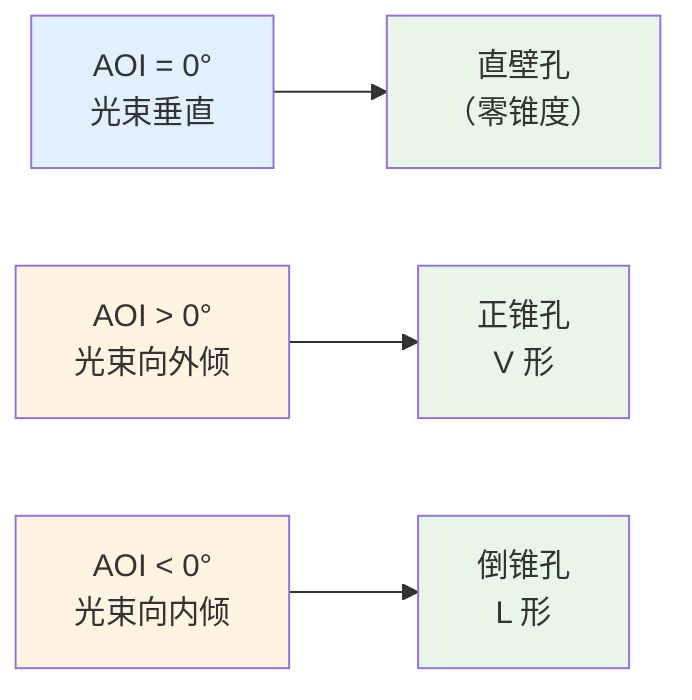
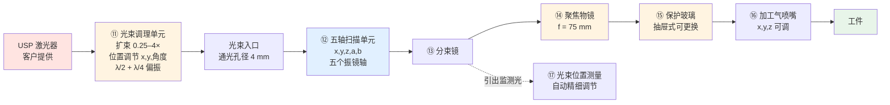

# 🔬 precSYS 五轴微加工：进动架构与镜片

> [!info] 一句话版本
> precSYS 的 5 轴不是"X/Y 扫描 + 变焦"，而是 **x, y, z 焦点三维定位 + a, b 入射角（AOI）控制**。
> 官方规格表原文：`Axes: 5 factory calibrated axes (x, y, z coordinates and 2 incidence angles a, b)`
>
> **它靠"让光束斜着打、并且在环切时连续改变倾角"来做孔形**——
> 正锥、倒锥、零锥度直壁，全由入射角决定。
> **纯振镜式、无旋转光学件**，环切频率可达 **650 Hz（39 000 rpm）**。

---

## 1. 为什么是"入射角"，不是"变焦"

### 1.1 用入射角控制孔壁形状

厂商原文：
> *「precSYS 让你把焦斑 3D 定位到工件上，并**精确跟踪入射角（AOI）**。
> 可以同时改变**焦点运动轨迹、入射角与激光强度**。」*
>
> *「螺旋式加工配可定义的光束倾斜，可做出高质量的孔入口与出口——
> **洁净、无毛刺、无熔渣**。由此可以做出**正锥（V 形）、倒锥（L 形）或理想圆柱形（II 形）**
> 的孔壁轮廓，且**深径比高**。」*

> [!important] 关键机制：进动（precession）消除"光束焦散"效应
> 厂商原文：
> *「**进动钻孔**——与典型的环切（trepanning）和螺旋钻孔不同——
> 允许以**螺旋移动且同时倾斜**的激光束加工，例如**在入口边缘处几乎消除光束焦散效应**。
> 这样，precSYS 的高进动频率甚至能实现**一秒内加工出深径比高、孔壁垂直的深孔**。」*

### 1.2 与"变焦派 5 轴"的根本差别

![[光学-precSYS五轴入射角.svg]]

> [!danger] 两支的"5 轴"除了名字几乎无共同点
> | | **precSYS（本篇）** | RAYLASE AM-MODULE III 类 |
> |---|---|---|
> | 5 轴构成 | **x, y, z + a, b** | X/Y + Z + 2 轴变焦 |
> | 第 4/5 轴作用 | **控入射角** | 改光斑大小 |
> | 场镜 | ❌ **没有**，用固定物镜 f=75 mm | ✅ 有 F-θ 场镜 |
> | 幅面 | **Ø2.5 mm**（打标 Ø5 mm） | 100+ mm |
> | 光斑 | Ø20 µm（1030）/ Ø10.2 µm（515） | 几十 µm 可调 |
> | 环切频率 | **≤ 650 Hz（39 000 rpm）** | 不适用 |
> | 用途 | **微孔 / 切割 / 刻蚀**（USP） | 打标 / 焊接 / 增材 |

> [!note] 💡 为什么它不需要变焦
> 它的工艺目标是"控角度"，不是"改光斑"。
> 光斑由**物镜 + 光束调理单元**一次性定好（Ø8.2~20 µm），加工中不需要变。
> 想改光斑？**换物镜**，或者调整光束调理单元的扩束倍率（0.25×~4×）。

---

## 2. 完整光路与每一片镜片

### 逐件说明

| # | 组件 | 作用 | 关键规格 |
|---|---|---|---|
| ⑪ | **光束调理单元** | 适配入射光束的直径与发散角；在像场内调圆偏振 | 扩束倍率 **0.25×~4×**；**发散角可调**；位置调节器（**x, y, 角度**）；含 **λ/2 + λ/4 波片** |
| ⑫ | **五轴扫描单元** | x,y,z 焦点定位 + a,b 入射角；**密封 + 吹扫气（微正压）**、带吹扫气监测 | 见第 3 节 |
| ⑬ | **分束镜** | 引出监测光（自动精细调节 / 过程监测） | — |
| ⑭ | **聚焦物镜** | 会聚到工件；**不是 F-θ 场镜** | 物镜焦距 **75 mm**；有效焦距 **25 mm** |
| ⑮ | **保护玻璃**（抽屉式） | 快速、安全更换 | 可更换（fast-replacement drawer） |
| ⑯ | **加工气喷嘴** | 工艺气体 | 最大 **6 bar**；喷嘴开口 **1 mm**；**x,y,z 可调** |
| ⑰ | **光束位置测量单元** | 自动精细调节闭环 | 工厂预校准 |
| ⑱⑲ | **相机物镜 + 适配器**（可选） | 过程监测 | 观测波长 **880 nm ± 10**（另可 820–890 / 1230–1370） |

> [!warning] ⚠️ 一个手册里没解释清楚的地方
> 数据手册**并列给出**「物镜焦距 75 mm」与「有效焦距 25 mm」，
> 但**没有说明这两个口径的换算关系**（也不是简单的倍率关系）。
> ⚠️ 本库**未找到**官方解释——引用时请勿自行推导，以厂商确认为准。

---

## 3. 五轴扫描单元：5 个振镜轴

> [!important] 是"纯振镜式"，不是"振镜 + 旋转轴"
> 官方原文：*「precSYS 的专利技术，**首次**实现了稳定的、**纯振镜式（purely galvo-based）**的
> 5 轴微加工子系统」*；*「系统工作时**不使用任何旋转光学元件**（works without any rotary optics）」。*

**轴分工与指标**（数据手册）：

| 轴 | 作用 | 指标 |
|---|---|---|
| **x, y** | 焦斑平面定位 | 理论定位分辨率 **17 nm**（1030 nm 型）/< 20 nm（515 nm 型） |
| **z** | 焦斑轴向定位 | 焦程 **±1.0 mm**；最大速度 **10 mm/s** |
| **a, b** | 光束入射角（两正交方向） | 最大 **±7.5°**；理论角分辨率 **2 µrad** |

**系统级指标**：

| 项目 | 数值 |
|---|---|
| 环切 / 进动频率 | **≤ 650 Hz（39 000 rpm）**（最大 AOI、Ø100 µm 时） |
| 重复性 | **≤0.5 µm**（像场内）※ |
| 工作幅面 | 进动加工 **≤ Ø2.5 mm**；打标 **≤ Ø5 mm** |
| 偏振 | **保持偏振**；光束调理后为**圆偏振** |
| 冷却 | 水冷 **25 °C**（振镜轴与电子学**分别**冷却） |
| 吹扫气 | 合成空气，ISO 8573-1:2010 class [1:2:1] |
| 重量 | 约 **30 kg** |

> ※ 重复性测试条件（原文脚注）：AOI −7.5°…+7.5°、Ø0.09~0.3 mm、f = 50~650 Hz、
> z = −1…+1 mm，**6 小时**运行负载下的**直径与圆度偏差**。
> **注意这不是"单点重复定位精度"，而是"加工出来的孔 6 小时内的一致性"。**

> [!note] 💡 为什么"幅面小"是"650 Hz"的前提
> 幅面 Ø2.5 mm → 需要的镜面转角很小 → 镜片可以做得很小很轻 →
> 转动惯量小 → 才能在 650 Hz 下保持伺服闭环稳定。
> **官方原文也印证**：*「高端振镜技术配**小镜面转角与低运动质量**，
> 保证以环切或进动频率 **up to 650 Hz** 进行高动态加工。」*
>
> 反过来：想要 100 mm 幅面，就不可能同时有 650 Hz 进动。**这是物理约束，不是设计取舍。**

---

## 4. 光束调理单元（beam conditioning unit）

> [!important] 这是 precSYS 光路上最"特殊"的部分——它把好几个功能集成在一个单元里
> 官方原文：*「用于适配入射光束的**直径与发散角**，以及在像场内**调整圆偏振**。
> 也可作为**不带外壳与吹扫气**的版本提供。」*

| 子元件 | 作用 |
|---|---|
| **扩束镜 + 位置调节器（x, y, 角度）** | 倍率 **0.25×~4×** |
| **发散角调节** | divergence adjustable |
| **偏振单元**（λ/2 + λ/4 波片） | 在像场内调圆偏振 |
| **外壳 + 吹扫气接头 + 保护窗** | 洁净防护 |

> [!danger] ⚠️ 注意：这几件"通常不由 SCANLAB 提供"
> 数据手册脚注原文：
> *「某些系统组件（例如激光器、电控气体阀、**电动偏振片**、**电动扩束镜**）
> 通常**不由 SCANLAB 提供**。」*
>
> **工程含义**：写选型清单时，这部分要**单独向第三方采购或自制**，
> 而且**必须满足 precSYS 的入口条件**（见下）。

> [!important] 入口硬指标（选激光器/光束调理时必须满足）
> | 项目 | 值 |
> |---|---|
> | 通光孔径（入口） | **4 mm** |
> | 典型入射光束直径（1/e²） | **2 mm**（1030 / 515 标准型）；**2.5 mm**（515 小焦斑型） |
> | 典型脉冲能量 | ≤ **300 µJ**（1030 nm）/ ≤ **65 µJ**（515 nm）/ ≤100 µJ（515 小焦斑） |
> | 典型平均功率 | ≤ **50 W** |
> | 典型脉宽 | **250 fs – 25 ps**（可到连续） |
> | 波长 | 1030 nm / 515 nm（标准）/ 515 nm（小焦斑） |
>
> **注意**：波长只有 1030 与 515 两个选项（515 小焦斑型的 AOI 略降为 ±7.0°）。
> ⚠️ 这不是一台"任意波长"的设备。

---

## 5. 分束镜与监测光路

光路里有**两处**分光，用途不同：

| 分光点 | 用途 | 说明 |
|---|---|---|
| **⑬ 主分束镜** | **自动精细调节** | 把光引到光束位置测量单元，闭环回零 |
| **⑱ 过程监测分束镜**（可选） | **过程/光束监测** | 配相机物镜，观测波长 880 nm ± 10 |

### 5.1 ⭐ 自动精细调节（本篇最值得借鉴的设计）

> [!important] 原理：用系统自己的 5 个振镜轴，把光束"调回零位"
> 官方原文：
> *「precSYS 出厂预校准的**光束位置测量单元**可用于监测系统的光束位置。
> 如果光束位置**超出应用特定的容差限**，则可用软件把光束**重新调回其原始零位**——
> **通过系统内部的五个振镜轴**（regulation via system-internal galvo axes）。」*
>
> **好处（厂商列举）**：
> - 在工作场附近做**光束位置稳定**，把激光器到工件之间**沿光路的偏差降到最小**
> - **持久可复现**的加工结果，不需要复杂的效果分析与人工重新调整
> - 通过维护软件做**光束位置监测**
> - 用 **DrillControl** 软件自动重调光束的位置与角度

> [!note] 💡 这是"多轴"带来的一个额外红利
> 一般系统的光路漂移（热漂移、机械蠕变）只能靠**人工调光路**解决，
> 或者干脆容忍它。precSYS 把**多出来的自由度**拿来当"电子调光架"用
> ——**这是"5 轴"的一个非显然价值**。

### 5.2 分束镜本身的选型注意

分束镜在光路里要承受**全部脉冲能量**，选型时注意：

- **LIDT 必须按你的峰值功率密度核算**（用高斯峰值，不是平均值）
- **后表面做楔角**，避免平行平板的标准具条纹与鬼像
- **取样比与偏振相关**（菲涅尔取样），见 [[05-光学篇/10-分光取样镜与在线功率监测]]

> [!danger] ⚠️ precSYS 这条光路对 LIDT 的要求不低
> 50 W 平均功率、300 µJ 脉冲能量、光斑 Ø20 µm →
> 💡 按高斯峰值估算，功率密度量级可达 **10⁸ W/cm²**。
> 具体以厂商的 LIDT 数据为准，**不要用普通成像级光学件**。

---

## 6. 物镜：为什么它不是 F-θ 场镜

| | **precSYS 的物镜** | **F-θ 场镜** |
|---|---|---|
| 焦距 | **75 mm**（有效 25 mm） | 100~500 mm |
| 平场校正 | ❌ **不做**（幅面小到不需要） | ✅ 核心任务 |
| 位置 | 振镜**之后** | 振镜**之后** |
| 幅面 | Ø2.5 mm | 100+ mm |
| 工作距离 | 短 | 长 |

> [!important] 关键区别：**物镜不需要"把角度线性变成位移"**
> F-θ 场镜存在的理由是 `r = f·θ`（线性化）。
> 但 precSYS 的像场只有 **Ø2.5 mm**——在这个尺度下，
> `f·tanθ` 与 `f·θ` 的差异小到可以忽略，而且系统有**出厂预校准**
> （标定后可以直接用**笛卡尔坐标的米制单位**描述激光运动）。
>
> 所以它用一片**普通聚焦物镜**就够了，不需要复杂的多片 F-θ 设计。

> [!note] 💡 出厂预校准的含义（厂商原文）
> *「出厂校准使得可以直接在 precSYS 的**笛卡尔像场坐标系**内、
> 用**米制单位**描述激光运动。」*
>
> 也就是说：**用户写 `x = 1.2 mm`，不用管振镜要转几度。**
> 标定这件事被厂商在出厂时做掉了——这也是"成品子系统"与"自建系统"的重要差别。

---

## 7. 保护玻璃、吹扫气与加工气

| 措施 | 说明 |
|---|---|
| **抽屉式可更换保护玻璃** | 「快速、安全更换」——对应 [[05-光学篇/09-保护镜与窗口片]] 的耗材思路 |
| **密封 + 吹扫气（微正压）光路** | 厂商原文：*「密封、充气的光学光路（**过压**）保证即使在恶劣工业条件下也有**最佳洁净度**——从而提高系统寿命与加工精度。」* |
| **吹扫气监测** | 5 轴扫描单元带 purge gas monitoring |
| **加工气喷嘴** | 最大 **6 bar**、开口 **1 mm**、**x,y,z 可调** |
| **水冷** | **25 °C**，振镜轴与电子学**分别**冷却 → 抗负载相关温度波动 |

> [!important] 这条思路值得单独学：**整条光路做正压密封，比只加保护镜更彻底**
> 一般设备只在最末端放一片保护镜（挡飞溅）。
> precSYS 把**整个光学腔体做成微正压 + 吹扫气**：
> 灰尘根本进不来，而不是"进来后挡住"。
> **代价**：需要洁净气源（合成空气 ISO 8573-1:2010 class [1:2:1]）、
> 需要监测、结构复杂。

---

## 8. 加工轨迹：5 轴能做哪些形状

官方列举的轨迹与几何能力：

| 能力 | 说明 |
|---|---|
| **2D / 3D 轨迹** | 圆、椭圆、直线，可在 2D 或 3D 中定义 |
| **AOI 全程受控** | 「对任何几何形状，**入射角都会在轨迹运动中按指定值被控制**」 |
| **进动钻孔** | 螺旋移动 + 同时倾斜 → 消除入口焦散，深孔垂直壁 |
| **孔形** | 正锥（V）、倒锥（L）、理想圆柱（II），**高深径比** |
| **打标** | Ø5 mm 圆场内，支持多种字体与字号 |
| **阵列** | 像场内多孔阵列**无需 XY 位移台**；每孔可**独立设定工艺参数** |
| **超出像场时** | 可用**外部轴**做工件定位（厂商称 supplementary external axes） |

**官方加工实例**（可用于对标工艺能力）：

| 实例 | 数据 |
|---|---|
| 300 µm 厚钢上的柔性几何（SEM，出口侧） | — |
| **Ø200 µm 圆孔**（放大） | 圆形、规则 |
| **Ø100 µm 孔**，200 µm 厚钢，**垂直壁轮廓（零锥度）** | **加工时间 1 s** |
| 椭圆孔 | 长 **190 µm**、宽 **110 µm** |
| 陶瓷上 4×4 方孔阵列 | 方孔 **30×30 µm**，深 **300 µm**（深径比 **1:10**），壁厚 **10 µm**，**角部圆角 < 4 µm** |

> [!important] "1 秒一个 Ø100 µm 深孔"这个数字值得记住
> 它同时体现了三件事：**高进动频率**（650 Hz）+ **精准的 z 跟随** + **稳定的束流**。
> 少任何一项都做不到。

---

## 9. 控制与集成（⚠️ 与 XY2-100 那套完全不同）

> [!danger] 这是最容易被误解的一点
> **precSYS 对外不用 XY2-100，也不把 5 个轴暴露给用户。**
>
> | 层 | 接口 |
> |---|---|
> | **对外（用户）** | **Ethernet**（DrillControl GUI、PLC 远程接口、**XML 作业定义**）、**EtherCAT**、外部启停触发 |
> | **内部** | **RTC6 控制卡 + 振镜**；5 个轴由 SCANLAB 自己闭环 |
>
> **含义**：
> - 用户写的是**米制笛卡尔坐标的作业**，不是 10 µs 一帧的振镜位置帧
> - 5 轴协同、延迟补偿、标定**都由厂商在内部解决**
> - **"XY2-100 带不了 5 轴"这个问题在 precSYS 里不存在**——它压根不走那条路
>
> **代价**：工艺自由度受厂商软件约束，**无法自己改底层时序**。

**软件分工**：

| 软件 | 作用 |
|---|---|
| **DrillControl** | 图形界面，3D 作业可视化、编程、仿真、参数管理、诊断面板（振镜状态/温度） |
| **DrillServer** | 跑在**嵌入式 PC** 上，接收 DrillControl 或系统控制的指令 |

**DrillControl 里值得注意的几项**：
- **把焦面与进动平面对齐**（aligning the focal plane to the precession plane）
- 焦斑路径的全局偏移、缩放、旋转
- 激光功率控制参数的特征曲线
- 最多控制 **10 路数字 + 2 路模拟输出**，带可自由定义的斜坡
  （用于设定激光功率、工艺气压等附加参数）

---

## 10. ⚠️ 常见误解

| # | 说法 | 核查结果 |
|---|---|---|
| 1 | 5 轴就是能变光斑 | ❌ precSYS 的 5 轴是 **x,y,z + a,b 入射角**，**根本不能变光斑**；要变光斑得换物镜或调光束调理单元 |
| 2 | 5 轴微加工需要旋转光学元件 | ❌ precSYS 是**纯振镜式**，官方原文 *"works without any rotary optics"* |
| 3 | 幅面越大越好 | ❌ precSYS 幅面只有 **Ø2.5 mm**——**正是"小"换来了 650 Hz** |
| 4 | 进动钻孔就是环切（trepanning） | ❌ 厂商明确区分：进动是**螺旋移动 + 同时倾斜**，能**在入口边缘消除光束焦散**，环切做不到 |
| 5 | 它也走 XY2-100 | ❌ 对外是 **Ethernet/EtherCAT + XML 作业**；RTC6 与 5 轴在内部 |
| 6 | 物镜就是 F-θ 场镜 | ❌ 它**不做平场校正**；幅面小到不需要，且有出厂预校准 |
| 7 | 光斑可以像变焦派那样连续调 | ❌ 光斑由**物镜 + 光束调理单元**定好，加工中固定 |
| 8 | 光束调理单元是标配 | ⚠️ 数据手册脚注明确：**电动偏振片、电动扩束镜等通常不由 SCANLAB 提供** |
| 9 | 重复性 ≤0.5 µm 就是定位精度 | ⚠️ 那是**6 小时负载下孔径与圆度的偏差**（有明确测试条件），不是单点重复定位精度 |
| 10 | 随便配一台激光器就行 | ❌ 入口有硬约束：通光孔径 4 mm、入射光束 ~2 mm、功率 ≤50 W、脉冲能量 ≤300 µJ、波长仅 1030/515 |

---

## ✅ 自检

- [ ] 能说出 precSYS 的 5 轴分别是 x,y,z,a,b 以及各自作用
- [ ] 能解释**为什么控入射角能做正锥/倒锥/零锥度直壁**
- [ ] 知道**进动钻孔与环切的区别**（螺旋 + 同时倾斜）
- [ ] 知道它**既没有 F-θ 场镜、也没有变焦**
- [ ] 知道 **650 Hz 与 Ø2.5 mm 幅面是一体两面**
- [ ] 能说出光束调理单元里的四类子元件
- [ ] 理解**自动精细调节**这个闭环（用 5 个振镜轴回零）
- [ ] 知道对外接口是 **Ethernet/EtherCAT + XML**，不是 XY2-100
- [ ] 记得入口硬约束（4 mm 孔径、2 mm 光束、50 W、300 µJ、1030/515 nm）

---

## 📖 原厂依据

> [!quote] 来源
> - **⭐ 主来源：SCANLAB precSYS 数据手册**（2026-02 版，本文所有规格与原文引述均出自此）
>   <https://www.scanlab.de/sites/default/files/2026-03/SCANLAB-precSYS-EN.pdf>
>
>   关键原文位置：
>   - 规格表 `Axes` 行：5 factory calibrated axes (x, y, z coordinates and 2 incidence angles a, b)
>   - 系统图 Legend 第 1 项：Gas-purged 5-axis scan unit (x, y, z, incidence angles a, b)
>   - Principle of Operation：纯振镜式、无旋转光学件、650 Hz、小镜面转角与低运动质量
>   - Automatic Fine Adjustment：光束位置测量单元 + 系统内部五个振镜轴回零
>   - Beam conditioning components：扩束 0.25–4×、位置调节 (x, y, 角度)、λ/2 与 λ/4 波片
>   - Flexible Processing：轨迹定义、AOI 受控、进动钻孔、正/倒/零锥度孔
>   - Specifications 表：全部电气/光学/机械指标
>   - 脚注 *：电动偏振片、电动扩束镜等通常不由 SCANLAB 提供
>   - 脚注 **：重复性 ≤0.5 µm 的完整测试条件
> - **precSYS 产品页**（5 轴定位、纯振镜式专利技术、Ethernet/EtherCAT）
>   <https://www.scanlab.de/en/products/advanced-scanning-solutions/precsys-micromachining-system>
> - **同类进动架构对照**：Aerotech AGV5D 数据手册
>   （`Axes: 5 total: Spot positioning (X,Y); Focusing (Z); Precession (A,B)`）
>   <https://www.aerotech.com/wp-content/uploads/2021/01/agv5d-1.pdf>
> - **变焦派对照（RAYLASE 4D / 5 轴定义）**：SP-ICE 3 用户手册 §7.1.1
>   <https://www.raylase.de/en/products/electronics-control-cards/sp-ice-3.html>
>
> ⚠️ **诚实声明（本库明确"未找到"的项）**：
> 1. **precSYS 内部 5 个振镜轴的逐轴独立规格**（各自行程/带宽/延迟）——
>    数据手册只给系统级指标，不给单轴。
> 2. **「物镜焦距 75 mm」与「有效焦距 25 mm」的换算关系**——
>    手册并列给出但**未解释口径**，请勿自行推导。
> 3. **自动精细调节的闭环带宽与调节精度**——厂商未公开数值。
> 4. **光束位置测量单元的测量原理与分辨率**——未公开。
> 5. **加工气喷嘴 x,y,z 可调的行程范围**——手册只说 "adjustable in x, y, z"。
>
> 💡 文中标 💡 的推断（例如"小幅面是 650 Hz 的前提"、"50 W/300 µJ/Ø20 µm 下的功率密度量级"）
> 为本库据厂商数据的工程解释，**不是厂商原话**。
> 所有指标**以 SCANLAB 最新版数据手册为准**（数据手册声明"信息可能变更，不另行通知"）。

---

## 🔗 相关

- 上一篇：[[05-光学篇/15-光学失效排错对照表]]
- 架构总览（本篇的上位）：[[05-光学篇/00-光路总览：从 3 轴到 5 轴]]
- 变焦派对照：[[05-光学篇/03-动态聚焦镜组（Z 轴）]]
- 扩束与光束调理：[[05-光学篇/04-扩束镜与变焦扩束镜组]]
- 偏振单元（λ/2、λ/4）：[[05-光学篇/07-偏振元件（半波片、四分之一波片、PBS）]]
- 分束与监测：[[05-光学篇/10-分光取样镜与在线功率监测]]
- 保护镜（抽屉式快换）：[[05-光学篇/09-保护镜与窗口片]]
- 回到入口：[[🏠 开始这里]]
