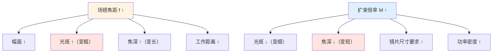

# ⚡ 光学速查卡

> [!info] 一句话版本
> 光学篇全部公式与典型值浓缩成一页，**打印出来贴桌上**。
> 配套计算器：`05-光学篇/代码/optics_calc.py`（公式已自检 15 项）。

---

## 0. ⚠️ 先确认你说的是哪一支"5 轴"

| | **进动派（precSYS）** | **变焦派（RAYLASE 4D）** |
|---|---|---|
| 5 轴 | **x,y,z 焦点定位 + a,b 入射角** | X/Y + Z + 2 轴变焦 |
| 场镜 | ❌ 固定物镜 f=75 mm | ✅ F-θ 场镜 |
| 幅面 | **Ø2.5 mm** | 100+ mm |
| 关键能力 | **孔形**（正锥/倒锥/零锥度）、650 Hz 环切 | **光斑大小**可调 |
| 详见 | [[05-光学篇/16-precSYS 五轴微加工：进动架构与镜片]] | [[05-光学篇/03-动态聚焦镜组（Z 轴）]] |

**下面第 1–6 节按"变焦派 + 场镜架构"写**（打标机最常见）。

---

## 1. 光路里有哪些镜片（场镜架构）

```text
① 激光器/光纤 → ② 准直镜 → ③ 变焦扩束镜组(2轴) → ④ 折转镜(可选)
   → ⑤ X 振镜 → ⑥ Y 振镜 → ⑦ Z 动态聚焦镜组(1轴) → ⑧ F-θ 场镜
   → ⑨ 保护镜 → ⑩ 工件
```

**precSYS 那类（进动架构）的光路完全不同**：

```text
激光器 → ⑪光束调理[扩束0.25–4× + 位置调节 + λ/2 + λ/4]
       → ⑫五轴扫描(x,y,z,a,b) → ⑬分束镜 → ⑭物镜(f=75mm)
       → ⑮保护玻璃 → ⑯加工气喷嘴 → 工件
       ⑬旁路 → ⑰光束位置测量（自动精细调节）
```

| 编号 | 镜片 | 一句话作用 | 详见 |
|---|---|---|---|
| ② | 准直镜 | 把光纤出来的发散光变成平行光 | [[05-光学篇/05-准直镜：光纤输出后第一片镜]] |
| ③ | 变焦扩束镜组 | 调光束直径 → 决定光斑大小 | [[05-光学篇/04-扩束镜与变焦扩束镜组]] |
| ④ | 折转镜 | 改变光路方向，省空间 | [[05-光学篇/01-振镜反射镜：X 镜与 Y 镜]] |
| ⑤⑥ | X / Y 振镜 | 把光束偏转到任意角度 | [[05-光学篇/01-振镜反射镜：X 镜与 Y 镜]] |
| ⑦ | 动态聚焦镜组 | 动焦距，补偿离焦 / 加工 3D 曲面 | [[05-光学篇/03-动态聚焦镜组（Z 轴）]] |
| ⑧ | F-θ 场镜 | 角度 → 平面位移，线性化 r = f·θ | [[05-光学篇/02-F-θ 场镜（平场聚焦镜）]] |
| ⑨ | 保护镜 | 挡飞溅，牺牲自己保护场镜 | [[05-光学篇/09-保护镜与窗口片]] |
| ⑭ | **聚焦物镜**（进动派） | 会聚；**不做平场**，幅面小到不需要 | [[05-光学篇/16-precSYS 五轴微加工：进动架构与镜片]] |

> [!note] 💡 不一定全都有
> 入门级打标机通常只有 ②准直/扩束 + ⑤⑥振镜 + ⑧场镜 + ⑨保护镜。
> **④折转镜、⑦Z 轴是"高配才有"**，③变焦扩束也是选配。
> 进动派则**既没场镜也没变焦**。

---

## 2. 九个必背公式

### 2.1 场镜：角度 → 位移（最核心）

```text
r = f × θ

r = 焦平面上的位移 (mm)
f = 场镜焦距 (mm)
θ = 光学偏转角 (弧度)      ← 注意是【光学角】，不是机械角
```

**反推焦距**：`f = r / θ`

> [!danger] 这里错了尺寸就差一倍
> 镜子转 θ（机械角），光线偏转 **2θ**（光学角）。
> 厂商手册说"扫描角 ±20°"时**必须确认是哪种角**。
> 详见 [[07-速查卡/03-公式速查]] 第 4 节。

### 2.2 幅面：能打多大

```text
幅面边长 = 2 × f × θ_half        （θ_half 用弧度）

例：f = 160 mm，光学半角 ±20°
    幅面 = 2 × 160 × 0.349 = 111.7 mm
```

| 焦距 f (mm) | ±20° 幅面 (mm) | ±10° 幅面 (mm) |
|---|---|---|
| 100 | 69.8 | 34.9 |
| 160 | **111.7** | 55.9 |
| 210 | 146.6 | 73.3 |
| 254 | 177.3 | 88.7 |
| 330 | 230.4 | 115.2 |
| 420 | 293.2 | 146.6 |

> [!warning] 幅面是"理论最大值"
> 实际上还要减去：振镜机械极限、边缘光斑劣化区、畸变校正损失。
> 💡 工程上按**理论幅面的 80%~90%** 规划有效加工区比较稳妥。

### 2.3 聚焦光斑：能打多细

```text
d = 1.83 × λ × f × M² / D        （厂商标称口径 ★ 默认用这个）

d = 光斑直径 (mm)
λ = 激光波长 (mm)        ← 1064 nm = 1.064e-3 mm，别忘换算
f = 场镜焦距 (mm)
D = 场镜处的光束直径 (mm)  ← 由扩束镜决定
M² = 光束质量因子（理想高斯 = 1，单模光纤激光 ≲ 1.2）
```

另一个式子：`d = 4λfM² / (πD)`

> [!danger] 这两个系数【不能混用】，差了 43.7%
> | 式子 | 系数 | 适用 |
> |---|---|---|
> | `1.83·λfM²/D` | **1.83** | 入瞳在 1/e² 处**被硬截断**的高斯光 ★ **厂商标称用这个** |
> | `4λfM²/(πD)` | 4/π = 1.273 | **未截断**理想高斯 |
>
> 两者 D 的含义相同，只是系数不同：`1.83 / 1.273 = 1.4373`。
> **来历**：入瞳边缘硬截断 → 孔径衍射主瓣变宽 + 旁瓣，系数从 1.273 抬到 1.83。
> Thorlabs、LINOS 等厂商目录的光斑算法用的就是 **C = 1.83**。
>
> **后果**：同一个系统，一个算 68 μm、一个算 47 μm。
> 拿 4/π 的结果去质疑厂商手册"算错了"，是新手最容易犯的错之一。

**记住两条反比关系**：
- 光斑 ∝ f：**焦距翻倍，光斑翻倍**
- 光斑 ∝ 1/D：**扩束 2 倍，光斑减半**

**实例（λ=1064 nm，D=10 mm，M²=1）**：

| 场镜 f (mm) | 光斑 d (μm, C=1.83) | 厂商经验值 |
|---|---|---|
| 100 | 19.5 | — |
| 160 | **31.2** | 约 33 μm ✅ |
| 254 | **49.5** | 约 52 μm ✅ |
| 330 | 64.3 | — |

> [!note] 这两个厂商经验值是本库的交叉验证点
> JHC 金海创给出的「10 mm 光斑 + F160 → 约 33 μm」「F254 → 约 52 μm」，
> 被 C=1.83 的公式算成 31.2 / 49.5 μm，**偏差不到 6%**——
> 说明公式和系数用对了（用 4/π 会算成 21.7 / 34.5 μm，明显对不上）。
> 见 `optics_calc.py selftest`。

### 2.4 焦深：焦平面附近多厚是清楚的

```text
DOF = 8 × λ × M² × (f/D)² / π

DOF ∝ (f/D)²   ← 平方关系！焦距翻倍，焦深变 4 倍
```

| 场镜 f (mm) | D=10 mm 时焦深 (mm) | D=20 mm 时焦深 (mm) |
|---|---|---|
| 100 | 0.226 | 0.057 |
| 160 | 0.579 | 0.145 |
| 254 | 1.459 | 0.365 |

> [!warning] 焦深是"深层矛盾"
> 想要**细光斑** → 要小 f 或大 D → 焦深就**短** → 工件稍微不平就离焦。
> 这是激光加工里绕不开的取舍，也是**为什么要 Z 轴动态聚焦**的根本原因。

### 2.5 光纤准直：光路起点

```text
准直后光斑直径  D = 2 × f × NA
准直后发散角    θ = 纤芯直径 / f
光束参数积      BPP = (纤芯直径/2) × NA     ← 系统不变量
```

**例**：纤芯 50 μm、NA 0.12、准直镜 f = 100 mm
```text
D   = 2 × 100 × 0.12 = 24 mm
θ   = 0.05 / 100 = 0.5 mrad
BPP = 0.025 × 0.12 = 3.0 mm·mrad
```

> [!important] BPP 是选镜片的硬约束
> **扩束镜不改变 BPP**（D 变大、θ 同比例变小，乘积不变）。
> 所以"用扩束镜把 50 μm 光纤做出 10 μm 光斑"是有极限的——
> 极限由 BPP 决定：`d_min ≈ 4·BPP·M² / ...`，见光学篇正文。

### 2.6 扩束倍率

```text
M = D_需要 / D_输入
```

⚠️ **扩束后光斑必须 ≤ 场镜入瞳直径**，否则边缘会被切光（渐晕）。

### 2.7 功率密度：选镜片的门槛

```text
平顶分布：I = P / (π (d/2)²)
高斯分布：I_peak = 2P / (π (d/2)²)     ← 峰值是平均值的 2 倍

I 单位 W/cm²，  P 单位 W，  d 单位 cm（注意 1 mm = 0.1 cm）
```

**例**：1000 W、光斑 50 μm
```text
d = 50 μm = 0.005 cm,  r = 0.0025 cm
A = π r² = 1.964e-5 cm²
平顶：I = 1000 / 1.964e-5 = 5.09e7 W/cm² = 50.9 MW/cm²
高斯峰值：101.9 MW/cm²
```

> [!danger] 拿这个数去比 LIDT，并留 2~3 倍余量
> 镜片镀膜的损伤阈值（LIDT）是**峰值**指标。
> 用平均值去比会低估一倍——高功率下这就是烧镜片的原因。
> 详见 [[05-光学篇/12-激光损伤阈值与光学件清洁维护]]。

### 2.8 扫描线速度

```text
v_max = f × θ_amp × ω      （正弦扫描时边缘速度最大）

θ_amp = 半角振幅 (弧度)     ω = 角频率 (rad/s) = 2π·f_scan
```

**例**：f = 160 mm、±20°、100 Hz
```text
v = 160 × 0.349 × 628 = 35.1 m/s
```
> [!warning] 这个数决定"要不要降速"
> 若超过振镜的跟踪能力，边缘就会甩出去。
> 见 [[02-硬件实现篇/05-更新率与振镜带宽匹配]]。

### 2.9 伺服滞后距离

```text
滞后距离 = v × t_lag
```

**例**：v = 2000 mm/s、滞后 25 μs → 50 μm
> 💡 这就是激光开/关需要提前或延后的量级（laser on/off delay）。
> 拐角处图形"鼓包"多是这个问题。

---

## 3. 参数联动关系（一图记住取舍）



> [!important] 一句话总结取舍
> **幅面、光斑、焦深三者不可兼得**，任选两个，第三个让出去。
> 想要"大幅面 + 细光斑 + 长焦深" → 只能靠**变焦扩束 + Z 轴**这套 5 轴方案。

---

## 4. 常用数值（默记）

| 量 | 典型值 |
|---|---|
| 光纤激光波长 | 1064 nm（光纤）/ 1070 nm / 1030 nm |
| 绿光 / 紫外 | 532 nm / 355 nm |
| CO₂ | 10.6 μm |
| 光纤纤芯 | 20 / 50 / 100 / 200 μm |
| 光纤 NA | 0.10 ~ 0.22 💡 |
| 场镜焦距 | 100 / 160 / 210 / 254 / 330 / 420 / 500 mm |
| 场镜工作距离 | 约 0.7~1.0 × f 💡 |
| 聚焦光斑（打标） | 20 ~ 80 μm |
| 打标功率密度 | 10⁵ ~ 10⁷ W/cm² 💡 |

---

## 5. 一页诊断表：现象 → 光学原因

| 现象 | 最可能的光学原因 | 详见 |
|---|---|---|
| 整个幅面光斑都变粗 | 扩束镜倍率不对 / 准直失调 | [[05-光学篇/04-扩束镜与变焦扩束镜组]] |
| 只有边缘光斑变粗、发虚 | 场镜焦面弯曲超焦深 / 需 Z 轴补偿 | [[05-光学篇/03-动态聚焦镜组（Z 轴）]] |
| 功率下降但光斑形状没变 | 保护镜污染 / 镀膜损伤 | [[05-光学篇/09-保护镜与窗口片]] |
| 光斑中间暗、环形 | 光路中心遮挡 / 镜片局部损伤 | [[05-光学篇/15-光学失效排错对照表]] |
| 图形整体变小或变大 | 场镜焦距选错 / 软件标度因子错 | [[05-光学篇/02-F-θ 场镜（平场聚焦镜）]] |
| 打标深浅随方向变化 | 偏振态问题（s/p 吸收差） | [[05-光学篇/07-偏振元件（半波片、四分之一波片、PBS）]] |
| 聚焦位置怎么调都不对 | Z 轴回零丢失 / 标定漂移 | [[05-光学篇/03-动态聚焦镜组（Z 轴）]] |
| 中心能打、边缘打不动 | 边缘功率密度不足 / 渐晕 | [[05-光学篇/04-扩束镜与变焦扩束镜组]] |

---

## 6. 直接跑计算器

```bash
cd 05-光学篇/代码
python optics_calc.py selftest              # 自检 14 项（公式系数对不对）
python optics_calc.py spot 1064 160 10      # 光斑 + 焦深
python optics_calc.py lens 1064 100 50      # 反推该选多大焦距场镜
python optics_calc.py expand 3 12           # 需要多大扩束倍率
python optics_calc.py collimate 50 0.12 100 # 光纤准直参数
python optics_calc.py power 1000 50         # 功率密度
python optics_calc.py table 1064            # 常用场镜对照表
```

---

## 📖 依据

> [!quote] 来源说明
> - 光斑公式 `1.83λf/D` 与 `4λfM²/πD`：激光聚焦的通用工程近似，两者理论差异 1.4%
> - 焦深公式：瑞利长度定义的常用形式
> - 厂商经验值「F160 → 33 μm」「F254 → 52 μm」：JHC 金海创代理页给出的场镜匹配经验
>   （见 `04-资源库/深度调研报告/调研笔记-电气与规格.md`）
> - 场镜线性关系 `r = fθ`：F-θ 场镜的定义式
> - 标注 💡 的典型值均为行业常见范围，**不是规范要求**，以你手上设备的手册为准

---

## 🔗 相关

- 公式速查（协议部分）：[[07-速查卡/03-公式速查]]
- 光学篇入口：[[05-光学篇/00-光路总览：从 3 轴到 5 轴]]
- 返回总入口：[[🏠 开始这里]]
